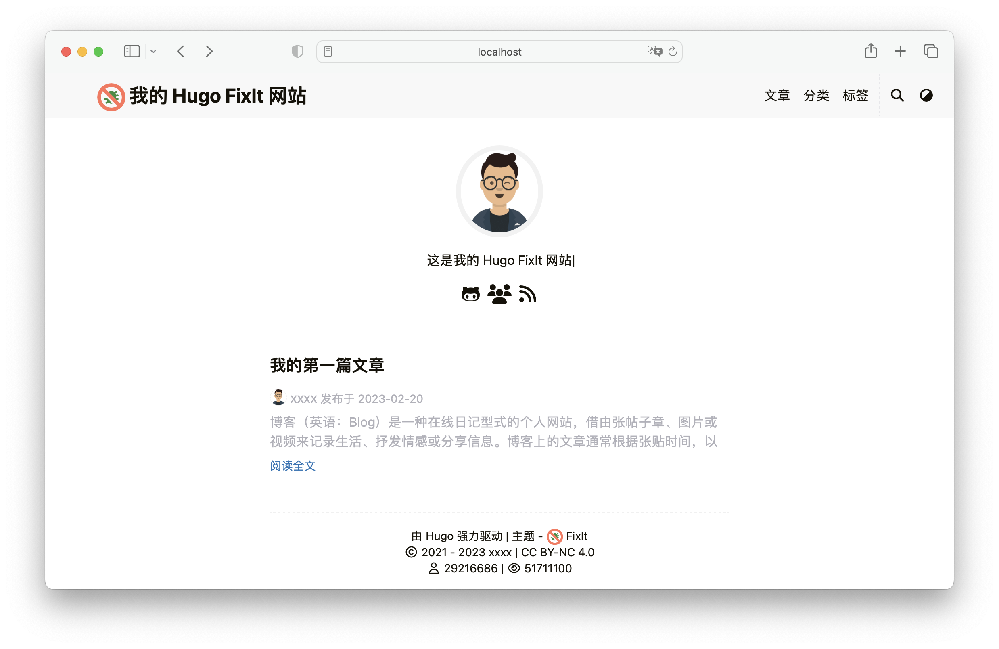

探索 Hugo - **FixIt** 主题的的基础知识和背后的核心概念。

<!--more-->


## 安装方式 {#install-theme}




实际上有多种方式可以快速安装主题，选择其中 **一种** 即可（推荐 [Git 子模块](#git-submodule) 或者 [Hugo 模块](#hugo-module)）。

### 手动下载

你可以下载主题的 [最新版本 :(fa-regular fa-file-archive fa-fw): .zip 文件][releases] 并且解压放到 `themes` 目录。

### Git 克隆

或者，也可以直接把这个主题克隆到 `themes` 目录：

```bash
git clone https://github.com/hugo-fixit/FixIt.git themes/FixIt
```

### Git 子模块



另外，在您的项目目录初始化一个空的 Git 存储库，将 [FixIt][fixit] 主题克隆到 `themes` 目录中，将其作为 [Git 子模块][git-submodule] 添加到您的项目中。


```bash
git init
git submodule add https://github.com/hugo-fixit/FixIt.git themes/FixIt
```

如果你想使用 `dev` 分支上的版本，可以使用以下命令：

```bash
git submodule add -b dev https://github.com/hugo-fixit/FixIt.git themes/FixIt
```

或者将子模块分支从 `master` 切换到 `dev`：

```bash
git submodule set-branch -b dev themes/FixIt
```

### Hugo 模块



> 以这种方式，无需要在 `config.toml` 中配置 `theme = "FixIt"`。

将 [Hugo 模块][hugo-modules] 用于主题的最简单方法是将其导入配置中。请参阅 [使用 Hugo 模块][use-hugo-modules]。

1. 初始化 Hugo 模块系统：`hugo mod init github.com/<your_user>/<your_project>`
2. 导入主题：

   ```toml
   [module]
     [[module.imports]]
       path = "github.com/hugo-fixit/FixIt"
   ```

## 完整配置

在开始配置之前，建议您执行以下命令，将主题的默认 [config.toml][config] 复制到您的项目中：

```bash
mv config.toml config.old.toml
cp themes/FixIt/config.toml config.toml
```

### 菜单配置 {#menu-configuration}

Hugo 有一个简单而强大的 [菜单系统][menu-system]。

根据 Hugo 提供的接口，FixIt 主题只实现了部分功能，这足以满足大多数人的需求，也让用户在使用上更加简单。

下面是一个完整的菜单项配置：

```toml
[menu]
  [[menu.main]]
    identifier = ""
    #  父级菜单项的标识符 (identifier)
    parent = ""
    # 你可以在名称（允许 HTML 格式）之前添加其他信息，例如图标
    pre = ""
    # 你可以在名称（允许 HTML 格式）之后添加其他信息，例如图标
    post = ""
    name = ""
    url = ""
    # 当你将鼠标悬停在此菜单链接上时，将显示的标题
    title = ""
    weight = 1
    #  向菜单项添加用户定义的内容
    [menu.main.params]
      # 添加 CSS 类到菜单项
      class = ""
      # 是否为草稿菜单，类似草稿页面
      draft = false
      #  添加 fontawesome 图标到菜单项
      icon = ""
      #  设置菜单项类型，可选值：["mobile", "desktop"]
      type = ""
```


考虑到实用性和排版问题，FixIt 主题只支持两层嵌套的菜单，通过在菜单配置中的 `parent` 字段即可。

一个菜单项的父项应该是另一个菜单项的标识符（`identifier`），在菜单中标识符应该是唯一的。


另外，也可以通过配置页面（即 `.md` 文件）的 `front matter` 添加内容到菜单中。

这是一个 `yaml` 示例：

```yaml
---
title: 入门篇
author: Lruihao
menu:
  main:
    title: 探索 Hugo - FixIt 主题的的基础知识和背后的核心概念。
    parent: documentation
    params:
      icon: fa-brands fa-readme
# ...
---
```

### 主题配置 {#theme-configuration}

除了 [Hugo 全局配置][hugo-config] 和 [菜单配置](#menu-configuration) 之外，**FixIt** 主题还允许您在网站配置中定义以下参数。

请打开下面的代码块查看完整的 `config.toml` 示例配置 :(fa-regular fa-hand-point-down fa-fw)::

```toml
[params]
  #  FixIt 主题版本
  version = "0.2.X" # 例如："0.2.X", "0.2.15", "v0.2.15" 等
  # 网站描述
  description = "这是我的 Hugo FixIt 网站"
  # 网站关键词
  keywords = ["Hugo", "FixIt"]
  # 网站默认主题样式 ["light", "dark", "auto"]
  defaultTheme = "auto"
  # 公共 git 仓库路径，仅在 enableGitInfo 设为 true 时有效
  gitRepo = ""
  #  哪种哈希函数用来 SRI, 为空时表示不使用 SRI
  # ["sha256", "sha384", "sha512", "md5"]
  fingerprint = ""
  #  日期格式
  dateFormat = "2006-01-02"
  # 网站图片，用于 Open Graph 和 Twitter Cards
  images = ["/logo.png"]
  #  开启 PWA 支持
  enablePWA = true
  #  是否自动显示外链图标
  externalIcon = false
  #  默认情况下，FixIt 只会在主页的 HTML 头中注入主题元标记
  # 您可以将其关闭，但如果您不这样做，我们将不胜感激，因为这是观察 FixIt 受欢迎程度上升的好方法
  disableThemeInject = false

  #  应用图标配置
  [params.app]
    # 当添加到 iOS 主屏幕或者 Android 启动器时的标题，覆盖默认标题
    title = "FixIt"
    # 是否隐藏网站图标资源链接
    noFavicon = false
    # 更现代的 SVG 网站图标，可替代旧的 .png 和 .ico 文件
    svgFavicon = ""
    # Safari 图标颜色
    iconColor = "#5bbad5"
    # Windows v8-10 磁贴颜色
    tileColor = "#da532c"
    #  Android 浏览器主题色
    [params.app.themeColor]
      light = "#f8f8f8"
      dark = "#252627"

  #  搜索配置
  [params.search]
    enable = true
    # 搜索引擎的类型 ["lunr", "algolia", "fuse"]
    type = "lunr"
    # 文章内容最长索引长度
    contentLength = 4000
    # 搜索框的占位提示语
    placeholder = ""
    #  最大结果数目
    maxResultLength = 10
    #  结果内容片段长度
    snippetLength = 50
    #  搜索结果中高亮部分的 HTML 标签
    highlightTag = "em"
    #  是否在搜索索引中使用基于 baseURL 的绝对路径
    absoluteURL = false
    [params.search.algolia]
      index = ""
      appID = ""
      searchKey = ""
    [params.search.fuse]
      #  https://fusejs.io/api/options.html
      isCaseSensitive = false
      minMatchCharLength = 2
      findAllMatches = false
      location = 0
      threshold = 0.3
      distance = 100
      ignoreLocation = false
      useExtendedSearch = false
      ignoreFieldNorm = false

  # 页面头部导航栏配置
  [params.header]
    #  桌面端导航栏模式 ["sticky", "normal", "auto"]
    desktopMode = "sticky"
    #  移动端导航栏模式 ["sticky", "normal", "auto"]
    mobileMode = "auto"
    #  页面头部导航栏标题配置
    [params.header.title]
      # LOGO 的 URL
      logo = "/fixit.min.svg"
      # 标题名称
      name = "我的 Hugo FixIt 网站"
      # 你可以在名称（允许 HTML 格式）之前添加其他信息，例如图标
      pre = ""
      # 你可以在名称（允许 HTML 格式）之后添加其他信息，例如图标
      post = ""
      #  是否为标题显示打字机动画
      typeit = false
    #  页面头部导航栏副标题配置
    [params.header.subtitle]
      # 副标题名称
      name = ""
      # 是否为副标题显示打字机动画
      typeit = false

  #  面包屑导航配置
  [params.breadcrumb]
    enable = false
    sticky = false
    showHome = false

  # 页面底部信息配置
  [params.footer]
    enable = true
    #  自定义内容（支持 HTML 格式）
    # 进阶使用，见参数 `params.customFilePath.footer`
    custom = ""
    #  是否显示 Hugo 和主题信息
    hugo = true
    #  是否显示版权信息
    copyright = true
    #  是否显示作者
    author = true
    # 网站创立年份
    since = 2021
    #  是否显示网站内容总字数
    wordCount = true
    #  公网安备信息，仅在中国使用（支持 HTML 格式）
    gov = ""
    #  ICP 备案信息，仅在中国使用（支持 HTML 格式）
    icp = ""
    # 许可协议信息（支持 HTML 格式）
    license = '<a rel="license external nofollow noopener noreferrer" href="https://creativecommons.org/licenses/by-nc/4.0/" target="_blank">CC BY-NC 4.0</a>'
    #  网站创立时间
    [params.footer.siteTime]
      enable = false
      animate = true
      icon = "fa-solid fa-heartbeat"
      pre = ""
      value = "" # e.g. "2021-12-18T16:15:22+08:00"
    #  页面底部行排序，可选值：["first", 0, 1, 2, 3, 4, 5, "last"]
    [params.footer.order]
      powered = 0
      copyright = 0
      statistics = 0
      visitor = 0
      beian = 0

  #  Section（所有文章）页面配置
  [params.section]
    # section 页面每页显示文章数量
    paginate = 20
    # 日期格式（月和日）
    dateFormat = "01-02"
    # RSS 文章数目
    rss = 10
    #  最近更新文章设置
    [params.section.recentlyUpdated]
      enable = false
      rss = false
      days = 30
      maxCount = 10

  #  List（目录或标签）页面配置
  [params.list]
    # list 页面每页显示文章数量
    paginate = 20
    # 日期格式（月和日）
    dateFormat = "01-02"
    # RSS 文章数目
    rss = 10

  #  标签云配置
  [params.tagcloud]
    enable = false
    min = 14 # 最小字体大小，单位：px
    max = 32 # 最大字体大小，单位：px
    peakCount = 10 # 每个标签的最大文章数
    orderby = "name" # 标签排序方式，可选值：["name", "count"]

  # 主页配置
  [params.home]
    #  RSS 文章数目
    rss = 10
    # 主页个人信息
    [params.home.profile]
      enable = true
      # Gravatar 邮箱，用于优先在主页显示的头像
      gravatarEmail = ""
      # 主页显示头像的 URL
      avatarURL = "/images/avatar.png"
      #  头像菜单链接的 identifier
      avatarMenu = ""
      #  主页显示的网站标题（支持 HTML 格式）
      title = ""
      # 主页显示的网站副标题
      subtitle = "这是我的 Hugo FixIt 网站"
      # 是否为副标题显示打字机动画
      typeit = true
      # 是否显示社交账号
      social = true
      #  免责声明（支持 HTML 格式）
      disclaimer = ""
    # 主页文章列表
    [params.home.posts]
      enable = true
      # 主页每页显示文章数量
      paginate = 6

  #  作者的社交信息设置
  [params.social]
    GitHub = "Lruihao"
    Linkedin = ""
    Twitter = ""
    Instagram = ""
    Facebook = ""
    Telegram = ""
    Medium = ""
    Gitlab = ""
    Youtubelegacy = ""
    Youtubecustom = ""
    Youtubechannel = ""
    Tumblr = ""
    Quora = ""
    Keybase = ""
    Pinterest = ""
    Reddit = ""
    Codepen = ""
    FreeCodeCamp = ""
    Bitbucket = ""
    Stackoverflow = ""
    Weibo = ""
    Odnoklassniki = ""
    VK = ""
    Flickr = ""
    Xing = ""
    Snapchat = ""
    Soundcloud = ""
    Spotify = ""
    Bandcamp = ""
    Paypal = ""
    Fivehundredpx = ""
    Mix = ""
    Goodreads = ""
    Lastfm = ""
    Foursquare = ""
    Hackernews = ""
    Kickstarter = ""
    Patreon = ""
    Steam = ""
    Twitch = ""
    Strava = ""
    Skype = ""
    Whatsapp = ""
    Zhihu = ""
    Douban = ""
    Angellist = ""
    Slidershare = ""
    Jsfiddle = ""
    Deviantart = ""
    Behance = ""
    Dribbble = ""
    Wordpress = ""
    Vine = ""
    Googlescholar = ""
    Researchgate = ""
    Mastodon = ""
    Thingiverse = ""
    Devto = ""
    Gitea = ""
    XMPP = ""
    Matrix = ""
    Bilibili = ""
    ORCID = ""
    Liberapay = ""
    Ko-Fi = ""
    BuyMeaCoffee = ""
    Linktree = ""
    QQ = ""
    QQGroup = "awbwdTtSQ_-H5QGzeJxdWgv6JMbNehNM" # https://qun.qq.com/join.html
    Diaspora = ""
    CSDN = ""
    Discord = ""
    DiscordInvite = ""
    Lichess = ""
    Pleroma = ""
    Kaggle = ""
    MediaWiki= ""
    Plume = ""
    HackTheBox = ""
    RootMe = ""
    Feishu = ""
    TryHackMe = ""
    Phone = ""
    Email = ""
    RSS = true

  #  文章页面配置
  [params.page]
    #  是否启用文章作者头像
    authorAvatar = true
    #  是否在主页隐藏一篇文章
    hiddenFromHomePage = false
    #  是否在搜索结果中隐藏一篇文章
    hiddenFromSearch = false
    #  是否使用 twemoji
    twemoji = false
    # 是否使用 lightgallery
    #  如果设为 "force"，文章中的图片将强制按照画廊形式呈现
    lightgallery = false
    #  是否使用 ruby 扩展语法
    ruby = true
    #  是否使用 fraction 扩展语法
    fraction = true
    #  是否使用 fontawesome 扩展语法
    fontawesome = true
    # 许可协议信息（支持 HTML 格式）
    license = '<a rel="license external nofollow noopener noreferrer" href="https://creativecommons.org/licenses/by-nc/4.0/" target="_blank">CC BY-NC 4.0</a>'
    # 是否在文章页面显示原始 Markdown 文档链接
    linkToMarkdown = true
    #  是否在 RSS 中显示全文内容
    rssFullText = false
    #  页面样式 ["narrow", "normal", "wide", ...]
    pageStyle = "normal"
    #   强制使用 Gravatar 作为作者头像
    # gravatarForce = true
    #  开启自动书签支持
    # 如果为 true，则在关闭页面时保存阅读进度
    autoBookmark = false
    #  是否使用 字数统计
    wordCount = true
    #  是否使用 预计阅读
    readingTime = true
    #  文章结束标志
    endFlag = ""
    #  是否开启即时页面
    instantPage = false

    #  转载配置
    [params.page.repost]
      enable = false
      url = ""
    #  目录配置
    [params.page.toc]
      # 是否使用目录
      enable = true
      #  是否保持使用文章前面的静态目录
      keepStatic = false
      # 是否使侧边目录自动折叠展开
      auto = true
      #  目录位置 ["left", "right"]
      position = "right"
    #  在文章开头显示提示信息，提醒读者文章内容可能过时
    [params.page.expirationReminder]
      enable = false
      # 如果文章最后更新于这天数之前，显示提醒
      reminder = 90
      # 如果文章最后更新于这天数之前，显示警告
      warning = 180
      # 如果文章到期是否关闭评论
      closeComment = false
    #  代码配置
    [params.page.code]
      # 是否显示代码块的复制按钮
      copy = true
      #  是否显示代码块的编辑按钮
      edit = true
      # 默认展开显示的代码行数
      maxShownLines = 10
    #  文章编辑
    [params.page.edit]
      enable = false
      #  编辑的基础链接
      # url = "/edit/branch-name/subdirectory-name" # 相对于 `params.gitRepo`
      # url = "https://github.com/user-name/repo-name/edit/branch-name/subdirectory-name" # 完整链接
      url = ""
    #   数学公式 (https://katex.org)
    [params.page.math]
      enable = true
      # 默认行内定界符是 $ ... $ 和 \( ... \)
      inlineLeftDelimiter = ""
      inlineRightDelimiter = ""
      # 默认块定界符是 $$ ... $$, \[ ... \],  \begin{equation} ... \end{equation} 和一些其它的函数
      blockLeftDelimiter = ""
      blockRightDelimiter = ""
      # KaTeX 插件 copy_tex
      copyTex = true
      # KaTeX 插件 mhchem
      mhchem = true
    #   配置 (https://docs.mapbox.com/mapbox-gl-js)
    [params.page.mapbox]
      # Mapbox GL JS 的 access token
      accessToken = ""
      # 浅色主题的地图样式
      lightStyle = "mapbox://styles/mapbox/light-v9"
      # 深色主题的地图样式
      darkStyle = "mapbox://styles/mapbox/dark-v9"
      # 是否添加 
      navigation = true
      # 是否添加 
      geolocate = true
      # 是否添加 
      scale = true
      # 是否添加 
      fullscreen = true
    #  赞赏设置
    [params.page.reward]
      enable = false
      animation = false
      # 相对于页脚的位置，可选值：["before", "after"]
      position = "after"
      # comment = "Buy me a coffee"
      #  二维码图片展示模式，可选值：["static", "fixed"]，默认：`static`
      mode = "static"
      [params.page.reward.ways]
        # wechatpay = "/images/wechatpay.png"
        # alipay = "/images/alipay.png"
        # paypal = "/images/paypal.png"
        # bitcoin = "/images/bitcoin.png"
    #  文章页面的分享信息设置
    [params.page.share]
      enable = true
      Twitter = true
      Facebook = true
      Linkedin = false
      Whatsapp = true
      Pinterest = false
      Tumblr = false
      HackerNews = false
      Reddit = false
      VK = false
      Buffer = false
      Xing = false
      Line = true
      Instapaper = false
      Pocket = false
      Digg = false
      Stumbleupon = false
      Flipboard = false
      Weibo = true
      Renren = false
      Myspace = true
      Blogger = true
      Baidu = false
      Odnoklassniki = false
      Evernote = true
      Skype = false
      Trello = false
      Mix = false
    #  评论系统设置
    [params.page.comment]
      enable = false
      #   评论系统设置 (https://artalk.js.org/)
      [params.page.comment.artalk]
        enable = false
        server = "https://yourdomain/api/"
        site = "默认站点"
        placeholder = ""
        noComment = ""
        sendBtn = ""
        editorTravel = true
        flatMode = "auto"
        #  启用 lightgallery 支持
        lightgallery = false
        locale = "" # 
        # 
        emoticons = ""
        nestMax = 2
        nestSort = "DATE_ASC" # ["DATE_ASC", "DATE_DESC", "VOTE_UP_DESC"]
        vote = true
        voteDown = false
        uaBadge = true
        listSort = true
        imgUpload = true
        preview = true
        versionCheck = true
      #   评论系统设置 (https://disqus.com)
      [params.page.comment.disqus]
        enable = false
        # Disqus 的 shortname，用来在文章中启用 Disqus 评论系统
        shortname = ""
      #   评论系统设置 (https://github.com/gitalk/gitalk)
      [params.page.comment.gitalk]
        enable = false
        owner = ""
        repo = ""
        clientId = ""
        clientSecret = ""
      #  评论系统设置 (https://github.com/xCss/Valine)
      [params.page.comment.valine]
        enable = false
        appId = ""
        appKey = ""
        placeholder = ""
        avatar = "mp"
        meta = ""
        requiredFields = ""
        pageSize = 10
        lang = ""
        visitor = true
        recordIP = true
        highlight = true
        enableQQ = false
        serverURLs = ""
        #  emoji 数据文件名称，默认是 "google.yml"
        # ["apple.yml", "google.yml", "facebook.yml", "twitter.yml"]
        # 位于 "themes/FixIt/assets/lib/valine/emoji/" 目录
        # 可以在你的项目下相同路径存放你自己的数据文件：
        # "assets/lib/valine/emoji/"
        emoji = ""
        commentCount = true # 
      #   评论系统设置 (https://waline.js.org)
      [params.page.comment.waline]
        enable = false
        serverURL = ""
        pageview = false # 
        emoji = ["//unpkg.com/@waline/emojis@1.1.0/weibo"]
        meta = ["nick", "mail", "link"]
        requiredMeta = []
        login = "enable"
        wordLimit = 0
        pageSize = 10
        imageUploader = false # 
        highlighter = false # 
        comment = false # 
        texRenderer = false # 
        search = false # 
        recaptchaV3Key = "" # 
        reaction = false # 
      # 设置 (https://developers.facebook.com/docs/plugins/comments)
      [params.page.comment.facebook]
        enable = false
        width = "100%"
        numPosts = 10
        appId = ""
        languageCode = "zh_CN"
      #   评论系统设置 (https://comments.app)
      [params.page.comment.telegram]
        enable = false
        siteID = ""
        limit = 5
        height = ""
        color = ""
        colorful = true
        dislikes = false
        outlined = false
      #   评论系统设置 (https://commento.io)
      [params.page.comment.commento]
        enable = false
      #   评论系统设置 (https://utteranc.es)
      [params.page.comment.utterances]
        enable = false
        # owner/repo
        repo = ""
        issueTerm = "pathname"
        label = ""
        lightTheme = "github-light"
        darkTheme = "github-dark"
      #   评论系统设置 (https://twikoo.js.org/)
      [params.page.comment.twikoo]
        enable = false
        envId = ""
        region = ""
        path = ""
        visitor = true
        commentCount = true
        #  启用 lightgallery 支持
        lightgallery = false
        #  启用 Katex 支持
        katex = false
      #   评论系统设置
      [params.page.comment.giscus]
        enable = false
        repo = ""
        repoId = ""
        category = ""
        categoryId = ""
        mapping = ""
        strict = "0" # 
        term = ""
        reactionsEnabled = "1"
        emitMetadata = "0"
        inputPosition = "bottom" # ["top", "bottom"]
        lightTheme = "light"
        darkTheme = "dark"
        lazyLoad = true
    #  第三方库配置
    [params.page.library]
      [params.page.library.css]
        # someCSS = "some.css"
        # 位于 "assets/"
        # 或者
        # someCSS = "https://cdn.example.com/some.css"
      [params.page.library.js]
        # someJavascript = "some.js"
        # 位于 "assets/"
        # 或者
        # someJavascript = "https://cdn.example.com/some.js"
    #  页面 SEO 配置
    [params.page.seo]
      # 图片 URL
      images = []
      # 出版者信息
      [params.page.seo.publisher]
        name = ""
        logoUrl = ""

  #  TypeIt 配置
  [params.typeit]
    # 每一步的打字速度（单位是毫秒）
    speed = 100
    # 光标的闪烁速度（单位是毫秒）
    cursorSpeed = 1000
    # 光标的字符（支持 HTML 格式）
    cursorChar = "|"
    # 打字结束之后光标的持续时间（单位是毫秒，"-1" 代表无限大）
    duration = -1
    #  打字完成后是否会连续循环
    loop = false

  #  Mermaid 配置
  [params.mermaid]
    # 取值详见 https://mermaid.js.org/config/theming.html#available-themes
    themes = ["default", "dark"]

  #  盘古之白配置
  [params.pangu]
    # 适用于中文写作用户
    enable = false
    selector = "article" # 

  #  水印配置
  # 详细参数见 https://github.com/Lruihao/watermark#readme
  [params.watermark]
    enable = false
    # 水印内容（允许 HTML 格式）
    content = ""
    # 水印透明度
    opacity = 0.1
    # 水印父节点
    appendTo = ".wrapper>main"
    # 单水印宽度 单位：px
    width = 150
    # 单水印高度 单位：px
    height = 20
    # 水印行间距 单位：px
    rowSpacing = 60
    # 水印列间距 单位：px
    colSpacing = 30
    # 水印旋转角度 单位：deg
    rotate = 15
    # 水印字体大小，单位：rem
    fontSize = 0.85
    #  水印字体
    fontFamily = "inherit"

  #  不蒜子统计
  [params.ibruce]
    enable = true
    # 在文章中开启
    enablePost = false

  # 网站验证代码，用于 Google/Bing/Yandex/Pinterest/Baidu/360/Sogou
  [params.verification]
    google = ""
    bing = ""
    yandex = ""
    pinterest = ""
    baidu = ""
    so = ""
    sogou = ""

  #  网站 SEO 配置
  [params.seo]
    # 图片 URL
    image = ""
    # 缩略图 URL
    thumbnailUrl = ""

  #  网站分析配置
  [params.analytics]
    enable = false
    # Google Analytics
    [params.analytics.google]
      id = ""
      # 是否匿名化用户 IP
      anonymizeIP = true
    # Fathom Analytics
    [params.analytics.fathom]
      id = ""
      # 自行托管追踪器时的主机路径
      server = ""

  #  Cookie 许可配置
  [params.cookieconsent]
    enable = true
    # 用于 Cookie 许可横幅的文本字符串
    [params.cookieconsent.content]
      message = ""
      dismiss = ""
      link = ""

  #  第三方库文件的 CDN 设置
  [params.cdn]
    # CDN 数据文件名称，默认不启用 ["jsdelivr.yml", "unpkg.yml", ...]
    # 位于 "themes/FixIt/assets/data/cdn/" 目录
    # 可以在你的项目下相同路径存放你自己的数据文件："assets/data/cdn/"
    # data = "unpkg.yml"

  #  兼容性设置
  [params.compatibility]
    # 是否使用 Polyfill.io 来兼容旧式浏览器
    polyfill = false
    # 是否使用 object-fit-images 来兼容旧式浏览器
    objectFit = false

  #  在左上角或者右上角显示 GitHub 开源链接
  [params.githubCorner]
    enable = false
    permalink = "https://github.com/hugo-fixit/FixIt"
    title = "在 GitHub 上查看源代码"
    position = "right" # ["left", "right"]

  #  Gravatar 设置
  [params.gravatar]
    #  取决于作者邮箱，作者邮箱未设置则使用本地头像
    enable = false
    # Gravatar 主机，默认：“www.gravatar.com”
    host = "www.gravatar.com" # ["cn.gravatar.com", "gravatar.loli.net", ...]
    style = "" # ["", "mp", "identicon", "monsterid", "wavatar", "retro", "blank", "robohash"]

  #  返回顶部
  [params.backToTop]
    enable = true
    # 在 b2t 按钮中显示滚动百分比
    scrollpercent = false

  #  阅读进度条
  [params.readingProgress]
    enable = false
    # 可用值：["left", "right"]
    start = "left"
    # 可用值：["top", "bottom"]
    position = "top"
    reversed = false
    light = ""
    dark = ""
    height = "2px"

  #  页面加载期间顶部的进度条
  # 有关详细信息：https://github.com/CodeByZach/pace
  [params.pace]
    enable = false
    # 所有可用颜色：
    # ["black", "blue", "green", "orange", "pink", "purple", "red", "silver", "white", "yellow"]
    color = "blue"
    # 所有可用主题：
    # ["barber-shop", "big-counter", "bounce", "center-atom", "center-circle", "center-radar", "center-simple",
    # "corner-indicator", "fill-left", "flash", "flat-top", "loading-bar", "mac-osx", "material", "minimal"]
    theme = "minimal"

  #  定义自定义文件路径
  # 在站点目录 `layouts/partials/custom` 中创建您的自定义文件，并取消注释下面需要的文件
  [params.customFilePath]
    # aside = "custom/aside.html"
    # profile = "custom/profile.html"
    # footer = "custom/footer.html"

  #  开发者选项
  [params.dev]
    enable = false
    # 检查更新
    c4u = false
    # 请勿公开展示！
    githubToken = ""
    # 移动端开发者工具配置
    [params.dev.mDevtools]
      enable = false
      # 支持 "vConsole", "eruda"
      type = "vConsole"

# Hugo 解析文档的配置
[markup]
  #  (https://gohugo.io/content-management/syntax-highlighting)
  [markup.highlight]
    ################## 必要的配置 ##################
    # 
    codeFences = true
    lineNos = true
    lineNumbersInTable = true
    noClasses = false
    ################## 必要的配置 ##################
    guessSyntax = true
  # Goldmark 是 Hugo 0.60 以来的默认 Markdown 解析库
  [markup.goldmark]
    [markup.goldmark.extensions]
      definitionList = true
      footnote = true
      linkify = true
      strikethrough = true
      table = true
      taskList = true
      typographer = true
    [markup.goldmark.renderer]
      # 是否在文档中直接使用 HTML 标签
      unsafe = true
  # 目录设置
  [markup.tableOfContents]
    startLevel = 2
    endLevel = 6

# 作者配置
[author]
  name = "xxxx"
  email = ""
  link = ""
  avatar = "/images/avatar.png" # 

# 网站地图配置
[sitemap]
  changefreq = "weekly"
  filename = "sitemap.xml"
  priority = 0.5

#  (https://gohugo.io/content-management/urls#permalinks)
[Permalinks]
  # posts = ":year/:month/:filename"
  posts = ":filename"

#  (https://gohugo.io/about/hugo-and-gdpr/)
[privacy]
  [privacy.twitter]
    enableDNT = true
  [privacy.youtube]
    privacyEnhanced = true

# 
[mediaTypes]
  # 用于输出 Markdown 格式文档的设置
  [mediaTypes."text/markdown"]
    suffixes = ["md"]
  # 用于输出 txt 格式文档的设置
  [mediaTypes."text/plain"]
    suffixes = ["txt"]

# 
[outputFormats]
  # 用于输出 Markdown 格式文档的设置
  [outputFormats.MarkDown]
    mediaType = "text/markdown"
    isPlainText = true
    isHTML = false
  #  用于输出 baidu_urls.txt 文件的设置
  [outputFormats.BaiduUrls]
    baseName = "baidu_urls"
    mediaType = "text/plain"
    isPlainText = true
    isHTML = false

#  用于 Hugo 输出文档的设置
[outputs]
  home = ["HTML", "RSS", "JSON", "BaiduUrls"]
  page = ["HTML", "MarkDown"]
  section = ["HTML", "RSS"]
  taxonomy = ["HTML", "RSS"]
  taxonomyTerm = ["HTML"]
```



#### CDN 配置

```toml
[params.cdn]
  # CDN 数据文件名称，默认不启用 ["jsdelivr.yml", "unpkg.yml", ...]
  data = ""
```

默认的 CDN 数据文件位于 `themes/FixIt/assets/data/cdn/` 目录。
可以在你的项目下相同路径存放你自己的数据文件：`assets/data/cdn/`。

#### 社交链接配置

你可以直接配置你的社交 ID 来生成一个默认社交链接和图标：

```toml
[params.social]
  Mastodon = "@xxxx"
```

生成的社交链接是 `https://mastodon.technology/@xxxx`。

或者你可以通过一个字典来设置更多的选项：

```toml
[params.social]
  [params.social.Mastodon]
    # 排列图标时的权重（权重越大，图标的位置越靠后）
    weight = 0
    # 你的社交 ID
    id = "@xxxx"
    # 你的社交链接的前缀
    prefix = "https://mastodon.social/"
    # 当鼠标停留在图标上时的提示内容
    title = "Mastodon"
```

所有支持的社交链接的默认数据位于 `themes/FixIt/assets/data/social.yaml`。
你可以参考它来配置你的社交链接。

#### 搜索配置

基于 [Lunr.js][lunrjs]、 [algolia][algolia] 或 [Fuse.js][fusejs]，**FixIt** 主题支持搜索功能，详见 [主题配置](#theme-configuration) 的 `params.search` 配置。

为了生成搜索功能所需要的 `index.json`, 请在你的站点配置中添加 `JSON` 输出文件类型到 `outputs` 部分的 `home` 字段中。

```toml
[outputs]
  home = ["HTML", "RSS", "JSON"]
```


你需要上传 `index.json` 到 algolia 来激活搜索功能。你可以使用浏览器来上传 `index.json` 文件但是一个自动化的脚本可能效果更好。
[Algolia Atomic](https://github.com/chrisdmacrae/atomic-algolia) 是一个不错的选择。
为了兼容 Hugo 的多语言模式，你需要上传不同语言的 `index.json` 文件到对应的 algolia index, 例如 `zh-cn/index.json` 或 `fr/index.json`……


### 网站图标，浏览器配置，网站清单

强烈建议你把：

- apple-touch-icon.png (180x180)
- favicon-32x32.png (32x32)
- favicon-16x16.png (16x16)
- mstile-150x150.png (150x150)
- android-chrome-192x192.png (192x192)
- android-chrome-512x512.png (512x512)

放在 `/static` 目录。利用 [https://realfavicongenerator.net/](https://realfavicongenerator.net/) 可以很容易地生成这些文件。

可以自定义 `browserconfig.xml` 和 `site.webmanifest` 文件来设置 `theme-color` 和 `background-color`。

### 多语言和 i18n

**FixIt** 主题完全兼容 Hugo 的多语言模式，并且支持在网页上切换语言。


#### 兼容性 {#language-compatibility}



| 语言         | Hugo 代码 | HTML `lang` 属性 | 主题文档                             | Lunr.js 支持                         |
| :----------- | :-------: | :--------------: | :----------------------------------: | :----------------------------------: |
| 英语         | `en`      | `en`             | :(fa-regular fa-check-square fa-fw): | :(fa-regular fa-check-square fa-fw): |
| 简体中文     | `zh-cn`   | `zh-CN`          | :(fa-regular fa-check-square fa-fw): | :(fa-regular fa-check-square fa-fw): |
| 繁体中文     | `zh-tw`   | `zh-TW`          | :(fa-regular fa-square fa-fw):       | :(fa-regular fa-check-square fa-fw): |
| 法语         | `fr`      | `fr`             | :(fa-regular fa-square fa-fw):       | :(fa-regular fa-check-square fa-fw): |
| 波兰语       | `pl`      | `pl`             | :(fa-regular fa-square fa-fw):       | :(fa-regular fa-square fa-fw):       |
| 巴西葡萄牙语 | `pt-br`   | `pt-BR`          | :(fa-regular fa-square fa-fw):       | :(fa-regular fa-check-square fa-fw): |
| 意大利语     | `it`      | `it`             | :(fa-regular fa-square fa-fw):       | :(fa-regular fa-check-square fa-fw): |
| 西班牙语     | `es`      | `es`             | :(fa-regular fa-square fa-fw):       | :(fa-regular fa-check-square fa-fw): |
| 德语         | `de`      | `de`             | :(fa-regular fa-square fa-fw):       | :(fa-regular fa-check-square fa-fw): |
| 塞尔维亚语   | `sr`      | `sr`             | :(fa-regular fa-square fa-fw):       | :(fa-regular fa-square fa-fw):       |
| 俄语         | `ru`      | `ru`             | :(fa-regular fa-square fa-fw):       | :(fa-regular fa-check-square fa-fw): |
| 罗马尼亚语   | `ro`      | `ro`             | :(fa-regular fa-square fa-fw):       | :(fa-regular fa-check-square fa-fw): |
| 越南语       | `vi`      | `vi`             | :(fa-regular fa-square fa-fw):       | :(fa-regular fa-check-square fa-fw): |

#### 基本配置

学习了 [Hugo 如何处理多语言网站][multilingual] 之后，请在站点配置中定义你的网站语言。

例如，一个支持英语，中文和法语的网站配置：

```toml
# [en, zh-cn, fr, pl, ...] 设置默认的语言
defaultContentLanguage = "zh-cn"

[languages]
  [languages.en]
    weight = 1
    title = "My Hugo FixIt Site"
    languageCode = "en"
    languageName = "English"
    [[languages.en.menu.main]]
      identifier = "posts"
      pre = ""
      post = ""
      name = "Posts"
      url = "/posts/"
      title = ""
      weight = 1
    [[languages.en.menu.main]]
      identifier = "tags"
      pre = ""
      post = ""
      name = "Tags"
      url = "/tags/"
      title = ""
      weight = 2
    [[languages.en.menu.main]]
      identifier = "categories"
      pre = ""
      post = ""
      name = "Categories"
      url = "/categories/"
      title = ""
      weight = 3

  [languages.zh-cn]
    weight = 2
    title = "我的 Hugo FixIt 网站"
    # 网站语言，仅在这里 CN 大写
    languageCode = "zh-CN"
    languageName = "简体中文"
    # 是否包括中日韩文字
    hasCJKLanguage = true
    [[languages.zh-cn.menu.main]]
      identifier = "posts"
      pre = ""
      post = ""
      name = "文章"
      url = "/posts/"
      title = ""
      weight = 1
    [[languages.zh-cn.menu.main]]
      identifier = "tags"
      pre = ""
      post = ""
      name = "标签"
      url = "/tags/"
      title = ""
      weight = 2
    [[languages.zh-cn.menu.main]]
      identifier = "categories"
      pre = ""
      post = ""
      name = "分类"
      url = "/categories/"
      title = ""
      weight = 3

  [languages.fr]
    weight = 3
    title = "Mon nouveau site Hugo FixIt"
    languageCode = "fr"
    languageName = "Français"
    [[languages.fr.menu.main]]
      identifier = "posts"
      pre = ""
      post = ""
      name = "Postes"
      url = "/posts/"
      title = ""
      weight = 1
    [[languages.fr.menu.main]]
      identifier = "tags"
      pre = ""
      post = ""
      name = "Balises"
      url = "/tags/"
      title = ""
      weight = 2
    [[languages.fr.menu.main]]
      identifier = "categories"
      pre = ""
      post = ""
      name = "Catégories"
      url = "/categories/"
      title = ""
      weight = 3
```

然后，对于每个新页面，将语言代码附加到文件名中。

单个文件 `my-page.md` 需要分为三个文件：

- 英语：`my-page.en.md`
- 中文：`my-page.zh-cn.md`
- 法语：`my-page.fr.md`


也可以使用 [文章前置参数](https://gohugo.io/content-management/multilingual#translate-your-content) 来翻译网址。


#### 修改默认的翻译字符串

翻译字符串用于在主题中使用的常见默认值。
目前提供 [一些语言](#language-compatibility) 的翻译，但你可能自定义其他语言或覆盖默认值。

要覆盖默认值，请在你项目的 i18n 目录 `i18n/<languageCode>.toml` 中创建一个新文件，并从 `themes/FixIt/i18n/en.toml` 中获得提示。

另外，由于你的翻译可能会帮助到其他人，请花点时间通过 [创建一个 PR :(fa-solid fa-code-branch fa-fw):][pulls] 来贡献主题翻译，谢谢！

[fixit]: https://github.com/hugo-fixit/FixIt
[releases]: https://github.com/hugo-fixit/FixIt/releases
[git-submodule]: https://git-scm.com/book/en/v2/Git-Tools-Submodules
[hugo-modules]: https://gohugo.io/hugo-modules/
[use-hugo-modules]: https://gohugo.io/hugo-modules/use-modules/
[config]: https://github.com/hugo-fixit/FixIt/blob/master/config.toml
[menu-system]: https://gohugo.io/content-management/menus/
[hugo-config]: https://gohugo.io/overview/configuration/
[lunrjs]: https://lunrjs.com/
[algolia]: https://www.algolia.com/
[fusejs]: https://fusejs.io/
[multilingual]: https://gohugo.io/content-management/multilingual
[pulls]: https://github.com/hugo-fixit/FixIt/pulls
