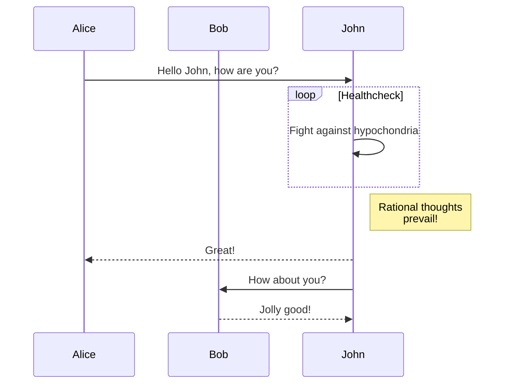
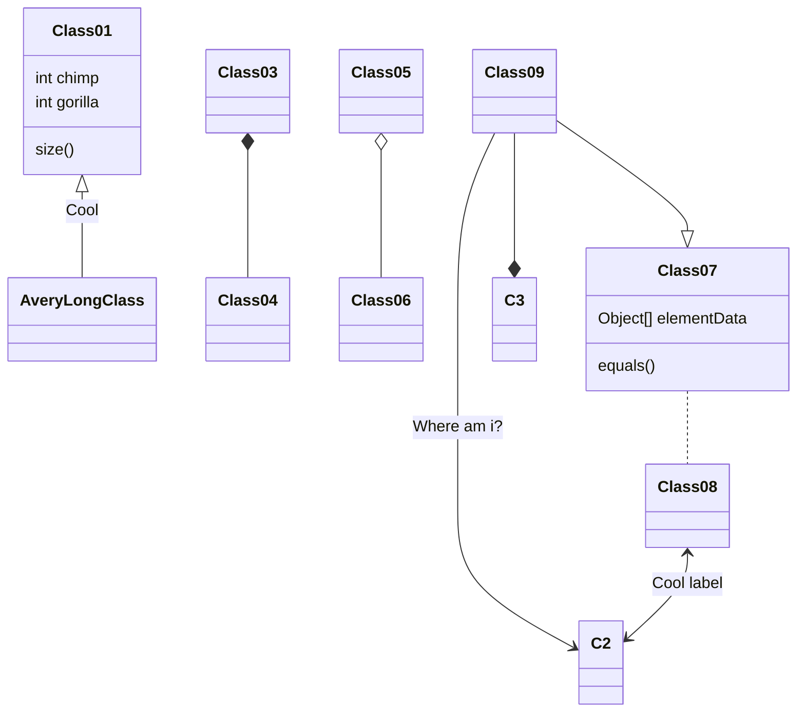
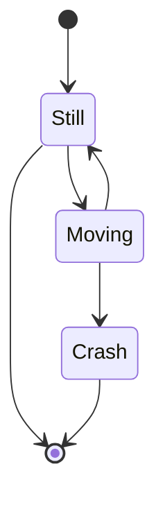
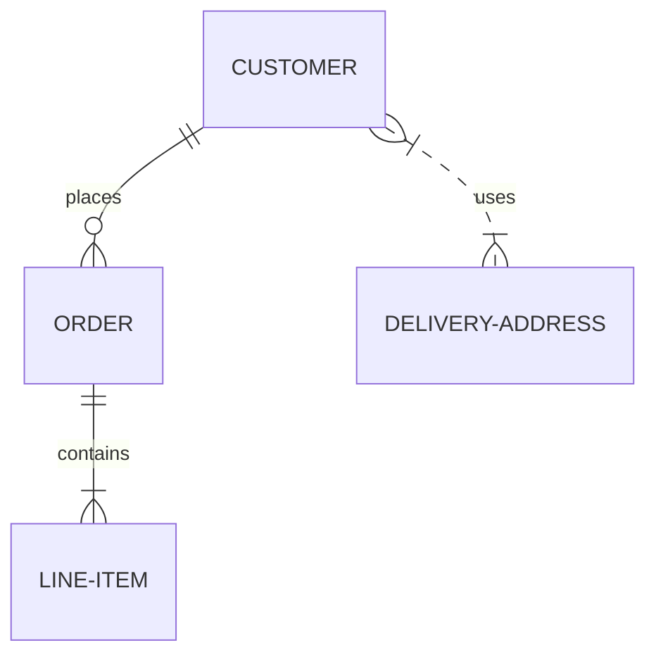
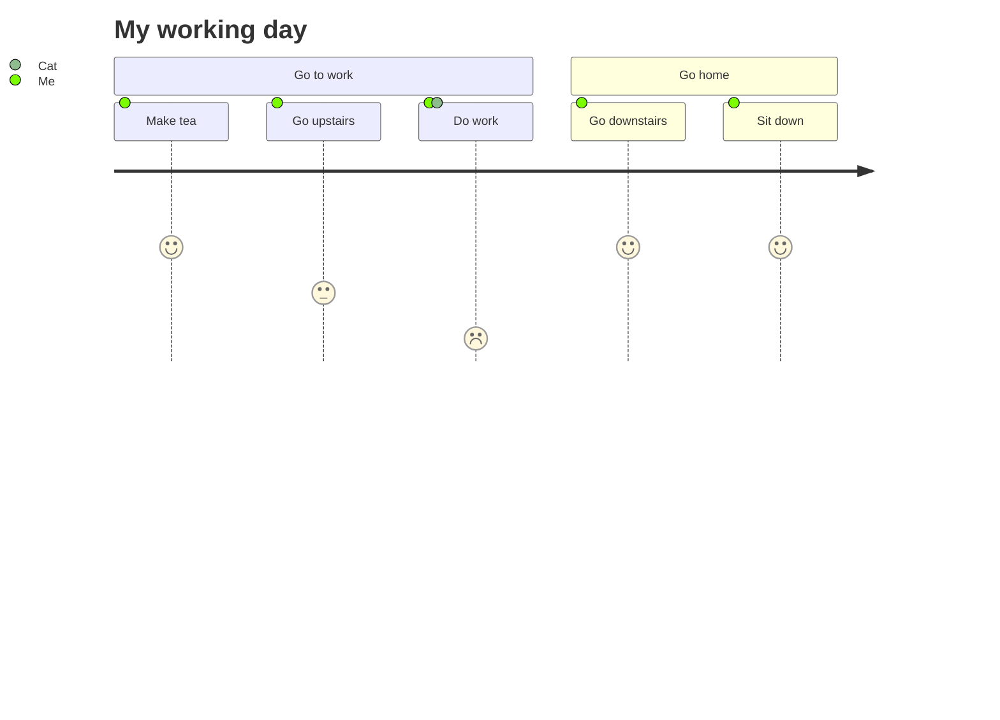
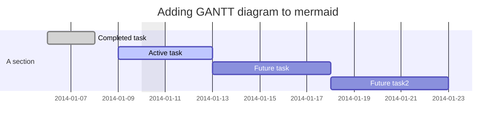
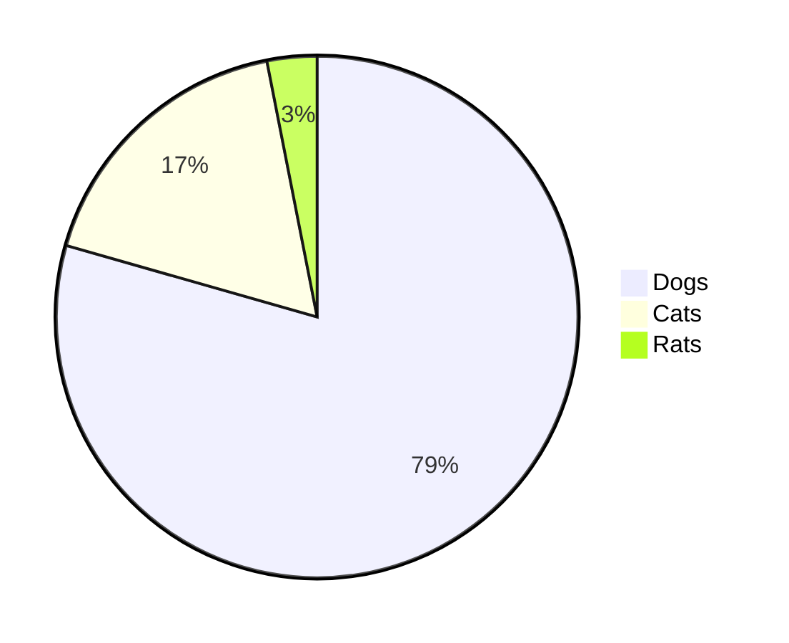
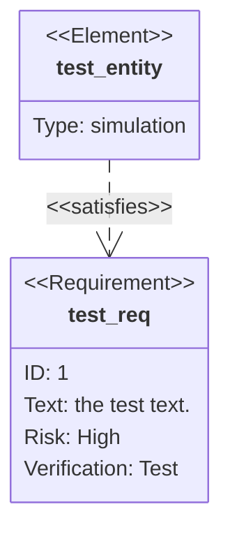
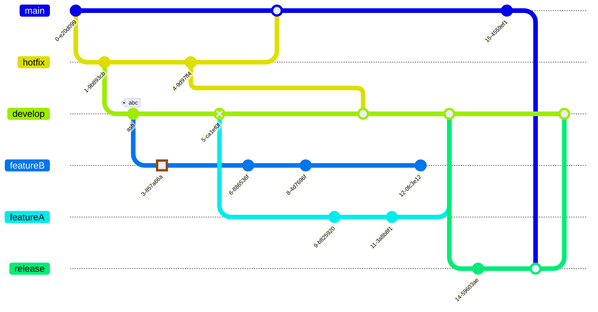

<!--more-->


Hugo [**v0.93.0**][hugo-release] or later is required for using fenced code blocks and markdown render hooks to display diagrams.

Check out the [`mermaid` shortcode][mermaid-shortcode] if you have to use an older version of Hugo.

[hugo-release]: https://github.com/gohugoio/hugo/releases/tag/v0.93.0
[mermaid-shortcode]: 


## GoAT

[[GoAT][goat]]^(Go ASCII Tool) is a Go implementation of [markdeep.mini.js][markdeep]'s ASCII diagram generator.

To use GoAT, simply place the ASCII input inside a code block with the language set to `goat`.

````markdown
```goat
// ASCII input here
```
````

Here are some examples of generated SVGs using GoAT.

More [examples][goat-examples] are available.

### Trees

````markdown
```goat
          .               .                .               .--- 1          .-- 1     / 1
         / \              |                |           .---+            .-+         +
        /   \         .---+---.         .--+--.        |   '--- 2      |   '-- 2   / \ 2
       +     +        |       |        |       |    ---+            ---+          +
      / \   / \     .-+-.   .-+-.     .+.     .+.      |   .--- 3      |   .-- 3   \ / 3
     /   \ /   \    |   |   |   |    |   |   |   |     '---+            '-+         +
     1   2 3   4    1   2   3   4    1   2   3   4         '--- 4          '-- 4     \ 4
```
````

```goat
          .               .                .               .--- 1          .-- 1     / 1
         / \              |                |           .---+            .-+         +
        /   \         .---+---.         .--+--.        |   '--- 2      |   '-- 2   / \ 2
       +     +        |       |        |       |    ---+            ---+          +
      / \   / \     .-+-.   .-+-.     .+.     .+.      |   .--- 3      |   .-- 3   \ / 3
     /   \ /   \    |   |   |   |    |   |   |   |     '---+            '-+         +
     1   2 3   4    1   2   3   4    1   2   3   4         '--- 4          '-- 4     \ 4
```

### Overlaps

````markdown
```goat
           .-.           .-.           .-.           .-.           .-.           .-.
          |   |         |   |         |   |         |   |         |   |         |   |
       .---------.   .--+---+--.   .--+---+--.   .--|   |--.   .--+   +--.   .------|--.
      |           | |           | |   |   |   | |   |   |   | |           | |   |   |   |
       '---------'   '--+---+--'   '--+---+--'   '--|   |--'   '--+   +--'   '--|------'
          |   |         |   |         |   |         |   |         |   |         |   |
           '-'           '-'           '-'           '-'           '-'           '-'
```
````

```goat
           .-.           .-.           .-.           .-.           .-.           .-.
          |   |         |   |         |   |         |   |         |   |         |   |
       .---------.   .--+---+--.   .--+---+--.   .--|   |--.   .--+   +--.   .------|--.
      |           | |           | |   |   |   | |   |   |   | |           | |   |   |   |
       '---------'   '--+---+--'   '--+---+--'   '--|   |--'   '--+   +--'   '--|------'
          |   |         |   |         |   |         |   |         |   |         |   |
           '-'           '-'           '-'           '-'           '-'           '-'
```

### Line Decorations

````markdown
```goat
                ________                            o        *          *   .--------------.
   *---+--.    |        |     o   o      |         ^          \        /   |  .----------.  |
       |   |    '--*   -+-    |   |      v        /            \      /    | |  <------.  | |
       |    '----->       .---(---'  --->*<---   /      .+->*<--o----'     | |          | | |
   <--'  ^  ^             |   |                 |      | |  ^    \         |  '--------'  | |
          \/        *-----'   o     |<----->|   '-----'  |__|     v         '------------'  |
          /\                                                               *---------------'
```
````

```goat
                ________                            o        *          *   .--------------.
   *---+--.    |        |     o   o      |         ^          \        /   |  .----------.  |
       |   |    '--*   -+-    |   |      v        /            \      /    | |  <------.  | |
       |    '----->       .---(---'  --->*<---   /      .+->*<--o----'     | |          | | |
   <--'  ^  ^             |   |                 |      | |  ^    \         |  '--------'  | |
          \/        *-----'   o     |<----->|   '-----'  |__|     v         '------------'  |
          /\                                                               *---------------'
```

### Line Ends

````markdown
```goat
   o--o    *--o     /  /   *  o  o o o o   * * * *   o o o o   * * * *      o o o o   * * * *
   o--*    *--*    v  v   ^  ^   | | | |   | | | |    \ \ \ \   \ \ \ \    / / / /   / / / /
   o-->    *-->   *  o   /  /    o * v '   o * v '     o * v \   o * v \  o * v /   o * v /
   o---    *---
                                 ^ ^ ^ ^   . . . .   ^ ^ ^ ^   \ \ \ \      ^ ^ ^ ^   / / / /
   |  |   *  o  \  \   *  o      | | | |   | | | |    \ \ \ \   \ \ \ \    / / / /   / / / /
   v  v   ^  ^   v  v   ^  ^     o * v '   o * v '     o * v \   o * v \  o * v /   o * v /
   *  o   |  |    *  o   \  \

   <--o   <--*   <-->   <---      ---o   ---*   --->   ----      *<--   o<--   -->o   -->*
```
````

```goat
   o--o    *--o     /  /   *  o  o o o o   * * * *   o o o o   * * * *      o o o o   * * * *
   o--*    *--*    v  v   ^  ^   | | | |   | | | |    \ \ \ \   \ \ \ \    / / / /   / / / /
   o-->    *-->   *  o   /  /    o * v '   o * v '     o * v \   o * v \  o * v /   o * v /
   o---    *---
                                 ^ ^ ^ ^   . . . .   ^ ^ ^ ^   \ \ \ \      ^ ^ ^ ^   / / / /
   |  |   *  o  \  \   *  o      | | | |   | | | |    \ \ \ \   \ \ \ \    / / / /   / / / /
   v  v   ^  ^   v  v   ^  ^     o * v '   o * v '     o * v \   o * v \  o * v /   o * v /
   *  o   |  |    *  o   \  \

   <--o   <--*   <-->   <---      ---o   ---*   --->   ----      *<--   o<--   -->o   -->*
```

### Dot Grids

````markdown
```goat
  o o o o o  * * * * *  * * o o *    o o o      * * *      o o o     · * · · ·     · · ·
  o o o o o  * * * * *  o o o o *   o o o o    * * * *    * o * *    · * * · ·    · · · ·
  o o o o o  * * * * *  o * o o o  o o o o o  * * * * *  o o o o o   · o · · o   · · * * ·
  o o o o o  * * * * *  o * o o o   o o o o    * * * *    o * o o    · · · · o    · · * ·
  o o o o o  * * * * *  * * * * o    o o o      * * *      o * o     · · · · ·     · · *
```
````

```goat
  o o o o o  * * * * *  * * o o *    o o o      * * *      o o o     · * · · ·     · · ·
  o o o o o  * * * * *  o o o o *   o o o o    * * * *    * o * *    · * * · ·    · · · ·
  o o o o o  * * * * *  o * o o o  o o o o o  * * * * *  o o o o o   · o · · o   · · * * ·
  o o o o o  * * * * *  o * o o o   o o o o    * * * *    o * o o    · · · · o    · · * ·
  o o o o o  * * * * *  * * * * o    o o o      * * *      o * o     · · · · ·     · · *
```

### Large Nodes

````markdown
```goat
   .---.       .-.        .-.       .-.                                       .-.
   | A +----->| 1 +<---->| 2 |<----+ 4 +------------------.                  | 8 |
   '---'       '-'        '+'       '-'                    |                  '-'
                           |         ^                     |                   ^
                           v         |                     v                   |
                          .-.      .-+-.        .-.      .-+-.      .-.       .+.       .---.
                         | 3 +---->| B |<----->| 5 +---->| C +---->| 6 +---->| 7 |<---->| D |
                          '-'      '---'        '-'      '---'      '-'       '-'       '---'
```
````

```goat
   .---.       .-.        .-.       .-.                                       .-.
   | A +----->| 1 +<---->| 2 |<----+ 4 +------------------.                  | 8 |
   '---'       '-'        '+'       '-'                    |                  '-'
                           |         ^                     |                   ^
                           v         |                     v                   |
                          .-.      .-+-.        .-.      .-+-.      .-.       .+.       .---.
                         | 3 +---->| B |<----->| 5 +---->| C +---->| 6 +---->| 7 |<---->| D |
                          '-'      '---'        '-'      '---'      '-'       '-'       '---'
```

### Small Grids

````markdown
```goat
       ___     ___      .---+---+---+---+---.     .---+---+---+---.  .---.   .---.
   ___/   \___/   \     |   |   |   |   |   |    / \ / \ / \ / \ /   |   +---+   |
  /   \___/   \___/     +---+---+---+---+---+   +---+---+---+---+    +---+   +---+
  \___/ b \___/   \     |   |   | b |   |   |    \ / \a/ \b/ \ / \   |   +---+   |
  / a \___/   \___/     +---+---+---+---+---+     +---+---+---+---+  +---+ b +---+
  \___/   \___/   \     |   | a |   |   |   |    / \ / \ / \ / \ /   | a +---+   |
      \___/   \___/     '---+---+---+---+---'   '---+---+---+---'    '---'   '---'
```
````

```goat
       ___     ___      .---+---+---+---+---.     .---+---+---+---.  .---.   .---.
   ___/   \___/   \     |   |   |   |   |   |    / \ / \ / \ / \ /   |   +---+   |
  /   \___/   \___/     +---+---+---+---+---+   +---+---+---+---+    +---+   +---+
  \___/ b \___/   \     |   |   | b |   |   |    \ / \a/ \b/ \ / \   |   +---+   |
  / a \___/   \___/     +---+---+---+---+---+     +---+---+---+---+  +---+ b +---+
  \___/   \___/   \     |   | a |   |   |   |    / \ / \ / \ / \ /   | a +---+   |
      \___/   \___/     '---+---+---+---+---'   '---+---+---+---'    '---'   '---'
```

### Big Grids

````markdown
```goat
    .----.        .----.
   /      \      /      \            .-----+-----+-----.
  +        +----+        +----.      |     |     |     |          .-----+-----+-----+-----+
   \      /      \      /      \     |     |     |     |         /     /     /     /     /
    +----+   B    +----+        +    +-----+-----+-----+        +-----+-----+-----+-----+
   /      \      /      \      /     |     |     |     |       /     /     /     /     /
  +   A    +----+        +----+      |     |  B  |     |      +-----+-----+-----+-----+
   \      /      \      /      \     +-----+-----+-----+     /     /  A  /  B  /     /
    '----+        +----+        +    |     |     |     |    +-----+-----+-----+-----+
          \      /      \      /     |  A  |     |     |   /     /     /     /     /
           '----'        '----'      '-----+-----+-----'  '-----+-----+-----+-----+
```
````

```goat
    .----.        .----.
   /      \      /      \            .-----+-----+-----.
  +        +----+        +----.      |     |     |     |          .-----+-----+-----+-----+
   \      /      \      /      \     |     |     |     |         /     /     /     /     /
    +----+   B    +----+        +    +-----+-----+-----+        +-----+-----+-----+-----+
   /      \      /      \      /     |     |     |     |       /     /     /     /     /
  +   A    +----+        +----+      |     |  B  |     |      +-----+-----+-----+-----+
   \      /      \      /      \     +-----+-----+-----+     /     /  A  /  B  /     /
    '----+        +----+        +    |     |     |     |    +-----+-----+-----+-----+
          \      /      \      /     |  A  |     |     |   /     /     /     /     /
           '----'        '----'      '-----+-----+-----'  '-----+-----+-----+-----+
```

### Complicated

````markdown
```goat
+-------------------+                           ^                      .---.
|    A Box          |__.--.__    __.-->         |      .-.             |   |
|                   |        '--'               v     | * |<---        |   |
+-------------------+                                  '-'             |   |
                       Round                                       *---(-. |
  .-----------------.  .-------.    .----------.         .-------.     | | |
 |   Mixed Rounded  | |         |  / Diagonals  \        |   |   |     | | |
 | & Square Corners |  '--. .--'  /              \       |---+---|     '-)-'       .--------.
 '--+------------+-'  .--. |     '-------+--------'      |   |   |       |        / Search /
    |            |   |    | '---.        |               '-------'       |       '-+------'
    |<---------->|   |    |      |       v                Interior                 |     ^
    '           <---'      '----'   .-----------.              ---.     .---       v     |
 .------------------.  Diag line    | .-------. +---.              \   /           .     |
 |   if (a > b)     +---.      .--->| |       | |    | Curved line  \ /           / \    |
 |   obj->fcn()     |    \    /     | '-------' |<--'                +           /   \   |
 '------------------'     '--'      '--+--------'      .--. .--.     |  .-.     +Done?+-'
    .---+-----.                        |   ^           |\ | | /|  .--+ |   |     \   /
    |   |     | Join        \|/        |   | Curved    | \| |/ | |    \    |      \ /
    |   |     +---->  o    --o--        '-'  Vertical  '--' '--'  '--  '--'        +  .---.
 <--+---+-----'       |     /|\                                                    |  | 3 |
                      v                             not:line    'quotes'        .-'   '---'
  .-.             .---+--------.            /            A || B   *bold*       |        ^
 |   |           |   Not a dot  |      <---+---<--    A dash--is not a line    v        |
  '-'             '---------+--'          /           Nor/is this.            ---
```
````

```goat
+-------------------+                           ^                      .---.
|    A Box          |__.--.__    __.-->         |      .-.             |   |
|                   |        '--'               v     | * |<---        |   |
+-------------------+                                  '-'             |   |
                       Round                                       *---(-. |
  .-----------------.  .-------.    .----------.         .-------.     | | |
 |   Mixed Rounded  | |         |  / Diagonals  \        |   |   |     | | |
 | & Square Corners |  '--. .--'  /              \       |---+---|     '-)-'       .--------.
 '--+------------+-'  .--. |     '-------+--------'      |   |   |       |        / Search /
    |            |   |    | '---.        |               '-------'       |       '-+------'
    |<---------->|   |    |      |       v                Interior                 |     ^
    '           <---'      '----'   .-----------.              ---.     .---       v     |
 .------------------.  Diag line    | .-------. +---.              \   /           .     |
 |   if (a > b)     +---.      .--->| |       | |    | Curved line  \ /           / \    |
 |   obj->fcn()     |    \    /     | '-------' |<--'                +           /   \   |
 '------------------'     '--'      '--+--------'      .--. .--.     |  .-.     +Done?+-'
    .---+-----.                        |   ^           |\ | | /|  .--+ |   |     \   /
    |   |     | Join        \|/        |   | Curved    | \| |/ | |    \    |      \ /
    |   |     +---->  o    --o--        '-'  Vertical  '--' '--'  '--  '--'        +  .---.
 <--+---+-----'       |     /|\                                                    |  | 3 |
                      v                             not:line    'quotes'        .-'   '---'
  .-.             .---+--------.            /            A || B   *bold*       |        ^
 |   |           |   Not a dot  |      <---+---<--    A dash--is not a line    v        |
  '-'             '---------+--'          /           Nor/is this.            ---
```

## Mermaid

[Mermaid][mermaid] is a JavaScript-based diagramming and charting tool that renders Markdown-inspired text definitions to create and modify diagrams dynamically. It lets you create diagrams and visualizations using text and code.

To use Mermaid, simply place the mermaid code inside a code block with the language set to `mermaid`.

````markdown
```mermaid
// mermaid diagram code here
```
````

Here are some examples of generated SVGs using Mermaid.

### Flowchat

All [Flowcharts][mermaid-flowchart] are composed of nodes, geometric shapes and edges, the arrows or lines. The mermaid code defines the way that these nodes and edges are made and interact.

````markdown

````


### Sequence Diagram

A [Sequence diagram][mermaid-sequenceDiagram] is an interaction diagram that shows how processes operate with one another and in what order.

````markdown

````


### Class Diagram

The [class diagram][mermaid-classDiagram] is the main building block of object-oriented modelling. It is used for general conceptual modelling of the structure of the application, and detailed modelling translating the models into programming code. Class diagrams can also be used for data modelling. The classes in a class diagram represent both the main elements, interactions in the application, and the classes to be programmed.

````markdown

````


### State Diagram

Mermaid can render [state diagrams][mermaid-stateDiagram]. The syntax tries to be compliant with the syntax used in plantUml as this will make it easier for users to share diagrams between mermaid and plantUml.

Example **state diagram** `mermaid` input:

````markdown

````

The rendered output looks like this:


### Entity Relationship Diagram

An [entity–relationship diagram][mermaid-entityRelationshipDiagram] (or ER diagram) describes interrelated things of interest in a specific domain of knowledge. A basic ER diagram is composed of entity types (which classify the things of interest) and specifies relationships that can exist between entities (instances of those entity types).

````markdown

````


### User Journey Diagram

[User journey diagrams][mermaid-user-journey] describe at a high level of detail exactly what steps different users take to complete a specific task within a system, application or website. This technique shows the current (as-is) user workflow, and reveals areas of improvement for the to-be workflow.

````markdown

````


### Gantt Diagram

A [Gantt chart][mermaid-gantt] is a type of bar chart, first developed by Karol Adamiecki in 1896, and independently by Henry Gantt in the 1910s, that illustrates a project schedule and the amount of time it would take for any one project to finish. Gantt charts illustrate numbers of days between the start and finish dates of the terminal elements and summary elements of a project.

````markdown

````


### Pie Chart

Mermaid can render [Pie Chart][mermaid-pie] diagrams.

Example **pie chart** `mermaid` input:

````markdown

````

The rendered output looks like this:


### Requirement Diagram

A [Requirement diagram][mermaid-requirementDiagram] provides a visualization for requirements and their connections, to each other and other documented elements. The modeling specs follow those defined by SysML v1.6.

Example **requirement diagram** `mermaid` input:

````markdown

````

The rendered output looks like this:


### Git graph

A [Git Graph][mermaid-gitgraph] is a pictorial representation of git commits and git actions(commands) on various branches.

````markdown

````

```mermaid
gitGraph
    commit
    branch hotfix
    checkout hotfix
    commit
    branch develop
    checkout develop
    commit id:"ash" tag:"abc"
    branch featureB
    checkout featureB
    commit type:HIGHLIGHT
    checkout main
    checkout hotfix
    commit type:NORMAL
    checkout develop
    commit type:REVERSE
    checkout featureB
    commit
    checkout main
    merge hotfix
    checkout featureB
    commit
    checkout develop
    branch featureA
    commit
    checkout develop
    merge hotfix
    checkout featureA
    commit
    checkout featureB
    commit
    checkout develop
    merge featureA
    branch release
    checkout release
    commit
    checkout main
    commit
    checkout release
    merge main
    checkout develop
    merge release
```

### C4 Diagrams :warning:

> C4 Diagram: This is an experimental diagram for now. The syntax and properties can change in future releases. Proper documentation will be provided when the syntax is stable.

Mermaid's c4 diagram syntax is compatible with plantUML. See example below:

````markdown
```mermaid
    C4Context
      title System Context diagram for Internet Banking System
      Enterprise_Boundary(b0, "BankBoundary0") {
        Person(customerA, "Banking Customer A", "A customer of the bank, with personal bank accounts.")
        Person(customerB, "Banking Customer B")
        Person_Ext(customerC, "Banking Customer C", "desc")

        Person(customerD, "Banking Customer D", "A customer of the bank, <br/> with personal bank accounts.")

        System(SystemAA, "Internet Banking System", "Allows customers to view information about their bank accounts, and make payments.")

        Enterprise_Boundary(b1, "BankBoundary") {

          SystemDb_Ext(SystemE, "Mainframe Banking System", "Stores all of the core banking information about customers, accounts, transactions, etc.")

          System_Boundary(b2, "BankBoundary2") {
            System(SystemA, "Banking System A")
            System(SystemB, "Banking System B", "A system of the bank, with personal bank accounts. next line.")
          }

          System_Ext(SystemC, "E-mail system", "The internal Microsoft Exchange e-mail system.")
          SystemDb(SystemD, "Banking System D Database", "A system of the bank, with personal bank accounts.")

          Boundary(b3, "BankBoundary3", "boundary") {
            SystemQueue(SystemF, "Banking System F Queue", "A system of the bank.")
            SystemQueue_Ext(SystemG, "Banking System G Queue", "A system of the bank, with personal bank accounts.")
          }
        }
      }

      BiRel(customerA, SystemAA, "Uses")
      BiRel(SystemAA, SystemE, "Uses")
      Rel(SystemAA, SystemC, "Sends e-mails", "SMTP")
      Rel(SystemC, customerA, "Sends e-mails to")

      UpdateElementStyle(customerA, $fontColor="red", $bgColor="grey", $borderColor="red")
      UpdateRelStyle(customerA, SystemAA, $textColor="blue", $lineColor="blue", $offsetX="5")
      UpdateRelStyle(SystemAA, SystemE, $textColor="blue", $lineColor="blue", $offsetY="-10")
      UpdateRelStyle(SystemAA, SystemC, $textColor="blue", $lineColor="blue", $offsetY="-40", $offsetX="-50")
      UpdateRelStyle(SystemC, customerA, $textColor="red", $lineColor="red", $offsetX="-50", $offsetY="20")

      UpdateLayoutConfig($c4ShapeInRow="3", $c4BoundaryInRow="1")
```
````

```mermaid
    C4Context
      title System Context diagram for Internet Banking System
      Enterprise_Boundary(b0, "BankBoundary0") {
        Person(customerA, "Banking Customer A", "A customer of the bank, with personal bank accounts.")
        Person(customerB, "Banking Customer B")
        Person_Ext(customerC, "Banking Customer C", "desc")

        Person(customerD, "Banking Customer D", "A customer of the bank, <br/> with personal bank accounts.")

        System(SystemAA, "Internet Banking System", "Allows customers to view information about their bank accounts, and make payments.")

        Enterprise_Boundary(b1, "BankBoundary") {

          SystemDb_Ext(SystemE, "Mainframe Banking System", "Stores all of the core banking information about customers, accounts, transactions, etc.")

          System_Boundary(b2, "BankBoundary2") {
            System(SystemA, "Banking System A")
            System(SystemB, "Banking System B", "A system of the bank, with personal bank accounts. next line.")
          }

          System_Ext(SystemC, "E-mail system", "The internal Microsoft Exchange e-mail system.")
          SystemDb(SystemD, "Banking System D Database", "A system of the bank, with personal bank accounts.")

          Boundary(b3, "BankBoundary3", "boundary") {
            SystemQueue(SystemF, "Banking System F Queue", "A system of the bank.")
            SystemQueue_Ext(SystemG, "Banking System G Queue", "A system of the bank, with personal bank accounts.")
          }
        }
      }

      BiRel(customerA, SystemAA, "Uses")
      BiRel(SystemAA, SystemE, "Uses")
      Rel(SystemAA, SystemC, "Sends e-mails", "SMTP")
      Rel(SystemC, customerA, "Sends e-mails to")

      UpdateElementStyle(customerA, $fontColor="red", $bgColor="grey", $borderColor="red")
      UpdateRelStyle(customerA, SystemAA, $textColor="blue", $lineColor="blue", $offsetX="5")
      UpdateRelStyle(SystemAA, SystemE, $textColor="blue", $lineColor="blue", $offsetY="-10")
      UpdateRelStyle(SystemAA, SystemC, $textColor="blue", $lineColor="blue", $offsetY="-40", $offsetX="-50")
      UpdateRelStyle(SystemC, customerA, $textColor="red", $lineColor="red", $offsetX="-50", $offsetY="20")

      UpdateLayoutConfig($c4ShapeInRow="3", $c4BoundaryInRow="1")
```

### Mindmap :warning:

- [ ] Bump Mermaid from 9.x to 10.x

### Timeline Diagram :warning:

- [ ] Bump Mermaid from 9.x to 10.x

### Mermaid Themes

Available themes are as follows:

1. [**default**][theme-default] - This is the default theme for all diagrams.
2. [**neutral**][theme-neutral] - This theme is great for black and white documents that will be printed.
3. [**dark**][theme-dark] - This theme goes well with dark-colored elements or dark-mode.
4. [**forest**][theme-forest] - This theme contains shades of green.
5. [**base**][theme-base] - This is the only theme that can be modified. Use this theme as the base for customizations.

Head to the [Theme Configuration | Mermaid][mermaid-theming] page to learn more about dynamic and integrated theme configuration.

#### Site-wide Themes

You can configure mermaid themes globally in `config.toml` via the `params.mermaid` parameter.

#### Diagram-specific Themes

To customize the theme of an individual diagram, use the `init` directive.

Example of `init` directive setting the `theme` to `forest`:

````markdown
```mermaid
%%{init: {'theme':'forest'}}%%
  graph TD
    a --> b
```
````

```mermaid
%%{init: {'theme':'forest'}}%%
  graph TD
    a --> b
```

[goat]: https://github.com/bep/goat
[markdeep]: https://casual-effects.com/markdeep/
[goat-examples]: https://github.com/bep/goat/tree/master/examples
[mermaid]: https://mermaid.js.org/
[mermaid-flowchart]: https://mermaid.js.org/syntax/flowchart.html
[mermaid-sequenceDiagram]: https://mermaid.js.org/syntax/sequenceDiagram.html
[mermaid-classDiagram]: https://mermaid.js.org/syntax/classDiagram.html
[mermaid-stateDiagram]: https://mermaid.js.org/syntax/stateDiagram.html
[mermaid-entityRelationshipDiagram]: https://mermaid.js.org/syntax/entityRelationshipDiagram.html
[mermaid-user-journey]: https://mermaid.js.org/syntax/userJourney.html
[mermaid-gantt]: https://mermaid.js.org/syntax/gantt.html
[mermaid-pie]: https://mermaid.js.org/syntax/pie.html
[mermaid-requirementDiagram]: https://mermaid.js.org/syntax/requirementDiagram.html
[mermaid-gitgraph]: https://mermaid.js.org/syntax/gitgraph.html
[theme-default]: https://github.com/mermaid-js/mermaid/blob/develop/packages/mermaid/src/themes/theme-default.js
[theme-neutral]: https://github.com/mermaid-js/mermaid/blob/develop/packages/mermaid/src/themes/theme-neutral.js
[theme-dark]: https://github.com/mermaid-js/mermaid/blob/develop/packages/mermaid/src/themes/theme-dark.js
[theme-forest]: https://github.com/mermaid-js/mermaid/blob/develop/packages/mermaid/src/themes/theme-forest.js
[theme-base]: https://github.com/mermaid-js/mermaid/blob/develop/packages/mermaid/src/themes/theme-base.js
[mermaid-theming]: https://mermaid.js.org/config/theming.html
