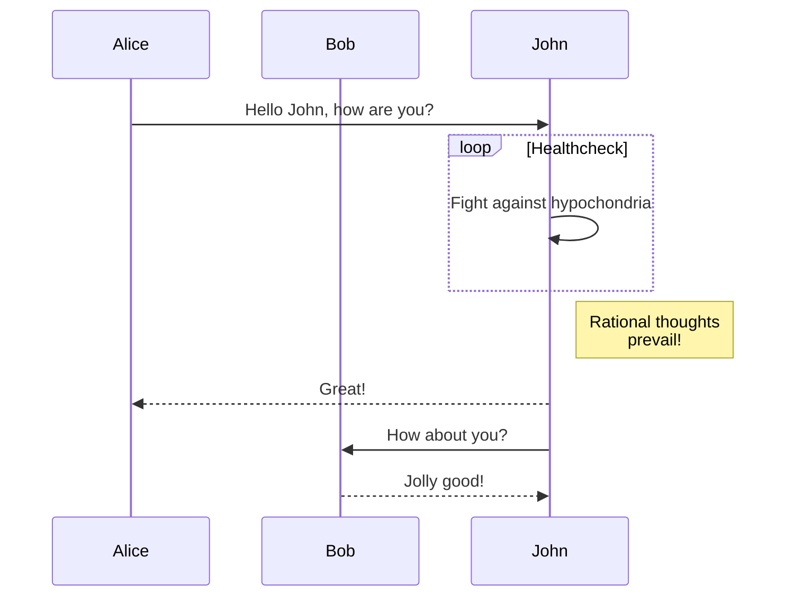
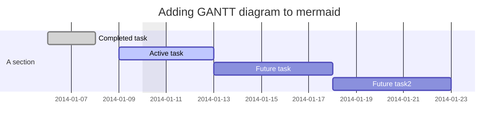
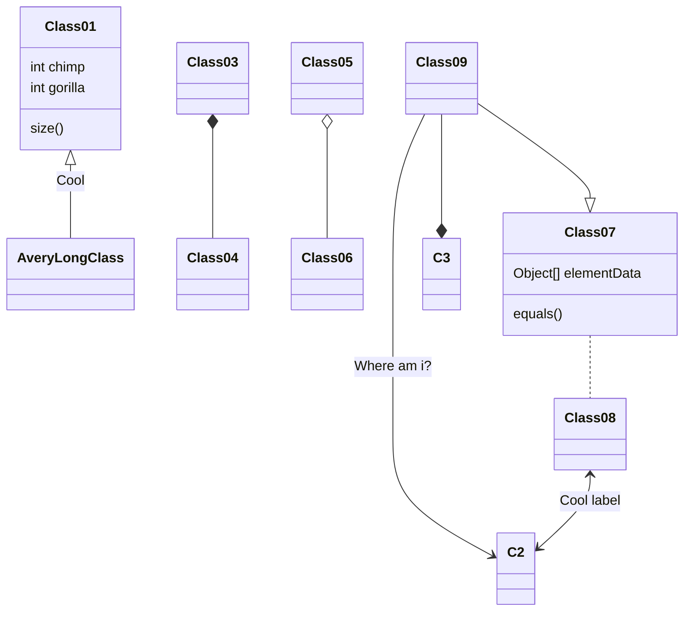
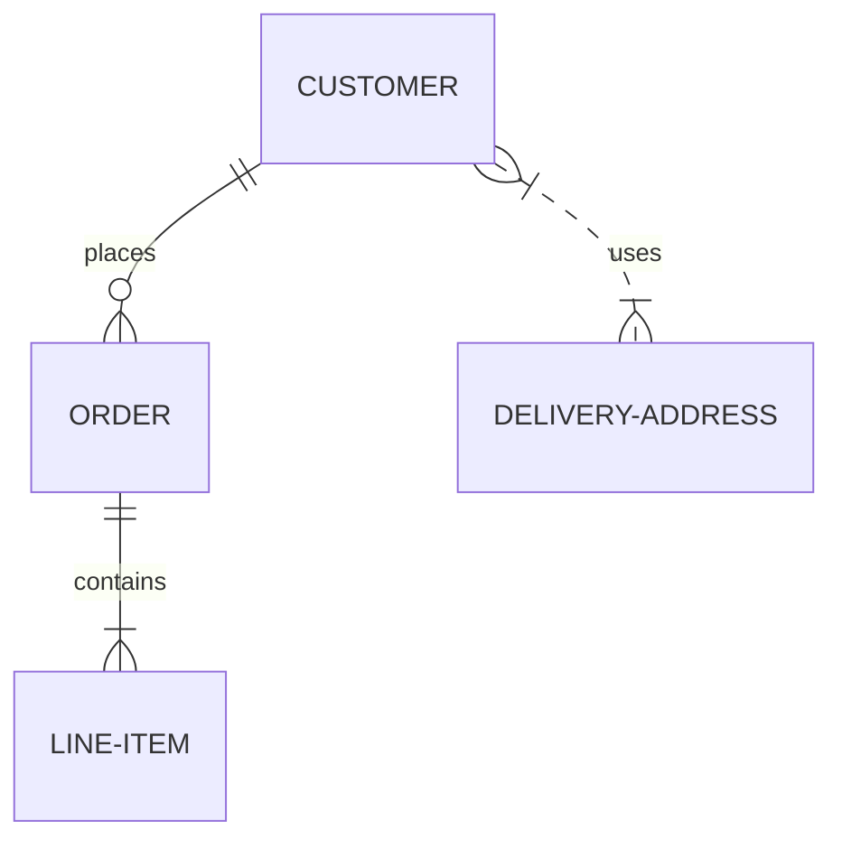
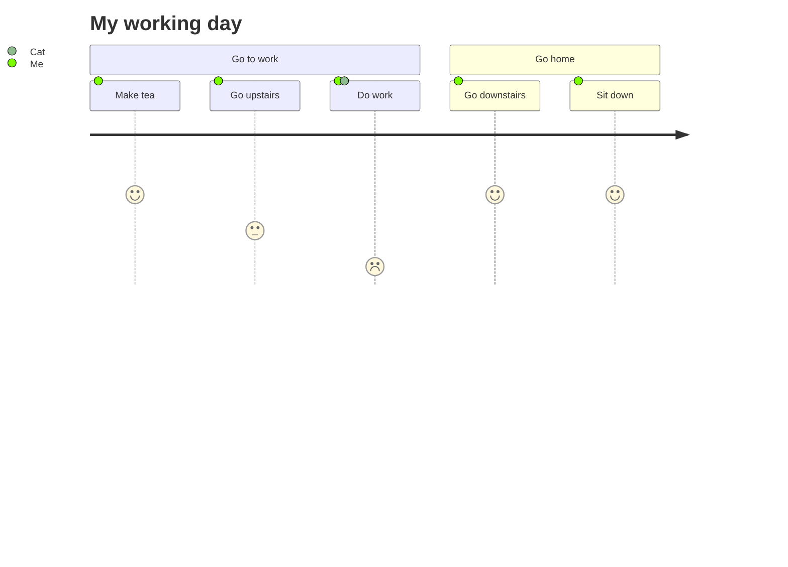
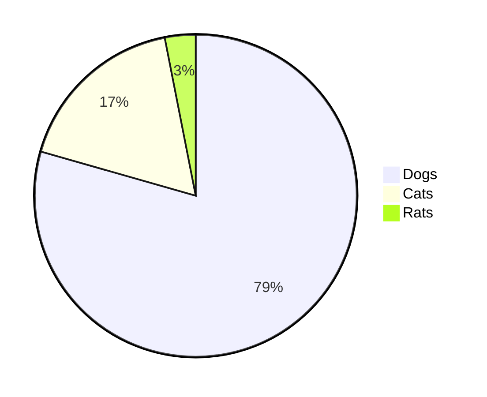
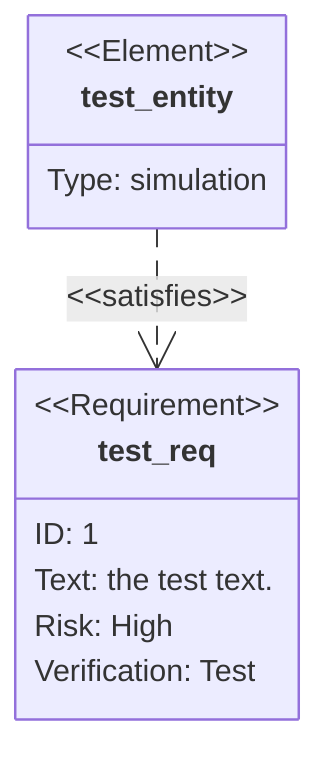
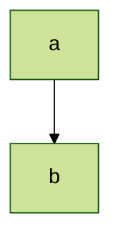

<!--more-->


你需要使用 Hugo [**v0.93.0**][hugo-release] 或更新的版本来创建自定义图表。

如果你不得不使用旧版的 Hugo，你可以使用 [`mermaid` shortcode][mermaid-shortcode]。

[hugo-release]: https://github.com/gohugoio/hugo/releases/tag/v0.93.0
[mermaid-shortcode]: 


## GoAT

[[GoAT][goat]]^(Go ASCII Tool) 是 [markdeep.mini.js][markdeep] 图像生成器的 Go 语言实现。

要使用 GoAT，只需将 ASCII 输入放在代码块中，并将语言设置为 `goat`。

````markdown
```goat
// ASCII input here
```
````

以下是使用 GoAT 生成 SVG 的一些示例。

查看更多[示例][goat-examples] 。

### 树

````markdown
```goat
          .               .                .               .--- 1          .-- 1     / 1
         / \              |                |           .---+            .-+         +
        /   \         .---+---.         .--+--.        |   '--- 2      |   '-- 2   / \ 2
       +     +        |       |        |       |    ---+            ---+          +
      / \   / \     .-+-.   .-+-.     .+.     .+.      |   .--- 3      |   .-- 3   \ / 3
     /   \ /   \    |   |   |   |    |   |   |   |     '---+            '-+         +
     1   2 3   4    1   2   3   4    1   2   3   4         '--- 4          '-- 4     \ 4
```
````

```goat
          .               .                .               .--- 1          .-- 1     / 1
         / \              |                |           .---+            .-+         +
        /   \         .---+---.         .--+--.        |   '--- 2      |   '-- 2   / \ 2
       +     +        |       |        |       |    ---+            ---+          +
      / \   / \     .-+-.   .-+-.     .+.     .+.      |   .--- 3      |   .-- 3   \ / 3
     /   \ /   \    |   |   |   |    |   |   |   |     '---+            '-+         +
     1   2 3   4    1   2   3   4    1   2   3   4         '--- 4          '-- 4     \ 4
```

### 重叠

````markdown
```goat
           .-.           .-.           .-.           .-.           .-.           .-.
          |   |         |   |         |   |         |   |         |   |         |   |
       .---------.   .--+---+--.   .--+---+--.   .--|   |--.   .--+   +--.   .------|--.
      |           | |           | |   |   |   | |   |   |   | |           | |   |   |   |
       '---------'   '--+---+--'   '--+---+--'   '--|   |--'   '--+   +--'   '--|------'
          |   |         |   |         |   |         |   |         |   |         |   |
           '-'           '-'           '-'           '-'           '-'           '-'
```
````

```goat
           .-.           .-.           .-.           .-.           .-.           .-.
          |   |         |   |         |   |         |   |         |   |         |   |
       .---------.   .--+---+--.   .--+---+--.   .--|   |--.   .--+   +--.   .------|--.
      |           | |           | |   |   |   | |   |   |   | |           | |   |   |   |
       '---------'   '--+---+--'   '--+---+--'   '--|   |--'   '--+   +--'   '--|------'
          |   |         |   |         |   |         |   |         |   |         |   |
           '-'           '-'           '-'           '-'           '-'           '-'
```

### 线条装饰

````markdown
```goat
                ________                            o        *          *   .--------------.
   *---+--.    |        |     o   o      |         ^          \        /   |  .----------.  |
       |   |    '--*   -+-    |   |      v        /            \      /    | |  <------.  | |
       |    '----->       .---(---'  --->*<---   /      .+->*<--o----'     | |          | | |
   <--'  ^  ^             |   |                 |      | |  ^    \         |  '--------'  | |
          \/        *-----'   o     |<----->|   '-----'  |__|     v         '------------'  |
          /\                                                               *---------------'
```
````

```goat
                ________                            o        *          *   .--------------.
   *---+--.    |        |     o   o      |         ^          \        /   |  .----------.  |
       |   |    '--*   -+-    |   |      v        /            \      /    | |  <------.  | |
       |    '----->       .---(---'  --->*<---   /      .+->*<--o----'     | |          | | |
   <--'  ^  ^             |   |                 |      | |  ^    \         |  '--------'  | |
          \/        *-----'   o     |<----->|   '-----'  |__|     v         '------------'  |
          /\                                                               *---------------'
```

### 线端

````markdown
```goat
   o--o    *--o     /  /   *  o  o o o o   * * * *   o o o o   * * * *      o o o o   * * * *
   o--*    *--*    v  v   ^  ^   | | | |   | | | |    \ \ \ \   \ \ \ \    / / / /   / / / /
   o-->    *-->   *  o   /  /    o * v '   o * v '     o * v \   o * v \  o * v /   o * v /
   o---    *---
                                 ^ ^ ^ ^   . . . .   ^ ^ ^ ^   \ \ \ \      ^ ^ ^ ^   / / / /
   |  |   *  o  \  \   *  o      | | | |   | | | |    \ \ \ \   \ \ \ \    / / / /   / / / /
   v  v   ^  ^   v  v   ^  ^     o * v '   o * v '     o * v \   o * v \  o * v /   o * v /
   *  o   |  |    *  o   \  \

   <--o   <--*   <-->   <---      ---o   ---*   --->   ----      *<--   o<--   -->o   -->*
```
````

```goat
   o--o    *--o     /  /   *  o  o o o o   * * * *   o o o o   * * * *      o o o o   * * * *
   o--*    *--*    v  v   ^  ^   | | | |   | | | |    \ \ \ \   \ \ \ \    / / / /   / / / /
   o-->    *-->   *  o   /  /    o * v '   o * v '     o * v \   o * v \  o * v /   o * v /
   o---    *---
                                 ^ ^ ^ ^   . . . .   ^ ^ ^ ^   \ \ \ \      ^ ^ ^ ^   / / / /
   |  |   *  o  \  \   *  o      | | | |   | | | |    \ \ \ \   \ \ \ \    / / / /   / / / /
   v  v   ^  ^   v  v   ^  ^     o * v '   o * v '     o * v \   o * v \  o * v /   o * v /
   *  o   |  |    *  o   \  \

   <--o   <--*   <-->   <---      ---o   ---*   --->   ----      *<--   o<--   -->o   -->*
```

### 点网格

````markdown
```goat
  o o o o o  * * * * *  * * o o *    o o o      * * *      o o o     · * · · ·     · · ·
  o o o o o  * * * * *  o o o o *   o o o o    * * * *    * o * *    · * * · ·    · · · ·
  o o o o o  * * * * *  o * o o o  o o o o o  * * * * *  o o o o o   · o · · o   · · * * ·
  o o o o o  * * * * *  o * o o o   o o o o    * * * *    o * o o    · · · · o    · · * ·
  o o o o o  * * * * *  * * * * o    o o o      * * *      o * o     · · · · ·     · · *
```
````

```goat
  o o o o o  * * * * *  * * o o *    o o o      * * *      o o o     · * · · ·     · · ·
  o o o o o  * * * * *  o o o o *   o o o o    * * * *    * o * *    · * * · ·    · · · ·
  o o o o o  * * * * *  o * o o o  o o o o o  * * * * *  o o o o o   · o · · o   · · * * ·
  o o o o o  * * * * *  o * o o o   o o o o    * * * *    o * o o    · · · · o    · · * ·
  o o o o o  * * * * *  * * * * o    o o o      * * *      o * o     · · · · ·     · · *
```

### 大节点

````markdown
```goat
   .---.       .-.        .-.       .-.                                       .-.
   | A +----->| 1 +<---->| 2 |<----+ 4 +------------------.                  | 8 |
   '---'       '-'        '+'       '-'                    |                  '-'
                           |         ^                     |                   ^
                           v         |                     v                   |
                          .-.      .-+-.        .-.      .-+-.      .-.       .+.       .---.
                         | 3 +---->| B |<----->| 5 +---->| C +---->| 6 +---->| 7 |<---->| D |
                          '-'      '---'        '-'      '---'      '-'       '-'       '---'
```
````

```goat
   .---.       .-.        .-.       .-.                                       .-.
   | A +----->| 1 +<---->| 2 |<----+ 4 +------------------.                  | 8 |
   '---'       '-'        '+'       '-'                    |                  '-'
                           |         ^                     |                   ^
                           v         |                     v                   |
                          .-.      .-+-.        .-.      .-+-.      .-.       .+.       .---.
                         | 3 +---->| B |<----->| 5 +---->| C +---->| 6 +---->| 7 |<---->| D |
                          '-'      '---'        '-'      '---'      '-'       '-'       '---'
```

### 小网格

````markdown
```goat
       ___     ___      .---+---+---+---+---.     .---+---+---+---.  .---.   .---.
   ___/   \___/   \     |   |   |   |   |   |    / \ / \ / \ / \ /   |   +---+   |
  /   \___/   \___/     +---+---+---+---+---+   +---+---+---+---+    +---+   +---+
  \___/ b \___/   \     |   |   | b |   |   |    \ / \a/ \b/ \ / \   |   +---+   |
  / a \___/   \___/     +---+---+---+---+---+     +---+---+---+---+  +---+ b +---+
  \___/   \___/   \     |   | a |   |   |   |    / \ / \ / \ / \ /   | a +---+   |
      \___/   \___/     '---+---+---+---+---'   '---+---+---+---'    '---'   '---'
```
````

```goat
       ___     ___      .---+---+---+---+---.     .---+---+---+---.  .---.   .---.
   ___/   \___/   \     |   |   |   |   |   |    / \ / \ / \ / \ /   |   +---+   |
  /   \___/   \___/     +---+---+---+---+---+   +---+---+---+---+    +---+   +---+
  \___/ b \___/   \     |   |   | b |   |   |    \ / \a/ \b/ \ / \   |   +---+   |
  / a \___/   \___/     +---+---+---+---+---+     +---+---+---+---+  +---+ b +---+
  \___/   \___/   \     |   | a |   |   |   |    / \ / \ / \ / \ /   | a +---+   |
      \___/   \___/     '---+---+---+---+---'   '---+---+---+---'    '---'   '---'
```

### 大网格

````markdown
```goat
    .----.        .----.
   /      \      /      \            .-----+-----+-----.
  +        +----+        +----.      |     |     |     |          .-----+-----+-----+-----+
   \      /      \      /      \     |     |     |     |         /     /     /     /     /
    +----+   B    +----+        +    +-----+-----+-----+        +-----+-----+-----+-----+
   /      \      /      \      /     |     |     |     |       /     /     /     /     /
  +   A    +----+        +----+      |     |  B  |     |      +-----+-----+-----+-----+
   \      /      \      /      \     +-----+-----+-----+     /     /  A  /  B  /     /
    '----+        +----+        +    |     |     |     |    +-----+-----+-----+-----+
          \      /      \      /     |  A  |     |     |   /     /     /     /     /
           '----'        '----'      '-----+-----+-----'  '-----+-----+-----+-----+
```
````

```goat
    .----.        .----.
   /      \      /      \            .-----+-----+-----.
  +        +----+        +----.      |     |     |     |          .-----+-----+-----+-----+
   \      /      \      /      \     |     |     |     |         /     /     /     /     /
    +----+   B    +----+        +    +-----+-----+-----+        +-----+-----+-----+-----+
   /      \      /      \      /     |     |     |     |       /     /     /     /     /
  +   A    +----+        +----+      |     |  B  |     |      +-----+-----+-----+-----+
   \      /      \      /      \     +-----+-----+-----+     /     /  A  /  B  /     /
    '----+        +----+        +    |     |     |     |    +-----+-----+-----+-----+
          \      /      \      /     |  A  |     |     |   /     /     /     /     /
           '----'        '----'      '-----+-----+-----'  '-----+-----+-----+-----+
```

### 复杂图表

````markdown
```goat
+-------------------+                           ^                      .---.
|    A Box          |__.--.__    __.-->         |      .-.             |   |
|                   |        '--'               v     | * |<---        |   |
+-------------------+                                  '-'             |   |
                       Round                                       *---(-. |
  .-----------------.  .-------.    .----------.         .-------.     | | |
 |   Mixed Rounded  | |         |  / Diagonals  \        |   |   |     | | |
 | & Square Corners |  '--. .--'  /              \       |---+---|     '-)-'       .--------.
 '--+------------+-'  .--. |     '-------+--------'      |   |   |       |        / Search /
    |            |   |    | '---.        |               '-------'       |       '-+------'
    |<---------->|   |    |      |       v                Interior                 |     ^
    '           <---'      '----'   .-----------.              ---.     .---       v     |
 .------------------.  Diag line    | .-------. +---.              \   /           .     |
 |   if (a > b)     +---.      .--->| |       | |    | Curved line  \ /           / \    |
 |   obj->fcn()     |    \    /     | '-------' |<--'                +           /   \   |
 '------------------'     '--'      '--+--------'      .--. .--.     |  .-.     +Done?+-'
    .---+-----.                        |   ^           |\ | | /|  .--+ |   |     \   /
    |   |     | Join        \|/        |   | Curved    | \| |/ | |    \    |      \ /
    |   |     +---->  o    --o--        '-'  Vertical  '--' '--'  '--  '--'        +  .---.
 <--+---+-----'       |     /|\                                                    |  | 3 |
                      v                             not:line    'quotes'        .-'   '---'
  .-.             .---+--------.            /            A || B   *bold*       |        ^
 |   |           |   Not a dot  |      <---+---<--    A dash--is not a line    v        |
  '-'             '---------+--'          /           Nor/is this.            ---
```
````

```goat
+-------------------+                           ^                      .---.
|    A Box          |__.--.__    __.-->         |      .-.             |   |
|                   |        '--'               v     | * |<---        |   |
+-------------------+                                  '-'             |   |
                       Round                                       *---(-. |
  .-----------------.  .-------.    .----------.         .-------.     | | |
 |   Mixed Rounded  | |         |  / Diagonals  \        |   |   |     | | |
 | & Square Corners |  '--. .--'  /              \       |---+---|     '-)-'       .--------.
 '--+------------+-'  .--. |     '-------+--------'      |   |   |       |        / Search /
    |            |   |    | '---.        |               '-------'       |       '-+------'
    |<---------->|   |    |      |       v                Interior                 |     ^
    '           <---'      '----'   .-----------.              ---.     .---       v     |
 .------------------.  Diag line    | .-------. +---.              \   /           .     |
 |   if (a > b)     +---.      .--->| |       | |    | Curved line  \ /           / \    |
 |   obj->fcn()     |    \    /     | '-------' |<--'                +           /   \   |
 '------------------'     '--'      '--+--------'      .--. .--.     |  .-.     +Done?+-'
    .---+-----.                        |   ^           |\ | | /|  .--+ |   |     \   /
    |   |     | Join        \|/        |   | Curved    | \| |/ | |    \    |      \ /
    |   |     +---->  o    --o--        '-'  Vertical  '--' '--'  '--  '--'        +  .---.
 <--+---+-----'       |     /|\                                                    |  | 3 |
                      v                             not:line    'quotes'        .-'   '---'
  .-.             .---+--------.            /            A || B   *bold*       |        ^
 |   |           |   Not a dot  |      <---+---<--    A dash--is not a line    v        |
  '-'             '---------+--'          /           Nor/is this.            ---
```

## Mermaid

[Mermaid][mermaid] 是一个基于 JavaScript 的图表工具，它允许您使用文本和代码创建图表和可视化。

要使用 Mermaid，只需将 Mermaid 的代码输入放在代码块中，并将语言设置为 `mermaid`。

````markdown
```mermaid
// mermaid diagram code here
```
````

下面是一些使用 Mermaid 生成的 SVG 图表示例。

### 流程图

All [Flowcharts][mermaid-flowchart] are composed of nodes, geometric shapes and edges, the arrows or lines. The mermaid code defines the way that these nodes and edges are made and interact.

````markdown

````


### 序列图

A [Sequence diagram][mermaid-sequenceDiagram] is an interaction diagram that shows how processes operate with one another and in what order.

````markdown

````


### 甘特图

A [Gantt chart][mermaid-gantt] is a type of bar chart, first developed by Karol Adamiecki in 1896, and independently by Henry Gantt in the 1910s, that illustrates a project schedule and the amount of time it would take for any one project to finish. Gantt charts illustrate numbers of days between the start and finish dates of the terminal elements and summary elements of a project.

````markdown

````


### 类图

The [class diagram][mermaid-classDiagram] is the main building block of object-oriented modelling. It is used for general conceptual modelling of the structure of the application, and detailed modelling translating the models into programming code. Class diagrams can also be used for data modelling. The classes in a class diagram represent both the main elements, interactions in the application, and the classes to be programmed.

````markdown

````


### Git 图

````markdown

````


### 实体关系图

An [entity–relationship diagram][mermaid-entityRelationshipDiagram] (or ER diagram) describes interrelated things of interest in a specific domain of knowledge. A basic ER diagram is composed of entity types (which classify the things of interest) and specifies relationships that can exist between entities (instances of those entity types).

````markdown

````


### 用户旅程图

[User journey diagrams][mermaid-user-journey] describe at a high level of detail exactly what steps different users take to complete a specific task within a system, application or website. This technique shows the current (as-is) user workflow, and reveals areas of improvement for the to-be workflow.

````markdown

````


### 饼图

一个 **饼图** `mermaid` 示例:

````markdown

````

呈现的输出效果如下:


### 依赖图

一个 **依赖图** `mermaid` 示例:

````markdown

````

呈现的输出效果如下:


### Mermaid 主题

以下是可用的主题：

1. [**default**][theme-default] - 这是所有图表的默认主题。
2. [**neutral**][theme-neutral] - 这个主题非常适合黑白打印的文档。
3. [**dark**][theme-dark] - 这个主题适合与深色元素或暗模式搭配使用。
4. [**forest**][theme-forest] - 这个主题包含各种绿色。
5. [**base**][theme-base] - 这是唯一可以修改的主题。使用此主题作为自定义的基础。

请前往 [Theme Configuration | Mermaid][mermaid-theming] 页面，了解有关动态和集成主题配置的更多信息。

#### 站点范围主题

您可以通过 `config.toml` 中的 `params.mermaid` 参数全局配置 Mermaid 主题。

#### 图表特定主题

要自定义单个图表的主题，请使用 `init` 指令。

以下是使用 `init` 指令将主题设置为 `forest` 的示例代码：

````markdown

````

```mermaid
%%{init: {'theme':'forest'}}%%
  graph TD
    a --> b
```

[goat]: https://github.com/bep/goat
[markdeep]: https://casual-effects.com/markdeep/
[goat-examples]: https://github.com/bep/goat/tree/master/examples
[mermaid]: https://mermaid-js.github.io/
[mermaid-flowchart]: https://mermaid-js.github.io/mermaid/#/./flowchart?id=flowcharts-basic-syntax
[mermaid-sequenceDiagram]: https://mermaid-js.github.io/mermaid/#/./sequenceDiagram
[mermaid-gantt]: https://mermaid-js.github.io/mermaid/#/./gantt
[mermaid-classDiagram]: https://mermaid-js.github.io/mermaid/#/./classDiagram
[mermaid-entityRelationshipDiagram]: https://mermaid-js.github.io/mermaid/#/./entityRelationshipDiagram
[mermaid-user-journey]: https://mermaid-js.github.io/mermaid/#/./user-journey
[theme-default]: https://github.com/mermaid-js/mermaid/blob/develop/packages/mermaid/src/themes/theme-default.js
[theme-neutral]: https://github.com/mermaid-js/mermaid/blob/develop/packages/mermaid/src/themes/theme-neutral.js
[theme-dark]: https://github.com/mermaid-js/mermaid/blob/develop/packages/mermaid/src/themes/theme-dark.js
[theme-forest]: https://github.com/mermaid-js/mermaid/blob/develop/packages/mermaid/src/themes/theme-forest.js
[theme-base]: https://github.com/mermaid-js/mermaid/blob/develop/packages/mermaid/src/themes/theme-base.js
[mermaid-theming]: https://mermaid.js.org/config/theming.html
