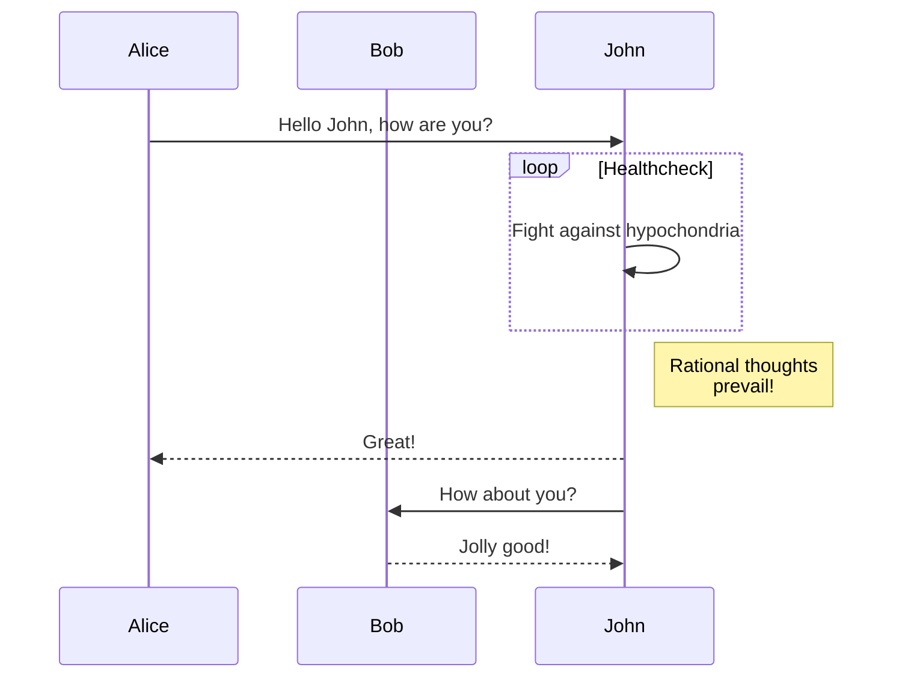
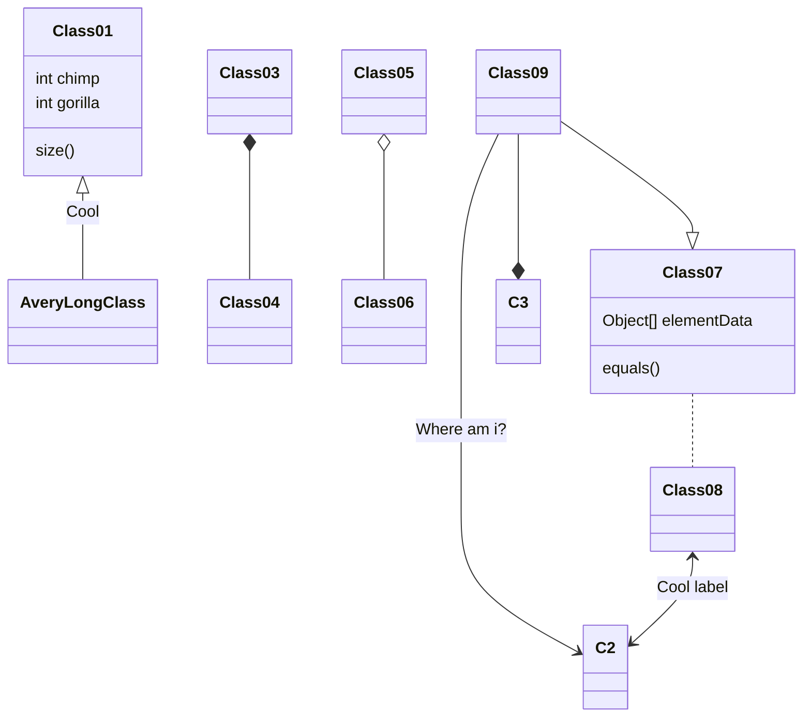
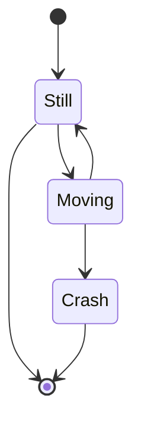
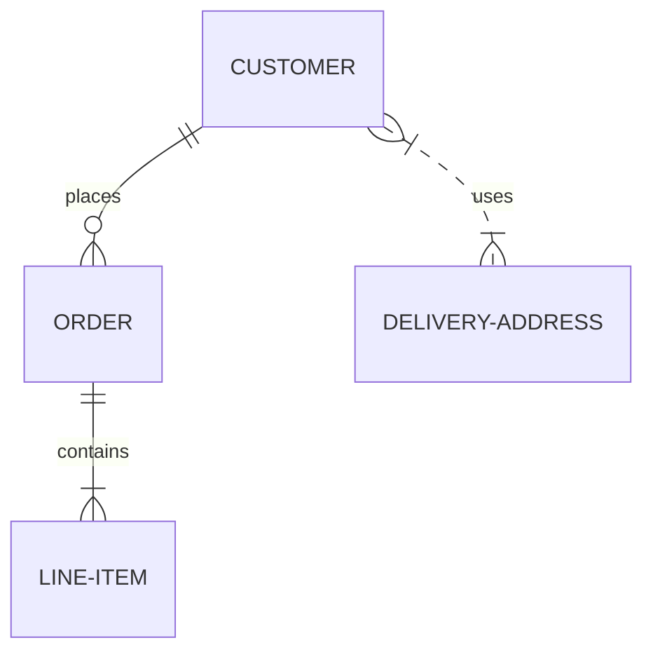
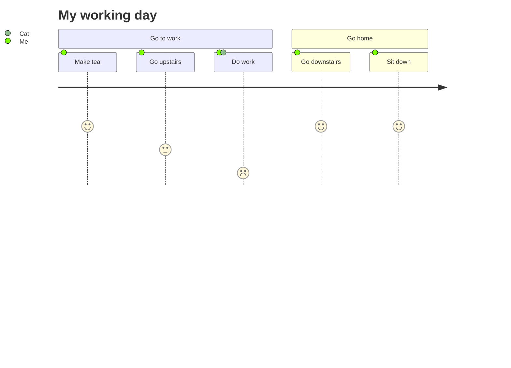
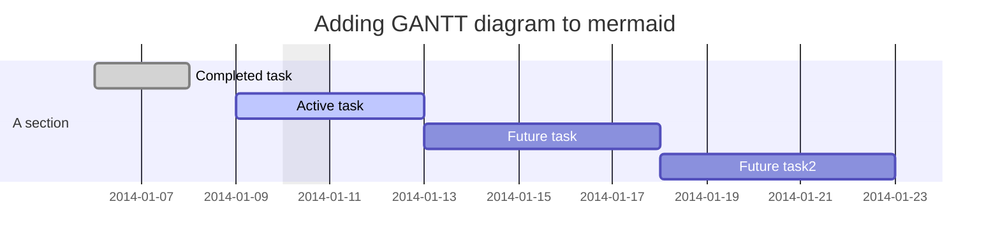
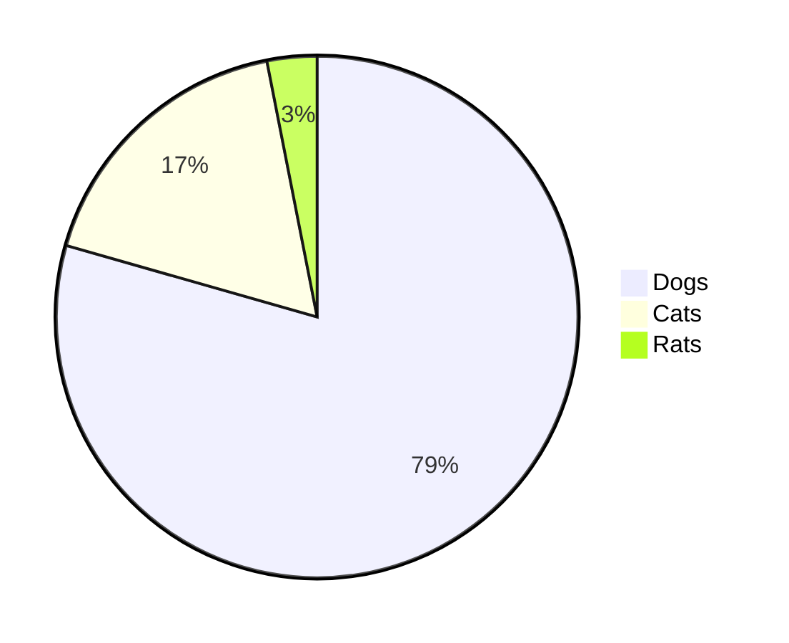
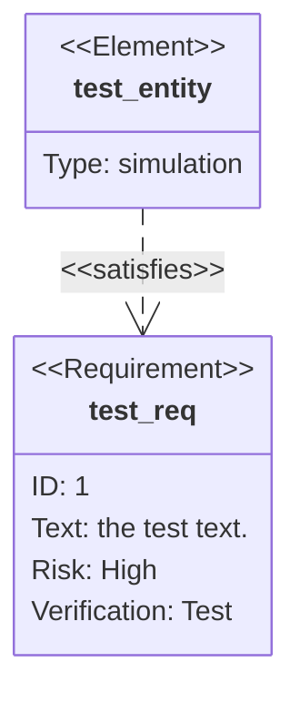
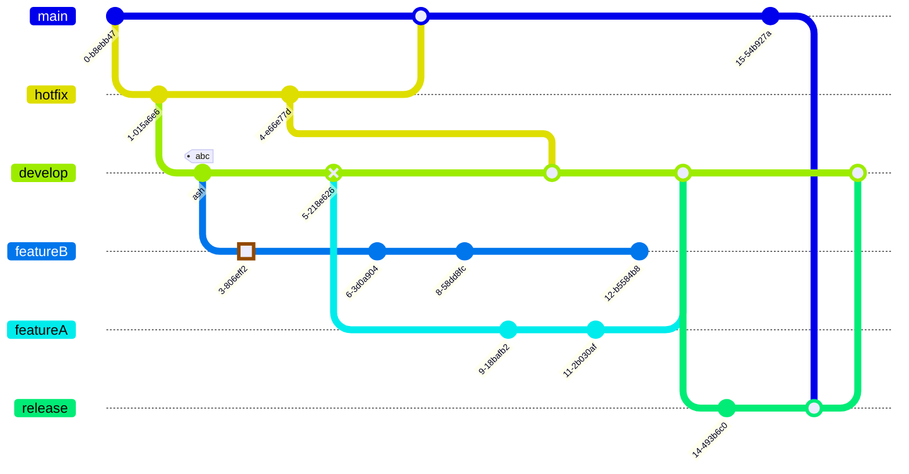

<!--more-->


你需要使用 Hugo [**v0.93.0**][hugo-release] 或更新的版本来创建自定义图表。

如果你不得不使用旧版的 Hugo，你可以使用 [`mermaid` shortcode][mermaid-shortcode]。

[hugo-release]: https://github.com/gohugoio/hugo/releases/tag/v0.93.0
[mermaid-shortcode]: 


## GoAT

[[GoAT][goat]]^(Go ASCII Tool) 是 [markdeep.mini.js][markdeep] 图像生成器的 Go 语言实现。

要使用 GoAT，只需将 ASCII 输入放在代码块中，并将语言设置为 `goat`。

````markdown
```goat
// ASCII input here
```
````

以下是使用 GoAT 生成 SVG 的一些示例。

查看更多[示例][goat-examples] 。

### 树

````markdown
```goat
          .               .                .               .--- 1          .-- 1     / 1
         / \              |                |           .---+            .-+         +
        /   \         .---+---.         .--+--.        |   '--- 2      |   '-- 2   / \ 2
       +     +        |       |        |       |    ---+            ---+          +
      / \   / \     .-+-.   .-+-.     .+.     .+.      |   .--- 3      |   .-- 3   \ / 3
     /   \ /   \    |   |   |   |    |   |   |   |     '---+            '-+         +
     1   2 3   4    1   2   3   4    1   2   3   4         '--- 4          '-- 4     \ 4
```
````

```goat
          .               .                .               .--- 1          .-- 1     / 1
         / \              |                |           .---+            .-+         +
        /   \         .---+---.         .--+--.        |   '--- 2      |   '-- 2   / \ 2
       +     +        |       |        |       |    ---+            ---+          +
      / \   / \     .-+-.   .-+-.     .+.     .+.      |   .--- 3      |   .-- 3   \ / 3
     /   \ /   \    |   |   |   |    |   |   |   |     '---+            '-+         +
     1   2 3   4    1   2   3   4    1   2   3   4         '--- 4          '-- 4     \ 4
```

### 重叠

````markdown
```goat
           .-.           .-.           .-.           .-.           .-.           .-.
          |   |         |   |         |   |         |   |         |   |         |   |
       .---------.   .--+---+--.   .--+---+--.   .--|   |--.   .--+   +--.   .------|--.
      |           | |           | |   |   |   | |   |   |   | |           | |   |   |   |
       '---------'   '--+---+--'   '--+---+--'   '--|   |--'   '--+   +--'   '--|------'
          |   |         |   |         |   |         |   |         |   |         |   |
           '-'           '-'           '-'           '-'           '-'           '-'
```
````

```goat
           .-.           .-.           .-.           .-.           .-.           .-.
          |   |         |   |         |   |         |   |         |   |         |   |
       .---------.   .--+---+--.   .--+---+--.   .--|   |--.   .--+   +--.   .------|--.
      |           | |           | |   |   |   | |   |   |   | |           | |   |   |   |
       '---------'   '--+---+--'   '--+---+--'   '--|   |--'   '--+   +--'   '--|------'
          |   |         |   |         |   |         |   |         |   |         |   |
           '-'           '-'           '-'           '-'           '-'           '-'
```

### 线条装饰

````markdown
```goat
                ________                            o        *          *   .--------------.
   *---+--.    |        |     o   o      |         ^          \        /   |  .----------.  |
       |   |    '--*   -+-    |   |      v        /            \      /    | |  <------.  | |
       |    '----->       .---(---'  --->*<---   /      .+->*<--o----'     | |          | | |
   <--'  ^  ^             |   |                 |      | |  ^    \         |  '--------'  | |
          \/        *-----'   o     |<----->|   '-----'  |__|     v         '------------'  |
          /\                                                               *---------------'
```
````

```goat
                ________                            o        *          *   .--------------.
   *---+--.    |        |     o   o      |         ^          \        /   |  .----------.  |
       |   |    '--*   -+-    |   |      v        /            \      /    | |  <------.  | |
       |    '----->       .---(---'  --->*<---   /      .+->*<--o----'     | |          | | |
   <--'  ^  ^             |   |                 |      | |  ^    \         |  '--------'  | |
          \/        *-----'   o     |<----->|   '-----'  |__|     v         '------------'  |
          /\                                                               *---------------'
```

### 线端

````markdown
```goat
   o--o    *--o     /  /   *  o  o o o o   * * * *   o o o o   * * * *      o o o o   * * * *
   o--*    *--*    v  v   ^  ^   | | | |   | | | |    \ \ \ \   \ \ \ \    / / / /   / / / /
   o-->    *-->   *  o   /  /    o * v '   o * v '     o * v \   o * v \  o * v /   o * v /
   o---    *---
                                 ^ ^ ^ ^   . . . .   ^ ^ ^ ^   \ \ \ \      ^ ^ ^ ^   / / / /
   |  |   *  o  \  \   *  o      | | | |   | | | |    \ \ \ \   \ \ \ \    / / / /   / / / /
   v  v   ^  ^   v  v   ^  ^     o * v '   o * v '     o * v \   o * v \  o * v /   o * v /
   *  o   |  |    *  o   \  \

   <--o   <--*   <-->   <---      ---o   ---*   --->   ----      *<--   o<--   -->o   -->*
```
````

```goat
   o--o    *--o     /  /   *  o  o o o o   * * * *   o o o o   * * * *      o o o o   * * * *
   o--*    *--*    v  v   ^  ^   | | | |   | | | |    \ \ \ \   \ \ \ \    / / / /   / / / /
   o-->    *-->   *  o   /  /    o * v '   o * v '     o * v \   o * v \  o * v /   o * v /
   o---    *---
                                 ^ ^ ^ ^   . . . .   ^ ^ ^ ^   \ \ \ \      ^ ^ ^ ^   / / / /
   |  |   *  o  \  \   *  o      | | | |   | | | |    \ \ \ \   \ \ \ \    / / / /   / / / /
   v  v   ^  ^   v  v   ^  ^     o * v '   o * v '     o * v \   o * v \  o * v /   o * v /
   *  o   |  |    *  o   \  \

   <--o   <--*   <-->   <---      ---o   ---*   --->   ----      *<--   o<--   -->o   -->*
```

### 点网格

````markdown
```goat
  o o o o o  * * * * *  * * o o *    o o o      * * *      o o o     · * · · ·     · · ·
  o o o o o  * * * * *  o o o o *   o o o o    * * * *    * o * *    · * * · ·    · · · ·
  o o o o o  * * * * *  o * o o o  o o o o o  * * * * *  o o o o o   · o · · o   · · * * ·
  o o o o o  * * * * *  o * o o o   o o o o    * * * *    o * o o    · · · · o    · · * ·
  o o o o o  * * * * *  * * * * o    o o o      * * *      o * o     · · · · ·     · · *
```
````

```goat
  o o o o o  * * * * *  * * o o *    o o o      * * *      o o o     · * · · ·     · · ·
  o o o o o  * * * * *  o o o o *   o o o o    * * * *    * o * *    · * * · ·    · · · ·
  o o o o o  * * * * *  o * o o o  o o o o o  * * * * *  o o o o o   · o · · o   · · * * ·
  o o o o o  * * * * *  o * o o o   o o o o    * * * *    o * o o    · · · · o    · · * ·
  o o o o o  * * * * *  * * * * o    o o o      * * *      o * o     · · · · ·     · · *
```

### 大节点

````markdown
```goat
   .---.       .-.        .-.       .-.                                       .-.
   | A +----->| 1 +<---->| 2 |<----+ 4 +------------------.                  | 8 |
   '---'       '-'        '+'       '-'                    |                  '-'
                           |         ^                     |                   ^
                           v         |                     v                   |
                          .-.      .-+-.        .-.      .-+-.      .-.       .+.       .---.
                         | 3 +---->| B |<----->| 5 +---->| C +---->| 6 +---->| 7 |<---->| D |
                          '-'      '---'        '-'      '---'      '-'       '-'       '---'
```
````

```goat
   .---.       .-.        .-.       .-.                                       .-.
   | A +----->| 1 +<---->| 2 |<----+ 4 +------------------.                  | 8 |
   '---'       '-'        '+'       '-'                    |                  '-'
                           |         ^                     |                   ^
                           v         |                     v                   |
                          .-.      .-+-.        .-.      .-+-.      .-.       .+.       .---.
                         | 3 +---->| B |<----->| 5 +---->| C +---->| 6 +---->| 7 |<---->| D |
                          '-'      '---'        '-'      '---'      '-'       '-'       '---'
```

### 小网格

````markdown
```goat
       ___     ___      .---+---+---+---+---.     .---+---+---+---.  .---.   .---.
   ___/   \___/   \     |   |   |   |   |   |    / \ / \ / \ / \ /   |   +---+   |
  /   \___/   \___/     +---+---+---+---+---+   +---+---+---+---+    +---+   +---+
  \___/ b \___/   \     |   |   | b |   |   |    \ / \a/ \b/ \ / \   |   +---+   |
  / a \___/   \___/     +---+---+---+---+---+     +---+---+---+---+  +---+ b +---+
  \___/   \___/   \     |   | a |   |   |   |    / \ / \ / \ / \ /   | a +---+   |
      \___/   \___/     '---+---+---+---+---'   '---+---+---+---'    '---'   '---'
```
````

```goat
       ___     ___      .---+---+---+---+---.     .---+---+---+---.  .---.   .---.
   ___/   \___/   \     |   |   |   |   |   |    / \ / \ / \ / \ /   |   +---+   |
  /   \___/   \___/     +---+---+---+---+---+   +---+---+---+---+    +---+   +---+
  \___/ b \___/   \     |   |   | b |   |   |    \ / \a/ \b/ \ / \   |   +---+   |
  / a \___/   \___/     +---+---+---+---+---+     +---+---+---+---+  +---+ b +---+
  \___/   \___/   \     |   | a |   |   |   |    / \ / \ / \ / \ /   | a +---+   |
      \___/   \___/     '---+---+---+---+---'   '---+---+---+---'    '---'   '---'
```

### 大网格

````markdown
```goat
    .----.        .----.
   /      \      /      \            .-----+-----+-----.
  +        +----+        +----.      |     |     |     |          .-----+-----+-----+-----+
   \      /      \      /      \     |     |     |     |         /     /     /     /     /
    +----+   B    +----+        +    +-----+-----+-----+        +-----+-----+-----+-----+
   /      \      /      \      /     |     |     |     |       /     /     /     /     /
  +   A    +----+        +----+      |     |  B  |     |      +-----+-----+-----+-----+
   \      /      \      /      \     +-----+-----+-----+     /     /  A  /  B  /     /
    '----+        +----+        +    |     |     |     |    +-----+-----+-----+-----+
          \      /      \      /     |  A  |     |     |   /     /     /     /     /
           '----'        '----'      '-----+-----+-----'  '-----+-----+-----+-----+
```
````

```goat
    .----.        .----.
   /      \      /      \            .-----+-----+-----.
  +        +----+        +----.      |     |     |     |          .-----+-----+-----+-----+
   \      /      \      /      \     |     |     |     |         /     /     /     /     /
    +----+   B    +----+        +    +-----+-----+-----+        +-----+-----+-----+-----+
   /      \      /      \      /     |     |     |     |       /     /     /     /     /
  +   A    +----+        +----+      |     |  B  |     |      +-----+-----+-----+-----+
   \      /      \      /      \     +-----+-----+-----+     /     /  A  /  B  /     /
    '----+        +----+        +    |     |     |     |    +-----+-----+-----+-----+
          \      /      \      /     |  A  |     |     |   /     /     /     /     /
           '----'        '----'      '-----+-----+-----'  '-----+-----+-----+-----+
```

### 复杂图表

````markdown
```goat
+-------------------+                           ^                      .---.
|    A Box          |__.--.__    __.-->         |      .-.             |   |
|                   |        '--'               v     | * |<---        |   |
+-------------------+                                  '-'             |   |
                       Round                                       *---(-. |
  .-----------------.  .-------.    .----------.         .-------.     | | |
 |   Mixed Rounded  | |         |  / Diagonals  \        |   |   |     | | |
 | & Square Corners |  '--. .--'  /              \       |---+---|     '-)-'       .--------.
 '--+------------+-'  .--. |     '-------+--------'      |   |   |       |        / Search /
    |            |   |    | '---.        |               '-------'       |       '-+------'
    |<---------->|   |    |      |       v                Interior                 |     ^
    '           <---'      '----'   .-----------.              ---.     .---       v     |
 .------------------.  Diag line    | .-------. +---.              \   /           .     |
 |   if (a > b)     +---.      .--->| |       | |    | Curved line  \ /           / \    |
 |   obj->fcn()     |    \    /     | '-------' |<--'                +           /   \   |
 '------------------'     '--'      '--+--------'      .--. .--.     |  .-.     +Done?+-'
    .---+-----.                        |   ^           |\ | | /|  .--+ |   |     \   /
    |   |     | Join        \|/        |   | Curved    | \| |/ | |    \    |      \ /
    |   |     +---->  o    --o--        '-'  Vertical  '--' '--'  '--  '--'        +  .---.
 <--+---+-----'       |     /|\                                                    |  | 3 |
                      v                             not:line    'quotes'        .-'   '---'
  .-.             .---+--------.            /            A || B   *bold*       |        ^
 |   |           |   Not a dot  |      <---+---<--    A dash--is not a line    v        |
  '-'             '---------+--'          /           Nor/is this.            ---
```
````

```goat
+-------------------+                           ^                      .---.
|    A Box          |__.--.__    __.-->         |      .-.             |   |
|                   |        '--'               v     | * |<---        |   |
+-------------------+                                  '-'             |   |
                       Round                                       *---(-. |
  .-----------------.  .-------.    .----------.         .-------.     | | |
 |   Mixed Rounded  | |         |  / Diagonals  \        |   |   |     | | |
 | & Square Corners |  '--. .--'  /              \       |---+---|     '-)-'       .--------.
 '--+------------+-'  .--. |     '-------+--------'      |   |   |       |        / Search /
    |            |   |    | '---.        |               '-------'       |       '-+------'
    |<---------->|   |    |      |       v                Interior                 |     ^
    '           <---'      '----'   .-----------.              ---.     .---       v     |
 .------------------.  Diag line    | .-------. +---.              \   /           .     |
 |   if (a > b)     +---.      .--->| |       | |    | Curved line  \ /           / \    |
 |   obj->fcn()     |    \    /     | '-------' |<--'                +           /   \   |
 '------------------'     '--'      '--+--------'      .--. .--.     |  .-.     +Done?+-'
    .---+-----.                        |   ^           |\ | | /|  .--+ |   |     \   /
    |   |     | Join        \|/        |   | Curved    | \| |/ | |    \    |      \ /
    |   |     +---->  o    --o--        '-'  Vertical  '--' '--'  '--  '--'        +  .---.
 <--+---+-----'       |     /|\                                                    |  | 3 |
                      v                             not:line    'quotes'        .-'   '---'
  .-.             .---+--------.            /            A || B   *bold*       |        ^
 |   |           |   Not a dot  |      <---+---<--    A dash--is not a line    v        |
  '-'             '---------+--'          /           Nor/is this.            ---
```

## Mermaid

[Mermaid][mermaid] 是一个基于 JavaScript 的图表工具，它允许您使用文本和代码创建图表和可视化。

要使用 Mermaid，只需将 Mermaid 的代码输入放在代码块中，并将语言设置为 `mermaid`。

````markdown
```mermaid
// mermaid diagram code here
```
````

下面是一些使用 Mermaid 生成的 SVG 图表示例。

### 流程图

所有 [流程图][mermaid-flowchart] 都由节点、几何形状和边缘（箭头或线）组成。Mermaid 代码定义了这些节点和边缘的制作方式和交互方式。

````markdown

````


### 序列图

[序列图][mermaid-sequenceDiagram] 是一种交互图，显示进程如何相互操作以及按什么顺序进行操作。

````markdown

````


### 类图

[类图][mermaid-classDiagram] 是面向对象建模的主要构建单元。它用于应用程序结构的一般概念建模，并将模型转换为编程代码的详细建模。类图也可以用于数据建模。类图中的类既表示应用程序中的主要元素和交互，也表示要编程的类。

````markdown

````


### 状态图

Mermaid 可以渲染 [状态图][mermaid-stateDiagram]。 语法尝试与 plantUml 中使用的语法兼容，因为这将使用户更容易在 mermaid 和 plantUml 之间共享图表。

一个 **状态图** `mermaid` 示例：

````markdown

````

呈现的输出效果如下：


### 实体关系图

[实体关系图][mermaid-entityRelationshipDiagram]（或 ER 图）描述了特定领域中相关的事物。基本的 ER 图由实体类型（分类感兴趣的事物）组成，并指定可以存在于实体之间（这些实体类型的实例）的关系。

````markdown

````


### 用户旅程图

[用户旅程图][mermaid-user-journey] 在高层次上描述了不同用户在系统、应用程序或网站中完成特定任务所采取的确切步骤。这种技术展示了当前（现有）的用户工作流程，并揭示了 to-be 工作流的改进区域。

````markdown

````


### 甘特图

[甘特图][mermaid-gantt] 是一种条形图，由 Karol Adamiecki 在 1896 年首次开发，独立于 Henry Gantt 在 1910 年代开发，用于说明项目进度和完成任何一个项目所需的时间量。甘特图说明了项目的终端元素和摘要元素的开始和结束日期之间的天数。

````markdown

````


### 饼图

Mermaid 可以渲染 [饼图][mermaid-pie]。

一个 **饼图** `mermaid` 示例:

````markdown

````

呈现的输出效果如下:


### 依赖图

[依赖图][mermaid-requirementDiagram] 提供了需求及其相互关系和其他文档化元素的可视化。建模规范遵循 SysML v1.6 定义的规范。

一个 **依赖图** `mermaid` 示例:

````markdown

````

呈现的输出效果如下:


### Git 图

[Git 图][mermaid-gitgraph]是 git 提交和 git 操作（命令）在各个分支上的图形表示。

````markdown

````

```mermaid
gitGraph
    commit
    branch hotfix
    checkout hotfix
    commit
    branch develop
    checkout develop
    commit id:"ash" tag:"abc"
    branch featureB
    checkout featureB
    commit type:HIGHLIGHT
    checkout main
    checkout hotfix
    commit type:NORMAL
    checkout develop
    commit type:REVERSE
    checkout featureB
    commit
    checkout main
    merge hotfix
    checkout featureB
    commit
    checkout develop
    branch featureA
    commit
    checkout develop
    merge hotfix
    checkout featureA
    commit
    checkout featureB
    commit
    checkout develop
    merge featureA
    branch release
    checkout release
    commit
    checkout main
    commit
    checkout release
    merge main
    checkout develop
    merge release
```

### C4 图 :warning:

> C4 图：目前这是一个实验性的图表。语法和属性可能会在未来的版本中发生变化。当语法稳定后，将会提供适当的文档说明。

Mermaid 的 C4 图语法与 PlantUML 兼容。以下是示例：

````markdown
```mermaid
    C4Context
      title System Context diagram for Internet Banking System
      Enterprise_Boundary(b0, "BankBoundary0") {
        Person(customerA, "Banking Customer A", "A customer of the bank, with personal bank accounts.")
        Person(customerB, "Banking Customer B")
        Person_Ext(customerC, "Banking Customer C", "desc")

        Person(customerD, "Banking Customer D", "A customer of the bank, <br/> with personal bank accounts.")

        System(SystemAA, "Internet Banking System", "Allows customers to view information about their bank accounts, and make payments.")

        Enterprise_Boundary(b1, "BankBoundary") {

          SystemDb_Ext(SystemE, "Mainframe Banking System", "Stores all of the core banking information about customers, accounts, transactions, etc.")

          System_Boundary(b2, "BankBoundary2") {
            System(SystemA, "Banking System A")
            System(SystemB, "Banking System B", "A system of the bank, with personal bank accounts. next line.")
          }

          System_Ext(SystemC, "E-mail system", "The internal Microsoft Exchange e-mail system.")
          SystemDb(SystemD, "Banking System D Database", "A system of the bank, with personal bank accounts.")

          Boundary(b3, "BankBoundary3", "boundary") {
            SystemQueue(SystemF, "Banking System F Queue", "A system of the bank.")
            SystemQueue_Ext(SystemG, "Banking System G Queue", "A system of the bank, with personal bank accounts.")
          }
        }
      }

      BiRel(customerA, SystemAA, "Uses")
      BiRel(SystemAA, SystemE, "Uses")
      Rel(SystemAA, SystemC, "Sends e-mails", "SMTP")
      Rel(SystemC, customerA, "Sends e-mails to")

      UpdateElementStyle(customerA, $fontColor="red", $bgColor="grey", $borderColor="red")
      UpdateRelStyle(customerA, SystemAA, $textColor="blue", $lineColor="blue", $offsetX="5")
      UpdateRelStyle(SystemAA, SystemE, $textColor="blue", $lineColor="blue", $offsetY="-10")
      UpdateRelStyle(SystemAA, SystemC, $textColor="blue", $lineColor="blue", $offsetY="-40", $offsetX="-50")
      UpdateRelStyle(SystemC, customerA, $textColor="red", $lineColor="red", $offsetX="-50", $offsetY="20")

      UpdateLayoutConfig($c4ShapeInRow="3", $c4BoundaryInRow="1")
```
````

```mermaid
    C4Context
      title System Context diagram for Internet Banking System
      Enterprise_Boundary(b0, "BankBoundary0") {
        Person(customerA, "Banking Customer A", "A customer of the bank, with personal bank accounts.")
        Person(customerB, "Banking Customer B")
        Person_Ext(customerC, "Banking Customer C", "desc")

        Person(customerD, "Banking Customer D", "A customer of the bank, <br/> with personal bank accounts.")

        System(SystemAA, "Internet Banking System", "Allows customers to view information about their bank accounts, and make payments.")

        Enterprise_Boundary(b1, "BankBoundary") {

          SystemDb_Ext(SystemE, "Mainframe Banking System", "Stores all of the core banking information about customers, accounts, transactions, etc.")

          System_Boundary(b2, "BankBoundary2") {
            System(SystemA, "Banking System A")
            System(SystemB, "Banking System B", "A system of the bank, with personal bank accounts. next line.")
          }

          System_Ext(SystemC, "E-mail system", "The internal Microsoft Exchange e-mail system.")
          SystemDb(SystemD, "Banking System D Database", "A system of the bank, with personal bank accounts.")

          Boundary(b3, "BankBoundary3", "boundary") {
            SystemQueue(SystemF, "Banking System F Queue", "A system of the bank.")
            SystemQueue_Ext(SystemG, "Banking System G Queue", "A system of the bank, with personal bank accounts.")
          }
        }
      }

      BiRel(customerA, SystemAA, "Uses")
      BiRel(SystemAA, SystemE, "Uses")
      Rel(SystemAA, SystemC, "Sends e-mails", "SMTP")
      Rel(SystemC, customerA, "Sends e-mails to")

      UpdateElementStyle(customerA, $fontColor="red", $bgColor="grey", $borderColor="red")
      UpdateRelStyle(customerA, SystemAA, $textColor="blue", $lineColor="blue", $offsetX="5")
      UpdateRelStyle(SystemAA, SystemE, $textColor="blue", $lineColor="blue", $offsetY="-10")
      UpdateRelStyle(SystemAA, SystemC, $textColor="blue", $lineColor="blue", $offsetY="-40", $offsetX="-50")
      UpdateRelStyle(SystemC, customerA, $textColor="red", $lineColor="red", $offsetX="-50", $offsetY="20")

      UpdateLayoutConfig($c4ShapeInRow="3", $c4BoundaryInRow="1")
```

### Mindmap :warning:

- [ ] Bump Mermaid from 9.x to 10.x

### Timeline Diagram :warning:

- [ ] Bump Mermaid from 9.x to 10.x

### Mermaid 主题

以下是可用的主题：

1. [**default**][theme-default] - 这是所有图表的默认主题。
2. [**neutral**][theme-neutral] - 这个主题非常适合黑白打印的文档。
3. [**dark**][theme-dark] - 这个主题适合与深色元素或暗模式搭配使用。
4. [**forest**][theme-forest] - 这个主题包含各种绿色。
5. [**base**][theme-base] - 这是唯一可以修改的主题。使用此主题作为自定义的基础。

请前往 [Theme Configuration | Mermaid][mermaid-theming] 页面，了解有关动态和集成主题配置的更多信息。

#### 站点范围主题

您可以通过 `config.toml` 中的 `params.mermaid` 参数全局配置 Mermaid 主题。

#### 图表特定主题

要自定义单个图表的主题，请使用 `init` 指令。

以下是使用 `init` 指令将主题设置为 `forest` 的示例代码：

````markdown
```mermaid
%%{init: {'theme':'forest'}}%%
  graph TD
    a --> b
```
````

```mermaid
%%{init: {'theme':'forest'}}%%
  graph TD
    a --> b
```

[goat]: https://github.com/bep/goat
[markdeep]: https://casual-effects.com/markdeep/
[goat-examples]: https://github.com/bep/goat/tree/master/examples
[mermaid]: https://mermaid.js.org/
[mermaid-flowchart]: https://mermaid.js.org/syntax/flowchart.html
[mermaid-sequenceDiagram]: https://mermaid.js.org/syntax/sequenceDiagram.html
[mermaid-classDiagram]: https://mermaid.js.org/syntax/classDiagram.html
[mermaid-stateDiagram]: https://mermaid.js.org/syntax/stateDiagram.html
[mermaid-entityRelationshipDiagram]: https://mermaid.js.org/syntax/entityRelationshipDiagram.html
[mermaid-user-journey]: https://mermaid.js.org/syntax/userJourney.html
[mermaid-gantt]: https://mermaid.js.org/syntax/gantt.html
[mermaid-pie]: https://mermaid.js.org/syntax/pie.html
[mermaid-requirementDiagram]: https://mermaid.js.org/syntax/requirementDiagram.html
[mermaid-gitgraph]: https://mermaid.js.org/syntax/gitgraph.html
[theme-default]: https://github.com/mermaid-js/mermaid/blob/develop/packages/mermaid/src/themes/theme-default.js
[theme-neutral]: https://github.com/mermaid-js/mermaid/blob/develop/packages/mermaid/src/themes/theme-neutral.js
[theme-dark]: https://github.com/mermaid-js/mermaid/blob/develop/packages/mermaid/src/themes/theme-dark.js
[theme-forest]: https://github.com/mermaid-js/mermaid/blob/develop/packages/mermaid/src/themes/theme-forest.js
[theme-base]: https://github.com/mermaid-js/mermaid/blob/develop/packages/mermaid/src/themes/theme-base.js
[mermaid-theming]: https://mermaid.js.org/config/theming.html
