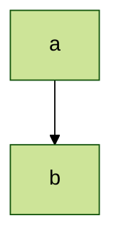
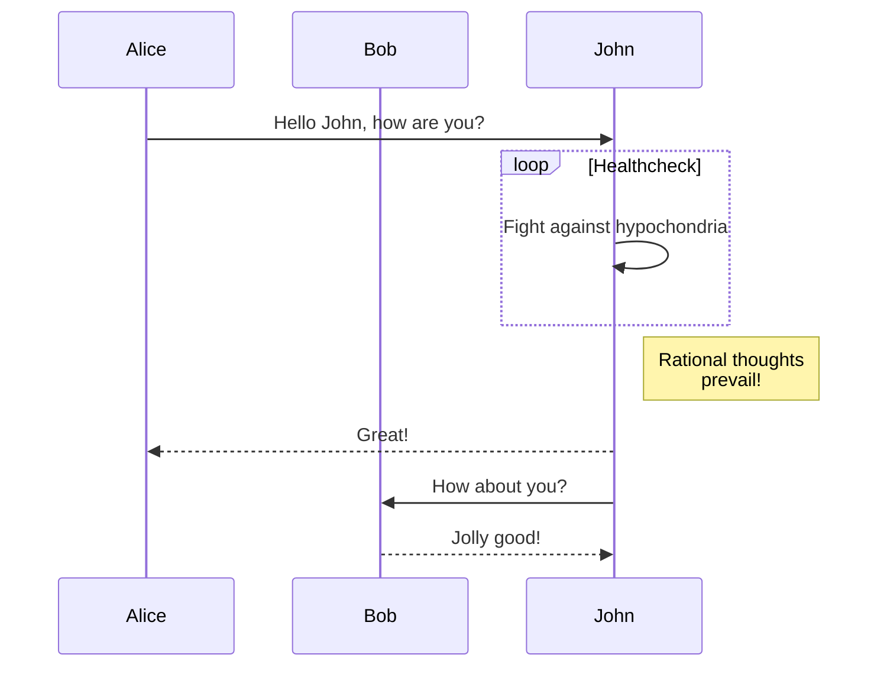
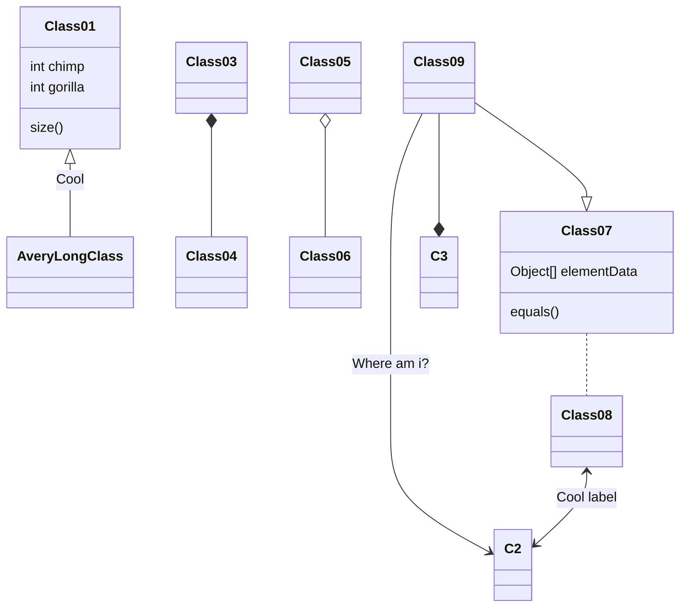
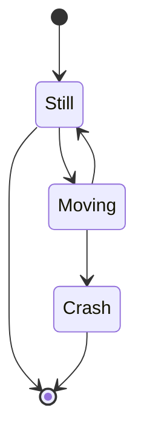
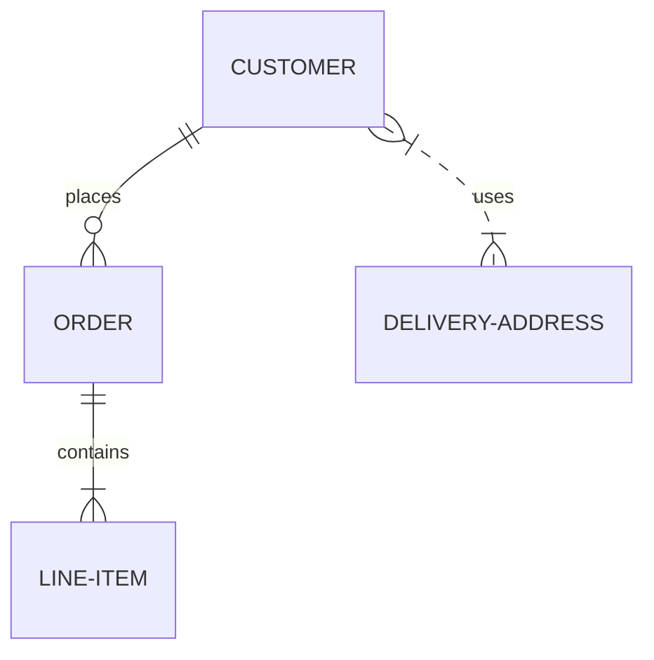
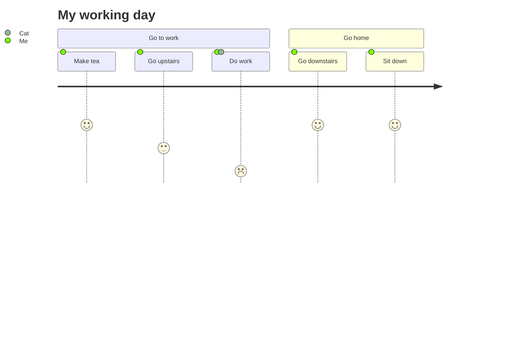
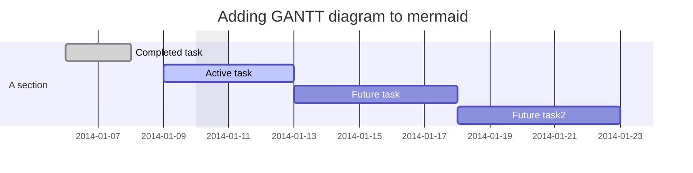
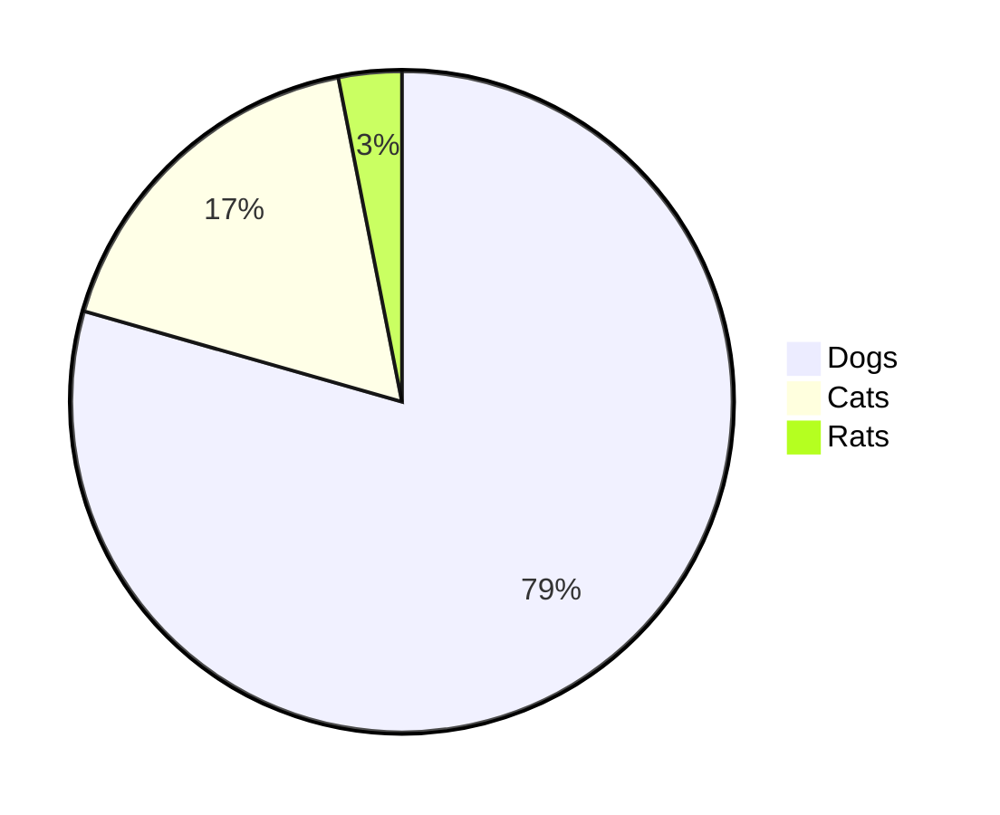
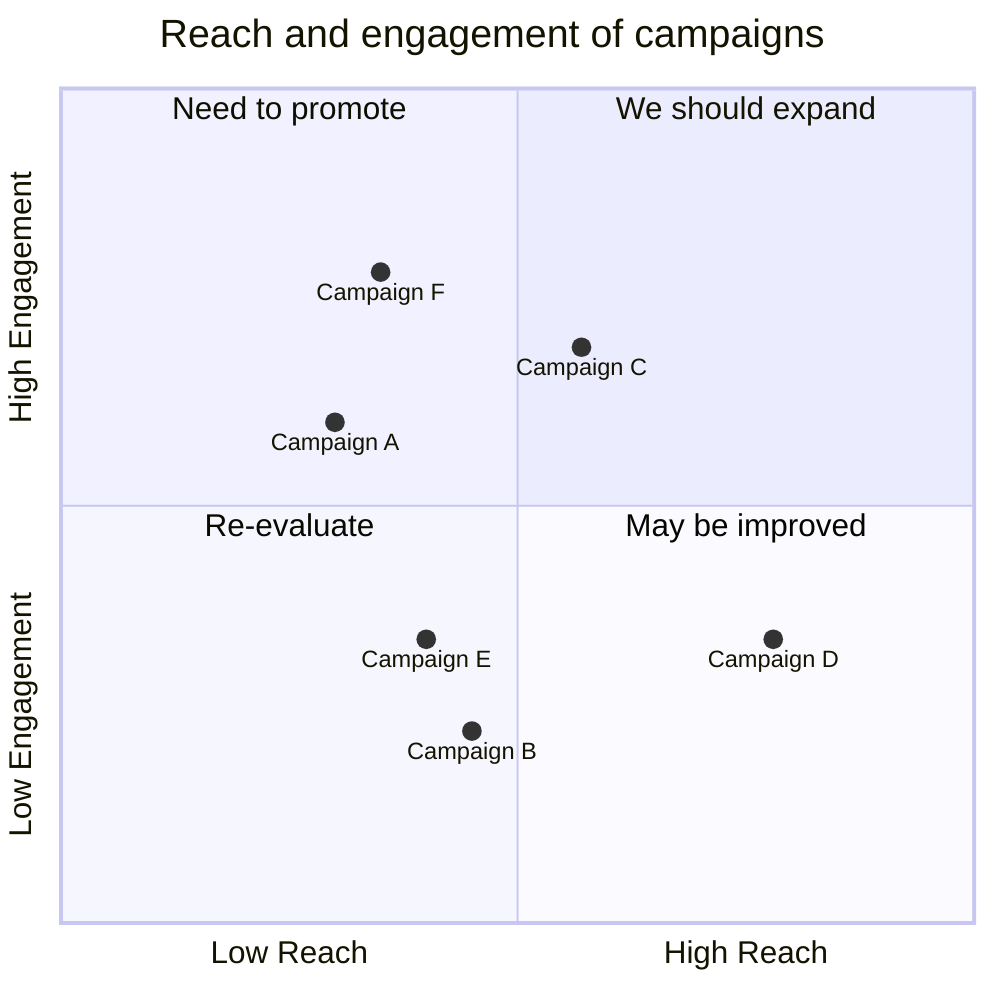

[Mermaid][mermaid] is a JavaScript-based diagramming and charting tool that renders Markdown-inspired text definitions to create and modify diagrams dynamically. It lets you create diagrams and visualizations using text and code.

<!--more-->

## Usage

### Syntax

To use Mermaid, simply place the mermaid code inside a code block with the language set to `mermaid`.

````markdown
```mermaid
// mermaid diagram code here
```
````

> [!TIP]
> You can also use the [`mermaid` shortcode][sc-mermaid] directly in your Markdown files.

### Configuration

You can configure Mermaid globally in your `hugo.toml` file.

```toml
[params]

[params.mermaid]
cdn = ""
zenuml = ""
themes = [
  "default",
  "dark"
]
# optional values: ["strict", "loose", "antiscript", "sandbox"]
securityLevel = "loose"
# optional values: ["classic", "handDrawn"]
look = "handDrawn"
fontFamily = ""
layoutLoaders = []
layout = "dagre"
```

CDN
: You can use `params.mermaid` in your configuration file to specify the version of Mermaid and ZenUML you want to use. For example:

```toml
[params]

[params.mermaid]
cdn = "https://cdn.jsdelivr.net/npm/mermaid@11/dist/mermaid.esm.min.mjs"
zenuml = "https://cdn.jsdelivr.net/npm/@mermaid-js/mermaid-zenuml@0.2/dist/mermaid-zenuml.esm.min.mjs"
```

> [!WARNING]
> The ZenUML function can only be used if ZenUML CDN is set.

look
: Mermaid diagrams in the FixIt theme are set to hand-drawn style by default. If you prefer the classic style, you can change it in your configuration file:

```toml
[params]

[params.mermaid]
look = "classic"
```

layoutLoaders
: Layout loaders allow you to load additional layout engines from ESM module CDN sources. This is particularly useful for enabling advanced layout algorithms like ELK (Eclipse Layout Kernel). You can specify an array of CDN URLs for layout modules:

```toml
[params]

[params.mermaid]
layoutLoaders = [ "https://cdn.jsdelivr.net/npm/@mermaid-js/layout-elk/dist/mermaid-layout-elk.esm.min.mjs" ]
```

> [!NOTE]
> When `layoutLoaders` is configured with the ELK layout engine, additional layout options become available: `"elk"`, `"elk.layered"`, `"elk.stress"`, `"elk.force"`, and `"elk.mrtree"`.

layout
: The default layout algorithm for rendering diagrams. The default value is `"dagre"`, which works well for most diagram types. When you have configured `layoutLoaders` with additional layout engines, you can choose from extended layout options:

```toml
[params]

[params.mermaid]
layout = "elk.layered" # Requires ELK layout loader to be configured
```

Available layout algorithms:

- `"dagre"` (default) - The standard Dagre layout algorithm
- `"elk"` - Basic ELK layout, equivalent to `"elk.layered"` (requires ELK layout loader)
- `"elk.layered"` - ELK layered layout algorithm (requires ELK layout loader)
- `"elk.stress"` - ELK stress layout algorithm (requires ELK layout loader)
- `"elk.force"` - ELK force-directed layout algorithm (requires ELK layout loader)
- `"elk.mrtree"` - ELK multi-root tree layout algorithm (requires ELK layout loader)

> [!WARNING]
> ELK layout algorithms require `layoutLoaders` to be configured first. Using ELK layouts without the corresponding layout loader will fall back to the default Dagre layout.

### Themes

Available themes are as follows:

1. [**default**][theme-default] - This is the default theme for all diagrams.
2. [**neutral**][theme-neutral] - This theme is great for black and white documents that will be printed.
3. [**dark**][theme-dark] - This theme goes well with dark-colored elements or dark-mode.
4. [**forest**][theme-forest] - This theme contains shades of green.
5. [**base**][theme-base] - This is the only theme that can be modified. Use this theme as the base for customizations.

Head to the [Theme Configuration | Mermaid][mermaid-theming] page to learn more about dynamic and integrated theme configuration.

Site-wide Themes
: You can configure mermaid themes globally in `hugo.toml` via the `params.mermaid.themes` parameter.

```toml
[params]

[params.mermaid]
themes = [
  "default",
  "dark"
]
```

Diagram-specific Themes
: To customize the theme of an individual diagram, use frontmatter config.

Example of frontmatter config setting the `theme` to `forest`:

````markdown

````


---

Here are some examples of generated SVGs using Mermaid.

## Flowchart

All [Flowcharts][mermaid-flowchart] are composed of nodes, geometric shapes and edges, the arrows or lines. The mermaid code defines the way that these nodes and edges are made and interact.

````markdown

````


## Sequence Diagram

A [Sequence diagram][mermaid-sequenceDiagram] is an interaction diagram that shows how processes operate with one another and in what order.

````markdown

````


## Class Diagram

The [class diagram][mermaid-classDiagram] is the main building block of object-oriented modelling. It is used for general conceptual modelling of the structure of the application, and detailed modelling translating the models into programming code. Class diagrams can also be used for data modelling. The classes in a class diagram represent both the main elements, interactions in the application, and the classes to be programmed.

````markdown

````


## State Diagram

Mermaid can render [state diagrams][mermaid-stateDiagram]. The syntax tries to be compliant with the syntax used in plantUml as this will make it easier for users to share diagrams between mermaid and plantUml.

Example **state diagram** `mermaid` input:

````markdown

````

The rendered output looks like this:


## Entity Relationship Diagram

An [entity–relationship diagram][mermaid-entityRelationshipDiagram] (or ER diagram) describes interrelated things of interest in a specific domain of knowledge. A basic ER diagram is composed of entity types (which classify the things of interest) and specifies relationships that can exist between entities (instances of those entity types).

````markdown

````


## User Journey Diagram

[User journey diagrams][mermaid-user-journey] describe at a high level of detail exactly what steps different users take to complete a specific task within a system, application or website. This technique shows the current (as-is) user workflow, and reveals areas of improvement for the to-be workflow.

````markdown

````


## Gantt Diagram

A [Gantt chart][mermaid-gantt] is a type of bar chart, first developed by Karol Adamiecki in 1896, and independently by Henry Gantt in the 1910s, that illustrates a project schedule and the amount of time it would take for any one project to finish. Gantt charts illustrate numbers of days between the start and finish dates of the terminal elements and summary elements of a project.

````markdown

````


## Pie Chart

Mermaid can render [Pie Chart][mermaid-pie] diagrams.

Example **pie chart** `mermaid` input:

````markdown

````

The rendered output looks like this:


## Quadrant Chart

A [quadrant chart][mermaid-quadrant] is a visual representation of data that is divided into four quadrants. It is used to plot data points on a two-dimensional grid, with one variable represented on the x-axis and another variable represented on the y-axis. The quadrants are determined by dividing the chart into four equal parts based on a set of criteria that is specific to the data being analyzed. Quadrant charts are often used to identify patterns and trends in data, and to prioritize actions based on the position of data points within the chart. They are commonly used in business, marketing, and risk management, among other fields.

Example **quadrant chart** `mermaid` input:

````markdown

````

The rendered output looks like this:

```mermaid
quadrantChart
    title Reach and engagement of campaigns
    x-axis Low Reach --> High Reach
    y-axis Low Engagement --> High Engagement
    quadrant-1 We should expand
    quadrant-2 Need to promote
    quadrant-3 Re-evaluate
    quadrant-4 May be improved
    Campaign A: [0.3, 0.6]
    Campaign B: [0.45, 0.23]
    Campaign C: [0.57, 0.69]
    Campaign D: [0.78, 0.34]
    Campaign E: [0.40, 0.34]
    Campaign F: [0.35, 0.78]
```

## Requirement Diagram

A [Requirement diagram][mermaid-requirementDiagram] provides a visualization for requirements and their connections, to each other and other documented elements. The modeling specs follow those defined by SysML v1.6.

Example **requirement diagram** `mermaid` input:

````markdown
```mermaid
requirementDiagram

requirement test_req {
id: 1
text: the test text.
risk: high
verifymethod: test
}

element test_entity {
type: simulation
}

test_entity - satisfies -> test_req
```
````

The rendered output looks like this:

```mermaid
requirementDiagram

requirement test_req {
id: 1
text: the test text.
risk: high
verifymethod: test
}

element test_entity {
type: simulation
}

test_entity - satisfies -> test_req
```

## Git Graph

A [Git Graph][mermaid-gitgraph] is a pictorial representation of git commits and git actions(commands) on various branches.

Example **gitgraph diagram** `mermaid` input:

````markdown
```mermaid
gitGraph
    commit
    branch hotfix
    checkout hotfix
    commit
    branch develop
    checkout develop
    commit id:"ash" tag:"abc"
    branch featureB
    checkout featureB
    commit type:HIGHLIGHT
    checkout main
    checkout hotfix
    commit type:NORMAL
    checkout develop
    commit type:REVERSE
    checkout featureB
    commit
    checkout main
    merge hotfix
    checkout featureB
    commit
    checkout develop
    branch featureA
    commit
    checkout develop
    merge hotfix
    checkout featureA
    commit
    checkout featureB
    commit
    checkout develop
    merge featureA
    branch release
    checkout release
    commit
    checkout main
    commit
    checkout release
    merge main
    checkout develop
    merge release
```
````

The rendered output looks like this:

```mermaid
gitGraph
    commit
    branch hotfix
    checkout hotfix
    commit
    branch develop
    checkout develop
    commit id:"ash" tag:"abc"
    branch featureB
    checkout featureB
    commit type:HIGHLIGHT
    checkout main
    checkout hotfix
    commit type:NORMAL
    checkout develop
    commit type:REVERSE
    checkout featureB
    commit
    checkout main
    merge hotfix
    checkout featureB
    commit
    checkout develop
    branch featureA
    commit
    checkout develop
    merge hotfix
    checkout featureA
    commit
    checkout featureB
    commit
    checkout develop
    merge featureA
    branch release
    checkout release
    commit
    checkout main
    commit
    checkout release
    merge main
    checkout develop
    merge release
```

## C4 Diagrams :warning:

> [!WARNING]
> [C4 Diagram][mermaid-c4]: This is an experimental diagram for now. The syntax and properties can change in future releases. Proper documentation will be provided when the syntax is stable.

Mermaid's c4 diagram syntax is compatible with plantUML. See example below:

````markdown
```mermaid
    C4Context
      title System Context diagram for Internet Banking System
      Enterprise_Boundary(b0, "BankBoundary0") {
        Person(customerA, "Banking Customer A", "A customer of the bank, with personal bank accounts.")
        Person(customerB, "Banking Customer B")
        Person_Ext(customerC, "Banking Customer C", "desc")

        Person(customerD, "Banking Customer D", "A customer of the bank, <br/> with personal bank accounts.")

        System(SystemAA, "Internet Banking System", "Allows customers to view information about their bank accounts, and make payments.")

        Enterprise_Boundary(b1, "BankBoundary") {

          SystemDb_Ext(SystemE, "Mainframe Banking System", "Stores all of the core banking information about customers, accounts, transactions, etc.")

          System_Boundary(b2, "BankBoundary2") {
            System(SystemA, "Banking System A")
            System(SystemB, "Banking System B", "A system of the bank, with personal bank accounts. next line.")
          }

          System_Ext(SystemC, "E-mail system", "The internal Microsoft Exchange e-mail system.")
          SystemDb(SystemD, "Banking System D Database", "A system of the bank, with personal bank accounts.")

          Boundary(b3, "BankBoundary3", "boundary") {
            SystemQueue(SystemF, "Banking System F Queue", "A system of the bank.")
            SystemQueue_Ext(SystemG, "Banking System G Queue", "A system of the bank, with personal bank accounts.")
          }
        }
      }

      BiRel(customerA, SystemAA, "Uses")
      BiRel(SystemAA, SystemE, "Uses")
      Rel(SystemAA, SystemC, "Sends e-mails", "SMTP")
      Rel(SystemC, customerA, "Sends e-mails to")

      UpdateElementStyle(customerA, $fontColor="red", $bgColor="grey", $borderColor="red")
      UpdateRelStyle(customerA, SystemAA, $textColor="blue", $lineColor="blue", $offsetX="5")
      UpdateRelStyle(SystemAA, SystemE, $textColor="blue", $lineColor="blue", $offsetY="-10")
      UpdateRelStyle(SystemAA, SystemC, $textColor="blue", $lineColor="blue", $offsetY="-40", $offsetX="-50")
      UpdateRelStyle(SystemC, customerA, $textColor="red", $lineColor="red", $offsetX="-50", $offsetY="20")

      UpdateLayoutConfig($c4ShapeInRow="3", $c4BoundaryInRow="1")
```
````

The rendered output looks like this:

```mermaid
    C4Context
      title System Context diagram for Internet Banking System
      Enterprise_Boundary(b0, "BankBoundary0") {
        Person(customerA, "Banking Customer A", "A customer of the bank, with personal bank accounts.")
        Person(customerB, "Banking Customer B")
        Person_Ext(customerC, "Banking Customer C", "desc")

        Person(customerD, "Banking Customer D", "A customer of the bank, <br/> with personal bank accounts.")

        System(SystemAA, "Internet Banking System", "Allows customers to view information about their bank accounts, and make payments.")

        Enterprise_Boundary(b1, "BankBoundary") {

          SystemDb_Ext(SystemE, "Mainframe Banking System", "Stores all of the core banking information about customers, accounts, transactions, etc.")

          System_Boundary(b2, "BankBoundary2") {
            System(SystemA, "Banking System A")
            System(SystemB, "Banking System B", "A system of the bank, with personal bank accounts. next line.")
          }

          System_Ext(SystemC, "E-mail system", "The internal Microsoft Exchange e-mail system.")
          SystemDb(SystemD, "Banking System D Database", "A system of the bank, with personal bank accounts.")

          Boundary(b3, "BankBoundary3", "boundary") {
            SystemQueue(SystemF, "Banking System F Queue", "A system of the bank.")
            SystemQueue_Ext(SystemG, "Banking System G Queue", "A system of the bank, with personal bank accounts.")
          }
        }
      }

      BiRel(customerA, SystemAA, "Uses")
      BiRel(SystemAA, SystemE, "Uses")
      Rel(SystemAA, SystemC, "Sends e-mails", "SMTP")
      Rel(SystemC, customerA, "Sends e-mails to")

      UpdateElementStyle(customerA, $fontColor="red", $bgColor="grey", $borderColor="red")
      UpdateRelStyle(customerA, SystemAA, $textColor="blue", $lineColor="blue", $offsetX="5")
      UpdateRelStyle(SystemAA, SystemE, $textColor="blue", $lineColor="blue", $offsetY="-10")
      UpdateRelStyle(SystemAA, SystemC, $textColor="blue", $lineColor="blue", $offsetY="-40", $offsetX="-50")
      UpdateRelStyle(SystemC, customerA, $textColor="red", $lineColor="red", $offsetX="-50", $offsetY="20")

      UpdateLayoutConfig($c4ShapeInRow="3", $c4BoundaryInRow="1")
```

## Mindmap

> [!WARNING]
> [Mindmap][mermaid-mindmap]: This is an experimental diagram for now. The syntax and properties can change in future releases. The syntax is stable except for the icon integration which is the experimental part.

Example **mindmap** `mermaid` input:

````markdown
```mermaid
mindmap
  root((mindmap))
    Origins
      Long history
      ::icon(fa fa-book)
      Popularisation
        British popular psychology author Tony Buzan
    Research
      On effectiveness<br/>and features
      On Automatic creation
        Uses
            Creative techniques
            Strategic planning
            Argument mapping
    Tools
      Pen and paper
      Mermaid
```
````

The rendered output looks like this:

```mermaid
mindmap
  root((mindmap))
    Origins
      Long history
      ::icon(fa fa-book)
      Popularisation
        British popular psychology author Tony Buzan
    Research
      On effectiveness<br/>and features
      On Automatic creation
        Uses
            Creative techniques
            Strategic planning
            Argument mapping
    Tools
      Pen and paper
      Mermaid
```

## Timeline

> [!WARNING]
> [Timeline][mermaid-timeline]: This is an experimental diagram for now. The syntax and properties can change in future releases. The syntax is stable except for the icon integration which is the experimental part.

Example **timeline** `mermaid` input:

````markdown
```mermaid
timeline
    title History of Social Media Platform
    2002 : LinkedIn
    2004 : Facebook
         : Google
    2005 : Youtube
    2006 : Twitter
```
````

The rendered output looks like this:

```mermaid
timeline
    title History of Social Media Platform
    2002 : LinkedIn
    2004 : Facebook
         : Google
    2005 : Youtube
    2006 : Twitter
```

## ZenUML

> A Sequence diagram is an interaction diagram that shows how processes operate with one another and in what order.

Mermaid can render sequence diagrams with [ZenUML][zemuml]. Note that ZenUML uses a different syntax than the original Sequence Diagram in mermaid.

> [!NOTE]
> [Mermaid ZenUML][mermaid-zenuml] is disabled by default. You can enable it by setting `params.mermaid.zenuml` in your configuration file.

Example **ZenUML** `mermaid` input:

````markdown
```mermaid
zenuml
    title Demo
    Alice->John: Hello John, how are you?
    John->Alice: Great!
    Alice->John: See you later!
```
````

The rendered output looks like this:

```mermaid
zenuml
    title Demo
    Alice->John: Hello John, how are you?
    John->Alice: Great!
    Alice->John: See you later!
```

## Sankey diagram :fire: {#sankey-diagram}

A [sankey diagram][mermaid-sankey] is a visualization used to depict a flow from one set of values to another.

> [!WARNING]
> This is an experimental diagram. Its syntax are very close to plain CSV, but it is to be extended in the nearest future.

Example **sankey diagram** `mermaid` input:

````markdown
```mermaid
---
config:
  sankey:
    showValues: false
---
sankey-beta

Agricultural 'waste',Bio-conversion,124.729
Bio-conversion,Liquid,0.597
Bio-conversion,Losses,26.862
Bio-conversion,Solid,280.322
Bio-conversion,Gas,81.144
Biofuel imports,Liquid,35
Biomass imports,Solid,35
Coal imports,Coal,11.606
Coal reserves,Coal,63.965
Coal,Solid,75.571
District heating,Industry,10.639
District heating,Heating and cooling - commercial,22.505
District heating,Heating and cooling - homes,46.184
Electricity grid,Over generation / exports,104.453
Electricity grid,Heating and cooling - homes,113.726
Electricity grid,H2 conversion,27.14
Electricity grid,Industry,342.165
Electricity grid,Road transport,37.797
Electricity grid,Agriculture,4.412
Electricity grid,Heating and cooling - commercial,40.858
Electricity grid,Losses,56.691
Electricity grid,Rail transport,7.863
Electricity grid,Lighting & appliances - commercial,90.008
Electricity grid,Lighting & appliances - homes,93.494
Gas imports,Ngas,40.719
Gas reserves,Ngas,82.233
Gas,Heating and cooling - commercial,0.129
Gas,Losses,1.401
Gas,Thermal generation,151.891
Gas,Agriculture,2.096
Gas,Industry,48.58
Geothermal,Electricity grid,7.013
H2 conversion,H2,20.897
H2 conversion,Losses,6.242
H2,Road transport,20.897
Hydro,Electricity grid,6.995
Liquid,Industry,121.066
Liquid,International shipping,128.69
Liquid,Road transport,135.835
Liquid,Domestic aviation,14.458
Liquid,International aviation,206.267
Liquid,Agriculture,3.64
Liquid,National navigation,33.218
Liquid,Rail transport,4.413
Marine algae,Bio-conversion,4.375
Ngas,Gas,122.952
Nuclear,Thermal generation,839.978
Oil imports,Oil,504.287
Oil reserves,Oil,107.703
Oil,Liquid,611.99
Other waste,Solid,56.587
Other waste,Bio-conversion,77.81
Pumped heat,Heating and cooling - homes,193.026
Pumped heat,Heating and cooling - commercial,70.672
Solar PV,Electricity grid,59.901
Solar Thermal,Heating and cooling - homes,19.263
Solar,Solar Thermal,19.263
Solar,Solar PV,59.901
Solid,Agriculture,0.882
Solid,Thermal generation,400.12
Solid,Industry,46.477
Thermal generation,Electricity grid,525.531
Thermal generation,Losses,787.129
Thermal generation,District heating,79.329
Tidal,Electricity grid,9.452
UK land based bioenergy,Bio-conversion,182.01
Wave,Electricity grid,19.013
Wind,Electricity grid,289.366
```
````

The rendered output looks like this:

```mermaid
---
config:
  sankey:
    showValues: false
---
sankey-beta

Agricultural 'waste',Bio-conversion,124.729
Bio-conversion,Liquid,0.597
Bio-conversion,Losses,26.862
Bio-conversion,Solid,280.322
Bio-conversion,Gas,81.144
Biofuel imports,Liquid,35
Biomass imports,Solid,35
Coal imports,Coal,11.606
Coal reserves,Coal,63.965
Coal,Solid,75.571
District heating,Industry,10.639
District heating,Heating and cooling - commercial,22.505
District heating,Heating and cooling - homes,46.184
Electricity grid,Over generation / exports,104.453
Electricity grid,Heating and cooling - homes,113.726
Electricity grid,H2 conversion,27.14
Electricity grid,Industry,342.165
Electricity grid,Road transport,37.797
Electricity grid,Agriculture,4.412
Electricity grid,Heating and cooling - commercial,40.858
Electricity grid,Losses,56.691
Electricity grid,Rail transport,7.863
Electricity grid,Lighting & appliances - commercial,90.008
Electricity grid,Lighting & appliances - homes,93.494
Gas imports,Ngas,40.719
Gas reserves,Ngas,82.233
Gas,Heating and cooling - commercial,0.129
Gas,Losses,1.401
Gas,Thermal generation,151.891
Gas,Agriculture,2.096
Gas,Industry,48.58
Geothermal,Electricity grid,7.013
H2 conversion,H2,20.897
H2 conversion,Losses,6.242
H2,Road transport,20.897
Hydro,Electricity grid,6.995
Liquid,Industry,121.066
Liquid,International shipping,128.69
Liquid,Road transport,135.835
Liquid,Domestic aviation,14.458
Liquid,International aviation,206.267
Liquid,Agriculture,3.64
Liquid,National navigation,33.218
Liquid,Rail transport,4.413
Marine algae,Bio-conversion,4.375
Ngas,Gas,122.952
Nuclear,Thermal generation,839.978
Oil imports,Oil,504.287
Oil reserves,Oil,107.703
Oil,Liquid,611.99
Other waste,Solid,56.587
Other waste,Bio-conversion,77.81
Pumped heat,Heating and cooling - homes,193.026
Pumped heat,Heating and cooling - commercial,70.672
Solar PV,Electricity grid,59.901
Solar Thermal,Heating and cooling - homes,19.263
Solar,Solar Thermal,19.263
Solar,Solar PV,59.901
Solid,Agriculture,0.882
Solid,Thermal generation,400.12
Solid,Industry,46.477
Thermal generation,Electricity grid,525.531
Thermal generation,Losses,787.129
Thermal generation,District heating,79.329
Tidal,Electricity grid,9.452
UK land based bioenergy,Bio-conversion,182.01
Wave,Electricity grid,19.013
Wind,Electricity grid,289.366
```

## XY Chart :fire: {#xy-chart}

In the context of mermaid-js, the [XY chart][mermaid-xy-chart] is a comprehensive charting module that encompasses various types of charts that utilize both x-axis and y-axis for data representation. Presently, it includes two fundamental chart types: the bar chart and the line chart. These charts are designed to visually display and analyze data that involve two numerical variables.

> [!NOTE]
> It's important to note that while the current implementation of mermaid-js includes these two chart types, the framework is designed to be dynamic and adaptable. Therefore, it has the capacity for expansion and the inclusion of additional chart types in the future. This means that users can expect an evolving suite of charting options within the XY chart module, catering to various data visualization needs as new chart types are introduced over time.

Example **XY chart** `mermaid` input:

````markdown
```mermaid
xychart-beta
    title "Sales Revenue"
    x-axis [jan, feb, mar, apr, may, jun, jul, aug, sep, oct, nov, dec]
    y-axis "Revenue (in $)" 4000 --> 11000
    bar [5000, 6000, 7500, 8200, 9500, 10500, 11000, 10200, 9200, 8500, 7000, 6000]
    line [5000, 6000, 7500, 8200, 9500, 10500, 11000, 10200, 9200, 8500, 7000, 6000]
```
````

The rendered output looks like this:

```mermaid
xychart-beta
    title "Sales Revenue"
    x-axis [jan, feb, mar, apr, may, jun, jul, aug, sep, oct, nov, dec]
    y-axis "Revenue (in $)" 4000 --> 11000
    bar [5000, 6000, 7500, 8200, 9500, 10500, 11000, 10200, 9200, 8500, 7000, 6000]
    line [5000, 6000, 7500, 8200, 9500, 10500, 11000, 10200, 9200, 8500, 7000, 6000]
```

## Block Diagram :fire: {#block-diagram}

See the [block diagram][mermaid-block-diagram] documentation for more information.

Example **block diagram** `mermaid` input:

````markdown
```mermaid
block-beta
columns 1
  db(("DB"))
  blockArrowId6<["&nbsp;&nbsp;&nbsp;"]>(down)
  block:ID
    A
    B["A wide one in the middle"]
    C
  end
  space
  D
  ID --> D
  C --> D
  style B fill:#969,stroke:#333,stroke-width:4px
```
````

The rendered output looks like this:

```mermaid
block-beta
columns 1
  db(("DB"))
  blockArrowId6<["&nbsp;&nbsp;&nbsp;"]>(down)
  block:ID
    A
    B["A wide one in the middle"]
    C
  end
  space
  D
  ID --> D
  C --> D
  style B fill:#969,stroke:#333,stroke-width:4px
```

## Packet :fire: {#packet}

A [packet diagram][mermaid-packet] is a visual representation used to illustrate the structure and contents of a network packet. Network packets are the fundamental units of data transferred over a network.

Example **packet diagram** `mermaid` input:

````markdown
```mermaid
packet-beta
title UDP Packet
0-15: "Source Port"
16-31: "Destination Port"
32-47: "Length"
48-63: "Checksum"
64-95: "Data (variable length)"
```
````

The rendered output looks like this:

```mermaid
packet-beta
title UDP Packet
0-15: "Source Port"
16-31: "Destination Port"
32-47: "Length"
48-63: "Checksum"
64-95: "Data (variable length)"
```

## Kanban :fire: {#kanban}

Mermaid's [Kanban diagram][mermaid-kanban] allows you to create visual representations of tasks moving through different stages of a workflow.

Example **kanban diagram** `mermaid` input:

````markdown
```mermaid
---
config:
  kanban:
    ticketBaseUrl: 'https://mermaidchart.atlassian.net/browse/#TICKET#'
---
kanban
  Todo
    [Create Documentation]
    docs[Create Blog about the new diagram]
  [In progress]
    id6[Create renderer so that it works in all cases. We also add some extra text here for testing purposes. And some more just for the extra flare.]
  id9[Ready for deploy]
    id8[Design grammar]@{ assigned: 'knsv' }
  id10[Ready for test]
    id4[Create parsing tests]@{ ticket: MC-2038, assigned: 'K.Sveidqvist', priority: 'High' }
    id66[last item]@{ priority: 'Very Low', assigned: 'knsv' }
  id11[Done]
    id5[define getData]
    id2[Title of diagram is more than 100 chars when user duplicates diagram with 100 char]@{ ticket: MC-2036, priority: 'Very High'}
    id3[Update DB function]@{ ticket: MC-2037, assigned: knsv, priority: 'High' }

  id12[Can't reproduce]
    id3[Weird flickering in Firefox]
```
````

The rendered output looks like this:

```mermaid
---
config:
  kanban:
    ticketBaseUrl: 'https://mermaidchart.atlassian.net/browse/#TICKET#'
---
kanban
  Todo
    [Create Documentation]
    docs[Create Blog about the new diagram]
  [In progress]
    id6[Create renderer so that it works in all cases. We also add some extra text here for testing purposes. And some more just for the extra flare.]
  id9[Ready for deploy]
    id8[Design grammar]@{ assigned: 'knsv' }
  id10[Ready for test]
    id4[Create parsing tests]@{ ticket: MC-2038, assigned: 'K.Sveidqvist', priority: 'High' }
    id66[last item]@{ priority: 'Very Low', assigned: 'knsv' }
  id11[Done]
    id5[define getData]
    id2[Title of diagram is more than 100 chars when user duplicates diagram with 100 char]@{ ticket: MC-2036, priority: 'Very High'}
    id3[Update DB function]@{ ticket: MC-2037, assigned: knsv, priority: 'High' }

  id12[Can't reproduce]
    id3[Weird flickering in Firefox]
```

## Architecture :fire: {#architecture}

In the context of mermaid-js, the [architecture diagram[mermaid-architecture]] is used to show the relationship between services and resources commonly found within the Cloud or CI/CD deployments. In an architecture diagram, services (nodes) are connected by edges. Related services can be placed within groups to better illustrate how they are organized.

Example **architecture diagram** `mermaid` input:

````markdown
```mermaid
architecture-beta
    group api(cloud)[API]

    service db(database)[Database] in api
    service disk1(disk)[Storage] in api
    service disk2(disk)[Storage] in api
    service server(server)[Server] in api

    db:L -- R:server
    disk1:T -- B:server
    disk2:T -- B:db
```
````

The rendered output looks like this:

```mermaid
architecture-beta
    group api(cloud)[API]

    service db(database)[Database] in api
    service disk1(disk)[Storage] in api
    service disk2(disk)[Storage] in api
    service server(server)[Server] in api

    db:L -- R:server
    disk1:T -- B:server
    disk2:T -- B:db
```

## Radar :fire: {#radar}

A [radar diagram][mermaid-radar] is a simple way to plot low-dimensional data in a circular format.

It is also known as a **radar chart**, **spider chart**, **star chart**, **cobweb chart**, **polar chart**, or **Kiviat diagram**.

Example **radar diagram** `mermaid` input:

````markdown
```mermaid
---
title: "Grades"
---
radar-beta
  axis m["Math"], s["Science"], e["English"]
  axis h["History"], g["Geography"], a["Art"]
  curve a["Alice"]{85, 90, 80, 70, 75, 90}
  curve b["Bob"]{70, 75, 85, 80, 90, 85}

  max 100
  min 0
```
````

The rendered output looks like this:

```mermaid
---
title: "Grades"
---
radar-beta
  axis m["Math"], s["Science"], e["English"]
  axis h["History"], g["Geography"], a["Art"]
  curve a["Alice"]{85, 90, 80, 70, 75, 90}
  curve b["Bob"]{70, 75, 85, 80, 90, 85}

  max 100
  min 0
```

## Treemap :fire: {#treemap}

A [treemap diagram][mermaid-treemap] displays hierarchical data as a set of nested rectangles. Each branch of the tree is represented by a rectangle, which is then tiled with smaller rectangles representing sub-branches.

> [!WARNING]
> This is a new diagram type in Mermaid. Its syntax may evolve in future versions.

Example **treemap diagram** `mermaid` input:

````markdown
```mermaid
---
config:
  treemap:
    valueFormat: '$0,0'
---
treemap-beta
"Budget"
    "Operations"
        "Salaries": 700000
        "Equipment": 200000
        "Supplies": 100000
    "Marketing"
        "Advertising": 400000
        "Events": 100000
```
````

The rendered output looks like this:

```mermaid
---
config:
  treemap:
    valueFormat: '$0,0'
---
treemap-beta
"Budget"
    "Operations"
        "Salaries": 700000
        "Equipment": 200000
        "Supplies": 100000
    "Marketing"
        "Advertising": 400000
        "Events": 100000
```

<!-- link reference definition -->
<!-- markdownlint-disable-file reference-links-images -->
[mermaid]: https://mermaid.js.org/
[theme-default]: https://github.com/mermaid-js/mermaid/blob/develop/packages/mermaid/src/themes/theme-default.js
[theme-neutral]: https://github.com/mermaid-js/mermaid/blob/develop/packages/mermaid/src/themes/theme-neutral.js
[theme-dark]: https://github.com/mermaid-js/mermaid/blob/develop/packages/mermaid/src/themes/theme-dark.js
[theme-forest]: https://github.com/mermaid-js/mermaid/blob/develop/packages/mermaid/src/themes/theme-forest.js
[theme-base]: https://github.com/mermaid-js/mermaid/blob/develop/packages/mermaid/src/themes/theme-base.js
[mermaid-theming]: https://mermaid.js.org/config/theming.html
[mermaid-flowchart]: https://mermaid.js.org/syntax/flowchart.html
[mermaid-sequenceDiagram]: https://mermaid.js.org/syntax/sequenceDiagram.html
[mermaid-classDiagram]: https://mermaid.js.org/syntax/classDiagram.html
[mermaid-stateDiagram]: https://mermaid.js.org/syntax/stateDiagram.html
[mermaid-entityRelationshipDiagram]: https://mermaid.js.org/syntax/entityRelationshipDiagram.html
[mermaid-user-journey]: https://mermaid.js.org/syntax/userJourney.html
[mermaid-gantt]: https://mermaid.js.org/syntax/gantt.html
[mermaid-pie]: https://mermaid.js.org/syntax/pie.html
[mermaid-quadrant]: https://mermaid.js.org/syntax/quadrantChart.html
[mermaid-requirementDiagram]: https://mermaid.js.org/syntax/requirementDiagram.html
[mermaid-gitgraph]: https://mermaid.js.org/syntax/gitgraph.html
[mermaid-c4]: https://mermaid.js.org/syntax/c4.html
[mermaid-mindmap]: https://mermaid.js.org/syntax/mindmap.html
[mermaid-timeline]: https://mermaid.js.org/syntax/timeline.html
[zemuml]: https://zenuml.com/
[mermaid-zenuml]: https://mermaid.js.org/syntax/zenuml.html
[mermaid-sankey]: https://mermaid.js.org/syntax/sankey.html
[mermaid-xy-chart]: https://mermaid.js.org/syntax/xyChart.html
[mermaid-block-diagram]: https://mermaid.js.org/syntax/block.html
[mermaid-packet]: https://mermaid.js.org/syntax/packet.html
[mermaid-kanban]: https://mermaid.js.org/syntax/kanban.html
[mermaid-architecture]: https://mermaid.js.org/syntax/architecture.html
[mermaid-radar]: https://mermaid.js.org/syntax/radar.html
[mermaid-treemap]: https://mermaid.js.org/syntax/treemap.html
<!-- markdownlint-disable-file reference-links-images -->
[sc-mermaid]: 
