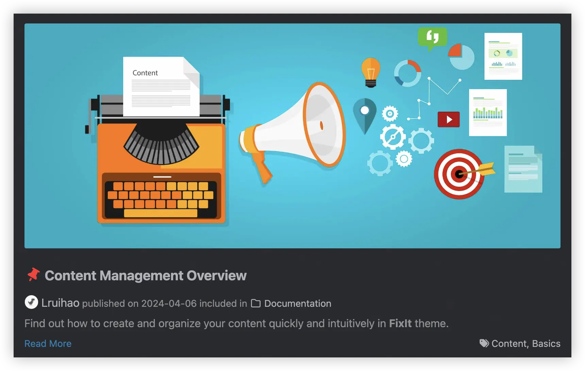

Find out how to create and organize your content quickly and intuitively in **FixIt** theme.

<!--more-->

## Contents Organization {#contents-organization}

A few suggestions to help you get a good looking site quickly:

- Keep post pages in the `content/posts` directory, for example: `content/posts/my-first-post.md`
- Keep other pages in the `content` directory, for example: `content/about.md`
- Use `_index.md` to translate list page titles, for example: `content/posts/_index.md`
- Local resources organization

There are three ways to reference local resources such as **images** and **music**:

1. Using [page resources][page-resources] in [page bundles][page-bundles].
   You can reference page resources by the value for `Resources.GetMatch` or the filepath of the resource relative to the page directory directly.
2. Store resources in the **assets** directory, which is `/assets` by default.
   The filepath of the resource to reference in the post is relative to the assets directory.
3. Store resources in the **static** directory, which is `/static` by default.
   The filepath of the resource to reference in the post is relative to the static directory.

The **priority** of references is also in the above order.

> [!TIP]
> It is recommended to use **[CoverView][coverview]** to generate beautiful cover images for your articles.
>
> - ✨ **Online Tool**: No software installation required, works in your browser
> - 🎨 **Multiple Templates**: Various preset templates and customization options
> - 📐 **Theme Compatible**: Perfectly adapted to FixIt theme design style
> - 🚀 **Quick Generation**: One-click download and quick cover generation
>
> Project: [Lruihao/CoverView][coverview-repo]

## Templates {#templates}

Generally, you don't need to set the **type** or **layout** parameter, because Hugo and **FixIt** will help you choose. However, in some special cases, you need to specify the template explicitly.

### Posts in Other Directories

Sometimes you may need to put some posts in a separate directory, rather than the `content/posts` directory. In this case, you need to set the `type: posts` parameter in the front matter of the post.

For example, put all the documentation posts in the `content/documentation` directory, and all the posts in this directory use the `posts` template:

```markdown
---
title: Content Management Overview
date: 2024-04-06T12:57:26+08:00
---
```

> [!TIP]
> You can set the `cascade.params.type` parameter to `posts` in `content/documentation/_index.md`, so that all posts in the `content/documentation` directory will use the `posts` template.
>
> ```markdown
> ---
> title: Documentation
> cascade:
>   params:
>     type: posts
> ---
> ```

### Friends



Set `layout: friends` in the front matter and create data file named `friends.yml` in the `yourSite/data/` directory, whose content format is as follows:

```yml
# Friend/Site info of one
- nickname: friend's name
  avatar: friend's avatar
  url: site link
  description: description of friend/site
```

> [!TIP]-
> You can use the following command to quickly create a friends page:
>
> ```bash
> hugo new friends/index.md
> ```

### Search



See [CSE Support][cse-support].

### Projects

This is an additional theme component, please refer to [hugo-fixit/component-projects].

## Front matter {#front-matter}

**Hugo** allows you to add front matter in `yaml`, `toml` or `json` to your content files, see [Front matter][front-matter].


**Not all** of the below front matters need to be set in each of your posts.
It is necessary only if the front matters and the `page` part in your [theme configuration]() are inconsistent.



Some [archetypes](https://gohugo.io/content-management/archetypes/) are embedded in the **FixIt** theme, which will take effect when creating new content with the following commands, and the front matter will be automatically brought in.

```bash
hugo new posts/foo.md
# Or
hugo new --kind post-bundle posts/bar/
```



- **title**: the title for the content.
- **subtitle**: the subtitle for the content.
- **date**: the datetime assigned to this page, which is usually fetched from the `date` field in front matter, but this behaviour is configurabl in the [theme configuration][theme-config].
- **lastmod**: the datetime at which the content was last modified.
- **draft**: if `true`, the content will not be rendered unless the `--buildDrafts`/`-D` flag is passed to the `hugo` command.
- **author**:  the author config for the content, the same as the `params.author` part in the [theme configuration][theme-config].

    ```yaml {data-open=false}
    author:
      name: '' # the author's name
      link: '' # the link of the author
      email: '' # the email of the author, used to set a Gravatar avatar, which takes precedence over `author.avatar`
      avatar: '' # the local avatar of the author
    ```

- **authorAvatar**:  whether to enable the author's avatar of the post.
- **description**: the description for the content.
- **keywords**: the keywords for the content.
- **license**: the special lisence for this content.
- **images**: page images for Open Graph and Twitter Cards.
- **summary**: the summary for the content.
- **summaryPlainify**:  whether to show summary in plain text, default: `false`. The same as the `params.summaryPlainify` in the [theme configuration][theme-config].

- **tags**: the tags for the content.
- **categories**: the categories for the content.
- **featuredImage**: the featured image for the content.
- **featuredImagePreview**: the featured image for the content preview in the home page.

- **hiddenFromHomePage**: if `true`, the content will not be shown in the home page.
- **hiddenFromSearch**: if `true`, the content will not be shown in the search results.
- **hiddenFromRelated**:  if `true`, the content will not be shown in the related posts.
- **hiddenFromFeed**:  if `true`, the content will not be shown in the RSS, Atom and JSON feed.
- **twemoji**: if `true`, the content will enable the twemoji.
- **lightgallery**:  the same as the `params.page.lightgallery` part in the [theme configuration][theme-config].
- **ruby**: if `true`, the content will enable the [ruby extended syntax][extended-markdown-syntax].
- **fraction**: if `true`, the content will enable the [fraction extended syntax][fraction-syntax].
- **fontawesome**: if `true`, the content will enable the [Font Awesome extended syntax][fontawesome-syntax].
- **linkToMarkdown**: if `true`, the footer of the content will be shown the link to the orignal Markdown file.
- **linkToSource**:  if `true`, the footer of the content will be shown the link to the source file.
- **linkToEdit**:  if `true`, the footer of the content will be shown the link to the edit page.
- **linkToReport**:  if `true`, the footer of the content will be shown the link to the report issue.
- **linkToVscode**:  if `true`, the footer of the content will be shown the link to the edit page in VSCode.
- **pageStyle**:  Detail see [Page Style][page-style].

- **codeblock**:  the same as the `params.codeblock` part in the [theme configuration][theme-config].
- **toc**: the same as the `params.page.toc` part in the [theme configuration][theme-config].
- **expirationReminder**:  the same as the `params.page.expirationReminder` part in the [theme configuration][theme-config].
- **heading**:  the same as the `params.page.heading` part in the [theme configuration][theme-config].
- **math**: the same as the `params.page.math` part in the [theme configuration][theme-config].
- **mapbox**: the same as the `params.page.mapbox` part in the [theme configuration][theme-config].
- **share**: the same as the `params.page.share` part in the [theme configuration][theme-config].
- **comment**: the same as the `params.page.comment` part in the [theme configuration][theme-config].
- **library**: the same as the `params.page.library` part in the [theme configuration][theme-config].
- **seo**: the same as the `params.page.seo` part in the [theme configuration][theme-config].
- **type**: the rendering template of page, see [templates](#templates) for details.
- **menu**: see [Add content to Menu][content-to-menu].

- **password**:  password of encrypted page content, see [Content Encryption](#content-encryption).
- **message**:  encryption prompt, see [Content Encryption](#content-encryption).

- **repost**:  the same as the `params.page.repost` part in the [theme configuration][theme-config].
- **autoBookmark**:  the same as the `params.page.autoBookmark` part in the [theme configuration][theme-config].
- **showLastmod**:  the same as the `params.page.showLastmod` part in the [theme configuration][theme-config].
- **wordCount**:  the same as the `params.page.wordCount` part in the [theme configuration][theme-config].
- **readingTime**:  the same as the `params.page.readingTime` part in the [theme configuration][theme-config].
- **endFlag**:  the same as the `params.page.endFlag` part in the [theme configuration][theme-config].
- **reward**:  the same as the `params.page.reward` part in the [theme configuration][theme-config].
- **instantPage**:  the same as the `params.page.instantPage` part in the [theme configuration][theme-config].
- **feed**:  the same as the `params.feed` part in the [theme configuration][theme-config].

<!-- front matter for section only -->

- **titleIcon**:  the icon for the page title, only valid in `_index.md`.

---

**featuredImage** and **featuredImagePreview** support the complete usage of [local resource references](#contents-organization).

If the page resource with `name: featured-image` or `name: featured-image-preview` is set in the front matter,
it is not necessary to set the parameter `featuredImage` or `featuredImagePreview`:

```yaml
resources:
  - name: featured-image
    src: featured-image.jpg
  - name: featured-image-preview
    src: featured-image-preview.jpg
```

Here is a front matter example:

```yaml
---
title: My First Post
subtitle: ''
date: 2020-03-04T15:58:26+08:00
lastmod: 2020-03-04T15:58:26+08:00
draft: true
author: ''
authorLink: ''
authorEmail: ''
description: ''
keywords: ''
license: ''
images: []

tags: []
categories: []
featuredImage: ''
featuredImagePreview: ''

hiddenFromHomePage: false
hiddenFromSearch: false
twemoji: false
lightgallery: true
ruby: true
fraction: true
fontawesome: true
linkToMarkdown: true
pageStyle: normal

toc:
  enable: true
  auto: true
expirationReminder:
  enable: false
  # ...
edit:
  enable: false
  # ...
math:
  enable: true
  # ...
mapbox:
  accessToken: ''
  # ...
share:
  enable: true
  # ...
comment:
  enable: true
  # ...
library:
  css:
  # someCSS = "some.css"
  # located in "assets/"
  # Or
  # someCSS = "https://cdn.example.com/some.css"
  js:
  # someJS = "some.js"
  # located in "assets/"
  # Or
  # someJS = "https://cdn.example.com/some.js"
seo:
  images: []
  # ...
---
```

## Content Summaries

**FixIt** theme uses the summary of the content to display abstract information in the home page. Hugo can generate summaries of your content.



### Automatic Summary Splitting

By default, Hugo automatically takes the first 70 words of your content as its summary.

You may customize the summary length by setting `summaryLength` in the site configuration.

If you are creating content in a [CJK]^(Chinese/Japanese/Korean) language and want to use Hugo's automatic summary splitting, set `hasCJKLanguage` to `true` in your site configuration.

### Manual Summary Splitting

Alternatively, you may add the `<!--more-->` summary divider where you want to split the article.

Content that comes before the summary divider will be used as that content’s summary.


Be careful to enter `<!--more-->` exactly; i.e., all lowercase and with no whitespace.


### Front Matter Summary

You might want your summary to be something other than the text that starts the article. In this case you can provide a separate summary in the `summary` variable of the article front matter.

### Use Description as Summary

You might want your description in the `description` variable of the article front matter as the summary.

You may add the `<!--more-->` summary divider at the start of the article. Keep content that comes before the summary divider empty. Then **FixIt** theme will use your description as the summary.

### Comparison

Each summary type has different characteristics:

| Type              | Precedence | Renders markdown | Renders shortcodes | Wraps single lines with `<p>` |
| :---------------- | :--------: | :--------------: | :----------------: | :---------------------------: |
| Manual            | 1          | ✔️             | ✔️               | ✔️                          |
| Front&nbsp;matter | 2          | ✔️             | ❌                 | ❌                            |
| Automatic         | 3          | ✔️             | ✔️               | ❌                            |

1. If there is a `<!--more-->` summary divider present in the article but no content is before the divider, the description will be used as the summary.
2. If there is a `<!--more-->` summary divider present in the article the text up to the divider will be provided as per the manual summary split method.
3. If there is a summary variable in the article front matter the value of the variable will be provided as per the front matter summary method.
4. The text at the start of the article will be provided as per the automatic summary split method.

> [!TIP]
> If you want plain text summaries, you can set `params.summaryPlainify` or Front matter `summaryPlainify`.

## Markdown Syntax

This part is shown in the [basic markdown syntax page][basic-markdown-syntax] and the [extended markdown syntax page][extended-markdown-syntax].

## Shortcodes

This part is shown in the [shortcodes page][shortcodes].

## Content Encryption

This part is shown in the [content encryption page][content-encryption].

## URL management

**Hugo** has a powerful URL management system, see [Hugo URL management][hugo-url-management].

## Multilingual and I18n {#multilingual}

**FixIt** theme is fully compatible with Hugo multilingual mode, which provides in-browser language switching.


### Compatibility {#language-compatibility}

| Language             | Hugo Code | HTML `lang` Attribute | Theme Docs                           |
| :------------------- | :-------: | :-------------------: | :----------------------------------: |
| English              | `en`      | `en`                  | :(fa-regular fa-check-square fa-fw): |
| Simplified Chinese   | `zh-cn`   | `zh-CN`               | :(fa-regular fa-check-square fa-fw): |
| Traditional Chinese  | `zh-tw`   | `zh-TW`               | :(fa-regular fa-square fa-fw):       |
| French               | `fr`      | `fr`                  | :(fa-regular fa-square fa-fw):       |
| Polish               | `pl`      | `pl`                  | :(fa-regular fa-square fa-fw):       |
| Brazilian Portuguese | `pt-br`   | `pt-BR`               | :(fa-regular fa-square fa-fw):       |
| Italian              | `it`      | `it`                  | :(fa-regular fa-square fa-fw):       |
| Spanish              | `es`      | `es`                  | :(fa-regular fa-square fa-fw):       |
| German               | `de`      | `de`                  | :(fa-regular fa-square fa-fw):       |
| Serbian              | `sr`      | `sr`                  | :(fa-regular fa-square fa-fw):       |
| Russian              | `ru`      | `ru`                  | :(fa-regular fa-square fa-fw):       |
| Romanian             | `ro`      | `ro`                  | :(fa-regular fa-square fa-fw):       |
| Vietnamese           | `vi`      | `vi`                  | :(fa-regular fa-square fa-fw):       |
| Hindi                | `hi`      | `hi`                  | :(fa-regular fa-square fa-fw):       |
| Japanese             | `ja`      | `ja`                  | :(fa-regular fa-square fa-fw):       |
| Korean               | `ko`      | `ko`                  | :(fa-regular fa-square fa-fw):       |

### Basic Configuration

After learning [how Hugo handle multilingual websites][multilingual], define your languages in your site configuration.

For example with English, Chinese and French website:

```toml
# [en, zh-cn, fr, pl, ...] determines default content language
defaultContentLanguage = "en"

[languages]

[languages.en]
weight = 1
title = "My Hugo FixIt Site"
languageCode = "en"
languageName = "English"

[[languages.en.menu.main]]
identifier = "posts"
pre = ""
post = ""
name = "Posts"
url = "/posts/"
title = ""
weight = 1

[[languages.en.menu.main]]
identifier = "tags"
pre = ""
post = ""
name = "Tags"
url = "/tags/"
title = ""
weight = 2

[[languages.en.menu.main]]
identifier = "categories"
pre = ""
post = ""
name = "Categories"
url = "/categories/"
title = ""
weight = 3

[languages.zh-cn]
weight = 2
title = "我的 Hugo FixIt 网站"
# language code, CN only here
languageCode = "zh-CN"
languageName = "简体中文"
# whether to include Chinese/Japanese/Korean
hasCJKLanguage = true

[[languages.zh-cn.menu.main]]
identifier = "posts"
pre = ""
post = ""
name = "文章"
url = "/posts/"
title = ""
weight = 1

[[languages.zh-cn.menu.main]]
identifier = "tags"
pre = ""
post = ""
name = "标签"
url = "/tags/"
title = ""
weight = 2

[[languages.zh-cn.menu.main]]
identifier = "categories"
pre = ""
post = ""
name = "分类"
url = "/categories/"
title = ""
weight = 3

[languages.fr]
weight = 3
title = "Mon nouveau site Hugo FixIt"
languageCode = "fr"
languageName = "Français"

[[languages.fr.menu.main]]
identifier = "posts"
pre = ""
post = ""
name = "Postes"
url = "/posts/"
title = ""
weight = 1

[[languages.fr.menu.main]]
identifier = "tags"
pre = ""
post = ""
name = "Balises"
url = "/tags/"
title = ""
weight = 2

[[languages.fr.menu.main]]
identifier = "categories"
name = "Catégories"
pre = ""
post = ""
url = "/categories/"
title = ""
weight = 3
```

Then, for each new page, append the language code to the file name.

Single file `my-page.md` is split in three files:

- in English: `my-page.en.md`
- in Chinese: `my-page.zh-cn.md`
- in French: `my-page.fr.md`


Use [Front Matter parameter](https://gohugo.io/content-management/multilingual#translate-your-content) to translate urls too.


### Overwrite Translation Strings

Translations strings are used for common default values used in the theme. Translations are available in [some languages](#language-compatibility), but you may use another language or want to override default values.

To override these values, create a new file in your local I18n folder `i18n/<languageCode>.toml` and inspire yourself from `themes/FixIt/i18n/en.toml`.

By the way, as these translations could be used by other people, please take the time to propose a translation by [making a PR :(fa-solid fa-code-branch fa-fw):][pulls] to the theme!

### Automatic Translation

With the [Auto Translate][hugo-fixit/cmpt-translate] component, you can automatically translate a single-language site into multiple languages with minimal configuration.


> [!TIP]
> This is an additional theme component, please refer to [hugo-fixit/cmpt-translate].

<!-- link reference definition -->
<!-- markdownlint-disable-file MD052 MD060 -->
[page-resources]: https://gohugo.io/content-management/page-resources/
[page-bundles]: https://gohugo.io/content-management/page-bundles/
[coverview]: https://coverview.lruihao.cn/
[coverview-repo]: https://github.com/Lruihao/CoverView
[front-matter]: https://gohugo.io/content-management/front-matter/
[cse-support]: 
[hugo-fixit/component-projects]: /ecosystem/hugo-fixit/component-projects/
[theme-config]: 
[content-to-menu]: 
[ruby-syntax]: 
[fraction-syntax]: 
[fontawesome-syntax]: 
[page-style]: 
[content-encryption]: 
[hugo-url-management]: https://gohugo.io/content-management/urls/
[basic-markdown-syntax]: 
[extended-markdown-syntax]: 
[shortcodes]: 
[multilingual]: https://gohugo.io/content-management/multilingual
[pulls]: https://github.com/hugo-fixit/FixIt/pulls
[hugo-fixit/cmpt-translate]: /ecosystem/hugo-fixit/cmpt-translate/
