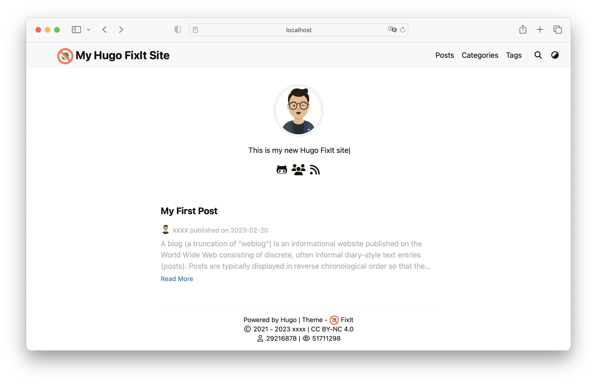

Find out all **FixIt** theme configuration settings via the root configuration keys `params`.

<!--more-->

A simple example:

```toggle {name="hugo.toml"}
baseURL = 'https://example.org/'
locale = 'en'
title = 'ABC Widgets, Inc.'

[params]
version = "1.0.X"
description = "This is my new Hugo FixIt site"
keywords = [
  "Hugo",
  "FixIt"
]
# ...
```



All theme configuration settings provided by **FixIt** are documented in this page. You can also view the complete configuration preview in the [hugo.toml](https://github.com/hugo-fixit/FixIt/blob//hugo.toml) file of the theme.

<!-- HUGO_FIXIT_PARAMS:START -->
<!--
Automatically generated by the `pnpm gen:docs` command.
Do not modify it manually!
-->

## Site Level

These apply to the entire site and cannot be overridden on a per-page basis.

### version

`string` FixIt theme version. Example: "0.4.X", "0.4.5", "v1.0.0" etc. Default is `"1.0.X"`.

### description

`string` Site description. Default is `""`.

### keywords

`string array` Site keywords. Default is `[]`.

### default_theme

`string` Site default theme. Available values: ["light", "dark", "auto"]. Default is `"auto"`.

### fingerprint

`string` Which hash function used for SRI, when empty, no SRI is used. Available values: ["sha256", "sha384", "sha512", "md5"]. Default is `""`.

### date_format

`string` Date format. Default is `"2006-01-02"`.

### images

`string array` Website images for Open Graph and Twitter Cards. Default is `[]`.

### with_site_title

`bool` Whether to add site title to the title of every page. Remember to set up your site title in `hugo.toml` (e.g. `title = "title"`). Default is `true`.

### title_delimiter

`string` Title delimiter when the site title is added to the title of every page. Default is `"-"`.

### index_with_subtitle

`bool` Whether to add site subtitle to the title of index page. Remember to set up your site subtitle by `params.header.subtitle.name`. Default is `false`.

### enable_translation_merge

`bool` Whether to enable merging missing translations from other languages. When set to true, missing translations from other languages will be merged and displayed. Default is false for better performance, especially for single-language sites. Set to true if your site has multiple languages and you want to show all content. Default is `false`.

### tooltip

`bool` Whether to enable tooltip replacement for elements with title attribute, such as footnote references. Default is `true`.

### disable_theme_inject

`bool` FixIt will, by default, inject a theme meta tag in the HTML head on the home page only. You can turn it off, but we would really appreciate if you don't, as this is a good way to watch FixIt's popularity on the rise. Default is `false`.

### git_info

`map` Public Git repository information only then enableGitInfo is true.

```toggle
[params]

[params.git_info]
repo = ""
branch = "main"
dir = "content"
issue_tpl = "title=[BUG]%20{title}&body=|Field|Value|%0A|-|-|%0A|Title|{title}|%0A|URL|{URL}|%0A|Filename|{sourceURL}|"
```

repo
: `string` Example: `"https://github.com/hugo-fixit/docs"`. Default is `""`.

branch
: `string` Default is `"main"`.

dir
: `string` The content directory path relative to the root of the repository. Default is `"content"`.

issue_tpl
: `string` The issue template for reporting issue of the posts. Available template params: {title} {URL} {sourceURL}. Default is `"title=[BUG]%20{title}&body=|Field|Value|%0A|-|-|%0A|Title|{title}|%0A|URL|{URL}|%0A|Filename|{sourceURL}|"`.

### app

`map` App and PWA configuration.

```toggle
[params]

[params.app]
pwa = false
name = ""
short_name = ""
no_favicon = false
svg_favicon = ""
mask_color = "#FF7359"
tile_color = "#2d89ef"

[params.app.theme_color]
light = "#f6f8fa"
dark = "#151b23"

[[params.app.icons]]
src = "/apple-touch-icon.png"
sizes = "180x180"
type = "image/png"
purpose = "any maskable"

[[params.app.icons]]
src = "/android-chrome-192x192.png"
sizes = "192x192"
type = "image/png"

[[params.app.icons]]
src = "/android-chrome-512x512.png"
sizes = "512x512"
type = "image/png"
```

pwa
: `bool` Whether to enable PWA support. Default is `false`.

name
: `string` App name used for home screen and manifest (falls back to site title). Default is `""`.

short_name
: `string` Optional short name for the manifest (falls back to name). Default is `""`.

no_favicon
: `bool` Whether to omit favicon resource links. Default is `false`.

svg_favicon
: `string` Modern SVG favicon to use in place of older style .png and .ico files. Default is `""`.

mask_color
: `string` Safari mask icon color. Default is `"#FF7359"`.

tile_color
: `string` Windows v8-10 tile color. Default is `"#2d89ef"`.

theme_color
: `map` Android browser theme color.

- light: `string` Default is `"#f6f8fa"`.
- dark: `string` Default is `"#151b23"`.

icons
: `map array` Default is `[{"src":"/apple-touch-icon.png","sizes":"180x180","type":"image/png","purpose":"any maskable"},{"src":"/android-chrome-192x192.png","sizes":"192x192","type":"image/png"},{"src":"/android-chrome-512x512.png","sizes":"512x512","type":"image/png"}]`.

### search

`map` Search configuration.

```toggle
[params]

[params.search]
enable = true
type = "fuse"
content_length = 4000
placeholder = ""
max_result_length = 10
snippet_length = 30
highlight_tag = "em"
absolute_url = false
anchorify = true

[params.search.algolia]
index = ""
app_id = ""
search_key = ""

[params.search.fuse]
is_case_sensitive = false
min_match_char_length = 2
find_all_matches = false
location = 0
threshold = 0.3
distance = 100
ignore_location = false
use_extended_search = false
ignore_field_norm = false

[params.search.pagefind]
bundle_path = "pagefind/"
debounce_timeout_ms = 300
use_built_in_filters = true
sort_by = ""
sort_order = "desc"
```

enable
: `bool` Default is `true`.

type
: `string` Type of search engine. Available values: ["fuse", "algolia", "pagefind", "cse"]. Default is `"fuse"`.

content_length
: `int` Max index length of the chunked content. Default is `4000`.

placeholder
: `string` Placeholder of the search bar. Default is `""`.

max_result_length
: `int` Max number of results length. Default is `10`.

snippet_length
: `int` Snippet length of the result. Default is `30`.

highlight_tag
: `string` HTML tag name of the highlight part in results. Default is `"em"`.

absolute_url
: `bool` Whether to use the absolute URL based on the baseURL in search index. Default is `false`.

anchorify
: `bool` Whether to enable anchorify for headings in search results. Default is `true`.

algolia
: `map` Algolia search configuration.

- index: `string` Default is `""`.
- app_id: `string` Default is `""`.
- search_key: `string` Default is `""`.

fuse
: `map` Fuse.js search configuration. See: [Fuse.js options](https://fusejs.io/api/options.html).

- is_case_sensitive: `bool` Default is `false`.
- min_match_char_length: `int` Default is `2`.
- find_all_matches: `bool` Default is `false`.
- location: `int` Default is `0`.
- threshold: `float` Default is `0.3`.
- distance: `int` Default is `100`.
- ignore_location: `bool` Default is `false`.
- use_extended_search: `bool` Default is `false`.
- ignore_field_norm: `bool` Default is `false`.

pagefind
: `map` Pagefind search configuration. See: [Pagefind](http://pagefind.app/).

- bundle_path: `string` Pagefind bundle and index directory. Default is `"pagefind/"`.
- debounce_timeout_ms: `int` Debounce timeout in milliseconds, set to 0 to disable debounce. Default is `300`.
- use_built_in_filters: `bool` Whether to respect FixIt built-in search visibility rules. Default is `true`.
- sort_by: `string` Optional sort field. Available values: ["date", "title"]. Default is `""`.
- sort_order: `string` Sort order for sort_by. Available values: ["asc", "desc"]. Default is `"desc"`.

### cse

`map` Custom Search Engine (CSE).

```toggle
[params]

[params.cse]
engine = "google"
results_page = "/search/"

[params.cse.google]
cx = ""

[params.cse.bing]
cx = ""
```

engine
: `string` Search engine. Available values: ["google", "bing"]. Default is `"google"`.

results_page
: `string` Search results page URL (layout: search). Default is `"/search/"`.

google
: `map` Google Custom Search Engine Context. See: [Google CSE](https://programmablesearchengine.google.com/).

- cx: `string` Default is `""`.

bing
: `map` Bing Custom Search Engine Context (unverified). See: [Bing CSE](https://www.customsearch.ai/).

- cx: `string` Default is `""`.

### header

`map` Header configuration.

```toggle
[params]

[params.header]
desktop_mode = "sticky"
mobile_mode = "auto"
blur = false

[params.header.title]
logo = ""
name = ""
pre = ""
post = ""
typeit = false

[params.header.subtitle]
name = ""
typeit = false
```

desktop_mode
: `string` Desktop header mode. Available values: ["sticky", "normal", "auto"]. Default is `"sticky"`.

mobile_mode
: `string` Mobile header mode. Available values: ["sticky", "normal", "auto"]. Default is `"auto"`.

blur
: `bool` Whether to enable header blur effect. Default is `false`.

title
: `map` Header title configuration.

- logo: `string` URL of the logo. Default is `""`.
- name: `string` Title name. Default is `""`.
- pre: `string` You can add extra information before the name (HTML format is supported), such as icons. Default is `""`.
- post: `string` You can add extra information after the name (HTML format is supported), such as icons. Default is `""`.
- typeit: `bool` Whether to use typeit animation for title name. Default is `false`.

subtitle
: `map` Header subtitle configuration.

- name: `string` Subtitle name. Default is `""`.
- typeit: `bool` Whether to use typeit animation for subtitle name. Default is `false`.

### breadcrumb

`map` Breadcrumb configuration.

```toggle
[params]

[params.breadcrumb]
enable = false
sticky = true
show_home = false
separator = "/"
capitalize = true
```

enable
: `bool` Default is `false`.

sticky
: `bool` Default is `true`.

show_home
: `bool` Default is `false`.

separator
: `string` Default is `"/"`.

capitalize
: `bool` Default is `true`.

### navigation

`map` Post navigation configuration.

```toggle
[params]

[params.navigation]
in_section = false
reverse = false
```

in_section
: `bool` Whether to show the post navigation in section pages scope. Default is `false`.

reverse
: `bool` Whether to reverse the next/previous post navigation order. Default is `false`.

### footer

`map` Footer configuration.

```toggle
[params]

[params.footer]
enable = true
copyright = true
author = true
since = ""
gov = ""
icp = ""
license = ""

[params.footer.powered]
enable = true
hugo_logo = false
theme_logo = false

[params.footer.site_time]
enable = false
animate = true
icon = "fa-solid fa-heartbeat"
pre = ""
value = ""

[params.footer.order]
powered = 0
copyright = 0
statistics = 0
visitor = 0
beian = 0
```

enable
: `bool` Default is `true`.

copyright
: `bool` Whether to show copyright info. Default is `true`.

author
: `bool` Whether to show the author. Default is `true`.

since
: `string` Site creation year. Default is `""`.

gov
: `string` Public network security only in China (HTML format is supported). Default is `""`.

icp
: `string` ICP info only in China (HTML format is supported). Default is `""`.

license
: `string` License info (HTML format is supported). Default is `""`.

powered
: `map` Whether to show Hugo and theme info.

- enable: `bool` Default is `true`.
- hugo_logo: `bool` Default is `false`.
- theme_logo: `bool` Default is `false`.

site_time
: `map` Site creation time.

- enable: `bool` Default is `false`.
- animate: `bool` Default is `true`.
- icon: `string` Default is `"fa-solid fa-heartbeat"`.
- pre: `string` Default is `""`.
- value: `string` Example: "2021-12-18T16:15:22+08:00". Default is `""`.

order
: `map` Footer lines order. Available values: ["first", 0-5, "last"].

- powered: `int` Default is `0`.
- copyright: `int` Default is `0`.
- statistics: `int` Default is `0`.
- visitor: `int` Default is `0`.
- beian: `int` Default is `0`.

### archives

`map` Archives page configuration (all pages of posts type).

```toggle
[params]

[params.archives]
paginate = 20
date_format = "01-02"
```

paginate
: `int` Special amount of posts in archives page. Default is `20`.

date_format
: `string` Date format (month and day). Default is `"01-02"`.

### section

`map` Section page configuration (all pages in section).

```toggle
[params]

[params.section]
paginate = 20
date_format = "01-02"

[params.section.feed]
limit = -1
full_text = false
```

paginate
: `int` Special amount of pages in each section page. Default is `20`.

date_format
: `string` Date format (month and day). Default is `"01-02"`.

feed
: `map` Section feed configuration for RSS, Atom and JSON feed.

- limit: `int` The number of posts to include in the feed. If set to -1, all posts. Default is `-1`.
- full_text: `bool` Whether to show the full text content in feed. Default is `false`.

### list

`map` Term list (category or tag) page configuration.

```toggle
[params]

[params.list]
paginate = 20
date_format = "01-02"

[params.list.feed]
limit = -1
full_text = false
```

paginate
: `int` Special amount of posts in each list page. Default is `20`.

date_format
: `string` Date format (month and day). Default is `"01-02"`.

feed
: `map` Term list feed configuration for RSS, Atom and JSON feed.

- limit: `int` The number of posts to include in the feed. If set to -1, all posts. Default is `-1`.
- full_text: `bool` Whether to show the full text content in feed. Default is `false`.

### recently_updated

`map` Recently updated pages configuration for archives, section and term list.

```toggle
[params]

[params.recently_updated]
archives = true
section = true
list = true
days = 30
max_count = 10
```

archives
: `bool` Default is `true`.

section
: `bool` Default is `true`.

list
: `bool` Default is `true`.

days
: `int` Default is `30`.

max_count
: `int` Default is `10`.

### tag_cloud

`map` TagCloud configuration for tags page.

```toggle
[params]

[params.tag_cloud]
enable = false
min = 14
max = 32
peak_count = 10
orderby = "name"
```

enable
: `bool` Default is `false`.

min
: `int` Minimum font size in px. Default is `14`.

max
: `int` Maximum font size in px. Default is `32`.

peak_count
: `int` Maximum count of posts per tag. Default is `10`.

orderby
: `string` Order of tags. Available values: ["name", "count"]. Default is `"name"`.

### home

`map` Home page configuration.

```toggle
[params]

[params.home]

[params.home.profile]
enable = false
only_first_page = false
gravatar_email = ""
avatar_url = ""
avatar_menu = ""
title = ""
subtitle = ""
typeit = true
social = true
disclaimer = ""

[params.home.posts]
enable = true
paginate = 6
image_preview = true
```

profile
: `map` Home page profile.

- enable: `bool` Default is `false`.
- only_first_page: `bool` Whether to show profile and content only in the first home page. Default is `false`.
- gravatar_email: `string` Gravatar email for preferred avatar in home page. Default is `""`.
- avatar_url: `string` URL of avatar shown in home page, default is author's avatar. Default is `""`.
- avatar_menu: `string` Identifier of avatar menu link. Default is `""`.
- title: `string` Title shown in home page (HTML format is supported). Default is `""`.
- subtitle: `string` Subtitle shown in home page (HTML format is supported). Default is `""`.
- typeit: `bool` Whether to use typeit animation for subtitle. Default is `true`.
- social: `bool` Whether to show social links. Default is `true`.
- disclaimer: `string` Disclaimer (HTML format is supported). Default is `""`.

posts
: `map` Home page posts.

- enable: `bool` Default is `true`.
- paginate: `int` Special amount of posts in each home posts page. Default is `6`.
- image_preview: `bool` Whether to show featured image preview in home page post list. Default is `true`.

### social

`map` Custom social links like the following. [params.social.twitter]. Example: `id = "lruihao"`. Example: `weight = 3`. Example: `prefix = "https://x.com/"`. Example: `title = "X"`. [params.social.twitter.icon]. Example: `class = "fa-brands fa-x-twitter"`.

```toggle
[params]

[params.social]
GitHub = ""
Linkedin = ""
Twitter = ""
Instagram = ""
Facebook = ""
Telegram = ""
Medium = ""
Gitlab = ""
Youtubelegacy = ""
Youtubecustom = ""
Youtubechannel = ""
Tumblr = ""
Quora = ""
Keybase = ""
Pinterest = ""
Reddit = ""
Codepen = ""
FreeCodeCamp = ""
Bitbucket = ""
Stackoverflow = ""
Weibo = ""
Odnoklassniki = ""
VK = ""
Flickr = ""
Xing = ""
Snapchat = ""
Soundcloud = ""
Spotify = ""
Bandcamp = ""
Paypal = ""
Fivehundredpx = ""
Mix = ""
Goodreads = ""
Lastfm = ""
Foursquare = ""
Hackernews = ""
Kickstarter = ""
Patreon = ""
Steam = ""
Twitch = ""
Strava = ""
Skype = ""
Whatsapp = ""
Zhihu = ""
Douban = ""
Angellist = ""
Slidershare = ""
Jsfiddle = ""
Deviantart = ""
Behance = ""
Dribbble = ""
Wordpress = ""
Vine = ""
Googlescholar = ""
Researchgate = ""
Mastodon = ""
Thingiverse = ""
Devto = ""
Gitea = ""
XMPP = ""
Matrix = ""
Bilibili = ""
ORCID = ""
Liberapay = ""
Ko-Fi = ""
BuyMeaCoffee = ""
Linktree = ""
QQ = ""
QQGroup = ""
Diaspora = ""
CSDN = ""
Discord = ""
DiscordInvite = ""
Lichess = ""
Pleroma = ""
Kaggle = ""
MediaWiki = ""
Plume = ""
HackTheBox = ""
RootMe = ""
Feishu = ""
TryHackMe = ""
Douyin = ""
TikTok = ""
Credly = ""
Bluesky = ""
Phone = ""
Email = ""
RSS = true
```

GitHub
: `string` Default is `""`.

Linkedin
: `string` Default is `""`.

Twitter
: `string` Default is `""`.

Instagram
: `string` Default is `""`.

Facebook
: `string` Default is `""`.

Telegram
: `string` Default is `""`.

Medium
: `string` Default is `""`.

Gitlab
: `string` Default is `""`.

Youtubelegacy
: `string` Default is `""`.

Youtubecustom
: `string` Default is `""`.

Youtubechannel
: `string` Default is `""`.

Tumblr
: `string` Default is `""`.

Quora
: `string` Default is `""`.

Keybase
: `string` Default is `""`.

Pinterest
: `string` Default is `""`.

Reddit
: `string` Default is `""`.

Codepen
: `string` Default is `""`.

FreeCodeCamp
: `string` Default is `""`.

Bitbucket
: `string` Default is `""`.

Stackoverflow
: `string` Default is `""`.

Weibo
: `string` Default is `""`.

Odnoklassniki
: `string` Default is `""`.

VK
: `string` Default is `""`.

Flickr
: `string` Default is `""`.

Xing
: `string` Default is `""`.

Snapchat
: `string` Default is `""`.

Soundcloud
: `string` Default is `""`.

Spotify
: `string` Default is `""`.

Bandcamp
: `string` Default is `""`.

Paypal
: `string` Default is `""`.

Fivehundredpx
: `string` Default is `""`.

Mix
: `string` Default is `""`.

Goodreads
: `string` Default is `""`.

Lastfm
: `string` Default is `""`.

Foursquare
: `string` Default is `""`.

Hackernews
: `string` Default is `""`.

Kickstarter
: `string` Default is `""`.

Patreon
: `string` Default is `""`.

Steam
: `string` Default is `""`.

Twitch
: `string` Default is `""`.

Strava
: `string` Default is `""`.

Skype
: `string` Default is `""`.

Whatsapp
: `string` Default is `""`.

Zhihu
: `string` Default is `""`.

Douban
: `string` Default is `""`.

Angellist
: `string` Default is `""`.

Slidershare
: `string` Default is `""`.

Jsfiddle
: `string` Default is `""`.

Deviantart
: `string` Default is `""`.

Behance
: `string` Default is `""`.

Dribbble
: `string` Default is `""`.

Wordpress
: `string` Default is `""`.

Vine
: `string` Default is `""`.

Googlescholar
: `string` Default is `""`.

Researchgate
: `string` Default is `""`.

Mastodon
: `string` Default is `""`.

Thingiverse
: `string` Default is `""`.

Devto
: `string` Default is `""`.

Gitea
: `string` Default is `""`.

XMPP
: `string` Default is `""`.

Matrix
: `string` Default is `""`.

Bilibili
: `string` Default is `""`.

ORCID
: `string` Default is `""`.

Liberapay
: `string` Default is `""`.

Ko-Fi
: `string` Default is `""`.

BuyMeaCoffee
: `string` Default is `""`.

Linktree
: `string` Default is `""`.

QQ
: `string` Default is `""`.

QQGroup
: `string` Default is `""`.

Diaspora
: `string` Default is `""`.

CSDN
: `string` Default is `""`.

Discord
: `string` Default is `""`.

DiscordInvite
: `string` Default is `""`.

Lichess
: `string` Default is `""`.

Pleroma
: `string` Default is `""`.

Kaggle
: `string` Default is `""`.

MediaWiki
: `string` Default is `""`.

Plume
: `string` Default is `""`.

HackTheBox
: `string` Default is `""`.

RootMe
: `string` Default is `""`.

Feishu
: `string` Default is `""`.

TryHackMe
: `string` Default is `""`.

Douyin
: `string` Default is `""`.

TikTok
: `string` Default is `""`.

Credly
: `string` Default is `""`.

Bluesky
: `string` Default is `""`.

Phone
: `string` Default is `""`.

Email
: `string` Default is `""`.

RSS
: `bool` Default is `true`.

### typeit

`map` TypeIt configuration.

```toggle
[params]

[params.typeit]
speed = 100
cursor_speed = 1000
cursor_char = "|"
duration = -1
loop = false
```

speed
: `int` Typing speed between each step (measured in milliseconds). Default is `100`.

cursor_speed
: `int` Blinking speed of the cursor (measured in milliseconds). Default is `1000`.

cursor_char
: `string` Character used for the cursor (HTML format is supported). Default is `"|"`.

duration
: `int` Cursor duration after typing finishing (measured in milliseconds, "-1" means unlimited). Default is `-1`.

loop
: `bool` Whether your strings will continuously loop after completing. Default is `false`.

### admonition

`map` Admonitions custom configuration. See: [Custom Admonitions](https://fixit.lruihao.cn/docs/advanced/#custom-admonitions). Syntax: `<type> = <icon>`. Example: `ban = "fa-solid fa-ban"`.

### task_list

`map` Task lists custom configuration. See: [Custom Task Lists](https://fixit.lruihao.cn/docs/advanced/#custom-task-lists). Syntax: `<sign> = <icon>`. Example: `tip = "fa-regular fa-lightbulb"`.

### repo_version

`map` Version shortcode configuration.

```toggle
[params]

[params.repo_version]
name = "FixIt"
url = "https://github.com/hugo-fixit/FixIt/releases/tag/v"
```

name
: `string` Project name. Default is `"FixIt"`.

url
: `string` URL prefix for the release tag. Default is `"https://github.com/hugo-fixit/FixIt/releases/tag/v"`.

### pangu

`map` PanguJS configuration.

```toggle
[params]

[params.pangu]
enable = false
selector = "article"
```

enable
: `bool` For Chinese writing. Default is `false`.

selector
: `string` Default is `"article"`.

### watermark

`map` Watermark configuration. Detail config See: https://github.com/Lruihao/watermark#readme.

```toggle
[params]

[params.watermark]
enable = false
content = ""
opacity = 0.1
width = 150
height = 20
row_spacing = 60
col_spacing = 30
rotate = 15
font_size = 0.85
font_family = "inherit"
```

enable
: `bool` Default is `false`.

content
: `string` Watermark's text (HTML format is supported). Default is `""`.

opacity
: `float` Watermark's transparency. Default is `0.1`.

width
: `int` Watermark's width. Unit: px. Default is `150`.

height
: `int` Watermark's height. Unit: px. Default is `20`.

row_spacing
: `int` Row spacing of watermarks. Unit: px. Default is `60`.

col_spacing
: `int` Col spacing of watermarks. Unit: px. Default is `30`.

rotate
: `int` Watermark's tangent angle. Unit: deg. Default is `15`.

font_size
: `float` Watermark's fontSize. Unit: rem. Default is `0.85`.

font_family
: `string` Watermark's fontFamily. Default is `"inherit"`.

### busuanzi

`map` Busuanzi count.

```toggle
[params]

[params.busuanzi]
enable = false
source = "https://vercount.one/js"
site_views = true
page_views = true
```

enable
: `bool` Whether to enable busuanzi count. Default is `false`.

source
: `string` Busuanzi count core script source. Default is https://vercount.one/js. Default is `"https://vercount.one/js"`.

site_views
: `bool` Whether to show the site views. Default is `true`.

page_views
: `bool` Whether to show the page views. Default is `true`.

### verification

`map` Site verification code configuration for Google/Bing/Yandex/Pinterest/Baidu/360/Sogou.

```toggle
[params]

[params.verification]
google = ""
bing = ""
yandex = ""
pinterest = ""
baidu = ""
so = ""
sogou = ""
```

google
: `string` Default is `""`.

bing
: `string` Default is `""`.

yandex
: `string` Default is `""`.

pinterest
: `string` Default is `""`.

baidu
: `string` Default is `""`.

so
: `string` Default is `""`.

sogou
: `string` Default is `""`.

### seo

`map` Site SEO configuration.

```toggle
[params]

[params.seo]
cover = ""
thumbnail_url = ""
images = []

[params.seo.publisher]
name = ""
logo_url = ""
```

cover
: `string` Default cover image for the site. Default is `""`.

thumbnail_url
: `string` Thumbnail URL. Default is `""`.

images
: `string array` Page SEO images (frontmatter-overridable). Default is `[]`.

publisher
: `map` Publisher info (frontmatter-overridable).

- name: `string` Default is `""`.
- logo_url: `string` Default is `""`.

### analytics

`map` Analytics configuration.

```toggle
[params]

[params.analytics]
enable = false

[params.analytics.google]
id = ""
anonymize_ip = true

[params.analytics.fathom]
id = ""
server = ""

[params.analytics.baidu]
id = ""

[params.analytics.umami]
data_website_id = ""
src = ""
data_host_url = ""
data_domains = ""

[params.analytics.plausible]
data_domain = ""
src = ""

[params.analytics.cloudflare]
token = ""

[params.analytics.splitbee]
enable = false
no_cookie = true
do_not_track = true
data_token = ""
```

enable
: `bool` Default is `false`.

google
: `map` Google Analytics.

- id: `string` Default is `""`.
- anonymize_ip: `bool` Whether to anonymize IP. Default is `true`.

fathom
: `map` Fathom Analytics.

- id: `string` Default is `""`.
- server: `string` Server URL for your tracker if you're self hosting. Default is `""`.

baidu
: `map` Baidu Analytics.

- id: `string` Default is `""`.

umami
: `map` Umami Analytics.

- data_website_id: `string` Default is `""`.
- src: `string` Default is `""`.
- data_host_url: `string` Default is `""`.
- data_domains: `string` Default is `""`.

plausible
: `map` Plausible Analytics.

- data_domain: `string` Default is `""`.
- src: `string` Default is `""`.

cloudflare
: `map` Cloudflare Analytics.

- token: `string` Default is `""`.

splitbee
: `map` Splitbee Analytics.

- enable: `bool` Default is `false`.
- no_cookie: `bool` No cookie mode. Default is `true`.
- do_not_track: `bool` Respect the do not track setting of the browser. Default is `true`.
- data_token: `string` Token (optional), more info on https://splitbee.io/docs/embed-the-script. Default is `""`.

### cookieconsent

`map` Cookie consent configuration.

```toggle
[params]

[params.cookieconsent]
enable = true

[params.cookieconsent.content]
message = ""
dismiss = ""
link = ""
```

enable
: `bool` Default is `true`.

content
: `map` Text strings used for Cookie consent banner.

- message: `string` Default is `""`.
- dismiss: `string` Default is `""`.
- link: `string` Default is `""`.

### cdn

`map` CDN configuration for third-party library files.

```toggle
[params]

[params.cdn]
data = ""
```

data
: `string` CDN data file name, disabled by default. Available values: ["jsdelivr.yml", "unpkg.yml"]. Located in "themes/FixIt/assets/data/cdn/" directory. You can store your own data files in the same path under your project: "assets/data/cdn/". Default is `""`.

### compatibility

`map` Compatibility configuration.

```toggle
[params]

[params.compatibility]
polyfill = false
object_fit = false
```

polyfill
: `bool` Whether to use Polyfill.io on cdnjs to be compatible with older browsers. See: https://cdnjs.cloudflare.com/polyfill. Default is `false`.

object_fit
: `bool` Whether to use object-fit-images to be compatible with older browsers. Default is `false`.

### github_corner

`map` GitHub banner in the top-right or top-left corner.

```toggle
[params]

[params.github_corner]
enable = false
permalink = "https://github.com/hugo-fixit/FixIt"
title = "View source on GitHub"
position = "right"
```

enable
: `bool` Default is `false`.

permalink
: `string` Default is `"https://github.com/hugo-fixit/FixIt"`.

title
: `string` Default is `"View source on GitHub"`.

position
: `string` Available values: ["left", "right"]. Default is `"right"`.

### gravatar

`map` Gravatar configuration.

```toggle
[params]

[params.gravatar]
enable = false
host = "www.gravatar.com"
style = ""
```

enable
: `bool` Depends on the author's email, if the author's email is not set, the local avatar will be used. Default is `false`.

host
: `string` Gravatar host, default: "www.gravatar.com". Available values: ["cravatar.cn", "gravatar.loli.net", ...]. Default is `"www.gravatar.com"`.

style
: `string` Available values: ["", "mp", "identicon", "monsterid", "wavatar", "retro", "blank", "robohash"]. Default is `""`.

### back_to_top

`map` Back to top.

```toggle
[params]

[params.back_to_top]
enable = true
scrollpercent = false
```

enable
: `bool` Default is `true`.

scrollpercent
: `bool` Whether to show the scroll percent indicator around the back to top button. Default is `false`.

### reading_progress

`map` Reading progress bar.

```toggle
[params]

[params.reading_progress]
enable = false
start = "left"
position = "top"
reversed = false
light = ""
dark = ""
height = "2px"
```

enable
: `bool` Default is `false`.

start
: `string` Available values: ["left", "right"]. Default is `"left"`.

position
: `string` Available values: ["top", "bottom"]. Default is `"top"`.

reversed
: `bool` Default is `false`.

light
: `string` Default is `""`.

dark
: `string` Default is `""`.

height
: `string` Default is `"2px"`.

### pace

`map` Progress bar in the top during page loading. For more information: https://github.com/CodeByZach/pace.

```toggle
[params]

[params.pace]
enable = false
color = "blue"
theme = "minimal"
```

enable
: `bool` Default is `false`.

color
: `string` All available colors:. ["black", "blue", "green", "orange", "pink", "purple", "red", "silver", "white", "yellow"]. Default is `"blue"`.

theme
: `string` All available themes:. ["barber-shop", "big-counter", "bounce", "center-atom", "center-circle", "center-radar", "center-simple",. "corner-indicator", "fill-left", "flash", "flat-top", "loading-bar", "mac-osx", "material", "minimal"]. Default is `"minimal"`.

### feed

`map` Global Feed configuration for RSS, Atom and JSON feed.

```toggle
[params]

[params.feed]
limit = 10
full_text = true

[params.feed.follow]
feed_id = ""
user_id = ""
```

limit
: `int` The number of posts to include in the feed. If set to -1, all posts. Default is `10`.

full_text
: `bool` Whether to show the full text content in feed. Default is `true`.

follow
: `map` Site Challenge for Follow: https://follow.is/.

- feed_id: `string` Default is `""`.
- user_id: `string` Default is `""`.

### taxonomy_icons

`map` Taxonomy icons configuration. Works with `taxonomies`. Configure `taxonomies` first, otherwise taxonomy icons will not take effect. Syntax: `<taxonomy> = [<title icon>, <card icon>, <term title icon>]`. Example:. Example: `topic = [`. "fa-solid fa-book-bookmark",. "fa-solid fa-book",. "fa-solid fa-book-open". ].

### print

`map` Print configuration.

```toggle
[params]

[params.print]
expand_admonition = true
expand_code = true
expand_details = true
expand_file_tree = false
```

expand_admonition
: `bool` Whether to expand all admonitions before printing. Default is `true`.

expand_code
: `bool` Whether to expand all code blocks and code tabs before printing. Default is `true`.

expand_details
: `bool` Whether to expand all details elements before printing. Default is `true`.

expand_file_tree
: `bool` Whether to expand all file trees before printing. Default is `false`.

### custom_partials

`map` Custom partials configuration. Custom partials must be stored in the /layouts/_partials/ directory. Depends on open custom blocks https://fixit.lruihao.cn/references/blocks/.

```toggle
[params]

[params.custom_partials]
head = []
menu_desktop = []
menu_mobile = []
profile = []
aside = []
comment = []
footer = []
widgets = []
assets = []
post_toc_before = []
post_toc_after = []
post_content_before = []
post_content_after = []
post_footer_before = []
post_footer_after = []
```

head
: `string array` Default is `[]`.

menu_desktop
: `string array` Default is `[]`.

menu_mobile
: `string array` Default is `[]`.

profile
: `string array` Default is `[]`.

aside
: `string array` Default is `[]`.

comment
: `string array` Default is `[]`.

footer
: `string array` Default is `[]`.

widgets
: `string array` Default is `[]`.

assets
: `string array` Default is `[]`.

post_toc_before
: `string array` Default is `[]`.

post_toc_after
: `string array` Default is `[]`.

post_content_before
: `string array` Default is `[]`.

post_content_after
: `string array` Default is `[]`.

post_footer_before
: `string array` Default is `[]`.

post_footer_after
: `string array` Default is `[]`.

### appearance

`map` SCSS variables customization via config. Leave empty to use the theme default value (defined in scss-vars.html). Note: Color values must use hex format (e.g. "#ff0000"), CSS named colors (e.g. "red") are not supported.

```toggle
[params]

[params.appearance]
global_font_family = ""
global_font_size = ""
global_font_weight = ""
global_line_height = ""
global_border_radius = ""
global_background_color = ""
global_background_color_dark = ""
global_font_color = ""
global_font_color_dark = ""
global_font_secondary_color = ""
global_font_secondary_color_dark = ""
global_link_color = ""
global_link_color_dark = ""
global_link_hover_color = ""
global_link_hover_color_dark = ""
global_border_color = ""
global_border_color_dark = ""
scrollbar_color = ""
scrollbar_hover_color = ""
selection_color = ""
selection_color_dark = ""
header_background_color = ""
header_background_color_dark = ""
header_title_font_size = ""
header_title_font_family = ""
menu_active_color = ""
menu_active_color_dark = ""
menu_border_color = ""
menu_border_color_dark = ""
search_background_color = ""
search_background_color_dark = ""
tag_cloud_start = ""
tag_cloud_start_dark = ""
tag_cloud_end = ""
tag_cloud_end_dark = ""
toc_title_font_size = ""
toc_content_font_size = ""
collection_title_font_size = ""
collection_list_font_size = ""
related_title_font_size = ""
related_list_font_size = ""
single_link_color = ""
single_link_color_dark = ""
single_link_hover_color = ""
single_link_hover_color_dark = ""
table_background_color = ""
table_background_color_dark = ""
table_thead_color = ""
table_thead_color_dark = ""
table_border_color = ""
table_border_color_dark = ""
blockquote_color = ""
blockquote_color_dark = ""
reward_color = ""
reward_color_dark = ""
reward_img_width = ""
pagination_link_color = ""
pagination_link_color_dark = ""
pagination_link_hover_color = ""
pagination_link_hover_color_dark = ""
code_color = ""
code_color_dark = ""
code_font_family = ""
code_header_color = ""
code_header_color_dark = ""
code_header_background_color = ""
code_header_background_color_dark = ""
code_background_color = ""
code_background_color_dark = ""
code_error_color = ""
code_highlight_color = ""
code_highlight_color_dark = ""
code_font_size = ""
code_block_font_size = ""
github_corner_color = ""
github_corner_color_dark = ""
github_corner_fill = ""
github_corner_fill_dark = ""
```

global_font_family
: `string` Default is `""`.

global_font_size
: `string` Default is `""`.

global_font_weight
: `string` Default is `""`.

global_line_height
: `string` Default is `""`.

global_border_radius
: `string` Default is `""`.

global_background_color
: `string` Default is `""`.

global_background_color_dark
: `string` Default is `""`.

global_font_color
: `string` Default is `""`.

global_font_color_dark
: `string` Default is `""`.

global_font_secondary_color
: `string` Default is `""`.

global_font_secondary_color_dark
: `string` Default is `""`.

global_link_color
: `string` Default is `""`.

global_link_color_dark
: `string` Default is `""`.

global_link_hover_color
: `string` Default is `""`.

global_link_hover_color_dark
: `string` Default is `""`.

global_border_color
: `string` Default is `""`.

global_border_color_dark
: `string` Default is `""`.

scrollbar_color
: `string` Default is `""`.

scrollbar_hover_color
: `string` Default is `""`.

selection_color
: `string` Default is `""`.

selection_color_dark
: `string` Default is `""`.

header_background_color
: `string` Default is `""`.

header_background_color_dark
: `string` Default is `""`.

header_title_font_size
: `string` Default is `""`.

header_title_font_family
: `string` Default is `""`.

menu_active_color
: `string` Default is `""`.

menu_active_color_dark
: `string` Default is `""`.

menu_border_color
: `string` Default is `""`.

menu_border_color_dark
: `string` Default is `""`.

search_background_color
: `string` Default is `""`.

search_background_color_dark
: `string` Default is `""`.

tag_cloud_start
: `string` Default is `""`.

tag_cloud_start_dark
: `string` Default is `""`.

tag_cloud_end
: `string` Default is `""`.

tag_cloud_end_dark
: `string` Default is `""`.

toc_title_font_size
: `string` Default is `""`.

toc_content_font_size
: `string` Default is `""`.

collection_title_font_size
: `string` Default is `""`.

collection_list_font_size
: `string` Default is `""`.

related_title_font_size
: `string` Default is `""`.

related_list_font_size
: `string` Default is `""`.

single_link_color
: `string` Default is `""`.

single_link_color_dark
: `string` Default is `""`.

single_link_hover_color
: `string` Default is `""`.

single_link_hover_color_dark
: `string` Default is `""`.

table_background_color
: `string` Default is `""`.

table_background_color_dark
: `string` Default is `""`.

table_thead_color
: `string` Default is `""`.

table_thead_color_dark
: `string` Default is `""`.

table_border_color
: `string` Default is `""`.

table_border_color_dark
: `string` Default is `""`.

blockquote_color
: `string` Default is `""`.

blockquote_color_dark
: `string` Default is `""`.

reward_color
: `string` Default is `""`.

reward_color_dark
: `string` Default is `""`.

reward_img_width
: `string` Default is `""`.

pagination_link_color
: `string` Default is `""`.

pagination_link_color_dark
: `string` Default is `""`.

pagination_link_hover_color
: `string` Default is `""`.

pagination_link_hover_color_dark
: `string` Default is `""`.

code_color
: `string` Default is `""`.

code_color_dark
: `string` Default is `""`.

code_font_family
: `string` Default is `""`.

code_header_color
: `string` Default is `""`.

code_header_color_dark
: `string` Default is `""`.

code_header_background_color
: `string` Default is `""`.

code_header_background_color_dark
: `string` Default is `""`.

code_background_color
: `string` Default is `""`.

code_background_color_dark
: `string` Default is `""`.

code_error_color
: `string` Default is `""`.

code_highlight_color
: `string` Default is `""`.

code_highlight_color_dark
: `string` Default is `""`.

code_font_size
: `string` Default is `""`.

code_block_font_size
: `string` Default is `""`.

github_corner_color
: `string` Default is `""`.

github_corner_color_dark
: `string` Default is `""`.

github_corner_fill
: `string` Default is `""`.

github_corner_fill_dark
: `string` Default is `""`.

### dev

`map` Developer options. Select the scope named `public_repo` to generate personal access token,. Configure with environment variable `HUGO_PARAMS_GHTOKEN=xxx`, See: https://gohugo.io/functions/os/getenv/#examples.

```toggle
[params]

[params.dev]
enable = false
c4u = false
```

enable
: `bool` Default is `false`.

c4u
: `bool` Check for updates. Default is `false`.

## Page Level

These can be overridden on a per-page basis via front matter.

### capitalize_titles

`bool` Whether to capitalize titles. Default is `true`.

### summary_plainify

`bool` Whether to show summary in plain text. Default is `false`.

### author_avatar

`bool` Whether to enable the author's avatar of the post. Default is `true`.

### hidden_from_home_page

`bool` Whether to hide a page from home page. Default is `false`.

### hidden_from_search

`bool` Whether to hide a page from search results. Default is `false`.

### hidden_from_related

`bool` Whether to hide a page from related posts. Default is `false`.

### hidden_from_feed

`bool` Whether to hide a page from RSS, Atom and JSON feed. Default is `false`.

### twemoji

`bool` Whether to enable twemoji. Default is `false`.

### lightgallery

`bool` Whether to enable lightgallery. Set to true, images in the content will be shown as the gallery if the image has a title, e.g. ``. Set to "force", images in the content will be forced to shown as the gallery regardless of the image has a title or not, e.g. ``. Default is `false`.

### ruby

`bool` Whether to enable the ruby extended syntax. Default is `true`.

### fraction

`bool` Whether to enable the fraction extended syntax. Default is `true`.

### fontawesome

`bool` Whether to enable the fontawesome extended syntax. Default is `true`.

### license

`string` License info (HTML format is supported). Default is `"<a rel=\"license external nofollow noopener noreferrer\" href=\"https://creativecommons.org/licenses/by-nc-sa/4.0/\" target=\"_blank\">CC BY-NC-SA 4.0</a>"`.

### page_style

`string` Page style. Available values: ["narrow", "normal", "wide", ...]. Default is `"normal"`.

### auto_bookmark

`bool` Auto bookmark support. If true, save the reading progress when closing the page. Default is `false`.

### show_lastmod

`bool` Whether to show the last modified time. Default is `true`.

### word_count

`bool` Whether to enable word count. Default is `true`.

### reading_time

`bool` Whether to enable reading time. Default is `true`.

### instant_page

`bool` Whether to enable instant.page. Default is `false`.

### collection_list

`bool` Whether to enable collection list at the sidebar. Default is `false`.

### collection_navigation

`bool` Whether to enable collection navigation at the end of the post. Default is `false`.

### end_flag

`string` End of post flag. Default is `""`.

### author

`map` Author configuration.

```toggle
[params]

[params.author]
name = ""
email = ""
link = ""
avatar = ""
```

name
: `string` Default is `""`.

email
: `string` Default is `""`.

link
: `string` Default is `""`.

avatar
: `string` Default is `""`.

### link

`map` Link configuration.

```toggle
[params]

[params.link]
external_icon = true

[params.link.guard]
enable = false
mode = "modal"
allow_domains = []
```

external_icon
: `bool` Whether to add external icon for external links automatically. Default is `true`.

guard
: `map` External link guard configuration.

- enable: `bool` Default is `false`.
- mode: `string` External link guard mode. Available values: ["modal", "redirect"]. In "modal" mode, a dialog will pop up to ask for confirmation when users click external links. In "redirect" mode, users will be redirected to an intermediate page before visiting external links. Default is `"modal"`.
- allow_domains: `string array` Allowed domains (exact host or parent domain) will skip confirmation. Default is `[]`.

### image

`map` Image configuration. Combined with Hugo's image processing option `imaging` for image optimisation.

```toggle
[params]

[params.image]
cache_remote = false
optimise = false
black_list = []
```

cache_remote
: `bool` Cache remote images for better optimisations. Default is `false`.

optimise
: `bool` Image resizing and optimisation (may slow builds). Default is `false`.

black_list
: `string array` A list of image file names or patterns to exclude from optimisation. Example: `["no-optimize.jpg", "*.tiff", "images/exclude-*.webp"]`. Default is `[]`.

### codeblock

`map` Code block wrapper configuration. You can override the global config via Markdown attributes, for example:. ```lang {mode="mac", max_shown_lines=5}. Code here. ```.

```toggle
[params]

[params.codeblock]
wrapper = true
mode = "classic"
wrapper_class = ""
max_shown_lines = 10
shadow = "never"
copyable = true
downloadable = false
fullscreen = false
line_nos_toggler = true
line_wrap_toggler = true
editable = false
```

wrapper
: `bool` Whether to enable the code block wrapper. Default is `true`.

mode
: `string` Code block mode. Available values: ["classic", "mac", "simple"]. If you set to custom value, you need to create a custom CSS for data-mode attribute. Default is `"classic"`.

wrapper_class
: `string` Additional classes for the code block wrapper. Example: "is-collapsed is-expanded line-nos-hidden line-wrapping". Default is `""`.

max_shown_lines
: `int` The maximum number of lines to show in the code block preview. Default is `10`.

shadow
: `string` Whether to show shadow effect for code blocks. Available values: ["always", "hover", "never"]. Default is `"never"`.

copyable
: `bool` Whether to enable code copy button. Default is `true`.

downloadable
: `bool` Whether to enable code download button in the code block header. Only available in classic mode. Default is `false`.

fullscreen
: `bool` Whether to enable code fullscreen button in the code block header. Only available in classic mode. Default is `false`.

line_nos_toggler
: `bool` Whether to enable line numbers toggle button in the code block header. Only available in classic mode. Default is `true`.

line_wrap_toggler
: `bool` Whether to enable toggle line wrapping button in the code block header. Only available in classic mode. Default is `true`.

editable
: `bool` Whether to enable code edit button in the code block header (**experimental**). Only available in classic mode. Default is `false`.

### json_viewer

`map` JSON Viewer configuration. See: [json-viewer-element](https://github.com/Lruihao/json-viewer-element).

```toggle
[params]

[params.json_viewer]
enable = true
expand_depth = 1
copyable = true
sort = false
boxed = true
```

enable
: `bool` Default is `true`.

expand_depth
: `int` Default is `1`.

copyable
: `bool` Default is `true`.

sort
: `bool` Default is `false`.

boxed
: `bool` Default is `true`.

### filetree

`map` File tree configuration. See: [File Tree](https://fixit.lruihao.cn/docs/content-management/shortcodes/extended/file-tree/).

```toggle
[params]

[params.filetree]
level = 1
folder_slash = false
ignore_list = []
highlight_list = []
```

level
: `int` The expand level of the tree (expand all: -1, collapse all: 0). Default is `1`.

folder_slash
: `bool` Whether to append a trailing `/` to folder names. Default is `false`.

ignore_list
: `string array` List of file or folder names to ignore. Default is `[]`.

highlight_list
: `string array` List of file or folder names to highlight. Default is `[]`.

### mermaid

`map` Mermaid configuration. See: [Mermaid](https://fixit.lruihao.cn/docs/content-management/diagrams-support/mermaid/).

```toggle
[params]

[params.mermaid]
wrapper = true
cdn = "https://cdn.jsdelivr.net/npm/mermaid/dist/mermaid.esm.min.mjs"
zenuml = ""
themes = ["default","dark"]
security_level = "loose"
look = "handDrawn"
font_family = ""
layout_loaders = []
layout = "dagre"
```

wrapper
: `bool` Whether to enable the Mermaid wrapper. When enabled, Mermaid diagrams are wrapped with diagram tabs and actions:. - pan/zoom (drag & ctrl+wheel). - reset view. - download as SVG. Default is `true`.

cdn
: `string` Mermaid ESM module CDN source. Default is `"https://cdn.jsdelivr.net/npm/mermaid/dist/mermaid.esm.min.mjs"`.

zenuml
: `string` ZenUML ESM module CDN source. You can set it to a CDN source to enable ZenUML support. Example: `https://cdn.jsdelivr.net/npm/@mermaid-js/mermaid-zenuml/dist/mermaid-zenuml.esm.min.mjs`. Default is `""`.

themes
: `string array` For values, See: [Available Themes](https://mermaid.js.org/config/theming.html#available-themes). Default is `["default","dark"]`.

security_level
: `string` The security level for Mermaid diagrams. Available values: ["strict", "loose", "antiscript", "sandbox"]. Default is `"loose"`.

look
: `string` The appearance style for Mermaid diagrams. Available values: ["classic", "handDrawn"]. Default is `"handDrawn"`.

font_family
: `string` Specifies the font to be used in the rendered diagrams. Default is `""`.

layout_loaders
: `string array` Layout loaders from ESM module CDN sources (e.g., ELK layout engine). Example: ["https://cdn.jsdelivr.net/npm/@mermaid-js/layout-elk/dist/mermaid-layout-elk.esm.min.mjs"]. This will enable additional layout options: ["elk", "elk.layered", "elk.stress", "elk.force", "elk.mrtree"]. Default is `[]`.

layout
: `string` Default layout algorithm for rendering diagrams. Available values: ["dagre", "elk", "elk.layered", "elk.stress", "elk.force", "elk.mrtree"]. Note: ELK layouts require `layout_loaders` to be configured first. Default is `"dagre"`.

### toc

`map` Table of the contents configuration.

```toggle
[params]

[params.toc]
enable = true
keep_static = false
auto = true
position = "right"
ordered = false
start_level = 2
end_level = 6
decrease_h1 = false
```

enable
: `bool` Whether to enable the table of the contents. Default is `true`.

keep_static
: `bool` Whether to keep the static table of the contents in front of the post. Default is `false`.

auto
: `bool` Whether to make the table of the contents in the sidebar automatically collapsed. Default is `true`.

position
: `string` Position of TOC. Available values: ["left", "right"]. Default is `"right"`.

ordered
: `bool` Supersede `markup.tableOfContents` settings. Default is `false`.

start_level
: `int` Default is `2`.

end_level
: `int` Default is `6`.

decrease_h1
: `bool` Whether to decrease the H1 heading level in content. Default is `false`.

### expiration_reminder

`map` Display a message at the beginning of an article to warn the reader that its content might be expired.

```toggle
[params]

[params.expiration_reminder]
enable = false
reminder = 90
warning = 180
close_comment = false
```

enable
: `bool` Default is `false`.

reminder
: `int` Display the reminder if the last modified time is more than 90 days ago. Default is `90`.

warning
: `int` Display warning if the last modified time is more than 180 days ago. Default is `180`.

close_comment
: `bool` If the article expires, close the comment or not. Default is `false`.

### heading

`map` Page heading configuration.

```toggle
[params]

[params.heading]
capitalize = false

[params.heading.number]
enable = false
only_main_section = true

[params.heading.number.format]
h1 = "{title}"
h2 = "{h2} {title}"
h3 = "{h2}.{h3} {title}"
h4 = "{h2}.{h3}.{h4} {title}"
h5 = "{h2}.{h3}.{h4}.{h5} {title}"
h6 = "{h2}.{h3}.{h4}.{h5}.{h6} {title}"
```

capitalize
: `bool` Whether to capitalize automatic text of headings. Default is `false`.

number
: `map` Must set `params.toc.ordered` to true.

- enable: `bool` Whether to enable auto heading numbering. Default is `false`.
- only_main_section: `bool` Only enable in main section pages (default is posts). Default is `true`.
- format: `map`

### math

`map` Mathematical formulas configuration. See: [Formula](https://fixit.lruihao.cn/docs/content-management/markdown-syntax/extended/#formula).

```toggle
[params]

[params.math]
enable = true
type = "katex"

[params.math.katex]
copy_tex = true
throw_on_error = false
error_color = "#ff4949"

[params.math.katex.macros]

[params.math.mathjax]
cdn = "https://cdn.jsdelivr.net/npm/mathjax@3/es5/tex-mml-chtml.js"

[params.math.mathjax.packages]

[params.math.mathjax.macros]

[params.math.mathjax.loader]
load = ["ui/safe"]
paths = ""

[params.math.mathjax.options]
enable_menu = true
skip_html_tags = ["script","noscript","style","textarea","pre","code","math","select","option","mjx-container"]
ignore_html_class = "mathjax_ignore"
include_html_tags = ""
```

enable
: `bool` Default is `true`.

type
: `string` Mathematical formulas rendering engines. Available values: ["katex", "mathjax"]. Default is `"katex"`.

katex
: `map` KaTeX server-side rendering. See: [KaTeX](https://katex.org) and [transform.ToMath Options](https://gohugo.io/functions/transform/tomath/#options).

- copy_tex: `bool` KaTeX extension copy-tex. Default is `true`.
- throw_on_error: `bool` Default is `false`.
- error_color: `string` Default is `"#ff4949"`.
- macros: `map` Custom macros map. Syntax: `<macro> = <definition>`. Example: `"\\f" = "#1f(#2)" # usage: $\f{a}{b}$`.

mathjax
: `map` MathJax server-side rendering. See: [MathJax](https://www.mathjax.org) and [MathJax Options](https://docs.mathjax.org/en/latest/options/index.html).

- cdn: `string` Default is `"https://cdn.jsdelivr.net/npm/mathjax@3/es5/tex-mml-chtml.js"`.
- packages: `map` MathJax packages config. Example: `"[+]" = ["configmacros"]`.
- macros: `map` Custom macros map. Syntax: `<macro> = <definition>`. Example: `bold = ["{\\bf #1}", 1] # usage: $\bold{math}$`.
- loader: `map` MathJax loader configuration. More loader config e.g source, dependencies, provides etc support.
- options: `map`

### mapbox

`map` Mapbox GL JS configuration. See: [Mapbox GL JS](https://docs.mapbox.com/mapbox-gl-js).

```toggle
[params]

[params.mapbox]
access_token = ""
light_style = "mapbox://styles/mapbox/light-v11"
dark_style = "mapbox://styles/mapbox/dark-v11"
navigation = true
geolocate = true
scale = true
fullscreen = true
```

access_token
: `string` Access token of Mapbox GL JS. Default is `""`.

light_style
: `string` Style for the light theme. Default is `"mapbox://styles/mapbox/light-v11"`.

dark_style
: `string` Style for the dark theme. Default is `"mapbox://styles/mapbox/dark-v11"`.

navigation
: `bool` Whether to add NavigationControl. Default is `true`.

geolocate
: `bool` Whether to add GeolocateControl. Default is `true`.

scale
: `bool` Whether to add ScaleControl. Default is `true`.

fullscreen
: `bool` Whether to add FullscreenControl. Default is `true`.

### post_chat

`map` PostChat AI configuration. Based on your posts to build a knowledge base, support AI summary, AI search, and AI Chatbot. See: [HongMoAI](https://ai.zhheo.com/docs/). Get PostChat Key from my invitation link, thanks for your support! https://ai.zhheo.com/console/login?InviteID=85041330.

```toggle
[params]

[params.post_chat]
enable = false
key = ""
user_mode = "iframe"
add_button = true
default_input = false
left = ""
bottom = ""
width = ""
height = ""
fill = ""
background_color = ""
upload_web = true
show_invite_link = true
user_title = ""
user_desc = ""
black_dom = []
frame_width = ""
frame_height = ""
user_icon = ""
default_chat_questions = []
default_search_questions = []
hot_words = true
```

enable
: `bool` Default is `false`.

key
: `string` Default is `""`.

user_mode
: `string` How users initiate chats. Available values: ["iframe", "magic"]. Default is `"iframe"`.

add_button
: `bool` Default is `true`.

default_input
: `bool` Default is `false`.

left
: `string` Default is `""`.

bottom
: `string` Default is `""`.

width
: `string` Default is `""`.

height
: `string` Default is `""`.

fill
: `string` Default is `""`.

background_color
: `string` Default is `""`.

upload_web
: `bool` Default is `true`.

show_invite_link
: `bool` Default is `true`.

user_title
: `string` Default is `""`.

user_desc
: `string` Default is `""`.

black_dom
: `string array` DOM container to be blacked out, e.g. [".aplayer"]. Default is `[]`.

frame_width
: `string` Only for iframe mode. Example: "375px". Default is `""`.

frame_height
: `string` Example: "600px". Default is `""`.

user_icon
: `string` Only for magic mode. Default is `""`.

default_chat_questions
: `string array` Default is `[]`.

default_search_questions
: `string array` Default is `[]`.

hot_words
: `bool` Default is `true`.

### post_summary

`map` Summary AI configuration. See: [PostSummary](https://ai.zhheo.com/docs/summary.html).

```toggle
[params]

[params.post_summary]
enable = false
key = ""
title = ""
theme = ""
post_url = ""
blacklist = ""
word_limit = 1000
typing_animate = true
beginning_text = ""
loading_text = true
```

enable
: `bool` Default is `false`.

key
: `string` If you set `params.post_chat.key`, you don't need to set `params.post_summary.key`. Default is `""`.

title
: `string` Default is `""`.

theme
: `string` Available values: ["", "simple", "yanzhi", "menghuan"]. Default is `""`.

post_url
: `string` Default is `""`.

blacklist
: `string` Default is `""`.

word_limit
: `int` Default is `1000`.

typing_animate
: `bool` Default is `true`.

beginning_text
: `string` Default is `""`.

loading_text
: `bool` Default is `true`.

### podcast

`map` Podcast AI configuration. See: [Podcast](https://ai.zhheo.com/docs/podcast.html).

```toggle
[params]

[params.podcast]
enable = false
```

enable
: `bool` Default is `false`.

### related

`map` Related content configuration. See: [Related Content](https://gohugo.io/content-management/related/).

```toggle
[params]

[params.related]
enable = false
count = 5
position = ["aside","footer"]
```

enable
: `bool` Default is `false`.

count
: `int` Default is `5`.

position
: `string array` Position of related content. Available values: ["aside", "footer"]. Default is `["aside","footer"]`.

### reward

`map` Donate (Sponsor) settings.

```toggle
[params]

[params.reward]
enable = false
animation = false
position = "after"
mode = "static"

[params.reward.ways]
```

enable
: `bool` Default is `false`.

animation
: `bool` Default is `false`.

position
: `string` Position relative to post footer. Available values: ["before", "after"]. Default is `"after"`.

mode
: `string` Example: `comment = "Buy me a coffee"`. Display mode of QR code images. Available values: ["static", "fixed"]. Default is `"static"`.

ways
: `map` Ways to donate (sponsor). Example: `wechatpay = "/images/wechatpay.png"`. Example: `alipay = "/images/alipay.png"`. Example: `paypal = "/images/paypal.png"`. Example: `bitcoin = "/images/bitcoin.png"`.

### post_link

`map` Post footer link configuration.

```toggle
[params]

[params.post_link]
markdown = true
source = true
edit = true
report = true
editor = "vscode"
```

markdown
: `bool` Whether to show link to Raw Markdown content. Default is `true`.

source
: `bool` Whether to show link to view source code (requires git_info.repo). Default is `true`.

edit
: `bool` Whether to show link to edit the post (requires git_info.repo). Default is `true`.

report
: `bool` Whether to show link to report issue (requires git_info.repo). Default is `true`.

editor
: `string` Open in editor protocol (e.g. "vscode", "trae" etc.), empty to disable. Default is `"vscode"`.

### share

`map` Social share links in post page.

```toggle
[params]

[params.share]
enable = true
Twitter = true
Facebook = true
Linkedin = false
Whatsapp = false
Pinterest = false
Tumblr = false
HackerNews = false
Reddit = false
VK = false
Buffer = false
Xing = false
Line = false
Instapaper = false
Pocket = false
Flipboard = false
Weibo = true
Myspace = false
Blogger = false
Baidu = false
Odnoklassniki = false
Evernote = false
Skype = false
Trello = false
Mix = false
```

enable
: `bool` Default is `true`.

Twitter
: `bool` Default is `true`.

Facebook
: `bool` Default is `true`.

Linkedin
: `bool` Default is `false`.

Whatsapp
: `bool` Default is `false`.

Pinterest
: `bool` Default is `false`.

Tumblr
: `bool` Default is `false`.

HackerNews
: `bool` Default is `false`.

Reddit
: `bool` Default is `false`.

VK
: `bool` Default is `false`.

Buffer
: `bool` Default is `false`.

Xing
: `bool` Default is `false`.

Line
: `bool` Default is `false`.

Instapaper
: `bool` Default is `false`.

Pocket
: `bool` Default is `false`.

Flipboard
: `bool` Default is `false`.

Weibo
: `bool` Default is `true`.

Myspace
: `bool` Default is `false`.

Blogger
: `bool` Default is `false`.

Baidu
: `bool` Default is `false`.

Odnoklassniki
: `bool` Default is `false`.

Evernote
: `bool` Default is `false`.

Skype
: `bool` Default is `false`.

Trello
: `bool` Default is `false`.

Mix
: `bool` Default is `false`.

### comment

`map` Comment configuration.

```toggle
[params]

[params.comment]
enable = false

[params.comment.artalk]
enable = false
server = "https://yourdomain"
site = "默认站点"
prefer_remote_conf = false
placeholder = ""
no_comment = ""
send_btn = ""
editor_travel = true
flat_mode = "auto"
lightgallery = false
locale = ""
emoticons = ""
nest_max = 2
nest_sort = "DATE_ASC"
vote = true
vote_down = false
ua_badge = true
list_sort = true
list_unread_highlight = false
img_upload = true
img_lazy_load = false
preview = true
version_check = true
req_timeout = 15000
pv_add = true

[params.comment.artalk.pagination]
page_size = 20
read_more = true
auto_load = true

[params.comment.artalk.height_limit]
content = 300
children = 400
scrollable = false

[params.comment.disqus]
enable = false
shortname = ""

[params.comment.gitalk]
enable = false
owner = ""
repo = ""
client_id = ""
client_secret = ""

[params.comment.valine]
enable = false
app_id = ""
app_key = ""
placeholder = ""
avatar = "mp"
meta = ["nick","mail","link"]
required_fields = []
page_size = 10
lang = ""
visitor = true
record_ip = true
highlight = true
enable_qq = false
server_urls = ""
emoji = ""
comment_count = true

[params.comment.waline]
enable = false
server_url = ""
pageview = false
emoji = ["//unpkg.com/@waline/emojis@1.1.0/weibo"]
meta = ["nick","mail","link"]
required_meta = []
login = "enable"
word_limit = 0
page_size = 10
image_uploader = false
highlighter = false
comment = false
tex_renderer = false
search = false
recaptcha_v3_key = ""
turnstile_key = ""
reaction = false

[params.comment.facebook]
enable = false
width = "100%"
num_posts = 10
app_id = ""
language_code = ""

[params.comment.telegram]
enable = false
site_id = ""
limit = 5
height = ""
color = ""
colorful = true
dislikes = false
outlined = false

[params.comment.commento]
enable = false

[params.comment.utterances]
enable = false
repo = ""
issue_term = "pathname"
label = ""
light_theme = "github-light"
dark_theme = "github-dark"

[params.comment.twikoo]
enable = false
env_id = ""
region = ""
path = ""
visitor = true
comment_count = true
lang = ""
lightgallery = false
katex = false

[params.comment.giscus]
enable = false
repo = ""
repo_id = ""
category = ""
category_id = ""
mapping = ""
origin = "https://giscus.app"
strict = "0"
term = ""
reactions_enabled = "1"
emit_metadata = "0"
input_position = "bottom"
lang = ""
light_theme = "light"
dark_theme = "dark"
lazy_load = true
```

enable
: `bool` Default is `false`.

artalk
: `map` Artalk comment configuration. See: [Artalk](https://artalk.js.org/).

- enable: `bool` Default is `false`.
- server: `string` Default is `"https://yourdomain"`.
- site: `string` Default is `"默认站点"`.
- prefer_remote_conf: `bool` Prefer remote (backend) configuration over local. If true, remote config takes priority; if false (default), local config overrides remote. Default is `false`.
- placeholder: `string` Default is `""`.
- no_comment: `string` Default is `""`.
- send_btn: `string` Default is `""`.
- editor_travel: `bool` Default is `true`.
- flat_mode: `string` Default is `"auto"`.
- lightgallery: `bool` Enable lightgallery support. Default is `false`.
- locale: `string` Default is `""`.
- emoticons: `string` Default is `""`.
- nest_max: `int` Default is `2`.
- nest_sort: `string` Available values: ["DATE_ASC", "DATE_DESC", "VOTE_UP_DESC"]. Default is `"DATE_ASC"`.
- vote: `bool` Default is `true`.
- vote_down: `bool` Default is `false`.
- ua_badge: `bool` Default is `true`.
- list_sort: `bool` Default is `true`.
- list_unread_highlight: `bool` Default is `false`.
- img_upload: `bool` Default is `true`.
- img_lazy_load: `bool` Available values: [false, "native", "data-src"]. Default is `false`.
- preview: `bool` Default is `true`.
- version_check: `bool` Default is `true`.
- req_timeout: `int` Request timeout in milliseconds. Default is `15000`.
- pv_add: `bool` Page view increment on comment list load. Default is `true`.
- pagination: `map` Pagination configuration.
- height_limit: `map` Height limit configuration.

disqus
: `map` Disqus comment configuration. See: [Disqus](https://disqus.com).

- enable: `bool` Default is `false`.
- shortname: `string` Disqus shortname to use Disqus in posts. Default is `""`.

gitalk
: `map` Gitalk comment configuration. See: [Gitalk](https://github.com/gitalk/gitalk).

- enable: `bool` Default is `false`.
- owner: `string` Default is `""`.
- repo: `string` Default is `""`.
- client_id: `string` Default is `""`.
- client_secret: `string` Default is `""`.

valine
: `map` Valine comment configuration. See: [Valine](https://github.com/xCss/Valine).

- enable: `bool` Default is `false`.
- app_id: `string` Default is `""`.
- app_key: `string` Default is `""`.
- placeholder: `string` Default is `""`.
- avatar: `string` Default is `"mp"`.
- meta: `string array` Default is `["nick","mail","link"]`.
- required_fields: `string array` Default is `[]`.
- page_size: `int` Default is `10`.
- lang: `string` Default is `""`.
- visitor: `bool` Default is `true`.
- record_ip: `bool` Default is `true`.
- highlight: `bool` Default is `true`.
- enable_qq: `bool` Default is `false`.
- server_urls: `string` Default is `""`.
- emoji: `string` Emoji data file name, default is "google.yml". Available values: ["apple.yml", "google.yml", "facebook.yml", "twitter.yml"]. Located in "themes/FixIt/assets/lib/valine/emoji/" directory. You can store your own data files in the same path under your project:. "assets/lib/valine/emoji/". Default is `""`.
- comment_count: `bool` Default is `true`.

waline
: `map` Waline comment configuration. See: [Waline](https://waline.js.org).

- enable: `bool` Default is `false`.
- server_url: `string` Default is `""`.
- pageview: `bool` Default is `false`.
- emoji: `string array` Default is `["//unpkg.com/@waline/emojis@1.1.0/weibo"]`.
- meta: `string array` Default is `["nick","mail","link"]`.
- required_meta: `string array` Default is `[]`.
- login: `string` Default is `"enable"`.
- word_limit: `int` Default is `0`.
- page_size: `int` Default is `10`.
- image_uploader: `bool` Default is `false`.
- highlighter: `bool` Default is `false`.
- comment: `bool` Default is `false`.
- tex_renderer: `bool` Default is `false`.
- search: `bool` Default is `false`.
- recaptcha_v3_key: `string` Default is `""`.
- turnstile_key: `string` Default is `""`.
- reaction: `bool` Default is `false`.

facebook
: `map` Facebook comment configuration. See: [Facebook Comments](https://developers.facebook.com/docs/plugins/comments).

- enable: `bool` Default is `false`.
- width: `string` Default is `"100%"`.
- num_posts: `int` Default is `10`.
- app_id: `string` Default is `""`.
- language_code: `string` Default is `""`.

telegram
: `map` Telegram comments configuration. See: [Telegram Comments](https://comments.app).

- enable: `bool` Default is `false`.
- site_id: `string` Default is `""`.
- limit: `int` Default is `5`.
- height: `string` Default is `""`.
- color: `string` Default is `""`.
- colorful: `bool` Default is `true`.
- dislikes: `bool` Default is `false`.
- outlined: `bool` Default is `false`.

commento
: `map` Commento comment configuration. See: [Commento](https://commento.io).

- enable: `bool` Default is `false`.

utterances
: `map` Utterances comment configuration. See: [Utterances](https://utteranc.es).

- enable: `bool` Default is `false`.
- repo: `string` Owner/repo. Default is `""`.
- issue_term: `string` Default is `"pathname"`.
- label: `string` Default is `""`.
- light_theme: `string` Default is `"github-light"`.
- dark_theme: `string` Default is `"github-dark"`.

twikoo
: `map` Twikoo comment configuration. See: [Twikoo](https://twikoo.js.org/).

- enable: `bool` Default is `false`.
- env_id: `string` Default is `""`.
- region: `string` Default is `""`.
- path: `string` Default is `""`.
- visitor: `bool` Default is `true`.
- comment_count: `bool` Default is `true`.
- lang: `string` Default is `""`.
- lightgallery: `bool` Enable lightgallery support. Default is `false`.
- katex: `bool` Enable KaTeX support. Default is `false`.

giscus
: `map` Giscus comments configuration.

- enable: `bool` Default is `false`.
- repo: `string` Default is `""`.
- repo_id: `string` Default is `""`.
- category: `string` Default is `""`.
- category_id: `string` Default is `""`.
- mapping: `string` Default is `""`.
- origin: `string` Or set it to your self-hosted domain. Default is `"https://giscus.app"`.
- strict: `string` Default is `"0"`.
- term: `string` Default is `""`.
- reactions_enabled: `string` Default is `"1"`.
- emit_metadata: `string` Default is `"0"`.
- input_position: `string` Available values: ["top", "bottom"]. Default is `"bottom"`.
- lang: `string` Default is `""`.
- light_theme: `string` Default is `"light"`.
- dark_theme: `string` Default is `"dark"`.
- lazy_load: `bool` Default is `true`.

### library

`map` Third-party library configuration for some custom CSS and JS files. Files can be loaded from local assets (relative to /assets/) or remote CDN URLs. The key is a unique identifier, the value is the file path or URL.

```toml
[params]

[params.library]

[params.library.css]

[params.library.js]
```

css
: `map` Load some CSS from local assets. Example: `someCSS = "css/some.css"`. Load some CSS from remote CDN. Example: `someCSS = "https://cdn.example.com/some.css"`.

js
: `map` Load some JS from local assets. Example: `someJS = "js/some.js"`. Load some JS from remote CDN. Example: `someJS = "https://cdn.example.com/some.js"`.
<!-- HUGO_FIXIT_PARAMS:END -->

<!-- link reference definition -->
[front-matter]: 
