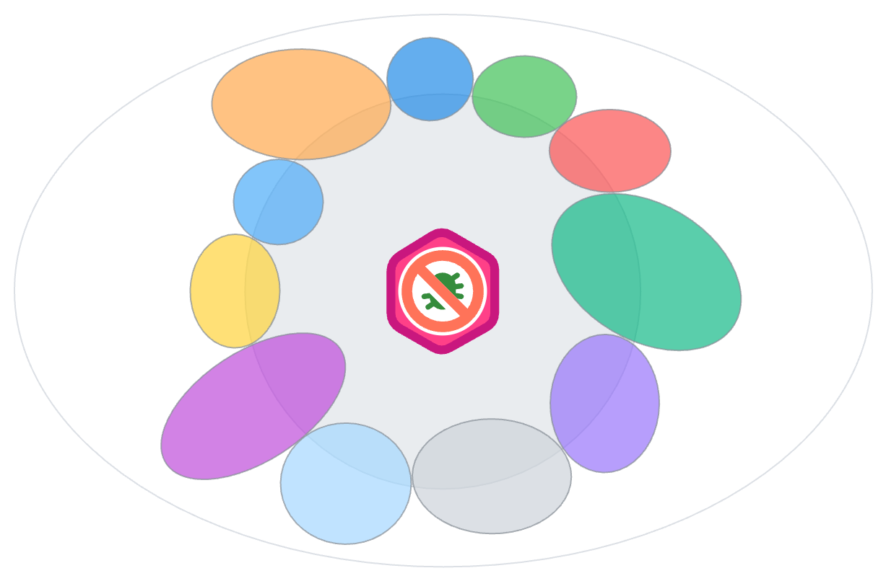

To enhance the extensibility of the FixIt theme, we provide some custom blocks that you can use in your project to achieve more functionality.

<!--more-->

## What's the Meaning

By opening custom blocks, the extensibility of the FixIt theme is further enhanced.

After that, we can make full use of the basic features of the theme and build more upper-level components, so that the blog is full of unlimited imagination and creativity!



## Entry File



The FixIt theme opens a unified custom template entry file [`layouts/partials/custom.html`][custom-html].

In this file, the FixIt theme has defined all open custom blocks. If you want to further customize, you can copy it from the theme to your project and override it.

```bash
cp themes/FixIt/layouts/partials/custom.html layouts/partials/custom.html
```

## Custom Blocks

You can implement these blocks through `define`.

| Block Name                   | Description                     | Location                               |
| :--------------------------- | :------------------------------ | :------------------------------------- |
| `custom-head`                | Head custom block               | `layouts/_default/baseof.html`         |
| `custom-profile`             | Profile custom block            | `layouts/partials/home/profile.html`   |
| `custom-comment`             | Comment system custom block     | `layouts/partials/single/comment.html` |
| `custom-aside`               | Sidebar custom block            | `layouts/posts/single.html`            |
| `custom-footer`              | Footer custom block             | `layouts/partials/footer.html`         |
| `custom-widgets`             | Widgets custom block            | `layouts/partials/widgets.html`        |
| `custom-assets`              | Assets custom block             | `layouts/partials/assets.html`         |
| `custom-post__footer:before` | Custom block before post footer | `layouts/posts/single.html`            |
| `custom-post__footer:after`  | Custom block after post footer  | `layouts/posts/single.html`            |

## Theme Configuration



To facilitate the management of introducing custom templates, you can specify the path of custom templates through the `params.customPartials` parameter.

Custom partials must be stored in the `/layouts/partials/` directory.

```toml
[params]
  [params.customPartials]
    head = []
    profile = []
    aside = []
    comment = []
    footer = []
    widgets = []
    assets = []
    postFooterBefore = []
    postFooterAfter = []
```

## How to Use

Now let's take the custom home page `custom-profile` block as an example to demonstrate how to use custom blocks.

At first, create a custom file in the `layouts/partials/` directory, such as `layouts/partials/custom/profile.html`.

Write any content:

```go-html-template
The quick brown fox jumps over the lazy dog.
```

Then specify the path of the custom template in the configuration file.

```toml
[params]
  [params.customPartials]
    profile = ["custom/profile.html"]
```

Visit the homepage, and you will see the custom content in the `profile` area.

<!-- link reference definition -->
[custom-html]: https://github.com/hugo-fixit/FixIt/blob/master/layouts/partials/custom.html
