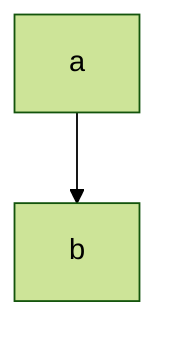
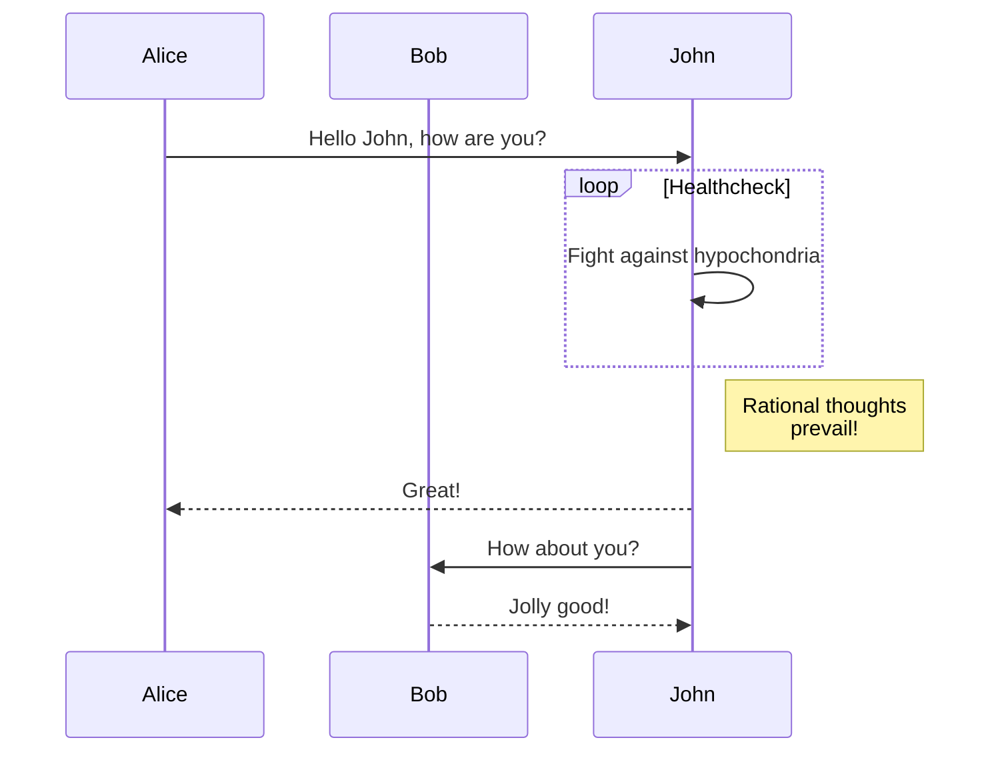
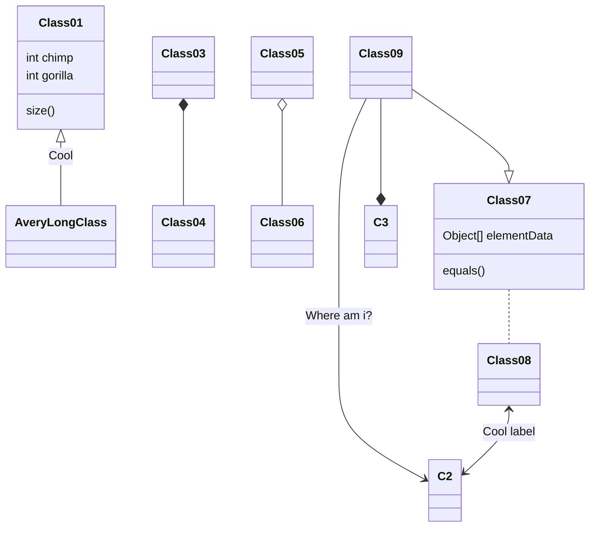
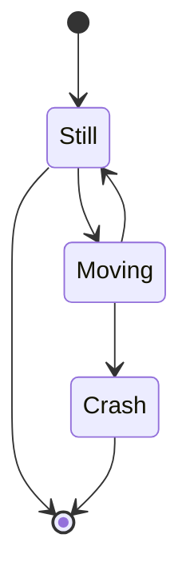
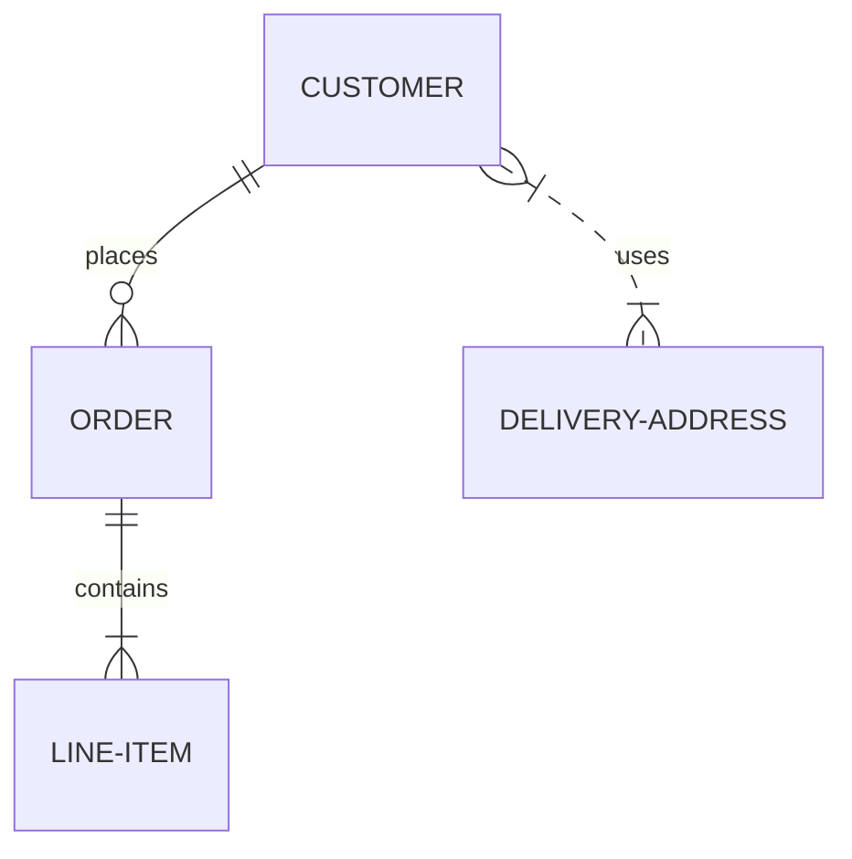
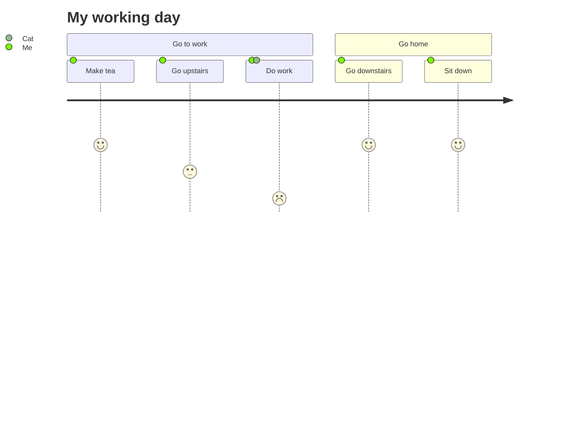
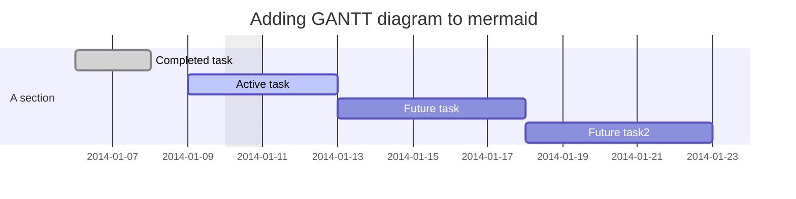
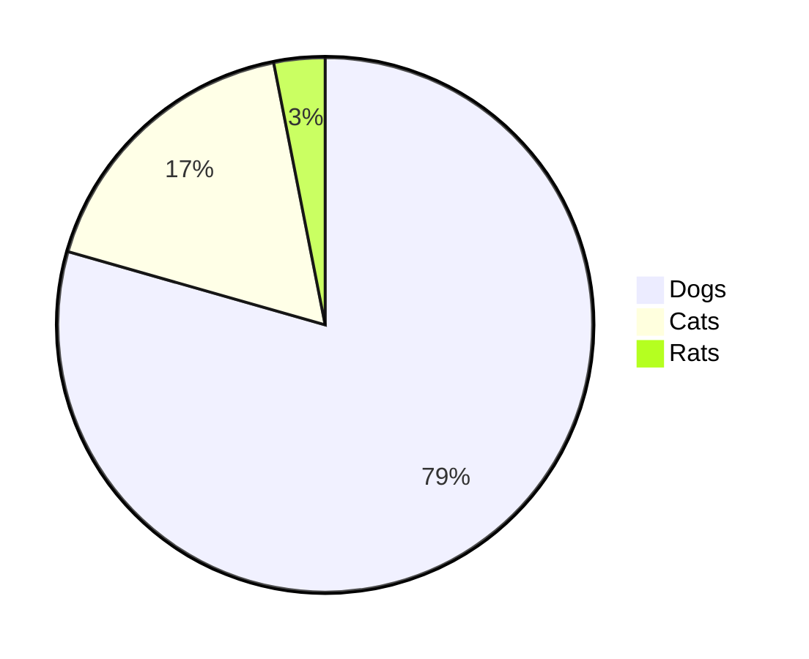
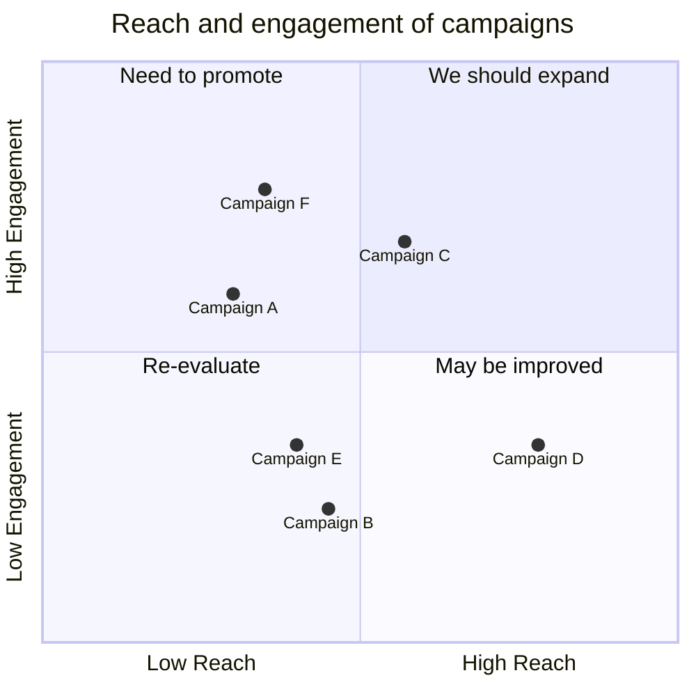

[Mermaid][mermaid] 是一个基于 JavaScript 的图表工具，它允许你使用文本和代码创建图表和可视化。

<!--more-->

## 用法 {#usage}

### 语法 {#syntax}

要使用 Mermaid，只需将 Mermaid 的代码输入放在代码块中，并将语言设置为 `mermaid`。

````markdown
```mermaid
// mermaid diagram code here
```
````

> [!TIP]
> 你也可以直接在 Markdown 文件中使用 [`mermaid` 短代码][sc-mermaid]。

### 配置 {#configuration}

你可以在 `hugo.toml` 文件中全局配置 Mermaid。

```toml
[params]

[params.mermaid]
cdn = ""
zenuml = ""
themes = [
  "default",
  "dark"
]
# optional values: ["strict", "loose", "antiscript", "sandbox"]
securityLevel = "loose"
# optional values: ["classic", "handDrawn"]
look = "handDrawn"
fontFamily = ""
layoutLoaders = []
layout = "dagre"
```

CDN
: 你可使用 `params.mermaid` 在配置文件中指定你想使用的 Mermaid 和 ZenUML 版本。例如：

```toml
[params]

[params.mermaid]
cdn = "https://cdn.jsdelivr.net/npm/mermaid@11/dist/mermaid.esm.min.mjs"
zenuml = "https://cdn.jsdelivr.net/npm/@mermaid-js/mermaid-zenuml@0.2/dist/mermaid-zenuml.esm.min.mjs"
```

> [!WARNING]
> 只有设置了 ZenUML CDN，才能使用 ZenUML 功能。

look
: Mermaid 图表在 FixIt 主题中默认是手绘样式，如果你更喜欢经典样式，可以在配置文件中修改：

```toml
[params]

[params.mermaid]
look = "classic"
```

layoutLoaders
: 布局加载器允许你从 ESM 模块 CDN 源加载额外的布局引擎。这对于启用高级布局算法（如 ELK（Eclipse Layout Kernel））特别有用。你可以指定布局模块的 CDN URL 数组：

```toml
[params]

[params.mermaid]
layoutLoaders = [ "https://cdn.jsdelivr.net/npm/@mermaid-js/layout-elk/dist/mermaid-layout-elk.esm.min.mjs" ]
```

> [!NOTE]
> 当 `layoutLoaders` 配置了 ELK 布局引擎时，将可以使用额外的布局选项：`"elk"`、`"elk.layered"`、`"elk.stress"`、`"elk.force"` 和 `"elk.mrtree"`。

layout
: 用于渲染图表的默认布局算法。默认值为 `"dagre"`，适用于大多数图表类型。当你配置了带有额外布局引擎的 `layoutLoaders` 时，可以从扩展的布局选项中进行选择：

```toml
[params]

[params.mermaid]
layout = "elk.layered" # 需要先配置 ELK 布局加载器
```

可用的布局算法：

- `"dagre"`（默认）- 标准 Dagre 布局算法
- `"elk"` - 基本 ELK 布局，等价于 `"elk.layered"`（需要 ELK 布局加载器）
- `"elk.layered"` - ELK 分层布局算法（需要 ELK 布局加载器）
- `"elk.stress"` - ELK 压力布局算法（需要 ELK 布局加载器）
- `"elk.force"` - ELK 力导向布局算法（需要 ELK 布局加载器）
- `"elk.mrtree"` - ELK 多根树布局算法（需要 ELK 布局加载器）

> [!WARNING]
> ELK 布局算法需要先配置 `layoutLoaders`。在没有相应布局加载器的情况下使用 ELK 布局将回退到默认的 Dagre 布局。

### 主题 {#themes}

以下是可用的主题：

1. [**default**][theme-default] - 这是所有图表的默认主题。
2. [**neutral**][theme-neutral] - 这个主题非常适合黑白打印的文档。
3. [**dark**][theme-dark] - 这个主题适合与深色元素或暗模式搭配使用。
4. [**forest**][theme-forest] - 这个主题包含各种绿色。
5. [**base**][theme-base] - 这是唯一可以修改的主题。使用此主题作为自定义的基础。

请前往 [Theme Configuration | Mermaid][mermaid-theming] 页面，了解有关动态和集成主题配置的更多信息。

站点范围主题
: 你可以通过 `hugo.toml` 中的 `params.mermaid.themes` 参数全局配置 Mermaid 主题。

```toml
[params]

[params.mermaid]
themes = [
  "default",
  "dark"
]
```

图表特定主题
: 要自定义单个图表的主题，请使用 frontmatter 配置。

以下是使用 frontmatter 配置将主题设置为 `forest` 的示例代码：

````markdown

````


---

下面是一些使用 Mermaid 生成的 SVG 图表示例。

## 流程图 {#flowchart}

所有 [流程图][mermaid-flowchart] 都由节点、几何形状和边缘（箭头或线）组成。Mermaid 代码定义了这些节点和边缘的制作方式和交互方式。

````markdown

````


## 序列图 {#sequence-diagram}

[序列图][mermaid-sequenceDiagram] 是一种交互图，显示进程如何相互操作以及按什么顺序进行操作。

````markdown

````


## 类图 {#class-diagram}

[类图][mermaid-classDiagram] 是面向对象建模的主要构建单元。它用于应用程序结构的一般概念建模，并将模型转换为编程代码的详细建模。类图也可以用于数据建模。类图中的类既表示应用程序中的主要元素和交互，也表示要编程的类。

````markdown
```mermaid

[类图][mermaid-classDiagram] 是面向对象建模的主要构建单元。它用于应用程序结构的一般概念建模，并将模型转换为编程代码的详细建模。类图也可以用于数据建模。类图中的类既表示应用程序中的主要元素和交互，也表示要编程的类。

````markdown
```mermaid
classDiagram
Class01 <|-- AveryLongClass : Cool
Class03 *-- Class04
Class05 o-- Class06
Class07 .. Class08
Class09 --> C2 : Where am i?
Class09 --* C3
Class09 --|> Class07
Class07 : equals()
Class07 : Object[] elementData
Class01 : size()
Class01 : int chimp
Class01 : int gorilla
Class08 <--> C2: Cool label
```
````



## 状态图 {#state-diagram}

Mermaid 可以渲染 [状态图][mermaid-stateDiagram]。语法尝试与 plantUml 中使用的语法兼容，因为这将使用户更容易在 mermaid 和 plantUml 之间共享图表。

一个 **状态图** `mermaid` 示例：

````markdown

````

呈现的输出效果如下：


## 实体关系图 {#entity-relationship-diagram}

[实体关系图][mermaid-entityRelationshipDiagram]（或 ER 图）描述了特定领域中相关的事物。基本的 ER 图由实体类型（分类感兴趣的事物）组成，并指定可以存在于实体之间（这些实体类型的实例）的关系。

````markdown

````


## 用户旅程图 {#user-journey}

[用户旅程图][mermaid-user-journey] 在高层次上描述了不同用户在系统、应用程序或网站中完成特定任务所采取的确切步骤。这种技术展示了当前（现有）的用户工作流程，并揭示了 to-be 工作流的改进区域。

````markdown

````


## 甘特图 {#gantt-diagram}

[甘特图][mermaid-gantt] 是一种条形图，由 Karol Adamiecki 在 1896 年首次开发，独立于 Henry Gantt 在 1910 年代开发，用于说明项目进度和完成任何一个项目所需的时间量。甘特图说明了项目的终端元素和摘要元素的开始和结束日期之间的天数。

````markdown

````


## 饼图 {#pie-chart}

Mermaid 可以渲染 [饼图][mermaid-pie]。

一个 **饼图** `mermaid` 示例：

````markdown

````

呈现的输出效果如下：


## 象限图 {#quadrant-chart}

[象限图][mermaid-quadrant] 是一种将数据划分为四个象限的视觉表示。它用于在二维网格上绘制数据点，一个变量表示在 x 轴上，另一个变量表示在 y 轴上。通过根据特定于所分析数据的一组标准将图表划分为四个相等的部分来确定象限。象限图通常用于识别数据中的模式和趋势，并根据图表中数据点的位置确定操作的优先级。它们通常用于商业、营销和风险管理等领域。

一个 **象限图** `mermaid` 示例：

````markdown

````

呈现的输出效果如下：

```mermaid
quadrantChart
    title Reach and engagement of campaigns
    x-axis Low Reach --> High Reach
    y-axis Low Engagement --> High Engagement
    quadrant-1 We should expand
    quadrant-2 Need to promote
    quadrant-3 Re-evaluate
    quadrant-4 May be improved
    Campaign A: [0.3, 0.6]
    Campaign B: [0.45, 0.23]
    Campaign C: [0.57, 0.69]
    Campaign D: [0.78, 0.34]
    Campaign E: [0.40, 0.34]
    Campaign F: [0.35, 0.78]
```

## 依赖图 {#requirement-diagram}

[依赖图][mermaid-requirementDiagram] 提供了需求及其相互关系和其他文档化元素的可视化。建模规范遵循 SysML v1.6 定义的规范。

一个 **依赖图** `mermaid` 示例：

````markdown
```mermaid
requirementDiagram

requirement test_req {
id: 1
text: the test text.
risk: high
verifymethod: test
}

element test_entity {
type: simulation
}

test_entity - satisfies -> test_req
```
````

呈现的输出效果如下：

```mermaid
requirementDiagram

requirement test_req {
id: 1
text: the test text.
risk: high
verifymethod: test
}

element test_entity {
type: simulation
}

test_entity - satisfies -> test_req
```

## Git 图 {#git-graph}

[Git 图][mermaid-gitgraph]是 git 提交和 git 操作（命令）在各个分支上的图形表示。

一个 **Git 图** `mermaid` 示例：

````markdown
```mermaid
gitGraph
    commit
    branch hotfix
    checkout hotfix
    commit
    branch develop
    checkout develop
    commit id:"ash" tag:"abc"
    branch featureB
    checkout featureB
    commit type:HIGHLIGHT
    checkout main
    checkout hotfix
    commit type:NORMAL
    checkout develop
    commit type:REVERSE
    checkout featureB
    commit
    checkout main
    merge hotfix
    checkout featureB
    commit
    checkout develop
    branch featureA
    commit
    checkout develop
    merge hotfix
    checkout featureA
    commit
    checkout featureB
    commit
    checkout develop
    merge featureA
    branch release
    checkout release
    commit
    checkout main
    commit
    checkout release
    merge main
    checkout develop
    merge release
```
````

呈现的输出效果如下：

```mermaid
gitGraph
    commit
    branch hotfix
    checkout hotfix
    commit
    branch develop
    checkout develop
    commit id:"ash" tag:"abc"
    branch featureB
    checkout featureB
    commit type:HIGHLIGHT
    checkout main
    checkout hotfix
    commit type:NORMAL
    checkout develop
    commit type:REVERSE
    checkout featureB
    commit
    checkout main
    merge hotfix
    checkout featureB
    commit
    checkout develop
    branch featureA
    commit
    checkout develop
    merge hotfix
    checkout featureA
    commit
    checkout featureB
    commit
    checkout develop
    merge featureA
    branch release
    checkout release
    commit
    checkout main
    commit
    checkout release
    merge main
    checkout develop
    merge release
```

## C4 图 :warning:

> [!WARNING]
> [C4 图][mermaid-c4]：目前这是一个实验性的图表。语法和属性可能会在未来的版本中发生变化。当语法稳定后，将会提供适当的文档说明。

Mermaid 的 C4 图语法与 PlantUML 兼容。以下是示例：

````markdown
```mermaid
    C4Context
      title System Context diagram for Internet Banking System
      Enterprise_Boundary(b0, "BankBoundary0") {
        Person(customerA, "Banking Customer A", "A customer of the bank, with personal bank accounts.")
        Person(customerB, "Banking Customer B")
        Person_Ext(customerC, "Banking Customer C", "desc")

        Person(customerD, "Banking Customer D", "A customer of the bank, <br/> with personal bank accounts.")

        System(SystemAA, "Internet Banking System", "Allows customers to view information about their bank accounts, and make payments.")

        Enterprise_Boundary(b1, "BankBoundary") {

          SystemDb_Ext(SystemE, "Mainframe Banking System", "Stores all of the core banking information about customers, accounts, transactions, etc.")

          System_Boundary(b2, "BankBoundary2") {
            System(SystemA, "Banking System A")
            System(SystemB, "Banking System B", "A system of the bank, with personal bank accounts. next line.")
          }

          System_Ext(SystemC, "E-mail system", "The internal Microsoft Exchange e-mail system.")
          SystemDb(SystemD, "Banking System D Database", "A system of the bank, with personal bank accounts.")

          Boundary(b3, "BankBoundary3", "boundary") {
            SystemQueue(SystemF, "Banking System F Queue", "A system of the bank.")
            SystemQueue_Ext(SystemG, "Banking System G Queue", "A system of the bank, with personal bank accounts.")
          }
        }
      }

      BiRel(customerA, SystemAA, "Uses")
      BiRel(SystemAA, SystemE, "Uses")
      Rel(SystemAA, SystemC, "Sends e-mails", "SMTP")
      Rel(SystemC, customerA, "Sends e-mails to")

      UpdateElementStyle(customerA, $fontColor="red", $bgColor="grey", $borderColor="red")
      UpdateRelStyle(customerA, SystemAA, $textColor="blue", $lineColor="blue", $offsetX="5")
      UpdateRelStyle(SystemAA, SystemE, $textColor="blue", $lineColor="blue", $offsetY="-10")
      UpdateRelStyle(SystemAA, SystemC, $textColor="blue", $lineColor="blue", $offsetY="-40", $offsetX="-50")
      UpdateRelStyle(SystemC, customerA, $textColor="red", $lineColor="red", $offsetX="-50", $offsetY="20")

      UpdateLayoutConfig($c4ShapeInRow="3", $c4BoundaryInRow="1")
```
````

呈现的输出效果如下：

```mermaid
    C4Context
      title System Context diagram for Internet Banking System
      Enterprise_Boundary(b0, "BankBoundary0") {
        Person(customerA, "Banking Customer A", "A customer of the bank, with personal bank accounts.")
        Person(customerB, "Banking Customer B")
        Person_Ext(customerC, "Banking Customer C", "desc")

        Person(customerD, "Banking Customer D", "A customer of the bank, <br/> with personal bank accounts.")

        System(SystemAA, "Internet Banking System", "Allows customers to view information about their bank accounts, and make payments.")

        Enterprise_Boundary(b1, "BankBoundary") {

          SystemDb_Ext(SystemE, "Mainframe Banking System", "Stores all of the core banking information about customers, accounts, transactions, etc.")

          System_Boundary(b2, "BankBoundary2") {
            System(SystemA, "Banking System A")
            System(SystemB, "Banking System B", "A system of the bank, with personal bank accounts. next line.")
          }

          System_Ext(SystemC, "E-mail system", "The internal Microsoft Exchange e-mail system.")
          SystemDb(SystemD, "Banking System D Database", "A system of the bank, with personal bank accounts.")

          Boundary(b3, "BankBoundary3", "boundary") {
            SystemQueue(SystemF, "Banking System F Queue", "A system of the bank.")
            SystemQueue_Ext(SystemG, "Banking System G Queue", "A system of the bank, with personal bank accounts.")
          }
        }
      }

      BiRel(customerA, SystemAA, "Uses")
      BiRel(SystemAA, SystemE, "Uses")
      Rel(SystemAA, SystemC, "Sends e-mails", "SMTP")
      Rel(SystemC, customerA, "Sends e-mails to")

      UpdateElementStyle(customerA, $fontColor="red", $bgColor="grey", $borderColor="red")
      UpdateRelStyle(customerA, SystemAA, $textColor="blue", $lineColor="blue", $offsetX="5")
      UpdateRelStyle(SystemAA, SystemE, $textColor="blue", $lineColor="blue", $offsetY="-10")
      UpdateRelStyle(SystemAA, SystemC, $textColor="blue", $lineColor="blue", $offsetY="-40", $offsetX="-50")
      UpdateRelStyle(SystemC, customerA, $textColor="red", $lineColor="red", $offsetX="-50", $offsetY="20")

      UpdateLayoutConfig($c4ShapeInRow="3", $c4BoundaryInRow="1")
```

## 思维导图 {#mindmap}

> [思维导图][mermaid-mindmap]：目前这是一个实验性的图表。语法和属性在将来的版本中可能会更改。语法是稳定的，除了图标集成是实验部分。

一个 **思维导图** `mermaid` 示例：

````markdown
```mermaid
mindmap
  root((mindmap))
    Origins
      Long history
      ::icon(fa fa-book)
      Popularisation
        British popular psychology author Tony Buzan
    Research
      On effectiveness<br/>and features
      On Automatic creation
        Uses
            Creative techniques
            Strategic planning
            Argument mapping
    Tools
      Pen and paper
      Mermaid
```
````

呈现的输出效果如下：

```mermaid
mindmap
  root((mindmap))
    Origins
      Long history
      ::icon(fa fa-book)
      Popularisation
        British popular psychology author Tony Buzan
    Research
      On effectiveness<br/>and features
      On Automatic creation
        Uses
            Creative techniques
            Strategic planning
            Argument mapping
    Tools
      Pen and paper
      Mermaid
```

## 时间轴 {#timeline}

> [!WARNING]
> [时间轴][mermaid-timeline]：目前这是一个实验性图表。语法和属性可能会在未来版本中发生变化。除了图标集成（实验性部分）外，语法是稳定的。

一个 **时间轴** `mermaid` 示例：

````markdown
```mermaid
timeline
    title History of Social Media Platform
    2002 : LinkedIn
    2004 : Facebook
         : Google
    2005 : Youtube
    2006 : Twitter
```
````

呈现的输出效果如下：

```mermaid
timeline
    title History of Social Media Platform
    2002 : LinkedIn
    2004 : Facebook
         : Google
    2005 : Youtube
    2006 : Twitter
```

## ZenUML



> 序列图是一种交互图，显示流程如何相互运行以及以什么顺序运行。

Mermaid 可以使用 [ZenUML][zemuml] 渲染序列图。请注意，ZenUML 使用的语法与原始的 Mermaid 序列图不同。

> [!NOTE]
> [Mermaid ZenUML][mermaid-zenuml] 默认禁用，你可以通过在配置文件中设置 `params.mermaid.zenuml` 来启用它。

一个 **ZenUML** `mermaid` 示例：

````markdown
```mermaid
zenuml
    title Demo
    Alice->John: Hello John, how are you?
    John->Alice: Great!
    Alice->John: See you later!
```
````

呈现的输出效果如下：

```mermaid
zenuml
    title Demo
    Alice->John: Hello John, how are you?
    John->Alice: Great!
    Alice->John: See you later!
```

## 桑基图 :fire: {#sankey-diagram}

[桑基图][mermaid-sankey] 是一种可视化方法，用于描述从一组值到另一组值的流动。

> [!WARNING]
> 这是一个实验性图表。其语法与纯 CSV 非常接近，但不久的将来会得到扩展。

一个 **桑基图** `mermaid` 示例：

````markdown
```mermaid
---
config:
  sankey:
    showValues: false
---
sankey-beta

Agricultural 'waste',Bio-conversion,124.729
Bio-conversion,Liquid,0.597
Bio-conversion,Losses,26.862
Bio-conversion,Solid,280.322
Bio-conversion,Gas,81.144
Biofuel imports,Liquid,35
Biomass imports,Solid,35
Coal imports,Coal,11.606
Coal reserves,Coal,63.965
Coal,Solid,75.571
District heating,Industry,10.639
District heating,Heating and cooling - commercial,22.505
District heating,Heating and cooling - homes,46.184
Electricity grid,Over generation / exports,104.453
Electricity grid,Heating and cooling - homes,113.726
Electricity grid,H2 conversion,27.14
Electricity grid,Industry,342.165
Electricity grid,Road transport,37.797
Electricity grid,Agriculture,4.412
Electricity grid,Heating and cooling - commercial,40.858
Electricity grid,Losses,56.691
Electricity grid,Rail transport,7.863
Electricity grid,Lighting & appliances - commercial,90.008
Electricity grid,Lighting & appliances - homes,93.494
Gas imports,Ngas,40.719
Gas reserves,Ngas,82.233
Gas,Heating and cooling - commercial,0.129
Gas,Losses,1.401
Gas,Thermal generation,151.891
Gas,Agriculture,2.096
Gas,Industry,48.58
Geothermal,Electricity grid,7.013
H2 conversion,H2,20.897
H2 conversion,Losses,6.242
H2,Road transport,20.897
Hydro,Electricity grid,6.995
Liquid,Industry,121.066
Liquid,International shipping,128.69
Liquid,Road transport,135.835
Liquid,Domestic aviation,14.458
Liquid,International aviation,206.267
Liquid,Agriculture,3.64
Liquid,National navigation,33.218
Liquid,Rail transport,4.413
Marine algae,Bio-conversion,4.375
Ngas,Gas,122.952
Nuclear,Thermal generation,839.978
Oil imports,Oil,504.287
Oil reserves,Oil,107.703
Oil,Liquid,611.99
Other waste,Solid,56.587
Other waste,Bio-conversion,77.81
Pumped heat,Heating and cooling - homes,193.026
Pumped heat,Heating and cooling - commercial,70.672
Solar PV,Electricity grid,59.901
Solar Thermal,Heating and cooling - homes,19.263
Solar,Solar Thermal,19.263
Solar,Solar PV,59.901
Solid,Agriculture,0.882
Solid,Thermal generation,400.12
Solid,Industry,46.477
Thermal generation,Electricity grid,525.531
Thermal generation,Losses,787.129
Thermal generation,District heating,79.329
Tidal,Electricity grid,9.452
UK land based bioenergy,Bio-conversion,182.01
Wave,Electricity grid,19.013
Wind,Electricity grid,289.366
```
````

呈现的输出效果如下：

```mermaid
---
config:
  sankey:
    showValues: false
---
sankey-beta

Agricultural 'waste',Bio-conversion,124.729
Bio-conversion,Liquid,0.597
Bio-conversion,Losses,26.862
Bio-conversion,Solid,280.322
Bio-conversion,Gas,81.144
Biofuel imports,Liquid,35
Biomass imports,Solid,35
Coal imports,Coal,11.606
Coal reserves,Coal,63.965
Coal,Solid,75.571
District heating,Industry,10.639
District heating,Heating and cooling - commercial,22.505
District heating,Heating and cooling - homes,46.184
Electricity grid,Over generation / exports,104.453
Electricity grid,Heating and cooling - homes,113.726
Electricity grid,H2 conversion,27.14
Electricity grid,Industry,342.165
Electricity grid,Road transport,37.797
Electricity grid,Agriculture,4.412
Electricity grid,Heating and cooling - commercial,40.858
Electricity grid,Losses,56.691
Electricity grid,Rail transport,7.863
Electricity grid,Lighting & appliances - commercial,90.008
Electricity grid,Lighting & appliances - homes,93.494
Gas imports,Ngas,40.719
Gas reserves,Ngas,82.233
Gas,Heating and cooling - commercial,0.129
Gas,Losses,1.401
Gas,Thermal generation,151.891
Gas,Agriculture,2.096
Gas,Industry,48.58
Geothermal,Electricity grid,7.013
H2 conversion,H2,20.897
H2 conversion,Losses,6.242
H2,Road transport,20.897
Hydro,Electricity grid,6.995
Liquid,Industry,121.066
Liquid,International shipping,128.69
Liquid,Road transport,135.835
Liquid,Domestic aviation,14.458
Liquid,International aviation,206.267
Liquid,Agriculture,3.64
Liquid,National navigation,33.218
Liquid,Rail transport,4.413
Marine algae,Bio-conversion,4.375
Ngas,Gas,122.952
Nuclear,Thermal generation,839.978
Oil imports,Oil,504.287
Oil reserves,Oil,107.703
Oil,Liquid,611.99
Other waste,Solid,56.587
Other waste,Bio-conversion,77.81
Pumped heat,Heating and cooling - homes,193.026
Pumped heat,Heating and cooling - commercial,70.672
Solar PV,Electricity grid,59.901
Solar Thermal,Heating and cooling - homes,19.263
Solar,Solar Thermal,19.263
Solar,Solar PV,59.901
Solid,Agriculture,0.882
Solid,Thermal generation,400.12
Solid,Industry,46.477
Thermal generation,Electricity grid,525.531
Thermal generation,Losses,787.129
Thermal generation,District heating,79.329
Tidal,Electricity grid,9.452
UK land based bioenergy,Bio-conversion,182.01
Wave,Electricity grid,19.013
Wind,Electricity grid,289.366
```

## XY 图 :fire: {#xy-chart}

在 mermaid-js 的上下文中，[XY 图][mermaid-xy-chart] 是一个全面的图表模块，它包含各种类型的图表，这些图表使用 x 轴和 y 轴来表示数据。目前，它包括两种基本图表类型：条形图和折线图。这些图表旨在直观地显示和分析涉及两个数值变量的数据。

> [!NOTE]
> 值得注意的是，虽然 mermaid-js 的当前实现包括这两种图表类型，但该框架的设计是动态和适应性的。因此，它具有扩展和将来包含其他图表类型的能力。这意味着用户可以期待 XY 图表模块中不断发展的一套图表选项，随着新图表类型的引入，可以满足各种数据可视化需求。

一个 **XY 图** `mermaid` 示例：

````markdown
```mermaid
xychart-beta
    title "Sales Revenue"
    x-axis [jan, feb, mar, apr, may, jun, jul, aug, sep, oct, nov, dec]
    y-axis "Revenue (in $)" 4000 --> 11000
    bar [5000, 6000, 7500, 8200, 9500, 10500, 11000, 10200, 9200, 8500, 7000, 6000]
    line [5000, 6000, 7500, 8200, 9500, 10500, 11000, 10200, 9200, 8500, 7000, 6000]
```
````

呈现的输出效果如下：

```mermaid
xychart-beta
    title "Sales Revenue"
    x-axis [jan, feb, mar, apr, may, jun, jul, aug, sep, oct, nov, dec]
    y-axis "Revenue (in $)" 4000 --> 11000
    bar [5000, 6000, 7500, 8200, 9500, 10500, 11000, 10200, 9200, 8500, 7000, 6000]
    line [5000, 6000, 7500, 8200, 9500, 10500, 11000, 10200, 9200, 8500, 7000, 6000]
```

## 框图 :fire: {#block-diagram}

请参阅 [block diagram][mermaid-block-diagram] 文档以了解更多信息。

一个 **框图** `mermaid` 示例：

````markdown
```mermaid
block-beta
columns 1
  db(("DB"))
  blockArrowId6<["&nbsp;&nbsp;&nbsp;"]>(down)
  block:ID
    A
    B["A wide one in the middle"]
    C
  end
  space
  D
  ID --> D
  C --> D
  style B fill:#969,stroke:#333,stroke-width:4px
```
````

呈现的输出效果如下：

```mermaid
block-beta
columns 1
  db(("DB"))
  blockArrowId6<["&nbsp;&nbsp;&nbsp;"]>(down)
  block:ID
    A
    B["A wide one in the middle"]
    C
  end
  space
  D
  ID --> D
  C --> D
  style B fill:#969,stroke:#333,stroke-width:4px
```

## 数据包图 :fire: {#packet}

[数据包图][mermaid-packet] 是一种用于说明网络数据包结构和内容的可视化表示。网络数据包是通过网络传输数据的基本单位。

一个 **数据包图** `mermaid` 示例：

````markdown
```mermaid
packet-beta
title UDP Packet
0-15: "Source Port"
16-31: "Destination Port"
32-47: "Length"
48-63: "Checksum"
64-95: "Data (variable length)"
```
````

呈现的输出效果如下：

```mermaid
packet-beta
title UDP Packet
0-15: "Source Port"
16-31: "Destination Port"
32-47: "Length"
48-63: "Checksum"
64-95: "Data (variable length)"
```

## 看板图 :fire: {#kanban}



Mermaid 的 [看板图][mermaid-kanban] 允许你创建任务在工作流的不同阶段之间移动的可视化表示。

一个 **看板图** `mermaid` 示例：

````markdown
```mermaid
---
config:
  kanban:
    ticketBaseUrl: 'https://mermaidchart.atlassian.net/browse/#TICKET#'
---
kanban
  Todo
    [Create Documentation]
    docs[Create Blog about the new diagram]
  [In progress]
    id6[Create renderer so that it works in all cases. We also add some extra text here for testing purposes. And some more just for the extra flare.]
  id9[Ready for deploy]
    id8[Design grammar]@{ assigned: 'knsv' }
  id10[Ready for test]
    id4[Create parsing tests]@{ ticket: MC-2038, assigned: 'K.Sveidqvist', priority: 'High' }
    id66[last item]@{ priority: 'Very Low', assigned: 'knsv' }
  id11[Done]
    id5[define getData]
    id2[Title of diagram is more than 100 chars when user duplicates diagram with 100 char]@{ ticket: MC-2036, priority: 'Very High'}
    id3[Update DB function]@{ ticket: MC-2037, assigned: knsv, priority: 'High' }

  id12[Can't reproduce]
    id3[Weird flickering in Firefox]
```
````

呈现的输出效果如下：

```mermaid
---
config:
  kanban:
    ticketBaseUrl: 'https://mermaidchart.atlassian.net/browse/#TICKET#'
---
kanban
  Todo
    [Create Documentation]
    docs[Create Blog about the new diagram]
  [In progress]
    id6[Create renderer so that it works in all cases. We also add some extra text here for testing purposes. And some more just for the extra flare.]
  id9[Ready for deploy]
    id8[Design grammar]@{ assigned: 'knsv' }
  id10[Ready for test]
    id4[Create parsing tests]@{ ticket: MC-2038, assigned: 'K.Sveidqvist', priority: 'High' }
    id66[last item]@{ priority: 'Very Low', assigned: 'knsv' }
  id11[Done]
    id5[define getData]
    id2[Title of diagram is more than 100 chars when user duplicates diagram with 100 char]@{ ticket: MC-2036, priority: 'Very High'}
    id3[Update DB function]@{ ticket: MC-2037, assigned: knsv, priority: 'High' }

  id12[Can't reproduce]
    id3[Weird flickering in Firefox]
```

## 架构图 :fire: {#architecture}

在 mermaid-js 的上下文中，[架构图][mermaid-architecture] 用于显示云或 CI/CD 部署中常见的服务和资源之间的关系。在架构图中，服务（节点）通过边连接。相关服务可以放在组中，以更好地说明它们的组织方式。

一个 **架构图** `mermaid` 示例：

````markdown
```mermaid
architecture-beta
    group api(cloud)[API]

    service db(database)[Database] in api
    service disk1(disk)[Storage] in api
    service disk2(disk)[Storage] in api
    service server(server)[Server] in api

    db:L -- R:server
    disk1:T -- B:server
    disk2:T -- B:db
```
````

呈现的输出效果如下：

```mermaid
architecture-beta
    group api(cloud)[API]

    service db(database)[Database] in api
    service disk1(disk)[Storage] in api
    service disk2(disk)[Storage] in api
    service server(server)[Server] in api

    db:L -- R:server
    disk1:T -- B:server
    disk2:T -- B:db
```

## 雷达图 :fire: {#radar}



[雷达图][mermaid-radar] 是一种以圆形格式绘制低维数据的简单方法。

它也被称为 **雷达图**、**蜘蛛图**、**星形图**、**蛛网图**、**极坐标图** 或 **Kiviat 图**。

一个 **雷达图** `mermaid` 示例：

````markdown
```mermaid
---
title: "Grades"
---
radar-beta
  axis m["Math"], s["Science"], e["English"]
  axis h["History"], g["Geography"], a["Art"]
  curve a["Alice"]{85, 90, 80, 70, 75, 90}
  curve b["Bob"]{70, 75, 85, 80, 90, 85}

  max 100
  min 0
```
````

呈现的输出效果如下：

```mermaid
---
title: "Grades"
---
radar-beta
  axis m["Math"], s["Science"], e["English"]
  axis h["History"], g["Geography"], a["Art"]
  curve a["Alice"]{85, 90, 80, 70, 75, 90}
  curve b["Bob"]{70, 75, 85, 80, 90, 85}

  max 100
  min 0
```

## 树状图 :fire: {#treemap}



[树状图][mermaid-treemap] 将分层数据显示为一组嵌套矩形。树的每个分支都由矩形表示，然后用代表子分支的较小矩形平铺。

> [!WARNING]
> 这是 Mermaid 中的一种新图表类型。它的语法可能会在未来的版本中发展。

一个 **树状图** `mermaid` 示例：

````markdown
```mermaid
---
config:
  treemap:
    valueFormat: '$0,0'
---
treemap-beta
"Budget"
    "Operations"
        "Salaries": 700000
        "Equipment": 200000
        "Supplies": 100000
    "Marketing"
        "Advertising": 400000
        "Events": 100000
```
````

呈现的输出效果如下：

```mermaid
---
config:
  treemap:
    valueFormat: '$0,0'
---
treemap-beta
"Budget"
    "Operations"
        "Salaries": 700000
        "Equipment": 200000
        "Supplies": 100000
    "Marketing"
        "Advertising": 400000
        "Events": 100000
```

<!-- link reference definition -->
<!-- markdownlint-disable-file reference-links-images -->
[mermaid]: https://mermaid.js.org/
[theme-default]: https://github.com/mermaid-js/mermaid/blob/develop/packages/mermaid/src/themes/theme-default.js
[theme-neutral]: https://github.com/mermaid-js/mermaid/blob/develop/packages/mermaid/src/themes/theme-neutral.js
[theme-dark]: https://github.com/mermaid-js/mermaid/blob/develop/packages/mermaid/src/themes/theme-dark.js
[theme-forest]: https://github.com/mermaid-js/mermaid/blob/develop/packages/mermaid/src/themes/theme-forest.js
[theme-base]: https://github.com/mermaid-js/mermaid/blob/develop/packages/mermaid/src/themes/theme-base.js
[mermaid-theming]: https://mermaid.js.org/config/theming.html
[mermaid-flowchart]: https://mermaid.js.org/syntax/flowchart.html
[mermaid-sequenceDiagram]: https://mermaid.js.org/syntax/sequenceDiagram.html
[mermaid-classDiagram]: https://mermaid.js.org/syntax/classDiagram.html
[mermaid-stateDiagram]: https://mermaid.js.org/syntax/stateDiagram.html
[mermaid-entityRelationshipDiagram]: https://mermaid.js.org/syntax/entityRelationshipDiagram.html
[mermaid-user-journey]: https://mermaid.js.org/syntax/userJourney.html
[mermaid-gantt]: https://mermaid.js.org/syntax/gantt.html
[mermaid-pie]: https://mermaid.js.org/syntax/pie.html
[mermaid-quadrant]: https://mermaid.js.org/syntax/quadrantChart.html
[mermaid-requirementDiagram]: https://mermaid.js.org/syntax/requirementDiagram.html
[mermaid-gitgraph]: https://mermaid.js.org/syntax/gitgraph.html
[mermaid-c4]: https://mermaid.js.org/syntax/c4.html
[mermaid-mindmap]: https://mermaid.js.org/syntax/mindmap.html
[mermaid-timeline]: https://mermaid.js.org/syntax/timeline.html
[zemuml]: https://zenuml.com/
[mermaid-zenuml]: https://mermaid.js.org/syntax/zenuml.html
[mermaid-sankey]: https://mermaid.js.org/syntax/sankey.html
[mermaid-xy-chart]: https://mermaid.js.org/syntax/xyChart.html
[mermaid-block-diagram]: https://mermaid.js.org/syntax/block.html
[mermaid-packet]: https://mermaid.js.org/syntax/packet.html
[mermaid-kanban]: https://mermaid.js.org/syntax/kanban.html
[mermaid-architecture]: https://mermaid.js.org/syntax/architecture.html
[mermaid-radar]: https://mermaid.js.org/syntax/radar.html
[mermaid-treemap]: https://mermaid.js.org/syntax/treemap.html
<!-- markdownlint-disable-file reference-links-images -->
[sc-mermaid]: 
