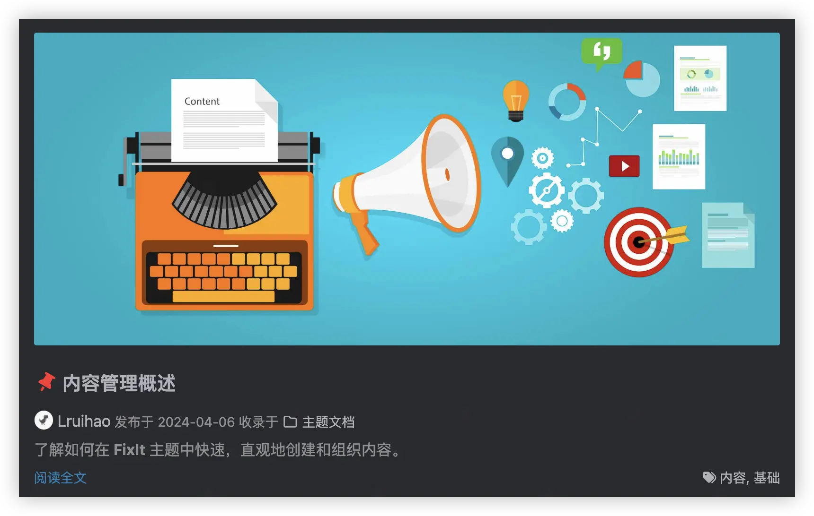

了解如何在 **FixIt** 主题中快速，直观地创建和组织内容。

<!--more-->

## 内容组织 {#contents-organization}

以下是一些方便你清晰管理和生成文章的目录结构建议：

- 保持博客文章存放在 `content/posts` 目录，例如：`content/posts/my-first-post.md`
- 保持简单的静态页面存放在 `content` 目录，例如：`content/about.md`
- 使用 `_index.md` 翻译列表页面标题等，例如：`content/posts/_index.md`
- 本地资源组织

有三种方法来引用 **图片** 和 **音乐** 等本地资源：

1. 使用 [捆绑页面 (Page bundles)][page-bundles] 中的 [页面资源][page-resources]。
   你可以使用适用于 `Resources.GetMatch` 的值或者直接使用相对于当前页面目录的文件路径来引用页面资源。
2. 将本地资源放在 **assets** 目录中，默认路径是 `/assets`。
   引用资源的文件路径是相对于 assets 目录的。
3. 将本地资源放在 **static** 目录中，默认路径是 `/static`。
   引用资源的文件路径是相对于 static 目录的。

引用的**优先级**符合以上的顺序。

> [!TIP]
> 推荐使用 **[CoverView][coverview]** 来为你的文章生成精美的封面图片。
>
> - ✨ **在线工具**：无需安装软件，在浏览器中即可使用
> - 🎨 **多种模板**：提供多种预设模板和自定义选项
> - 📐 **适配主题**：完美适配 FixIt 主题的设计风格
> - 🚀 **快速生成**：一键下载快速生成封面
>
> 项目地址：[Lruihao/CoverView][coverview-repo]

## 页面模板 {#templates}

一般情况，你不需要设置 **type** 或 **layout** 参数，因为 **Hugo** 和 **FixIt** 会帮你选择。但是一些特殊情况你需要明确指定模板。

### 其他目录的文章

有时候你可能需要把一些文章单独放在一个目录中，而不是 `content/posts` 目录。这时你需要在文章的 Front matter 中设置 `type: posts` 参数。

例如，把所有文档的文章放在 `content/documentation` 目录，这里面的文章都使用 `posts` 模板：

```markdown
---
title: 内容管理概述
date: 2024-04-06T12:57:26+08:00
type: posts
---
```

> [!TIP]
> 你可以在 `content/documentation/_index.md` 中设置 `cascade.params.type` 参数为 `posts`，这样 `content/documentation` 目录下的所有文章都会使用 `posts` 模板。
>
> ```markdown
> ---
> title: 主题文档
> cascade:
>   params:
>     type: posts
> ---
> ```

### 友情链接



在 Front matter 中设置 `layout: friends`，并在 `yourSite/data/` 目录下创建 `friends.yml`，其内容格式如下：

```yml
# 朋友/站点信息例子
- nickname: 朋友名字
  avatar: 朋友头像
  url: 站点链接
  description: 对朋友或其站点的说明
```

> [!TIP]-
> 你可以使用以下命令快速创建友情链接页面：
>
> ```bash
> hugo new content friends/index.md
> ```

### 搜索结果



详见 [CSE 支持][cse-support]。

### 项目页面

这是一个额外的主题组件，具体请查看 [hugo-fixit/component-projects]。

## Front matter {#front-matter}

这部分内容在 [Front matter][front-matter] 中介绍。

## 内容摘要

**FixIt** 主题使用内容摘要在主页中显示大致文章信息。Hugo 支持生成文章的摘要。



### 自动摘要拆分

默认情况下，Hugo 自动将内容的前 70 个单词作为摘要。

你可以通过在网站配置中设置 `summaryLength` 来自定义摘要长度。

如果你要使用 [CJK]^(中文/日语/韩语) 语言创建内容，并且想使用 Hugo 的自动摘要拆分功能，请在网站配置中将 `hasCJKLanguage` 设置为 `true`。

### 手动摘要拆分

另外，你也可以添加 `<!--more-->` 摘要分割符来拆分文章生成摘要。

摘要分隔符之前的内容将用作该文章的摘要。

> [!NOTE]
请小心输入 `<!--more-->`，即全部为小写且没有空格。

### Front matter 摘要

你可能希望摘要不是文章开头的文字。在这种情况下，你可以在文章 Front matter 的 `summary` 变量中设置单独的摘要。

### 使用文章描述作为摘要

你可能希望将文章 Front matter 中的 `description` 变量的内容作为摘要。

你仍然需要在文章开头添加 `<!--more-->` 摘要分割符。将摘要分隔符之前的内容保留为空。然后 **FixIt** 主题会将你的文章描述作为摘要。

### 比较

每种摘要类型都有不同的特点：

| 类型              | 优先级 | 渲染 Markdown | 渲染 Shortcodes | 使用 `<p>` 换行 |
| :---------------- | :----: | :-----------: | :-------------: | :-------------: |
| 手动摘要          | 1      | ✔️          | ✔️            | ✔️            |
| Front&nbsp;matter | 2      | ✔️          | ❌              | ❌              |
| 自动摘要          | 3      | ✔️          | ✔️            | ✔️            |

1. 如果文章中有 `<!--more-->` 摘要分隔符，但分隔符之前没有内容，则使用描述作为摘要。
2. 如果文章中有 `<!--more-->` 摘要分隔符，则将按照手动摘要拆分的方法获得摘要。
3. 如果文章 Front matter 中有摘要变量，那么将以该值作为摘要。
4. 按照自动摘要拆分方法。

> [!TIP]
> 如果你想要纯文本摘要，可以设置 `params.summary_plainify` 或者 Front matter `summary_plainify`。

## Markdown 语法

这部分内容在 [Markdown 基本语法页面][basic-markdown-syntax] 和 [Markdown 扩展语法页面][extended-markdown-syntax] 中介绍。

## Shortcodes

这部分内容在 [Shortcodes 页面][shortcodes] 中介绍。

## 内容加密 {#content-encryption}

这部分内容在 [内容加密页面][content-encryption] 中介绍。

## URL 管理 {#url-management}

**Hugo** 有一个强大的 URL 管理系统，详见 [Hugo URL 管理][hugo-url-management]。

## 多语言和 I18n {#multilingual}

**FixIt** 主题完全兼容 Hugo 的多语言模式，并且支持在网页上切换语言。


### 兼容性 {#language-compatibility}

| 语言         | Hugo 代码 | HTML `lang` 属性 | 主题文档                             |
| :----------- | :-------: | :--------------: | :----------------------------------: |
| 英语         | `en`      | `en`             | :(fa-regular fa-check-square fa-fw): |
| 简体中文     | `zh-cn`   | `zh-CN`          | :(fa-regular fa-check-square fa-fw): |
| 繁体中文     | `zh-tw`   | `zh-TW`          | :(fa-regular fa-square fa-fw):       |
| 法语         | `fr`      | `fr`             | :(fa-regular fa-square fa-fw):       |
| 波兰语       | `pl`      | `pl`             | :(fa-regular fa-square fa-fw):       |
| 巴西葡萄牙语 | `pt-br`   | `pt-BR`          | :(fa-regular fa-square fa-fw):       |
| 意大利语     | `it`      | `it`             | :(fa-regular fa-square fa-fw):       |
| 西班牙语     | `es`      | `es`             | :(fa-regular fa-square fa-fw):       |
| 德语         | `de`      | `de`             | :(fa-regular fa-square fa-fw):       |
| 塞尔维亚语   | `sr`      | `sr`             | :(fa-regular fa-square fa-fw):       |
| 俄语         | `ru`      | `ru`             | :(fa-regular fa-square fa-fw):       |
| 罗马尼亚语   | `ro`      | `ro`             | :(fa-regular fa-square fa-fw):       |
| 越南语       | `vi`      | `vi`             | :(fa-regular fa-square fa-fw):       |
| 印地语       | `hi`      | `hi`             | :(fa-regular fa-square fa-fw):       |
| 日语         | `ja`      | `ja`             | :(fa-regular fa-square fa-fw):       |
| 韩语         | `ko`      | `ko`             | :(fa-regular fa-square fa-fw):       |

### 基本配置

学习了 [Hugo 如何处理多语言网站][multilingual] 之后，请在站点配置中定义你的网站语言。

例如，一个支持英语，中文和法语的网站配置：

```toml
# [en, zh-cn, fr, pl, ...] 设置默认的语言
defaultContentLanguage = "zh-cn"

[languages]

[languages.en]
weight = 1
title = "My Hugo FixIt Site"
languageCode = "en"
languageName = "English"

[[languages.en.menu.main]]
identifier = "posts"
pre = ""
post = ""
name = "Posts"
url = "/posts/"
title = ""
weight = 1

[[languages.en.menu.main]]
identifier = "tags"
pre = ""
post = ""
name = "Tags"
url = "/tags/"
title = ""
weight = 2

[[languages.en.menu.main]]
identifier = "categories"
pre = ""
post = ""
name = "Categories"
url = "/categories/"
title = ""
weight = 3

[languages.zh-cn]
weight = 2
title = "我的 Hugo FixIt 网站"
# 网站语言，仅在这里 CN 大写
languageCode = "zh-CN"
languageName = "简体中文"
# 是否包括中日韩文字
hasCJKLanguage = true

[[languages.zh-cn.menu.main]]
identifier = "posts"
pre = ""
post = ""
name = "文章"
url = "/posts/"
title = ""
weight = 1

[[languages.zh-cn.menu.main]]
identifier = "tags"
pre = ""
post = ""
name = "标签"
url = "/tags/"
title = ""
weight = 2

[[languages.zh-cn.menu.main]]
identifier = "categories"
pre = ""
post = ""
name = "分类"
url = "/categories/"
title = ""
weight = 3

[languages.fr]
weight = 3
title = "Mon nouveau site Hugo FixIt"
languageCode = "fr"
languageName = "Français"

[[languages.fr.menu.main]]
identifier = "posts"
pre = ""
post = ""
name = "Postes"
url = "/posts/"
title = ""
weight = 1

[[languages.fr.menu.main]]
identifier = "tags"
pre = ""
post = ""
name = "Balises"
url = "/tags/"
title = ""
weight = 2

[[languages.fr.menu.main]]
identifier = "categories"
name = "Catégories"
pre = ""
post = ""
url = "/categories/"
title = ""
weight = 3
```

然后，对于每个新页面，将语言代码附加到文件名中。

单个文件 `my-page.md` 需要分为三个文件：

- 英语：`my-page.en.md`
- 中文：`my-page.zh-cn.md`
- 法语：`my-page.fr.md`

#### 修改默认的翻译字符串

翻译字符串用于在主题中使用的常见默认值。
目前提供 [一些语言](#language-compatibility) 的翻译，但你可能自定义其他语言或覆盖默认值。

要覆盖默认值，请在你项目的 `i18n` 目录中创建一个新文件 `i18n/<languageCode>.toml`，并从 `themes/FixIt/i18n/en.toml` 中获得提示。

另外，由于你的翻译可能会帮助到其他人，请花点时间通过 [创建一个 PR :(fa-solid fa-code-branch fa-fw):][pulls] 来贡献主题翻译，谢谢！

### 自动翻译

通过 [自动翻译][hugo-fixit/cmpt-translate] 组件，你只需少量的配置，就可以使单语言站点自动翻译为多种语言。


> [!TIP]
> 这是一个额外的主题组件，具体请查看 [hugo-fixit/cmpt-translate]。

<!-- link reference definition -->
<!-- markdownlint-disable-file MD052 MD060 -->
[page-resources]: https://gohugo.io/content-management/page-resources/
[page-bundles]: https://gohugo.io/content-management/page-bundles/
[coverview]: https://coverview.lruihao.cn/
[coverview-repo]: https://github.com/Lruihao/CoverView
[front-matter]: 
[cse-support]: 
[hugo-fixit/component-projects]: /zh-cn/ecosystem/hugo-fixit/component-projects/
[content-encryption]: 
[hugo-url-management]: https://gohugo.io/content-management/urls/
[basic-markdown-syntax]: 
[extended-markdown-syntax]: 
[shortcodes]: 
[multilingual]: https://gohugo.io/content-management/multilingual
[pulls]: https://github.com/hugo-fixit/FixIt/pulls
[hugo-fixit/cmpt-translate]: /zh-cn/ecosystem/hugo-fixit/cmpt-translate/
