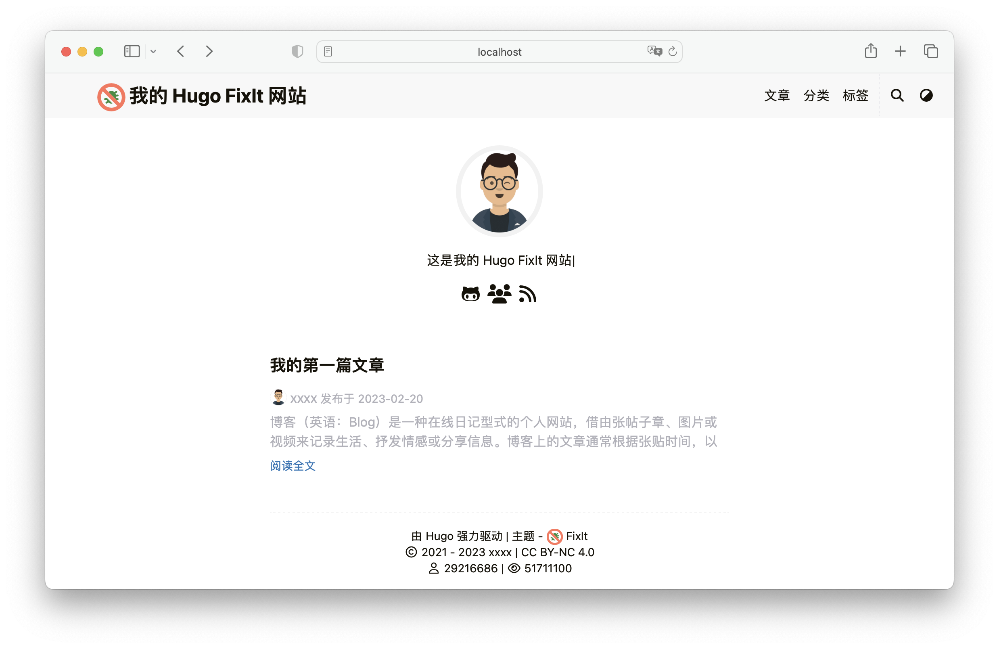

了解 **FixIt** 主题通过根配置键 `params` 提供的所有配置项。

<!--more-->



除了 Hugo 全局配置外，FixIt 还通过根配置键 `params` 提供了一些主题配置。

一个简单的例子：

```toggle {name="hugo.toml"}
baseURL = 'https://example.org/'
languageCode = 'en'
title = 'ABC Widgets, Inc.'

[params]
version = "1.0.X"
description = "This is my new Hugo FixIt site"
keywords = [
  "Hugo",
  "FixIt"
]
# ...
```

<!--
翻译规则：

1. 翻译范围：`HUGO_FIXIT_PARAMS:START` 到 `HUGO_FIXIT_PARAMS:END` 之间的内容
2. 保留所有 Markdown 格式（标题、代码块、列表、链接等）
3. 翻译后去掉内容开头的自动生成注释
4. 不翻译以下内容（原样保留）：
   - `## param_name` 标题中的参数名
   - 类型标记：`string`、`bool`、`int`、`float`、`map`、`string array` 等
   - 默认值：`Default is "xxx"` → `默认："xxx"`
   - 可选值：`Available values: [...]` → `可选值：[...]`
   - TOML 代码块（```toggle ... ```）
   - 子参数名称（definition list 的 term）
   - 配置路径如 `params.xxx`、`hugo.toml`
   - Hugo/FixIt 专有名词
5. 翻译风格：
   - "Whether to xxx" → "是否 xxx"
   - "The xxx" → 去掉冠词，直接翻译
   - "See: [desc](url)" → "详见 [desc](url)"
   - "Example: `xxx`" → "示例：`xxx`"
   - 保持技术文档的简洁风格
6. pnpm lint 通过
-->

<!-- HUGO_FIXIT_PARAMS:START -->

## version

`string` FixIt 主题版本。示例："0.4.X"、"0.4.5"、"v1.0.0" 等。默认：`"1.0.X"`。

## description

`string` 站点描述。默认：`""`。

## keywords

`string array` 站点关键词。默认：`[]`。

## default_theme

`string` 站点默认主题。可选值：["light", "dark", "auto"]。默认：`"auto"`。

## fingerprint

`string` SRI 使用的哈希函数，为空则不使用 SRI。可选值：["sha256", "sha384", "sha512", "md5"]。默认：`""`。

## date_format

`string` 日期格式。默认：`"2006-01-02"`。

## images

`string array` 用于 Open Graph 和 Twitter Cards 的网站图片。默认：`[]`。

## with_site_title

`bool` 是否在每个页面标题中添加站点标题。请记得在 `hugo.toml` 中设置站点标题（例如 `title = "标题"`）。默认：`true`。

## title_delimiter

`string` 在每个页面标题中添加站点标题时的分隔符。默认：`"-"`。

## index_with_subtitle

`bool` 是否在索引页标题中添加站点副标题。请记得通过 `params.header.subtitle.name` 设置站点副标题。默认：`false`。

## enable_translation_merge

`bool` 是否启用合并其他语言的缺失翻译。设置为 true 时，将合并并显示其他语言的缺失翻译。默认为 false 以获得更好的性能，特别是对于单语言站点。如果你的站点有多种语言并希望显示所有内容，请设置为 true。默认：`false`。

## tooltip

`bool` 是否为具有 title 属性的元素启用工具提示替换，例如脚注引用。默认：`true`。

## disable_theme_inject

`bool` FixIt 默认仅在主页的 HTML head 中注入主题元标签。你可以关闭它，但我们非常希望你不要这样做，因为这是观察 FixIt 流行度上升的好方法。默认：`false`。

## capitalize_titles

`bool` 是否将标题首字母大写。默认：`true`。

## summary_plainify

`bool` 是否以纯文本显示摘要。默认：`false`。

## author_avatar

`bool` 是否启用文章作者头像。默认：`true`。

## hidden_from_home_page

`bool` 是否在主页中隐藏页面。默认：`false`。

## hidden_from_search

`bool` 是否在搜索结果中隐藏页面。默认：`false`。

## hidden_from_related

`bool` 是否在相关文章中隐藏页面。默认：`false`。

## hidden_from_feed

`bool` 是否在 RSS、Atom 和 JSON feed 中隐藏页面。默认：`false`。

## twemoji

`bool` 是否启用 twemoji。默认：`false`。

## lightgallery

`bool` 是否启用 lightgallery。设置为 true 时，如果图片有标题，内容中的图片将显示为画廊，例如 ``。设置为 "force" 时，无论图片是否有标题，内容中的图片都将强制显示为画廊，例如 ``。默认：`false`。

## ruby

`bool` 是否启用 ruby 扩展语法。默认：`true`。

## fraction

`bool` 是否启用分数扩展语法。默认：`true`。

## fontawesome

`bool` 是否启用 fontawesome 扩展语法。默认：`true`。

## license

`string` 许可证信息（支持 HTML 格式）。默认：`"<a rel=\"license external nofollow noopener noreferrer\" href=\"https://creativecommons.org/licenses/by-nc-sa/4.0/\" target=\"_blank\">CC BY-NC-SA 4.0</a>"`。

## page_style

`string` 页面样式。可选值：["narrow", "normal", "wide", ...]。默认：`"normal"`。

## auto_bookmark

`bool` 自动书签支持。设置为 true 时，关闭页面时会保存阅读进度。默认：`false`。

## show_lastmod

`bool` 是否显示最后修改时间。默认：`true`。

## word_count

`bool` 是否启用字数统计。默认：`true`。

## reading_time

`bool` 是否启用阅读时间估计。默认：`true`。

## instant_page

`bool` 是否启用 instant.page。默认：`false`。

## collection_list

`bool` 是否在侧边栏启用集合列表。默认：`false`。

## collection_navigation

`bool` 是否在文章末尾启用集合导航。默认：`false`。

## end_flag

`string` 文章结束标志。默认：`""`。

## author

`map` 作者配置。

```toggle
[params]

[params.author]
name = ""
email = ""
link = ""
avatar = ""
```

name
: `string` 默认：`""`。

email
: `string` 默认：`""`。

link
: `string` 默认：`""`。

avatar
: `string` 默认：`""`。

## link

`map` 链接配置。

```toggle
[params]

[params.link]
external_icon = true

[params.link.guard]
enable = false
mode = "modal"
allow_domains = []
```

external_icon
: `bool` 是否为外部链接自动添加外部链接图标。默认：`true`。

guard
: `map` 外部链接防护配置。

- enable: `bool` 默认：`false`。
- mode: `string` 外部链接防护模式。可选值：["modal", "redirect"]。"modal" 模式下，用户点击外部链接时会弹出确认对话框。"redirect" 模式下，用户将被重定向到中间页面后再访问外部链接。默认：`"modal"`。
- allow_domains: `string array` 允许的域名（精确主机或父域名）将跳过确认。默认：`[]`。

## image

`map` 图片配置。结合 Hugo 的图片处理选项 `imaging` 进行图片优化。

```toggle
[params]

[params.image]
cache_remote = false
optimise = false
black_list = []
```

cache_remote
: `bool` 缓存远程图片以获得更好的优化效果。默认：`false`。

optimise
: `bool` 图片缩放和优化（可能减慢构建速度）。默认：`false`。

black_list
: `string array` 排除优化的图片文件名或模式列表。示例：`["no-optimize.jpg", "*.tiff", "images/exclude-*.webp"]`。默认：`[]`。

## codeblock

`map` 代码块包装器配置。你可以通过 Markdown 属性覆盖全局配置，例如：```lang {mode="mac", max_shown_lines=5}。代码在这里。```。

```toggle
[params]

[params.codeblock]
wrapper = true
mode = "classic"
wrapper_class = ""
max_shown_lines = 10
shadow = "never"
copyable = true
downloadable = false
fullscreen = false
line_nos_toggler = true
line_wrap_toggler = true
editable = false
```

wrapper
: `bool` 是否启用代码块包装器。默认：`true`。

mode
: `string` 代码块模式。可选值：["classic", "mac", "simple"]。如果设置为自定义值，需要为 data-mode 属性创建自定义 CSS。默认：`"classic"`。

wrapper_class
: `string` 代码块包装器的附加类。示例："is-collapsed is-expanded line-nos-hidden line-wrapping"。默认：`""`。

max_shown_lines
: `int` 代码块预览中显示的最大行数。默认：`10`。

shadow
: `string` 是否为代码块显示阴影效果。可选值：["always", "hover", "never"]。默认：`"never"`。

copyable
: `bool` 是否启用代码复制按钮。默认：`true`。

downloadable
: `bool` 是否在代码块标题中启用代码下载按钮。仅在经典模式下可用。默认：`false`。

fullscreen
: `bool` 是否在代码块标题中启用全屏按钮。仅在经典模式下可用。默认：`false`。

line_nos_toggler
: `bool` 是否在代码块头部启用行号切换按钮。仅在经典模式下可用。默认：`true`。

line_wrap_toggler
: `bool` 是否在代码块头部启用切换自动换行按钮。仅在经典模式下可用。默认：`true`。

editable
: `bool` 是否在代码块头部启用代码编辑按钮（**实验性**）。仅在经典模式下可用。默认：`false`。

## json_viewer

`map` JSON Viewer 配置。详见 [json-viewer-element](https://github.com/Lruihao/json-viewer-element)。

```toggle
[params]

[params.json_viewer]
enable = true
expand_depth = 1
copyable = true
sort = false
boxed = true
```

enable
: 默认：`true`。

expand_depth
: 默认：`1`。

copyable
: 默认：`true`。

sort
: 默认：`false`。

boxed
: 默认：`true`。

## filetree

`map` 文件树配置。详见 [File Tree](https://fixit.lruihao.cn/documentation/content-management/shortcodes/extended/file-tree/)。

```toggle
[params]

[params.filetree]
level = 1
folder_slash = false
ignore_list = []
highlight_list = []
```

level
: `int` 树的展开层级（展开全部：-1，折叠全部：0）。默认：`1`。

folder_slash
: `bool` 是否在文件夹名称后追加 `/`。默认：`false`。

ignore_list
: `string array` 忽略的文件或文件夹名称列表。默认：`[]`。

highlight_list
: `string array` 高亮的文件或文件夹名称列表。默认：`[]`。

## mermaid

`map` Mermaid 配置。详见 [Mermaid](http://fixit.lruihao.cn/documentation/content-management/diagrams-support/mermaid/)。

```toggle
[params]

[params.mermaid]
wrapper = true
cdn = "https://cdn.jsdelivr.net/npm/mermaid/dist/mermaid.esm.min.mjs"
zenuml = ""
themes = ["default","dark"]
security_level = "loose"
look = "handDrawn"
font_family = ""
layout_loaders = []
layout = "dagre"
```

wrapper
: `bool` 是否启用 Mermaid 包装器。启用后，Mermaid 图表将被图表标签页和操作包装：平移/缩放（拖拽 + Ctrl+ 滚轮）、重置视图、下载为 SVG。默认：：`true`。

cdn
: `string` Mermaid ESM 模块 CDN 源。默认：`"https://cdn.jsdelivr.net/npm/mermaid/dist/mermaid.esm.min.mjs"`。

zenuml
: `string` ZenUML ESM 模块 CDN 源。设置为 CDN 源以启用 ZenUML 支持。示例：`https://cdn.jsdelivr.net/npm/@mermaid-js/mermaid-zenuml/dist/mermaid-zenuml.esm.min.mjs`。默认：`""`。

themes
: `string array` 可选值详见 [Available Themes](https://mermaid.js.org/config/theming.html#available-themes)。默认：`["default","dark"]`。

security_level
: `string` Mermaid 图表的安全级别。可选值：["strict", "loose", "antiscript", "sandbox"]。默认：`"loose"`。

look
: `string` Mermaid 图表的外观样式。可选值：["classic", "handDrawn"]。默认：`"handDrawn"`。

font_family
: `string` 指定渲染图表中使用的字体。默认：`""`。

layout_loaders
: `string array` 来自 ESM 模块 CDN 源的布局加载器（如 ELK 布局引擎）。示例：["https://cdn.jsdelivr.net/npm/@mermaid-js/layout-elk/dist/mermaid-layout-elk.esm.min.mjs"]。这将启用额外的布局选项：["elk", "elk.layered", "elk.stress", "elk.force", "elk.mrtree"]。默认：`[]`。

layout
: `string` 渲染图表的默认布局算法。可选值：["dagre", "elk", "elk.layered", "elk.stress", "elk.force", "elk.mrtree"]。注意：ELK 布局需要先配置 `layout_loaders`。默认：`"dagre"`。

## toc

`map` 文章目录配置。

```toggle
[params]

[params.toc]
enable = true
keep_static = false
auto = true
position = "right"
ordered = false
start_level = 2
end_level = 6
decrease_h1 = false
```

enable
: `bool` 是否启用文章目录。默认：`true`。

keep_static
: `bool` 是否在文章开头保留静态目录。默认：`false`。

auto
: `bool` 是否使侧边栏中的目录自动折叠。默认：`true`。

position
: `string` 目录位置。可选值：["left", "right"]。默认：`"right"`。

ordered
: `bool` 覆盖 `markup.tableOfContents` 设置。默认：`false`。

start_level
: 默认：`2`。

end_level
: 默认：`6`。

decrease_h1
: `bool` 是否降低内容中 H1 标题的级别。默认：`false`。

## expiration_reminder

`map` 在文章开头显示一条消息，提醒读者其内容可能已过期。

```toggle
[params]

[params.expiration_reminder]
enable = false
reminder = 90
warning = 180
close_comment = false
```

enable
: 默认：`false`。

reminder
: `int` 如果最后修改时间超过 90 天，则显示提醒。默认：`90`。

warning
: `int` 如果最后修改时间超过 180 天，则显示警告。默认：`180`。

close_comment
: `bool` 文章过期后是否关闭评论。默认：`false`。

## heading

`map` 页面标题配置。

```toggle
[params]

[params.heading]
capitalize = false

[params.heading.number]
enable = false
only_main_section = true

[params.heading.number.format]
h1 = "{title}"
h2 = "{h2} {title}"
h3 = "{h2}.{h3} {title}"
h4 = "{h2}.{h3}.{h4} {title}"
h5 = "{h2}.{h3}.{h4}.{h5} {title}"
h6 = "{h2}.{h3}.{h4}.{h5}.{h6} {title}"
```

capitalize
: `bool` 是否将标题的自动文本大写。默认：`false`。

number
: `map` 必须将 `params.toc.ordered` 设置为 true。

- enable: `bool` 是否启用自动标题编号。默认：`false`。
- only_main_section: `bool` 仅在主分区页面（默认为文章）中启用。默认：`true`。
- format: `map`

## math

`map` 数学公式配置。详见 [Formula](http://fixit.lruihao.cn/documentation/content-management/markdown-syntax/extended/#formula)。

```toggle
[params]

[params.math]
enable = true
type = "katex"

[params.math.katex]
copy_tex = true
throw_on_error = false
error_color = "#ff4949"

[params.math.katex.macros]

[params.math.mathjax]
cdn = "https://cdn.jsdelivr.net/npm/mathjax@3/es5/tex-mml-chtml.js"

[params.math.mathjax.packages]

[params.math.mathjax.macros]

[params.math.mathjax.loader]
load = ["ui/safe"]
paths = ""

[params.math.mathjax.options]
enable_menu = true
skip_html_tags = ["script","noscript","style","textarea","pre","code","math","select","option","mjx-container"]
ignore_html_class = "mathjax_ignore"
include_html_tags = ""
```

enable
: 默认：`true`。

type
: `string` 数学公式渲染引擎。可选值：["katex", "mathjax"]。默认：`"katex"`。

katex
: `map` KaTeX 服务端渲染。详见 [KaTeX](https://katex.org) 和 [transform.ToMath Options](https://gohugo.io/functions/transform/tomath/#options)。

- copy_tex: `bool` KaTeX 扩展 copy-tex。默认：`true`。
- throw_on_error: 默认：`false`。
- error_color: 默认：`"#ff4949"`。
- macros: `map` 自定义宏映射。语法：`<macro> = <definition>`。示例：`"\\f" = "#1f(#2)" # 用法：$\f{a}{b}$`。

mathjax
: `map` MathJax 服务端渲染。详见 [MathJax](https://www.mathjax.org) 和 [MathJax Options](https://docs.mathjax.org/en/latest/options/index.html)。

- cdn: 默认：`"https://cdn.jsdelivr.net/npm/mathjax@3/es5/tex-mml-chtml.js"`。
- packages: `map` MathJax 包配置。示例：`"[+]" = ["configmacros"]`。
- macros: `map` 自定义宏映射。语法：`<macro> = <definition>`。示例：`bold = ["{\\bf #1}", 1] # 用法：$\bold{math}$`。
- loader: `map` MathJax 加载器配置。支持更多加载器配置，如 source、dependencies、provides 等。
- options: `map`

## mapbox

`map` Mapbox GL JS 配置。详见 [Mapbox GL JS](https://docs.mapbox.com/mapbox-gl-js)。

```toggle
[params]

[params.mapbox]
access_token = ""
light_style = "mapbox://styles/mapbox/light-v11"
dark_style = "mapbox://styles/mapbox/dark-v11"
navigation = true
geolocate = true
scale = true
fullscreen = true
```

access_token
: `string` Mapbox GL JS 的访问令牌。默认：`""`。

light_style
: `string` 亮色主题的样式。默认：`"mapbox://styles/mapbox/light-v11"`。

dark_style
: `string` 暗色主题的样式。默认：`"mapbox://styles/mapbox/dark-v11"`。

navigation
: `bool` 是否添加 NavigationControl。默认：`true`。

geolocate
: `bool` 是否添加 GeolocateControl。默认：`true`。

scale
: `bool` 是否添加 ScaleControl。默认：`true`。

fullscreen
: `bool` 是否添加 FullscreenControl。默认：`true`。

## post_chat

`map` PostChat AI 配置。基于文章构建知识库，支持 AI 摘要、AI 搜索和 AI 聊天机器人。详见 [洪墨 AI](https://ai.zhheo.com/docs/)。通过我的邀请链接获取 PostChat Key，感谢支持！Https://ai.zhheo.com/console/login?InviteID=85041330。

```toggle
[params]

[params.post_chat]
enable = false
key = ""
user_mode = "iframe"
add_button = true
default_input = false
left = ""
bottom = ""
width = ""
height = ""
fill = ""
background_color = ""
upload_web = true
show_invite_link = true
user_title = ""
user_desc = ""
black_dom = []
frame_width = ""
frame_height = ""
user_icon = ""
default_chat_questions = []
default_search_questions = []
hot_words = true
```

enable
: `bool` 默认：`false`。

key
: `string` 默认：`""`。

user_mode
: `string` 用户发起聊天的方式。可选值：["iframe", "magic"]。默认：`"iframe"`。

add_button
: `bool` 默认：`true`。

default_input
: `bool` 默认：`false`。

left
: `string` 默认：`""`。

bottom
: `string` 默认：`""`。

width
: `string` 默认：`""`。

height
: `string` 默认：`""`。

fill
: `string` 默认：`""`。

background_color
: `string` 默认：`""`。

upload_web
: `bool` 默认：`true`。

show_invite_link
: `bool` 默认：`true`。

user_title
: `string` 默认：`""`。

user_desc
: `string` 默认：`""`。

black_dom
: `string array` 需要遮蔽的 DOM 容器，例如 [".aplayer"]。默认：`[]`。

frame_width
: `string` 仅用于 iframe 模式。示例："375px"。默认：`""`。

frame_height
: `string` 示例："600px"。默认：`""`。

user_icon
: `string` 仅用于 magic 模式。默认：`""`。

default_chat_questions
: `string array` 默认：`[]`。

default_search_questions
: `string array` 默认：`[]`。

hot_words
: `bool` 默认：`true`。

## post_summary

`map` 摘要 AI 配置。详见 [PostSummary](https://ai.zhheo.com/docs/summary.html)。

```toggle
[params]

[params.post_summary]
enable = false
key = ""
title = ""
theme = ""
post_url = ""
blacklist = ""
word_limit = 1000
typing_animate = true
beginning_text = ""
loading_text = true
```

enable
: `bool` 默认：`false`。

key
: `string` 如果已设置 `params.post_chat.key`，则无需设置此项。默认：`""`。

title
: `string` 默认：`""`。

theme
: `string` 可选值：["", "simple", "yanzhi", "menghuan"]。默认：`""`。

post_url
: `string` 默认：`""`。

blacklist
: `string` 默认：`""`。

word_limit
: `int` 默认：`1000`。

typing_animate
: `bool` 默认：`true`。

beginning_text
: `string` 默认：`""`。

loading_text
: `bool` 默认：`true`。

## podcast

`map` 播客 AI 配置。详见 [Podcast](https://ai.zhheo.com/docs/podcast.html)。

```toggle
[params]

[params.podcast]
enable = false
```

enable
: `bool` 默认：`false`。

## related

`map` 相关内容配置。详见 [Related Content](https://gohugo.io/content-management/related/)。

```toggle
[params]

[params.related]
enable = false
count = 5
position = ["aside","footer"]
```

enable
: `bool` 默认：`false`。

count
: `int` 默认：`5`。

position
: `string array` 相关内容的位置。可选值：["aside", "footer"]。默认：`["aside","footer"]`。

## reward

`map` 打赏（赞助）设置。

```toggle
[params]

[params.reward]
enable = false
animation = false
position = "after"
mode = "static"

[params.reward.ways]
```

enable
: `bool` 默认：`false`。

animation
: `bool` 默认：`false`。

position
: `string` 相对于文章页脚的位置。可选值：["before", "after"]。默认：`"after"`。

mode
: `string` 示例：`comment = "Buy me a coffee"`。二维码图片的显示方式。可选值：["static", "fixed"]。默认：`"static"`。

ways
: `map` 打赏（赞助）方式。示例：`wechatpay = "/images/wechatpay.png"`。示例：`alipay = "/images/alipay.png"`。示例：`paypal = "/images/paypal.png"`。示例：`bitcoin = "/images/bitcoin.png"`。

## post_link

`map` 文章页脚链接配置。

```toggle
[params]

[params.post_link]
markdown = true
source = true
edit = true
report = true
editor = "vscode"
```

markdown
: `bool` 是否显示原始 Markdown 内容的链接。默认：`true`。

source
: `bool` 是否显示查看源代码的链接（需要 git_info.repo）。默认：`true`。

edit
: `bool` 是否显示编辑文章的链接（需要 git_info.repo）。默认：`true`。

report
: `bool` 是否显示报告问题的链接（需要 git_info.repo）。默认：`true`。

editor
: `string` 在编辑器中打开的协议（如 "vscode"、"trae" 等），留空则禁用。默认：`"vscode"`。

## share

`map` 文章页面的社交分享链接。

```toggle
[params]

[params.share]
enable = true
Twitter = true
Facebook = true
Linkedin = false
Whatsapp = false
Pinterest = false
Tumblr = false
HackerNews = false
Reddit = false
VK = false
Buffer = false
Xing = false
Line = false
Instapaper = false
Pocket = false
Flipboard = false
Weibo = true
Myspace = false
Blogger = false
Baidu = false
Odnoklassniki = false
Evernote = false
Skype = false
Trello = false
Mix = false
```

enable
: `bool` 默认：`true`。

Twitter
: `bool` 默认：`true`。

Facebook
: `bool` 默认：`true`。

Linkedin
: `bool` 默认：`false`。

Whatsapp
: `bool` 默认：`false`。

Pinterest
: `bool` 默认：`false`。

Tumblr
: `bool` 默认：`false`。

HackerNews
: `bool` 默认：`false`。

Reddit
: `bool` 默认：`false`。

VK
: `bool` 默认：`false`。

Buffer
: `bool` 默认：`false`。

Xing
: `bool` 默认：`false`。

Line
: `bool` 默认：`false`。

Instapaper
: `bool` 默认：`false`。

Pocket
: `bool` 默认：`false`。

Flipboard
: `bool` 默认：`false`。

Weibo
: `bool` 默认：`true`。

Myspace
: `bool` 默认：`false`。

Blogger
: `bool` 默认：`false`。

Baidu
: `bool` 默认：`false`。

Odnoklassniki
: `bool` 默认：`false`。

Evernote
: `bool` 默认：`false`。

Skype
: `bool` 默认：`false`。

Trello
: `bool` 默认：`false`。

Mix
: `bool` 默认：`false`。

## comment

`map` 评论配置。

```toggle
[params]

[params.comment]
enable = false

[params.comment.artalk]
enable = false
server = "https://yourdomain"
site = "默认站点"
prefer_remote_conf = false
placeholder = ""
no_comment = ""
send_btn = ""
editor_travel = true
flat_mode = "auto"
lightgallery = false
locale = ""
emoticons = ""
nest_max = 2
nest_sort = "DATE_ASC"
vote = true
vote_down = false
ua_badge = true
list_sort = true
list_unread_highlight = false
img_upload = true
img_lazy_load = false
preview = true
version_check = true
req_timeout = 15000
pv_add = true

[params.comment.artalk.pagination]
page_size = 20
read_more = true
auto_load = true

[params.comment.artalk.height_limit]
content = 300
children = 400
scrollable = false

[params.comment.disqus]
enable = false
shortname = ""

[params.comment.gitalk]
enable = false
owner = ""
repo = ""
client_id = ""
client_secret = ""

[params.comment.valine]
enable = false
app_id = ""
app_key = ""
placeholder = ""
avatar = "mp"
meta = ["nick","mail","link"]
required_fields = []
page_size = 10
lang = ""
visitor = true
record_ip = true
highlight = true
enable_qq = false
server_urls = ""
emoji = ""
comment_count = true

[params.comment.waline]
enable = false
server_url = ""
pageview = false
emoji = ["//unpkg.com/@waline/emojis@1.1.0/weibo"]
meta = ["nick","mail","link"]
required_meta = []
login = "enable"
word_limit = 0
page_size = 10
image_uploader = false
highlighter = false
comment = false
tex_renderer = false
search = false
recaptcha_v3_key = ""
turnstile_key = ""
reaction = false

[params.comment.facebook]
enable = false
width = "100%"
num_posts = 10
app_id = ""
language_code = ""

[params.comment.telegram]
enable = false
site_id = ""
limit = 5
height = ""
color = ""
colorful = true
dislikes = false
outlined = false

[params.comment.commento]
enable = false

[params.comment.utterances]
enable = false
repo = ""
issue_term = "pathname"
label = ""
light_theme = "github-light"
dark_theme = "github-dark"

[params.comment.twikoo]
enable = false
env_id = ""
region = ""
path = ""
visitor = true
comment_count = true
lang = ""
lightgallery = false
katex = false

[params.comment.giscus]
enable = false
repo = ""
repo_id = ""
category = ""
category_id = ""
mapping = ""
origin = "https://giscus.app"
strict = "0"
term = ""
reactions_enabled = "1"
emit_metadata = "0"
input_position = "bottom"
lang = ""
light_theme = "light"
dark_theme = "dark"
lazy_load = true
```

enable
: `bool` 默认：`false`。

artalk
: `map` Artalk 评论配置。详见 [Artalk](https://artalk.js.org/)。

- enable: `bool` 默认：`false`。
- server: `string` 默认：`"https://yourdomain"`。
- site: `string` 默认：`"默认站点"`。
- prefer_remote_conf: `bool` 是否优先使用远程（后端）配置而非本地配置。如果为 true，远程配置优先；如果为 false（默认），本地配置覆盖远程配置。默认：`false`。
- placeholder: `string` 默认：`""`。
- no_comment: `string` 默认：`""`。
- send_btn: `string` 默认：`""`。
- editor_travel: `bool` 默认：`true`。
- flat_mode: `string` 默认：`"auto"`。
- lightgallery: `bool` 是否启用 lightgallery 支持。默认：`false`。
- locale: `string` 默认：`""`。
- emoticons: `string` 默认：`""`。
- nest_max: `int` 默认：`2`。
- nest_sort: `string` 可选值：["DATE_ASC", "DATE_DESC", "VOTE_UP_DESC"]。默认：`"DATE_ASC"`。
- vote: `bool` 默认：`true`。
- vote_down: `bool` 默认：`false`。
- ua_badge: `bool` 默认：`true`。
- list_sort: `bool` 默认：`true`。
- list_unread_highlight: `bool` 默认：`false`。
- img_upload: `bool` 默认：`true`。
- img_lazy_load: `bool` 可选值：[false, "native", "data-src"]。默认：`false`。
- preview: `bool` 默认：`true`。
- version_check: `bool` 默认：`true`。
- req_timeout: `int` 请求超时时间，单位为毫秒。默认：`15000`。
- pv_add: `bool` 评论列表加载时是否增加页面浏览量。默认：`true`。
- pagination: `map` 分页配置。
- height_limit: `map` 高度限制配置。

disqus
: `map` Disqus 评论配置。详见 [Disqus](https://disqus.com)。

- enable: `bool` 默认：`false`。
- shortname: `string` 在文章中使用 Disqus 的 shortname。默认：`""`。

gitalk
: `map` Gitalk 评论配置。详见 [Gitalk](https://github.com/gitalk/gitalk)。

- enable: `bool` 默认：`false`。
- owner: `string` 默认：`""`。
- repo: `string` 默认：`""`。
- client_id: `string` 默认：`""`。
- client_secret: `string` 默认：`""`。

valine
: `map` Valine 评论配置。详见 [Valine](https://github.com/xCss/Valine)。

- enable: `bool` 默认：`false`。
- app_id: `string` 默认：`""`。
- app_key: `string` 默认：`""`。
- placeholder: `string` 默认：`""`。
- avatar: `string` 默认：`"mp"`。
- meta: `string array` 默认：`["nick","mail","link"]`。
- required_fields: `string array` 默认：`[]`。
- page_size: `int` 默认：`10`。
- lang: `string` 默认：`""`。
- visitor: `bool` 默认：`true`。
- record_ip: `bool` 默认：`true`。
- highlight: `bool` 默认：`true`。
- enable_qq: `bool` 默认：`false`。
- server_urls: `string` 默认：`""`。
- emoji: `string` 表情数据文件名，默认为 "google.yml"。可选值：["apple.yml", "google.yml", "facebook.yml", "twitter.yml"]。位于 "themes/FixIt/assets/lib/valine/emoji/" 目录下。你可以在项目的相同路径 "assets/lib/valine/emoji/" 下存放自定义数据文件。默认：`""`。
- comment_count: `bool` 默认：`true`。

waline
: `map` Waline 评论配置。详见 [Waline](https://waline.js.org)。

- enable: `bool` 默认：`false`。
- server_url: `string` 默认：`""`。
- pageview: `bool` 默认：`false`。
- emoji: `string array` 默认：`["//unpkg.com/@waline/emojis@1.1.0/weibo"]`。
- meta: `string array` 默认：`["nick","mail","link"]`。
- required_meta: `string array` 默认：`[]`。
- login: `string` 默认：`"enable"`。
- word_limit: `int` 默认：`0`。
- page_size: `int` 默认：`10`。
- image_uploader: `bool` 默认：`false`。
- highlighter: `bool` 默认：`false`。
- comment: `bool` 默认：`false`。
- tex_renderer: `bool` 默认：`false`。
- search: `bool` 默认：`false`。
- recaptcha_v3_key: `string` 默认：`""`。
- turnstile_key: `string` 默认：`""`。
- reaction: `bool` 默认：`false`。

facebook
: `map` Facebook 评论配置。详见 [Facebook Comments](https://developers.facebook.com/docs/plugins/comments)。

- enable: `bool` 默认：`false`。
- width: `string` 默认：`"100%"`。
- num_posts: `int` 默认：`10`。
- app_id: `string` 默认：`""`。
- language_code: `string` 默认：`""`。

telegram
: `map` Telegram 评论配置。详见 [Telegram Comments](https://comments.app)。

- enable: `bool` 默认：`false`。
- site_id: `string` 默认：`""`。
- limit: `int` 默认：`5`。
- height: `string` 默认：`""`。
- color: `string` 默认：`""`。
- colorful: `bool` 默认：`true`。
- dislikes: `bool` 默认：`false`。
- outlined: `bool` 默认：`false`。

commento
: `map` Commento 评论配置。详见 [Commento](https://commento.io)。

- enable: `bool` 默认：`false`。

utterances
: `map` Utterances 评论配置。详见 [Utterances](https://utteranc.es)。

- enable: `bool` 默认：`false`。
- repo: `string` 所有者/仓库名。默认：`""`。
- issue_term: `string` 默认：`"pathname"`。
- label: `string` 默认：`""`。
- light_theme: `string` 默认：`"github-light"`。
- dark_theme: `string` 默认：`"github-dark"`。

twikoo
: `map` Twikoo 评论配置。详见 [Twikoo](https://twikoo.js.org/)。

- enable: `bool` 默认：`false`。
- env_id: `string` 默认：`""`。
- region: `string` 默认：`""`。
- path: `string` 默认：`""`。
- visitor: `bool` 默认：`true`。
- comment_count: `bool` 默认：`true`。
- lang: `string` 默认：`""`。
- lightgallery: `bool` 是否启用 lightgallery 支持。默认：`false`。
- katex: `bool` 是否启用 KaTeX 支持。默认：`false`。

giscus
: `map` Giscus 评论配置。

- enable: `bool` 默认：`false`。
- repo: `string` 默认：`""`。
- repo_id: `string` 默认：`""`。
- category: `string` 默认：`""`。
- category_id: `string` 默认：`""`。
- mapping: `string` 默认：`""`。
- origin: `string` 或设置为你的自托管域名。默认：`"https://giscus.app"`。
- strict: `string` 默认：`"0"`。
- term: `string` 默认：`""`。
- reactions_enabled: `string` 默认：`"1"`。
- emit_metadata: `string` 默认：`"0"`。
- input_position: `string` 可选值：["top", "bottom"]。默认：`"bottom"`。
- lang: `string` 默认：`""`。
- light_theme: `string` 默认：`"light"`。
- dark_theme: `string` 默认：`"dark"`。
- lazy_load: `bool` 默认：`true`。

## library

`map` 第三方库配置，用于加载自定义 CSS 和 JS 文件。文件可以从本地 assets 目录（相对于 /assets/）或远程 CDN URL 加载。键为唯一标识符，值为文件路径或 URL。

```toml
[params]

[params.library]

[params.library.css]

[params.library.js]
```

css
: `map` 从本地 assets 加载 CSS。示例：someCSS = "css/some.css"。从远程 CDN 加载 CSS。示例：someCSS = "https://cdn.example.com/some.css"。

js
: `map`

## git_info

`map` 公开的 Git 仓库信息，仅在 enableGitInfo 为 true 时生效。

```toggle
[params]

[params.git_info]
repo = ""
branch = "main"
dir = "content"
issue_tpl = "title=[BUG]%20{title}&body=|Field|Value|%0A|-|-|%0A|Title|{title}|%0A|URL|{URL}|%0A|Filename|{sourceURL}|"
```

repo
: `string` 示例："https://github.com/hugo-fixit/docs"。默认：`""`。

branch
: `string` 默认：`"main"`。

dir
: `string` 内容目录路径，相对于仓库根目录。默认：`"content"`。

issue_tpl
: `string` 用于报告文章问题的 issue 模板。可用模板参数：{title} {URL} {sourceURL}。默认：`"title=[BUG]%20{title}&body=|Field|Value|%0A|-|-|%0A|Title|{title}|%0A|URL|{URL}|%0A|Filename|{sourceURL}|"`。

## app

`map` 应用和 PWA 配置。

```toggle
[params]

[params.app]
pwa = false
name = ""
short_name = ""
no_favicon = false
svg_favicon = ""
mask_color = "#FF7359"
tile_color = "#2d89ef"

[params.app.theme_color]
light = "#f6f8fa"
dark = "#151b23"

[[params.app.icons]]
src = "/apple-touch-icon.png"
sizes = "180x180"
type = "image/png"
purpose = "any maskable"

[[params.app.icons]]
src = "/android-chrome-192x192.png"
sizes = "192x192"
type = "image/png"

[[params.app.icons]]
src = "/android-chrome-512x512.png"
sizes = "512x512"
type = "image/png"
```

pwa
: `bool` 是否启用 PWA 支持。默认：`false`。

name
: `string` 用于主屏幕和 manifest 的应用名称（回退到站点标题）。默认：`""`。

short_name
: `string` manifest 的可选短名称（回退到 name）。默认：`""`。

no_favicon
: `bool` 是否省略 favicon 资源链接。默认：`false`。

svg_favicon
: `string` 现代 SVG favicon，用于替代旧式 .png 和 .ico 文件。默认：`""`。

mask_color
: `string` Safari 遮罩图标颜色。默认：`"#FF7359"`。

tile_color
: `string` Windows v8-10 磁贴颜色。默认：`"#2d89ef"`。

theme_color
: `map` Android 浏览器主题颜色。

- light: `string` 默认：`"#f6f8fa"`。
- dark: `string` 默认：`"#151b23"`。

icons
: `map array` 默认：`[{"src":"/apple-touch-icon.png","sizes":"180x180","type":"image/png","purpose":"any maskable"},{"src":"/android-chrome-192x192.png","sizes":"192x192","type":"image/png"},{"src":"/android-chrome-512x512.png","sizes":"512x512","type":"image/png"}]`。

## search

`map` 搜索配置。

```toggle
[params]

[params.search]
enable = true
type = "fuse"
content_length = 4000
placeholder = ""
max_result_length = 10
snippet_length = 30
highlight_tag = "em"
absolute_url = false
anchorify = true

[params.search.algolia]
index = ""
app_id = ""
search_key = ""

[params.search.fuse]
is_case_sensitive = false
min_match_char_length = 2
find_all_matches = false
location = 0
threshold = 0.3
distance = 100
ignore_location = false
use_extended_search = false
ignore_field_norm = false

[params.search.pagefind]
bundle_path = "pagefind/"
debounce_timeout_ms = 300
use_built_in_filters = true
sort_by = ""
sort_order = "desc"
```

enable
: `bool` 默认：`true`。

type
: `string` 搜索引擎类型。可选值：["fuse", "algolia", "pagefind", "cse"]。默认：`"fuse"`。

content_length
: `int` 分块内容的最大索引长度。默认：`4000`。

placeholder
: `string` 搜索栏的占位符文本。默认：`""`。

max_result_length
: `int` 最大结果数量。默认：`10`。

snippet_length
: `int` 结果的摘要长度。默认：`30`。

highlight_tag
: `string` 结果中高亮部分的 HTML 标签名。默认：`"em"`。

absolute_url
: `bool` 是否在搜索索引中使用基于 baseURL 的绝对 URL。默认：`false`。

anchorify
: `bool` 是否为搜索结果中的标题启用锚点化。默认：`true`。

algolia
: `map`

- index: `string` 默认：`""`。
- app_id: `string` 默认：`""`。
- search_key: `string` 默认：`""`。

fuse
: `map` 参见 https://fusejs.io/api/options.html。

- is_case_sensitive: `bool` 默认：`false`。
- min_match_char_length: `int` 默认：`2`。
- find_all_matches: `bool` 默认：`false`。
- location: `int` 默认：`0`。
- threshold: `float` 默认：`0.3`。
- distance: `int` 默认：`100`。
- ignore_location: `bool` 默认：`false`。
- use_extended_search: `bool` 默认：`false`。
- ignore_field_norm: `bool` 默认：`false`。

pagefind
: `map` Pagefind 搜索配置。详见 [Pagefind](http://pagefind.app/)。

- bundle_path: `string` Pagefind bundle 和索引目录。默认：`"pagefind/"`。
- debounce_timeout_ms: `int` 防抖超时时间，单位为毫秒，设为 0 可禁用防抖。默认：`300`。
- use_built_in_filters: `bool` 是否遵循 FixIt 内置的搜索可见性规则。默认：`true`。
- sort_by: `string` 可选排序字段。可选值：["date", "title"]。默认：`""`。
- sort_order: `string` sort_by 的排序方式。可选值：["asc", "desc"]。默认：`"desc"`。

## cse

`map` 自定义搜索引擎（CSE）。

```toggle
[params]

[params.cse]
engine = "google"
results_page = "/search/"

[params.cse.google]
cx = ""

[params.cse.bing]
cx = ""
```

engine
: `string` 搜索引擎。可选值：["google", "bing"]。默认：`"google"`。

results_page
: `string` 搜索结果页面 URL（布局：search）。默认：`"/search/"`。

google
: `map` Google 自定义搜索引擎上下文。详见 [Google CSE](https://programmablesearchengine.google.com/)。

- cx: `string` 默认：`""`。

bing
: `map` Bing 自定义搜索引擎上下文（未经验证）。详见 [Bing CSE](https://www.customsearch.ai/)。

- cx: `string` 默认：`""`。

## header

`map` 页面头部配置。

```toggle
[params]

[params.header]
desktop_mode = "sticky"
mobile_mode = "auto"
blur = false

[params.header.title]
logo = ""
name = ""
pre = ""
post = ""
typeit = false

[params.header.subtitle]
name = ""
typeit = false
```

desktop_mode
: `string` 桌面端头部模式。可选值：["sticky", "normal", "auto"]。默认：`"sticky"`。

mobile_mode
: `string` 移动端头部模式。可选值：["sticky", "normal", "auto"]。默认：`"auto"`。

blur
: `bool` 是否启用头部模糊效果。默认：`false`。

title
: `map` 头部标题配置。

- logo: `string` Logo URL。默认：`""`。
- name: `string` 标题名称。默认：`""`。
- pre: `string` 可在标题前添加额外信息（支持 HTML 格式），如图标。默认：`""`。
- post: `string` 可在标题后添加额外信息（支持 HTML 格式），如图标。默认：`""`。
- typeit: `bool` 是否对标题名称使用打字机动画。默认：`false`。

subtitle
: `map` 头部副标题配置。

- name: `string` 副标题名称。默认：`""`。
- typeit: `bool` 是否对副标题名称使用打字机动画。默认：`false`。

## breadcrumb

`map` 面包屑导航配置。

```toggle
[params]

[params.breadcrumb]
enable = false
sticky = true
show_home = false
separator = "/"
capitalize = true
```

enable
: `bool` 默认：`false`。

sticky
: `bool` 默认：`true`。

show_home
: `bool` 默认：`false`。

separator
: `string` 默认：`"/"`。

capitalize
: `bool` 默认：`true`。

## navigation

`map` 文章导航配置。

```toggle
[params]

[params.navigation]
in_section = false
reverse = false
```

in_section
: `bool` 是否在章节页面范围内显示文章导航。默认：`false`。

reverse
: `bool` 是否反转上/下篇文章导航顺序。默认：`false`。

## footer

`map` 页脚配置。

```toggle
[params]

[params.footer]
enable = true
copyright = true
author = true
since = ""
gov = ""
icp = ""
license = ""

[params.footer.powered]
enable = true
hugo_logo = false
theme_logo = false

[params.footer.site_time]
enable = false
animate = true
icon = "fa-solid fa-heartbeat"
pre = ""
value = ""

[params.footer.order]
powered = 0
copyright = 0
statistics = 0
visitor = 0
beian = 0
```

enable
: `bool` 默认：`true`。

copyright
: `bool` 是否显示版权信息。默认：`true`。

author
: `bool` 是否显示作者。默认：`true`。

since
: `string` 站点创建年份。默认：`""`。

gov
: `string` 仅限中国的公安备案信息（支持 HTML 格式）。默认：`""`。

icp
: `string` 仅限中国的 ICP 备案信息（支持 HTML 格式）。默认：`""`。

license
: `string` 许可证信息（支持 HTML 格式）。默认：`""`。

powered
: `map` 是否显示 Hugo 和主题信息。

- enable: `bool` 默认：`true`。
- hugo_logo: `bool` 默认：`false`。
- theme_logo: `bool` 默认：`false`。

site_time
: `map` 站点创建时间。

- enable: `bool` 默认：`false`。
- animate: `bool` 默认：`true`。
- icon: `string` 默认：`"fa-solid fa-heartbeat"`。
- pre: `string` 默认：`""`。
- value: `string` 示例："2021-12-18T16:15:22+08:00"。默认：`""`。

order
: `map` 页脚行排序。可选值：["first", 0-5, "last"]。

- powered: `int` 默认：`0`。
- copyright: `int` 默认：`0`。
- statistics: `int` 默认：`0`。
- visitor: `int` 默认：`0`。
- beian: `int` 默认：`0`。

## archives

`map` 归档页面配置（所有 posts 类型的页面）。

```toggle
[params]

[params.archives]
paginate = 20
date_format = "01-02"
```

paginate
: `int` 归档页面每页文章数量。默认：`20`。

date_format
: `string` 日期格式（月和日）。默认：`"01-02"`。

## section

`map` 章节页面配置（章节中的所有页面）。

```toggle
[params]

[params.section]
paginate = 20
date_format = "01-02"

[params.section.feed]
limit = -1
full_text = false
```

paginate
: `int` 每个章节页面的分页数量。默认：`20`。

date_format
: `string` 日期格式（月和日）。默认：`"01-02"`。

feed
: `map` 章节 RSS、Atom 和 JSON Feed 配置。

- limit: `int` Feed 中包含的文章数量。设为 -1 则包含所有文章。默认：`-1`。
- full_text: `bool` 是否在 Feed 中显示全文内容。默认：`false`。

## list

`map` 术语列表（分类或标签）页面配置。

```toggle
[params]

[params.list]
paginate = 20
date_format = "01-02"

[params.list.feed]
limit = -1
full_text = false
```

paginate
: `int` 每个列表页面的文章数量。默认：`20`。

date_format
: `string` 日期格式（月和日）。默认：`"01-02"`。

feed
: `map` 术语列表 RSS、Atom 和 JSON Feed 配置。

- limit: `int` Feed 中包含的文章数量。设为 -1 则包含所有文章。默认：`-1`。
- full_text: `bool` 是否在 Feed 中显示全文内容。默认：`false`。

## recently_updated

`map` 最近更新页面配置，适用于归档、章节和术语列表。

```toggle
[params]

[params.recently_updated]
archives = true
section = true
list = true
days = 30
max_count = 10
```

archives
: `bool` 默认：`true`。

section
: `bool` 默认：`true`。

list
: `bool` 默认：`true`。

days
: `int` 默认：`30`。

max_count
: `int` 默认：`10`。

## tag_cloud

`map` 标签页面的标签云配置。

```toggle
[params]

[params.tag_cloud]
enable = false
min = 14
max = 32
peak_count = 10
orderby = "name"
```

enable
: `bool` 默认：`false`。

min
: `int` 最小字体大小（px）。默认：`14`。

max
: `int` 最大字体大小（px）。默认：`32`。

peak_count
: `int` 每个标签的最大文章数量。默认：`10`。

orderby
: `string` 标签排序方式。可选值：["name", "count"]。默认：`"name"`。

## home

`map` 首页配置。

```toggle
[params]

[params.home]

[params.home.profile]
enable = false
only_first_page = false
gravatar_email = ""
avatar_url = ""
avatar_menu = ""
title = ""
subtitle = ""
typeit = true
social = true
disclaimer = ""

[params.home.posts]
enable = true
paginate = 6
image_preview = true
```

profile
: `map` 首页个人资料。

- enable: `bool` 默认：`false`。
- only_first_page: `bool` 是否仅在首页第一页显示个人资料和内容。默认：`false`。
- gravatar_email: `string` 首页 Gravatar 头像的邮箱地址。默认：`""`。
- avatar_url: `string` 首页显示的头像 URL，默认为作者头像。默认：`""`。
- avatar_menu: `string` 头像菜单链接的标识符。默认：`""`。
- title: `string` 首页显示的标题（支持 HTML 格式）。默认：`""`。
- subtitle: `string` 首页显示的副标题（支持 HTML 格式）。默认：`""`。
- typeit: `bool` 是否为副标题使用 TypeIt 打字动画。默认：`true`。
- social: `bool` 是否显示社交链接。默认：`true`。
- disclaimer: `string` 免责声明（支持 HTML 格式）。默认：`""`。

posts
: `map` 首页文章。

- enable: `bool` 默认：`true`。
- paginate: `int` 每个首页文章页面的特殊文章数量。默认：`6`。
- image_preview: `bool` 是否在首页文章列表中显示特色图片预览。默认：`true`。

## social

`map` 自定义社交链接，如下所示。[params.social.twitter]。示例：`id = "lruihao"`。示例：`weight = 3`。示例：`prefix = "https://x.com/"`。示例：`title = "X"`。[params.social.twitter.icon]。示例：`class = "fa-brands fa-x-twitter"`。

```toggle
[params]

[params.social]
GitHub = ""
Linkedin = ""
Twitter = ""
Instagram = ""
Facebook = ""
Telegram = ""
Medium = ""
Gitlab = ""
Youtubelegacy = ""
Youtubecustom = ""
Youtubechannel = ""
Tumblr = ""
Quora = ""
Keybase = ""
Pinterest = ""
Reddit = ""
Codepen = ""
FreeCodeCamp = ""
Bitbucket = ""
Stackoverflow = ""
Weibo = ""
Odnoklassniki = ""
VK = ""
Flickr = ""
Xing = ""
Snapchat = ""
Soundcloud = ""
Spotify = ""
Bandcamp = ""
Paypal = ""
Fivehundredpx = ""
Mix = ""
Goodreads = ""
Lastfm = ""
Foursquare = ""
Hackernews = ""
Kickstarter = ""
Patreon = ""
Steam = ""
Twitch = ""
Strava = ""
Skype = ""
Whatsapp = ""
Zhihu = ""
Douban = ""
Angellist = ""
Slidershare = ""
Jsfiddle = ""
Deviantart = ""
Behance = ""
Dribbble = ""
Wordpress = ""
Vine = ""
Googlescholar = ""
Researchgate = ""
Mastodon = ""
Thingiverse = ""
Devto = ""
Gitea = ""
XMPP = ""
Matrix = ""
Bilibili = ""
ORCID = ""
Liberapay = ""
Ko-Fi = ""
BuyMeaCoffee = ""
Linktree = ""
QQ = ""
QQGroup = ""
Diaspora = ""
CSDN = ""
Discord = ""
DiscordInvite = ""
Lichess = ""
Pleroma = ""
Kaggle = ""
MediaWiki = ""
Plume = ""
HackTheBox = ""
RootMe = ""
Feishu = ""
TryHackMe = ""
Douyin = ""
TikTok = ""
Credly = ""
Bluesky = ""
Phone = ""
Email = ""
RSS = true
```

GitHub
: `string` 默认：`""`。

Linkedin
: `string` 默认：`""`。

Twitter
: `string` 默认：`""`。

Instagram
: `string` 默认：`""`。

Facebook
: `string` 默认：`""`。

Telegram
: `string` 默认：`""`。

Medium
: `string` 默认：`""`。

Gitlab
: `string` 默认：`""`。

Youtubelegacy
: `string` 默认：`""`。

Youtubecustom
: `string` 默认：`""`。

Youtubechannel
: `string` 默认：`""`。

Tumblr
: `string` 默认：`""`。

Quora
: `string` 默认：`""`。

Keybase
: `string` 默认：`""`。

Pinterest
: `string` 默认：`""`。

Reddit
: `string` 默认：`""`。

Codepen
: `string` 默认：`""`。

FreeCodeCamp
: `string` 默认：`""`。

Bitbucket
: `string` 默认：`""`。

Stackoverflow
: `string` 默认：`""`。

Weibo
: `string` 默认：`""`。

Odnoklassniki
: `string` 默认：`""`。

VK
: `string` 默认：`""`。

Flickr
: `string` 默认：`""`。

Xing
: `string` 默认：`""`。

Snapchat
: `string` 默认：`""`。

Soundcloud
: `string` 默认：`""`。

Spotify
: `string` 默认：`""`。

Bandcamp
: `string` 默认：`""`。

Paypal
: `string` 默认：`""`。

Fivehundredpx
: `string` 默认：`""`。

Mix
: `string` 默认：`""`。

Goodreads
: `string` 默认：`""`。

Lastfm
: `string` 默认：`""`。

Foursquare
: `string` 默认：`""`。

Hackernews
: `string` 默认：`""`。

Kickstarter
: `string` 默认：`""`。

Patreon
: `string` 默认：`""`。

Steam
: `string` 默认：`""`。

Twitch
: `string` 默认：`""`。

Strava
: `string` 默认：`""`。

Skype
: `string` 默认：`""`。

Whatsapp
: `string` 默认：`""`。

Zhihu
: `string` 默认：`""`。

Douban
: `string` 默认：`""`。

Angellist
: `string` 默认：`""`。

Slidershare
: `string` 默认：`""`。

Jsfiddle
: `string` 默认：`""`。

Deviantart
: `string` 默认：`""`。

Behance
: `string` 默认：`""`。

Dribbble
: `string` 默认：`""`。

Wordpress
: `string` 默认：`""`。

Vine
: `string` 默认：`""`。

Googlescholar
: `string` 默认：`""`。

Researchgate
: `string` 默认：`""`。

Mastodon
: `string` 默认：`""`。

Thingiverse
: `string` 默认：`""`。

Devto
: `string` 默认：`""`。

Gitea
: `string` 默认：`""`。

XMPP
: `string` 默认：`""`。

Matrix
: `string` 默认：`""`。

Bilibili
: `string` 默认：`""`。

ORCID
: `string` 默认：`""`。

Liberapay
: `string` 默认：`""`。

Ko-Fi
: `string` 默认：`""`。

BuyMeaCoffee
: `string` 默认：`""`。

Linktree
: `string` 默认：`""`。

QQ
: `string` 默认：`""`。

QQGroup
: `string` 默认：`""`。

Diaspora
: `string` 默认：`""`。

CSDN
: `string` 默认：`""`。

Discord
: `string` 默认：`""`。

DiscordInvite
: `string` 默认：`""`。

Lichess
: `string` 默认：`""`。

Pleroma
: `string` 默认：`""`。

Kaggle
: `string` 默认：`""`。

MediaWiki
: `string` 默认：`""`。

Plume
: `string` 默认：`""`。

HackTheBox
: `string` 默认：`""`。

RootMe
: `string` 默认：`""`。

Feishu
: `string` 默认：`""`。

TryHackMe
: `string` 默认：`""`。

Douyin
: `string` 默认：`""`。

TikTok
: `string` 默认：`""`。

Credly
: `string` 默认：`""`。

Bluesky
: `string` 默认：`""`。

Phone
: `string` 默认：`""`。

Email
: `string` 默认：`""`。

RSS
: `bool` 默认：`true`。

## typeit

`map` TypeIt 配置。

```toggle
[params]

[params.typeit]
speed = 100
cursor_speed = 1000
cursor_char = "|"
duration = -1
loop = false
```

speed
: `int` 每步之间的打字速度（单位：毫秒）。默认：`100`。

cursor_speed
: `int` 光标闪烁速度（单位：毫秒）。默认：`1000`。

cursor_char
: `string` 光标使用的字符（支持 HTML 格式）。默认：`"|"`。

duration
: `int` 打字完成后光标持续时间（单位：毫秒，"-1" 表示无限）。默认：`-1`。

loop
: `bool` 是否在字符串输入完成后持续循环。默认：`false`。

## admonition

`map` 告诫自定义配置。详见 [Custom Admonitions](https://fixit.lruihao.cn/documentation/content-management/shortcodes/extended/admonition/#custom-admonitions)。语法：`<type> = <icon>`。示例：`ban = "fa-solid fa-ban"`。

## task_list

`map` 任务列表自定义配置。详见 [Custom Task Lists](https://fixit.lruihao.cn/documentation/content-management/advanced/#custom-task-lists)。语法：`<sign> = <icon>`。示例：`tip = "fa-regular fa-lightbulb"`。

## repo_version

`map` 版本短代码配置。

```toggle
[params]

[params.repo_version]
name = "FixIt"
url = "https://github.com/hugo-fixit/FixIt/releases/tag/v"
```

name
: `string` 项目名称。默认：`"FixIt"`。

url
: `string` 发布标签的 URL 前缀。默认：`"https://github.com/hugo-fixit/FixIt/releases/tag/v"`。

## pangu

`map` PanguJS 配置。

```toggle
[params]

[params.pangu]
enable = false
selector = "article"
```

enable
: `bool` 是否启用中文排版。默认：`false`。

selector
: `string` 默认：`"article"`。

## watermark

`map` 水印配置。详细配置参见：https://github.com/Lruihao/watermark#readme。

```toggle
[params]

[params.watermark]
enable = false
content = ""
opacity = 0.1
width = 150
height = 20
row_spacing = 60
col_spacing = 30
rotate = 15
font_size = 0.85
font_family = "inherit"
```

enable
: `bool` 默认：`false`。

content
: `string` 水印文本（支持 HTML 格式）。默认：`""`。

opacity
: `float` 水印透明度。默认：`0.1`。

width
: `int` 水印宽度。单位：px。默认：`150`。

height
: `int` 水印高度。单位：px。默认：`20`。

row_spacing
: `int` 水印行间距。单位：px。默认：`60`。

col_spacing
: `int` 水印列间距。单位：px。默认：`30`。

rotate
: `int` 水印切角。单位：deg。默认：`15`。

font_size
: `float` 水印字体大小。单位：rem。默认：`0.85`。

font_family
: `string` 水印字体。默认：`"inherit"`。

## busuanzi

`map` 不蒜子计数配置。

```toggle
[params]

[params.busuanzi]
enable = false
source = "https://vercount.one/js"
site_views = true
page_views = true
```

enable
: `bool` 是否启用不蒜子计数。默认：`false`。

source
: `string` 不蒜子计数核心脚本来源。默认：`"https://vercount.one/js"`。

site_views
: `bool` 是否显示站点访问量。默认：`true`。

page_views
: `bool` 是否显示页面访问量。默认：`true`。

## verification

`map` 站点验证码配置，支持 Google/Bing/Yandex/Pinterest/Baidu/360/Sogou。

```toggle
[params]

[params.verification]
google = ""
bing = ""
yandex = ""
pinterest = ""
baidu = ""
so = ""
sogou = ""
```

google
: `string` 默认：`""`。

bing
: `string` 默认：`""`。

yandex
: `string` 默认：`""`。

pinterest
: `string` 默认：`""`。

baidu
: `string` 默认：`""`。

so
: `string` 默认：`""`。

sogou
: `string` 默认：`""`。

## seo

`map` 站点 SEO 配置。

```toggle
[params]

[params.seo]
cover = ""
thumbnail_url = ""
images = []

[params.seo.publisher]
name = ""
logo_url = ""
```

cover
: `string` 站点默认封面图片。默认：`""`。

thumbnail_url
: `string` 缩略图 URL。默认：`""`。

images
: `string array` 页面 SEO 图片（可在 frontmatter 中覆盖）。默认：`[]`。

publisher
: `map` 发布者信息（可在 frontmatter 中覆盖）。

- name: `string` 默认：`""`。
- logo_url: `string` 默认：`""`。

## analytics

`map` 分析配置。

```toggle
[params]

[params.analytics]
enable = false

[params.analytics.google]
id = ""
anonymize_ip = true

[params.analytics.fathom]
id = ""
server = ""

[params.analytics.baidu]
id = ""

[params.analytics.umami]
data_website_id = ""
src = ""
data_host_url = ""
data_domains = ""

[params.analytics.plausible]
data_domain = ""
src = ""

[params.analytics.cloudflare]
token = ""

[params.analytics.splitbee]
enable = false
no_cookie = true
do_not_track = true
data_token = ""
```

enable
: `bool` 默认：`false`。

google
: `map`Google Analytics.

- id: `string` 默认：`""`。
- anonymize_ip: `bool` 是否匿名化 IP。默认：`true`。

fathom
: `map` Fathom Analytics.

- id: `string` 默认：`""`。
- server: `string` 自托管时的服务器 URL。默认：`""`。

baidu
: `map` 百度统计。

- id: `string` 默认：`""`。

umami
: `map` Umami Analytics.

- data_website_id: `string` 默认：`""`。
- src: `string` 默认：`""`。
- data_host_url: `string` 默认：`""`。
- data_domains: `string` 默认：`""`。

plausible
: `map` Plausible Analytics.

- data_domain: `string` 默认：`""`。
- src: `string` 默认：`""`。

cloudflare
: `map` Cloudflare Analytics.

- token: `string` 默认：`""`。

splitbee
: `map` Splitbee Analytics.

- enable: `bool` 默认：`false`。
- no_cookie: `bool` 无 Cookie 模式。默认：`true`。
- do_not_track: `bool` 是否尊重浏览器的 Do Not Track 设置。默认：`true`。
- data_token: `string` 令牌（可选），更多信息参见 https://splitbee.io/docs/embed-the-script。默认：`""`。

## cookieconsent

`map` Cookie 同意配置。

```toggle
[params]

[params.cookieconsent]
enable = true

[params.cookieconsent.content]
message = ""
dismiss = ""
link = ""
```

enable
: `bool` 默认：`true`。

content
: `map` Cookie 同意横幅使用的文本字符串。

- message: `string` 默认：`""`。
- dismiss: `string` 默认：`""`。
- link: `string` 默认：`""`。

## cdn

`map` 第三方库文件的 CDN 配置。

```toggle
[params]

[params.cdn]
data = ""
```

data
: `string` CDN 数据文件名，默认禁用。可选值：["jsdelivr.yml", "unpkg.yml"]。位于 "themes/FixIt/assets/data/cdn/" 目录。你可以在项目相同路径下存放自己的数据文件："assets/data/cdn/"。默认：`""`。

## compatibility

`map` 兼容性配置。

```toggle
[params]

[params.compatibility]
polyfill = false
object_fit = false
```

polyfill
: `bool` 是否使用 cdnjs 上的 Polyfill.io 以兼容旧版浏览器。Https://cdnjs.cloudflare.com/polyfill。默认：`false`。

object_fit
: `bool` 是否使用 object-fit-images 以兼容旧版浏览器。默认：`false`。

## github_corner

`map` 右上角或左上角的 GitHub 横幅。

```toggle
[params]

[params.github_corner]
enable = false
permalink = "https://github.com/hugo-fixit/FixIt"
title = "View source on GitHub"
position = "right"
```

enable
: `bool` 默认：`false`。

permalink
: `string` 默认：`"https://github.com/hugo-fixit/FixIt"`。

title
: `string` 默认：`"View source on GitHub"`。

position
: `string` 可选值：["left", "right"]。默认：`"right"`。

## gravatar

`map` Gravatar 配置。

```toggle
[params]

[params.gravatar]
enable = false
host = "www.gravatar.com"
style = ""
```

enable
: `bool` 依赖于作者邮箱，如果未设置作者邮箱，则使用本地头像。默认：`false`。

host
: `string` Gravatar 主机，默认：`"www.gravatar.com"`。可选值：["cravatar.cn", "gravatar.loli.net", ...]。默认：`"www.gravatar.com"`。

style
: `string` 可选值：["", "mp", "identicon", "monsterid", "wavatar", "retro", "blank", "robohash"]。默认：`""`。

## back_to_top

`map` 返回顶部。

```toggle
[params]

[params.back_to_top]
enable = true
scrollpercent = false
```

enable
: `bool` 默认：`true`。

scrollpercent
: `bool` 是否在返回顶部按钮周围显示滚动百分比指示器。默认：`false`。

## reading_progress

`map` 阅读进度条。

```toggle
[params]

[params.reading_progress]
enable = false
start = "left"
position = "top"
reversed = false
light = ""
dark = ""
height = "2px"
```

enable
: `bool` 默认：`false`。

start
: `string` 可选值：["left", "right"]。默认：`"left"`。

position
: `string` 可选值：["top", "bottom"]。默认：`"top"`。

reversed
: `bool` 默认：`false`。

light
: `string` 默认：`""`。

dark
: `string` 默认：`""`。

height
: `string` 默认：`"2px"`。

## pace

`map` 页面加载时顶部的进度条。更多信息：https://github.com/CodeByZach/pace。

```toggle
[params]

[params.pace]
enable = false
color = "blue"
theme = "minimal"
```

enable
: `bool` 默认：`false`。

color
: `string` 所有可选颜色：["black", "blue", "green", "orange", "pink", "purple", "red", "silver", "white", "yellow"]。默认：`"blue"`。

theme
: `string` 所有可选主题：["barber-shop", "big-counter", "bounce", "center-atom", "center-circle", "center-radar", "center-simple", "corner-indicator", "fill-left", "flash", "flat-top", "loading-bar", "mac-osx", "material", "minimal"]。默认：`"minimal"`。

## feed

`map` RSS、Atom 和 JSON feed 的全局 Feed 配置。

```toggle
[params]

[params.feed]
limit = 10
full_text = true

[params.feed.follow]
feed_id = ""
user_id = ""
```

limit
: `int` feed 中包含的文章数量。设为 -1 则包含所有文章。默认：`10`。

full_text
: `bool` 是否在 feed 中显示全文内容。默认：`true`。

follow
: `map` Follow 站点验证：https://follow.is/。

- feed_id: `string` 默认：`""`。
- user_id: `string` 默认：`""`。

## taxonomy_icons

`map` 分类图标配置。配合 `taxonomies` 使用。需先配置 `taxonomies`，否则分类图标不会生效。语法：`<taxonomy> = [<title icon>, <card icon>, <term title icon>]`。示例：`topic = [` `"fa-solid fa-book-bookmark",` `"fa-solid fa-book",` `"fa-solid fa-book-open"` `]`。

## print

`map` 打印配置。

```toggle
[params]

[params.print]
expand_admonition = true
expand_code = true
expand_details = true
expand_file_tree = false
```

expand_admonition
: `bool` 是否在打印前展开所有提示框。默认：`true`。

expand_code
: `bool` 是否在打印前展开所有代码块和代码标签页。默认：`true`。

expand_details
: `bool` 是否在打印前展开所有 details 元素。默认：`true`。

expand_file_tree
: `bool` 是否在打印前展开所有文件树。默认：`false`。

## custom_partials

`map` 自定义 partials 配置。自定义 partials 必须存放在 /layouts/_partials/ 目录下。依赖开放自定义区块 https://fixit.lruihao.cn/references/blocks/。

```toggle
[params]

[params.custom_partials]
head = []
menu_desktop = []
menu_mobile = []
profile = []
aside = []
comment = []
footer = []
widgets = []
assets = []
post_toc_before = []
post_toc_after = []
post_content_before = []
post_content_after = []
post_footer_before = []
post_footer_after = []
```

head
: `string array` 默认：`[]`。

menu_desktop
: `string array` 默认：`[]`。

menu_mobile
: `string array` 默认：`[]`。

profile
: `string array` 默认：`[]`。

aside
: `string array` 默认：`[]`。

comment
: `string array` 默认：`[]`。

footer
: `string array` 默认：`[]`。

widgets
: `string array` 默认：`[]`。

assets
: `string array` 默认：`[]`。

post_toc_before
: `string array` 默认：`[]`。

post_toc_after
: `string array` 默认：`[]`。

post_content_before
: `string array` 默认：`[]`。

post_content_after
: `string array` 默认：`[]`。

post_footer_before
: `string array` 默认：`[]`。

post_footer_after
: `string array` 默认：`[]`。

## appearance

`map` 通过配置自定义 SCSS 变量。留空则使用主题默认值（定义在 scss-vars.html 中）。注意：颜色值必须使用十六进制格式（如 "#ff0000"），不支持 CSS 命名颜色（如 "red"）。

```toggle
[params]

[params.appearance]
global_font_family = ""
global_font_size = ""
global_font_weight = ""
global_line_height = ""
global_border_radius = ""
global_background_color = ""
global_background_color_dark = ""
global_font_color = ""
global_font_color_dark = ""
global_font_secondary_color = ""
global_font_secondary_color_dark = ""
global_link_color = ""
global_link_color_dark = ""
global_link_hover_color = ""
global_link_hover_color_dark = ""
global_border_color = ""
global_border_color_dark = ""
scrollbar_color = ""
scrollbar_hover_color = ""
selection_color = ""
selection_color_dark = ""
header_background_color = ""
header_background_color_dark = ""
header_title_font_size = ""
header_title_font_family = ""
menu_active_color = ""
menu_active_color_dark = ""
menu_border_color = ""
menu_border_color_dark = ""
search_background_color = ""
search_background_color_dark = ""
tag_cloud_start = ""
tag_cloud_start_dark = ""
tag_cloud_end = ""
tag_cloud_end_dark = ""
toc_title_font_size = ""
toc_content_font_size = ""
collection_title_font_size = ""
collection_list_font_size = ""
related_title_font_size = ""
related_list_font_size = ""
single_link_color = ""
single_link_color_dark = ""
single_link_hover_color = ""
single_link_hover_color_dark = ""
table_background_color = ""
table_background_color_dark = ""
table_thead_color = ""
table_thead_color_dark = ""
table_border_color = ""
table_border_color_dark = ""
blockquote_color = ""
blockquote_color_dark = ""
reward_color = ""
reward_color_dark = ""
reward_img_width = ""
pagination_link_color = ""
pagination_link_color_dark = ""
pagination_link_hover_color = ""
pagination_link_hover_color_dark = ""
code_color = ""
code_color_dark = ""
code_font_family = ""
code_header_color = ""
code_header_color_dark = ""
code_header_background_color = ""
code_header_background_color_dark = ""
code_background_color = ""
code_background_color_dark = ""
code_error_color = ""
code_highlight_color = ""
code_highlight_color_dark = ""
code_font_size = ""
code_block_font_size = ""
github_corner_color = ""
github_corner_color_dark = ""
github_corner_fill = ""
github_corner_fill_dark = ""
```

global_font_family
: `string` 默认：`""`。

global_font_size
: `string` 默认：`""`。

global_font_weight
: `string` 默认：`""`。

global_line_height
: `string` 默认：`""`。

global_border_radius
: `string` 默认：`""`。

global_background_color
: `string` 默认：`""`。

global_background_color_dark
: `string` 默认：`""`。

global_font_color
: `string` 默认：`""`。

global_font_color_dark
: `string` 默认：`""`。

global_font_secondary_color
: `string` 默认：`""`。

global_font_secondary_color_dark
: `string` 默认：`""`。

global_link_color
: `string` 默认：`""`。

global_link_color_dark
: `string` 默认：`""`。

global_link_hover_color
: `string` 默认：`""`。

global_link_hover_color_dark
: `string` 默认：`""`。

global_border_color
: `string` 默认：`""`。

global_border_color_dark
: `string` 默认：`""`。

scrollbar_color
: `string` 默认：`""`。

scrollbar_hover_color
: `string` 默认：`""`。

selection_color
: `string` 默认：`""`。

selection_color_dark
: `string` 默认：`""`。

header_background_color
: `string` 默认：`""`。

header_background_color_dark
: `string` 默认：`""`。

header_title_font_size
: `string` 默认：`""`。

header_title_font_family
: `string` 默认：`""`。

menu_active_color
: `string` 默认：`""`。

menu_active_color_dark
: `string` 默认：`""`。

menu_border_color
: `string` 默认：`""`。

menu_border_color_dark
: `string` 默认：`""`。

search_background_color
: `string` 默认：`""`。

search_background_color_dark
: `string` 默认：`""`。

tag_cloud_start
: `string` 默认：`""`。

tag_cloud_start_dark
: `string` 默认：`""`。

tag_cloud_end
: `string` 默认：`""`。

tag_cloud_end_dark
: `string` 默认：`""`。

toc_title_font_size
: `string` 默认：`""`。

toc_content_font_size
: `string` 默认：`""`。

collection_title_font_size
: `string` 默认：`""`。

collection_list_font_size
: `string` 默认：`""`。

related_title_font_size
: `string` 默认：`""`。

related_list_font_size
: `string` 默认：`""`。

single_link_color
: `string` 默认：`""`。

single_link_color_dark
: `string` 默认：`""`。

single_link_hover_color
: `string` 默认：`""`。

single_link_hover_color_dark
: `string` 默认：`""`。

table_background_color
: `string` 默认：`""`。

table_background_color_dark
: `string` 默认：`""`。

table_thead_color
: `string` 默认：`""`。

table_thead_color_dark
: `string` 默认：`""`。

table_border_color
: `string` 默认：`""`。

table_border_color_dark
: `string` 默认：`""`。

blockquote_color
: `string` 默认：`""`。

blockquote_color_dark
: `string` 默认：`""`。

reward_color
: `string` 默认：`""`。

reward_color_dark
: `string` 默认：`""`。

reward_img_width
: `string` 默认：`""`。

pagination_link_color
: `string` 默认：`""`。

pagination_link_color_dark
: `string` 默认：`""`。

pagination_link_hover_color
: `string` 默认：`""`。

pagination_link_hover_color_dark
: `string` 默认：`""`。

code_color
: `string` 默认：`""`。

code_color_dark
: `string` 默认：`""`。

code_font_family
: `string` 默认：`""`。

code_header_color
: `string` 默认：`""`。

code_header_color_dark
: `string` 默认：`""`。

code_header_background_color
: `string` 默认：`""`。

code_header_background_color_dark
: `string` 默认：`""`。

code_background_color
: `string` 默认：`""`。

code_background_color_dark
: `string` 默认：`""`。

code_error_color
: `string` 默认：`""`。

code_highlight_color
: `string` 默认：`""`。

code_highlight_color_dark
: `string` 默认：`""`。

code_font_size
: `string` 默认：`""`。

code_block_font_size
: `string` 默认：`""`。

github_corner_color
: `string` 默认：`""`。

github_corner_color_dark
: `string` 默认：`""`。

github_corner_fill
: `string` 默认：`""`。

github_corner_fill_dark
: `string` 默认：`""`。

## dev

`map` 开发者选项。选择 `public_repo` 作用域以生成个人访问令牌，通过环境变量 `HUGO_PARAMS_GHTOKEN=xxx` 配置，详见 https://gohugo.io/functions/os/getenv/#examples。

```toggle
[params]

[params.dev]
enable = false
c4u = false
```

enable
: `bool` 默认：`false`。

c4u
: `bool` 检查更新。默认：`false`。

<!-- HUGO_FIXIT_PARAMS:END -->
